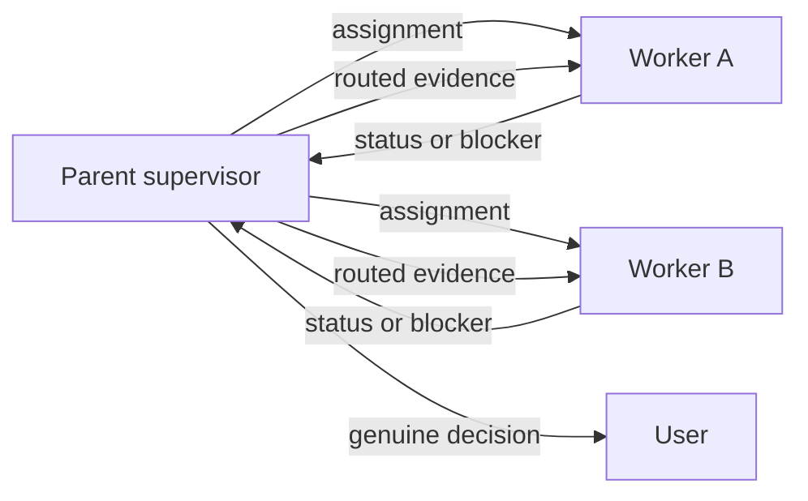

# Codex task orchestration

Build one supervised team. Establish the communication plane before assigning
work so every worker can report progress without waiting for the user.

## 1. Select the live plane

Honor an explicitly requested plane first. A request for subagents, internal
workers, or a parent/child team uses collaboration tools even when Desktop task
tools are available. A request for user-visible/sidebar tasks uses Desktop task
tools. When the user has not selected a plane, inspect the callable tools in the
current task and choose as follows.

- When existing or explicitly requested Desktop tasks are in scope and
  `send_message_to_thread` and `wait_threads` are available, use
  **Desktop tasks** for durable, user-visible workers. Resolve existing task IDs
  with `list_threads`; create a task only when the user explicitly requested a
  new one. Record each task's `threadId` and `hostId`. A worktree-backed create
  may return only `clientThreadId`; wait for setup to finish and resolve the
  resulting `threadId` plus `hostId` before sending, waiting, or claiming the
  worker is live.
- Otherwise, when the collaboration tools are available, use **subagents**.
  Spawn one bounded worker per ownership lane and keep this task as parent.
- When neither plane is callable, stop and ask the user to wake or message the
  tasks. A shared issue or file can retain receipts, but it is not a live bus.

Read
[`docs/research/runs/research-20260813-codex-session-communication/report.md`](../../../docs/research/runs/research-20260813-codex-session-communication/report.md)
when tool availability is ambiguous, a writer-lock error occurs, a task must be
migrated between planes, or exact version-specific semantics matter.

## 2. Establish ownership

Give each worker one bounded milestone with:

1. its repository or file ownership;
2. the exact objective and completion criterion;
3. inherited branch, SHA, issue, receipt, and blocker evidence;
4. adjacent work it must leave to another lane;
5. the parent destination for progress and blocker reports.

For subagents, state that they share the parent's filesystem and must preserve
others' changes. For Desktop tasks, record the exact host, project, checkout,
and worktree; treat filesystems as independent until that identity proves
otherwise. In both planes, require every worker to acknowledge its inherited
state and first action before counting the handoff as live.

## 3. Prove communication

Send a harmless status probe immediately after creating or resuming a worker.
The plane is established only after the parent receives a model-visible
acknowledgment.

### Desktop tasks

1. Use `send_message_to_thread` for assignments and follow-ups.
2. Ask the worker to return outcome, status, and any decision needed through
   `send_message_to_thread` to the coordinator task.
3. Monitor 1-8 tasks with one `wait_threads` call using each resolved `hostId`.
   Carry each returned cursor into the next wait so completed text is not
   redelivered.
4. Use `read_thread` for bounded inspection, not repeated polling.

### Subagents

1. Use `send_message` while a worker is running.
2. Use `followup_task` when an idle worker must begin another turn.
3. Use `wait_agent` for bounded waits and `list_agents` for a compact census.
4. Workers send progress and blockers to the parent with `send_message`.

## 4. Run the supervisor loop

Keep at most one implementation milestone active per repository unless the
workers prove file, generated-artifact, dependency, and runtime disjointness.

At each update:

1. classify it as progress, cross-lane evidence, external wait, or genuine user
   decision;
2. route cross-lane evidence without expanding either worker's ownership;
3. send the user a concise update when work lasts longer than a minute;
4. continue waiting while safe work remains;
5. ask the user only when authority, credentials, approval, or a material
   product choice is required.

### Handle blocked and dependent lanes

When one worker discovers a dependency owned by another lane:

1. assign exactly one worker to fix and validate the dependency, then land it
   only when already authorized or surface the bounded approval required;
2. tell dependent workers not to duplicate or partially recreate that fix;
3. preserve their validated branch state and run only read-only or restart-
   preparation work that remains valid if the dependency changes;
4. require the owner to report the candidate PR, SHA, and gate receipts, not
   merely a local commit or green check;
5. independently resolve the authorized remote ref, confirm it contains that
   exact SHA, and verify the applicable remote gates before unblocking work;
6. rebase or refresh dependents from that verified SHA before resuming gates.

If a lane needs credentials, spend, external approval, or a material product
choice, surface one bounded question to the user. Keep independent lanes moving
and do not describe the whole team as blocked.

When the user corrects a dependency, model, release, or other mutable premise,
withdraw the affected proposal immediately. Verify the replacement against its
primary source or authenticated inventory, update the durable decision record,
and resume only the affected lane from the corrected premise. Never guess an
identifier or keep an obsolete comparison arm merely to preserve momentum.

Before requesting an API key, new paid account, or incremental spend, inspect
the owned tool's exact current source and installed CLI for an existing
subscription, OAuth, platform-login, or other approved native route. Prefer
that route when it satisfies the required evidence contract. Report its actual
authentication status; do not confuse an installed executable with a logged-in
session, and do not route around a missing login with an API credential.

Before authorizing a metered, one-shot, destructive, or explicitly call-budgeted
external command, bind its exact command/subcommand argv and every required
machine-readable output field to the installed executable's current help or
capability surface. A source-supported backend does not prove that an installed
client still accepts an older documented flag. Fail before consuming the call
budget when any required argument or output contract is absent; classify a
parser/help exit separately from provider or model failure.

## 5. Persist the handoff

Use the repository's normal issue, goal-history, or handoff document for durable
state. Bind cross-repository handshakes to an immutable version or content hash.
The live message plane coordinates work; the durable receipt lets a future task
recover it.

## 6. Improve this skill from real failures

After a coordination failure or near miss:

1. capture the exact motivating replay in the reference document;
2. add the smallest general rule that would have prevented it;
3. add or update an eval prompt that exercises the same failure mode;
4. run the skill validator and an independent cold review;
5. record the validation result without treating a synthetic eval as proof of
   live transport capability.

Do not expand the skill for hypothetical failures. Prefer rules learned from
an observed blocked lane, duplicate edit, lost wakeup, writer conflict, or
incorrect completion claim.

## Guardrails

- Treat Desktop root tasks and subagents as different planes; do not promise
  sidebar visibility for subagents.
- Preserve an existing task as history when migrating it. Stop assigning new
  work, wait for or request an idle acknowledgment through the native peer
  channel, and record the replacement handoff. When pausing its persisted goal
  requires the owning task or user, request that action rather than claiming the
  coordinator performed it.
- Use one App Server owner. A second process may read persisted history, but it
  must not remove writer locks or compete for Desktop-owned tasks.
- Treat `thread/inject_items` as history injection, not messaging; it does not
  wake a task. Treat goals and scheduled tasks as continuation/watchdog
  mechanisms, not peer-to-peer buses.
- Keep approvals and user-input requests with the user. Route ordinary status
  and engineering blockers through the parent.

## Completion criterion

Orchestration is ready only when every worker has acknowledged its objective,
ownership, first action, and return channel; the parent has received a live
status probe; monitoring is active; and durable recovery state names the exact
workers and current milestone.
