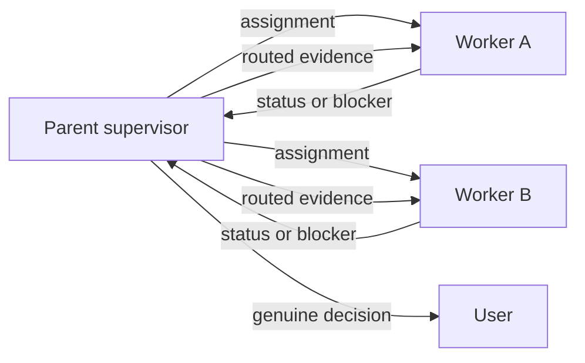

# Codex task orchestration

Build one supervised team. Establish the communication plane before assigning
work so every worker can report progress without waiting for the user.

## 1. Select the live plane

Honor an explicitly requested plane first. A request for subagents, internal
workers, or a parent/child team uses collaboration tools even when Desktop task
tools are available. A request for user-visible/sidebar tasks uses Desktop task
tools. Inspect the current callable tool catalog; never infer transport exposure
from a model name or model slug. These are different planes:

- **A — parent-controlled subagents and agent threads.** Current Codex releases
  enable subagents, and supported clients expose their activity under the main
  task. Use only callable collaboration tools such as `spawn_agent`,
  `send_message`, `followup_task`, `list_agents`, and `wait_agent`. The parent
  owns orchestration and receives each child's result.
- **B — independent Desktop sidebar tasks.** These are durable peers, not
  children of this task. Use `create_thread`, `list_threads`, `read_thread`,
  `send_message_to_thread`, and `wait_threads` only when each operation's tool
  is callable in the current task. Create a task only when the user explicitly
  requested a new sidebar task.

Gate each Desktop operation independently. Existing peers do not require
`create_thread`: use `list_threads` only to resolve identity, `read_thread` only
for bounded inspection, `send_message_to_thread` only for delivery, and
`wait_threads` only for monitoring when that operation is callable. Require
`create_thread` only when the user explicitly requested a new visible task.
Record each peer's `threadId` and `hostId`; a worktree-backed create may return
only `clientThreadId`, so wait for setup and resolve both real IDs before using
the peer.

When the user has not selected a plane, choose as follows.

- When existing Desktop tasks are named and the operations needed to coordinate
  them are callable, keep the **Desktop peer plane**. Missing creation capability
  is irrelevant to existing peers and never triggers a silent plane change.
- When the user explicitly requests a new visible task and `create_thread` is
  callable, use **Desktop task creation** and then gate resolution, delivery,
  inspection, and waiting separately.
- Otherwise, when the collaboration tools are available, use **subagents**.
  Spawn one bounded worker per ownership lane and keep this task as parent.
- When neither plane is callable, stop and ask the user to wake or message the
  tasks. A shared issue or file can retain receipts, but it is not a live bus.

When the user explicitly requested existing peers but an operation they need is
absent, name that operation and stop. Do not equate this with missing
`create_thread`. The durable-boundary fallback in section 4 is the only
pre-authorized exception for a requested fresh visible successor.

Read
[`docs/research/runs/research-20260813-codex-session-communication/report.md`](../../../docs/research/runs/research-20260813-codex-session-communication/report.md)
when tool availability is ambiguous, a writer-lock error occurs, a task must be
migrated between planes, or exact version-specific semantics matter.

## Resource admission

**Resource admission:** Before parallel execution, assign one coordinator to
each repository and one writer to each Git common directory. Send only shared
CPU, memory, Docker, architecture, port, and cache requests to the host decision
point. Wait when capacity or architecture isolation is not proved. Treat stale
or unknown containers as handoff and land blockers. Before dispatch, write a
read-only container census. Classify every duplicate. Block any known stale
duplicate and block unknown ownership before dispatch. Write the takeover
record described in
[`docs/specs/orchestration-takeover.md`](../../../docs/specs/orchestration-takeover.md)
before dispatch.

## 2. Establish ownership

Give each worker one bounded milestone with:

1. its repository or file ownership;
2. the exact objective and completion criterion;
3. inherited branch, SHA, issue, receipt, and blocker evidence;
4. adjacent work it must leave to another lane;
5. the parent destination for progress and blocker reports.

For subagents, state that they share the parent's filesystem and must preserve
others' changes. For Desktop tasks, record the exact host, project, checkout,
and worktree; treat filesystems as independent until that identity proves
otherwise. In both planes, require every worker to acknowledge its inherited
state and first action before counting the handoff as live.

## 3. Prove communication

Send a harmless status probe immediately after creating or resuming a worker.
The plane is established only after the parent receives a model-visible
acknowledgment.

### Desktop tasks

1. Use `send_message_to_thread` for assignments and follow-ups.
2. Ask the worker to return outcome, status, and any decision needed through
   `send_message_to_thread` to the coordinator task.
3. Monitor 1-8 tasks with one `wait_threads` call using each resolved `hostId`.
   Carry each returned cursor into the next wait so completed text is not
   redelivered.
4. Use `read_thread` for bounded inspection, not repeated polling.

A completed turn or wait is transport progress, not proof that the worker's goal is complete.
Read the worker's reported outcome and verify its stated completion criteria
before advancing the dependent lane.

For a successor that needs persistent continuation, send the agreed objective
through the peer channel and ask the peer task itself to call `create_goal`.
Require its acknowledgment; a coordinator cannot directly mutate another
task's goal. There is no supported hidden queue for cross-task work.
Computer Use must not control the current Codex application. Use a callable
native task or collaboration tool, or report that the live plane is unavailable.

### Subagents

1. Use `send_message` while a worker is running.
2. Use `followup_task` when an idle worker must begin another turn.
3. Use `wait_agent` for bounded waits and `list_agents` for a compact census.
4. Workers send progress and blockers to the parent with `send_message`.

When `spawn_agent` reports the agent-thread limit and `list_agents` plus
`followup_task` are callable, use the census to find a suitable completed or
confirmed-idle agent. Reuse it only after stating the new bounded role,
ownership, and inherited context.
Active writers and active workers are ineligible. If none is suitable, report
capacity exhaustion rather than silently changing a role or inventing a queue.

## 4. Transfer a completed Wayfinder ticket

Transfer only at a completed Wayfinder ticket or explicit ownership boundary,
never for tests, reviews, transient blockers, or ordinary workflow steps.

### Freeze canonical bytes

Build one JSON object with exactly these string keys: `first_action`, `issue`,
`milestone`, `ownership`, `return_channel`, and `sha`. Serialize it as UTF-8
with keys in that lexicographic order, JSON separators `,` and `:` with no
spaces, standard JSON string escaping, and no trailing newline. Those are the
canonical handoff bytes. Compute lowercase SHA-256 over those exact bytes and
send both payload and digest. A prose summary is not the handoff.

### Select the successor with explicit precedence

1. Use a named existing Desktop peer when its needed list/read/send/wait
   operations are callable; `create_thread` is irrelevant.
2. Otherwise, when the user requested a fresh visible task and `create_thread`
   is callable, create asynchronously and resolve its real `threadId` and
   `hostId` before delivery.
3. Otherwise use a fresh bounded subagent when collaboration spawning is
   callable. Report that it is parent-controlled and not sidebar-visible.
4. If spawning fails because the agent-thread limit is reached and census plus
   follow-up operations are callable, inspect the agents. Reuse a suitable
   completed or confirmed-idle agent with `followup_task`, explicitly stating
   its changed role, bounded ownership, and inherited handoff.
   Never reuse an active writer or silently change a role.
5. If no eligible successor exists, keep the predecessor authoritative and
   report capacity exhaustion. Do not invent a queue or change planes silently.

### Transfer write authority in three phases

Apply the same protocol to Desktop, fresh-subagent, and reused-agent successors:

1. **Read-only acknowledgment.** Deliver the canonical bytes and digest. The
   successor independently recomputes and echoes the digest, acknowledges the
   inherited fields and checkout identity, calls its own `create_goal` with the
   exact milestone when goals are applicable, and confirms it remains
   read-only. Creation, spawn, or acknowledgment grants no write ownership.
2. **Relinquishment.** Independently verify the acknowledgment. Then direct the
   predecessor to relinquish ownership and require its explicit confirmation
   that it is idle and owns no files or repository writes.
3. **Start signal.** Only after that confirmation, send a separate start signal
   granting the successor the bounded ownership. When the repository exposes a
   native writer-lease task, the successor must acquire that Git-common-dir
   lease with the acknowledged handoff digest through the pinned absolute
   bootstrap command. The repository's native `PreToolUse` hook must bind each
   mutation to the live holder and its `PostToolUse` hook must drain that exact
   tool ID before transfer; a manual check is diagnostic, not enforcement.
   Handoff versus recovery is derived from validated audit facts, never a
   caller label. The successor must also confirm that the repository's
   native Codex hook hash is trusted; `/hooks` is the review surface when Codex
   reports a new or changed project hook. Verify its start and lease acknowledgments
   before treating the transfer as live.

This ordering permits zero writers briefly but never two. Preserve the old task
as history after relinquishment. Task creation is identity setup, not
communication, and it does not inherit or replace a goal automatically.

## 5. Run the supervisor loop

Keep at most one implementation milestone active per repository unless the
workers prove file, generated-artifact, dependency, and runtime disjointness.

At each update:

1. classify it as progress, cross-lane evidence, external wait, or genuine user
   decision;
2. route cross-lane evidence without expanding either worker's ownership;
3. send the user a concise update when work lasts longer than a minute;
4. continue waiting while safe work remains;
5. ask the user only when authority, credentials, approval, or a material
   product choice is required.

### Handle blocked and dependent lanes

When one worker discovers a dependency owned by another lane:

1. assign exactly one worker to fix and validate the dependency, then land it
   only when already authorized or surface the bounded approval required;
2. tell dependent workers not to duplicate or partially recreate that fix;
3. preserve their validated branch state and run only read-only or restart-
   preparation work that remains valid if the dependency changes;
4. require the owner to report the candidate PR, SHA, and gate receipts, not
   merely a local commit or green check;
5. independently resolve the authorized remote ref, confirm it contains that
   exact SHA, and verify the applicable remote gates before unblocking work;
6. rebase or refresh dependents from that verified SHA before resuming gates.

If a lane needs credentials, spend, external approval, or a material product
choice, surface one bounded question to the user. Keep independent lanes moving
and do not describe the whole team as blocked.

When the user corrects a dependency, model, release, or other mutable premise,
withdraw the affected proposal immediately. Verify the replacement against its
primary source or authenticated inventory, update the durable decision record,
and resume only the affected lane from the corrected premise. Never guess an
identifier or keep an obsolete comparison arm merely to preserve momentum.

Before requesting an API key, new paid account, or incremental spend, inspect
the owned tool's exact current source and installed CLI for an existing
subscription, OAuth, platform-login, or other approved native route. Prefer
that route when it satisfies the required evidence contract. Report its actual
authentication status; do not confuse an installed executable with a logged-in
session, and do not route around a missing login with an API credential.

Before authorizing a metered, one-shot, destructive, or explicitly call-budgeted
external command, bind its exact command/subcommand argv and every required
machine-readable output field to the installed executable's current help or
capability surface. A source-supported backend does not prove that an installed
client still accepts an older documented flag. Fail before consuming the call
budget when any required argument or output contract is absent; classify a
parser/help exit separately from provider or model failure.

## 6. Persist the handoff

Use the repository's normal issue, goal-history, or handoff document for durable
state. Bind cross-repository handshakes to an immutable version or content hash.
The live message plane coordinates work; the durable receipt lets a future task
recover it.

### Recovery-vault-first missing-file lookup

When inherited evidence says a file existed but the checkout cannot find it,
inspect the configured recovery vault before recreating or declaring it gone.
Read the research report for this machine's current configured path, verified
sidecars, selection fields, read-only Git commands, and refusal boundaries.
Fail clearly when that configured vault is absent. A vault miss proves only
absence from its indexed Git snapshots; encrypted-only recovery needs explicit
targeted-restore authority.

### Visual artifact contract

Keep the authoritative newcomer-readable Mermaid in
`docs/agents/codex-task-orchestration.md`. When an explicitly identified issue
or PR is the authorized review surface, mirror the exact Mermaid block there,
read the remote body or comment back through the native API/CLI, and compare it
with the tracked block before claiming synchronization. Do not invent a remote target.
If the workflow has not created or named one, ask for the target and leave the
tracked document as the only authority.

## 7. Improve this skill from real failures

After a coordination failure or near miss:

1. capture the exact motivating replay in the reference document;
2. add the smallest general rule that would have prevented it;
3. add or update an eval prompt that exercises the same failure mode;
4. run the skill validator and an independent cold review;
5. record the validation result without treating a synthetic eval as proof of
   live transport capability.

Do not expand the skill for hypothetical failures. Prefer rules learned from
an observed blocked lane, duplicate edit, lost wakeup, writer conflict, or
incorrect completion claim.

## Guardrails

- Treat Desktop root tasks and subagents as different planes; do not promise
  sidebar visibility for subagents.
- Preserve an existing task as history when migrating it. Stop assigning new
  work, wait for or request an idle acknowledgment through the native peer
  channel, and record the replacement handoff. When pausing its persisted goal
  requires the owning task or user, request that action rather than claiming the
  coordinator performed it.
- Use one App Server owner. A second process may read persisted history, but it
  must not remove writer locks or compete for Desktop-owned tasks.
- Treat `thread/inject_items` as history injection, not messaging; it does not
  wake a task. Treat goals and scheduled tasks as continuation/watchdog
  mechanisms, not peer-to-peer buses.
- Keep approvals and user-input requests with the user. Route ordinary status
  and engineering blockers through the parent.

## Completion criterion

Orchestration is ready only when every worker has acknowledged its objective,
ownership, first action, and return channel; the parent has received a live
status probe; monitoring is active; and durable recovery state names the exact
workers and current milestone.
