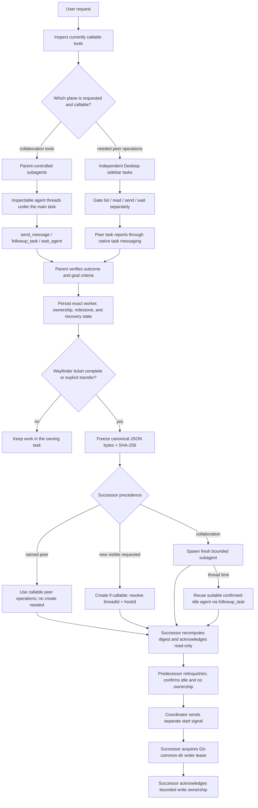

# Codex task orchestration planes

Codex has two distinct ways to coordinate parallel work. Choose from the tools
callable in the current task, not from the model name. Subagents stay under one
main task; Desktop tasks are independent sidebar peers.

## Reading the workflow

| Plane | Ownership and visibility | Live control | Durable identity |
|---|---|---|---|
| Parent-controlled subagents | The main task owns orchestration; the app exposes agent activity beneath it. | Collaboration tools steer, follow up, census, and wait. | Parent task plus agent identity for this execution. |
| Independent Desktop sidebar tasks | Each task is a user-owned peer in the sidebar. | Only currently callable create/list/read/send/wait thread tools. | `threadId`, `hostId`, project, checkout, and worktree. |

A wait or turn completed event says that transport advanced. It does not prove
goal completion. Read the worker's outcome, verify its completion criteria, and
confirm any remote SHA and gates before unblocking dependent work.

A created task is only a resolved identity; it has not received the handoff or
inherited the old goal. At a durable boundary, bind the six canonical handoff
fields to exact bytes and SHA-256. The successor recomputes that digest and
acknowledges while read-only. The predecessor then relinquishes and confirms it
is idle with no ownership; only a later start signal grants the successor write
authority. Existing peers do not need creation. A fresh subagent is the disclosed
fallback, and a suitable confirmed-idle agent may be reused after a thread-limit
failure; active writers are ineligible. Tests, reviews, transient blockers, and
ordinary steps stay inside the current task.

When a repository exposes the native writer-lease tasks, the separate start
signal is followed by acquisition against its Git common directory and a
pinned absolute bootstrap command. This machine-enforced repository identity
is stronger than branch or worktree naming; the handoff protocol still
controls when the successor is allowed to attempt acquisition. The tracked
Codex and Claude `PreToolUse` hooks bind Bash, unified exec, and direct mutation
tool IDs to the live challenge-bound holder before execution. Their
`PostToolUse` hooks drain those exact IDs, including a later `write_stdin`
completion, before release. Validated audit facts derive handoff versus
recovery; callers cannot relabel a crash. A manual check is diagnostic, not the
enforcement boundary. Review changed Codex hook hashes with `/hooks` before
treating the enforcement as active.

The tracked Mermaid block above is authoritative. Mirror that exact block only
to an explicitly identified issue or PR, read the remote artifact back, and
compare it before claiming synchronization. If no target exists, keep the
tracked artifact and ask for the intended review surface.
