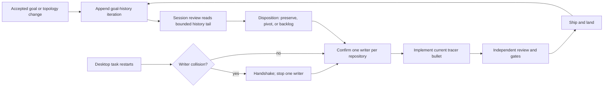

# Dotfiles goal history

This is the append-only record of accepted goal changes for dotfiles. It exists
so session review and SkillOpt can inspect how goals drift, where prompts are
ambiguous, and which orchestration choices repeatedly cost time. An entry
records a decision; it does not certify that the described work landed.

## Entry contract

- Append new iterations at the end. Never rewrite, reorder, squash, or delete
  earlier entries.
- `Prior goal digest` is the SHA-256 of the exact prior iteration's current goal
  text, excluding the Markdown quote prefix and trailing newline. The first
  tracked iteration uses `NONE (bootstrap)`.
- Append-only verification uses the fixed `origin/main` merge-base, checks every
  first-parent branch revision sequentially, then checks the working tree
  against committed `HEAD`. An unresolved baseline fails closed.
- Evidence must be independently inspectable. Missing evidence remains named as
  missing rather than inferred from assistant prose.
- `Topology and ownership` names the single current implementation writer for
  each repository and every handoff or collision risk.
- Every entry includes the current goal text and a current Mermaid workflow.

## 2026-08-14 — establish the tracked orchestration goal

- **Iteration ID:** `dotfiles-goal-20260814-001`
- **Prior goal digest:** `NONE (bootstrap)`
- **Current goal digest:** `sha256:12db9f86a5d17902e58b0cdc7330939cf2f1e025fb2a06d96c056860f6349385`
- **Changed requirement:** Establish an append-only goal history, make it a
  default session-review source, and enforce its required structure. Record the
  move from resumed Desktop tasks to one fallback subagent writer per repository.
- **Reason:** Both Desktop tasks completed their resumed goals. Peer task
  messaging was unavailable, so continued implementation required an explicit
  ownership handoff without allowing two writers to mutate one repository.
- **Evidence:** dotfiles PR #750 landed the task-orchestration skill; PR #752
  landed the final #671 acceptance test; knowledge-base coordination handshake
  v14 is recorded on issue #292. The local Graphify 0.9.42 health check reported
  a missing graph, so source files—not graph output—were authoritative here.
- **Affected tickets:** knowledge-base #292 and #299; dotfiles #750 and #752;
  dotfiles #753; this dotfiles goal-history implementation lane.
- **Disposition:** `ACCEPTED_AND_ACTIVE` — the Graphify-first MVP continues;
  this entry does not claim that knowledge-base #299 or later MVP tickets landed.
- **Topology and ownership:** The supervisor owns cross-repository coordination.
  One fallback subagent owns dotfiles and one owns knowledge-base. If a user
  restarts either Desktop task, that creates a duplicate-writer hazard: the
  Desktop task and fallback writer must handshake, and one must stop before
  either changes repository bytes. This is a manual coordination protocol, not
  executable prevention; dotfiles issue #753 tracks the native ownership lease.

### Current goal

> Implement and land the dotfiles append-only goal-history contract. Keep it discoverable to session review, enforce required iteration structure, and record orchestration topology changes without duplicating knowledge-base Graphify, SkillOpt, shared expert-bundle, or devcontainer work.

### Current workflow

