# Dotfiles goal history

This is the append-only record of accepted goal changes for dotfiles. It exists
so session review and SkillOpt can inspect how goals drift, where prompts are
ambiguous, and which orchestration choices repeatedly cost time. An entry
records a decision; it does not certify that the described work landed.

## Entry contract

- Append new iterations at the end. Never rewrite, reorder, squash, or delete
  earlier entries.
- `Prior goal digest` is the SHA-256 of the exact prior iteration's current goal
  text, excluding the Markdown quote prefix and trailing newline. The first
  tracked iteration uses `NONE (bootstrap)`.
- Append-only verification uses the fixed `origin/main` merge-base, checks every
  first-parent branch revision sequentially, then checks the working tree
  against committed `HEAD`. An unresolved baseline fails closed.
- Evidence must be independently inspectable. Missing evidence remains named as
  missing rather than inferred from assistant prose.
- `Topology and ownership` names the single current implementation writer for
  each repository and every handoff or collision risk.
- Every entry includes the current goal text and a current Mermaid workflow.

## 2026-08-14 — establish the tracked orchestration goal

- **Iteration ID:** `dotfiles-goal-20260814-001`
- **Prior goal digest:** `NONE (bootstrap)`
- **Current goal digest:** `sha256:12db9f86a5d17902e58b0cdc7330939cf2f1e025fb2a06d96c056860f6349385`
- **Changed requirement:** Establish an append-only goal history, make it a
  default session-review source, and enforce its required structure. Record the
  move from resumed Desktop tasks to one fallback subagent writer per repository.
- **Reason:** Both Desktop tasks completed their resumed goals. Peer task
  messaging was unavailable, so continued implementation required an explicit
  ownership handoff without allowing two writers to mutate one repository.
- **Evidence:** dotfiles PR #750 landed the task-orchestration skill; PR #752
  landed the final #671 acceptance test; knowledge-base coordination handshake
  v14 is recorded on issue #292. The local Graphify 0.9.42 health check reported
  a missing graph, so source files—not graph output—were authoritative here.
- **Affected tickets:** knowledge-base #292 and #299; dotfiles #750 and #752;
  dotfiles #753; this dotfiles goal-history implementation lane.
- **Disposition:** `ACCEPTED_AND_ACTIVE` — the Graphify-first MVP continues;
  this entry does not claim that knowledge-base #299 or later MVP tickets landed.
- **Topology and ownership:** The supervisor owns cross-repository coordination.
  One fallback subagent owns dotfiles and one owns knowledge-base. If a user
  restarts either Desktop task, that creates a duplicate-writer hazard: the
  Desktop task and fallback writer must handshake, and one must stop before
  either changes repository bytes. This is a manual coordination protocol, not
  executable prevention; dotfiles issue #753 tracks the native ownership lease.

### Current goal

> Implement and land the dotfiles append-only goal-history contract. Keep it discoverable to session review, enforce required iteration structure, and record orchestration topology changes without duplicating knowledge-base Graphify, SkillOpt, shared expert-bundle, or devcontainer work.

### Current workflow

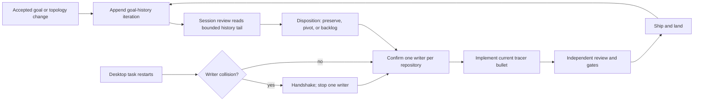

## 2026-08-14 — distinguish subagents from Desktop peer tasks

- **Iteration ID:** `dotfiles-goal-20260814-002`
- **Prior goal digest:** `sha256:12db9f86a5d17902e58b0cdc7330939cf2f1e025fb2a06d96c056860f6349385`
- **Current goal digest:** `sha256:123c4c2c1ae590ecc2f24123e89ec840bd4aae809f3ba3a448856d384277ae9f`
- **Changed requirement:** Update the landed orchestration skill after PR #755
  so it distinguishes parent-controlled subagents from independent Desktop
  sidebar tasks using the current callable tool catalog. Add recovery-vault-first
  missing-file lookup and a tracked Mermaid mirrored and read back from the
  authorized PR.
- **Reason:** Official Subagents documentation now explicitly describes
  enabled, inspectable agent threads under the main task. The installed Desktop
  bundle and reviewed peer-message screenshot describe a separate sidebar-task
  plane. Earlier orchestration could still conflate a finished wait/turn with
  goal completion or infer transport availability from a model slug.
- **Evidence:** `origin/main` was verified at PR #755 squash
  `307c95baf866b1c3ae591239479cf7e5b815b819`; the official Subagents page was
  read on 2026-08-14; the user-supplied Reddit screenshot matched SHA-256
  `cc4411af0b12b75daa23b82dbee63f646f31e3b354742d7961f08f3ecae81c30` and is
  retained only as non-authoritative evidence. Focused RED/GREEN receipts are
  in the branch-local structured contract; they do not certify live transport.
- **Affected tickets:** dotfiles PR #750; dotfiles issue #753; dotfiles PR #755;
  the current post-#755 task-orchestration delivery lane and its future PR.
- **Disposition:** `ACCEPTED_AND_ACTIVE` — implementation and focused
  verification are active. No PR, remote mirror, ship, or landing is claimed by
  this entry.
- **Topology and ownership:** The root supervisor owns cross-repository
  coordination. This task is the sole dotfiles implementation writer in
  `/Users/rmanaloto/dev/github/ray-manaloto/worktrees/dotfiles-codex-task-orchestration-v2`
  on `codex/codex-task-orchestration-v2`; the separate knowledge-base writer
  owns KB work. Parent-controlled subagents remain under their main task;
  independent Desktop tasks remain peer sidebar tasks. A restarted peer must
  handshake and stop one writer before touching this repository.

### Current goal

> Implement, validate, ship, and land the post-#755 Codex task-orchestration skill update from exact origin/main 307c95baf866b1c3ae591239479cf7e5b815b819. Distinguish parent-controlled subagents from independent Desktop sidebar tasks using only currently callable tools, preserve single-writer ownership and recovery-vault-first lookup, and keep the tracked Mermaid synchronized with the authorized PR mirror and readback. Synthetic evals test routing decisions but do not certify live transport.

### Current workflow

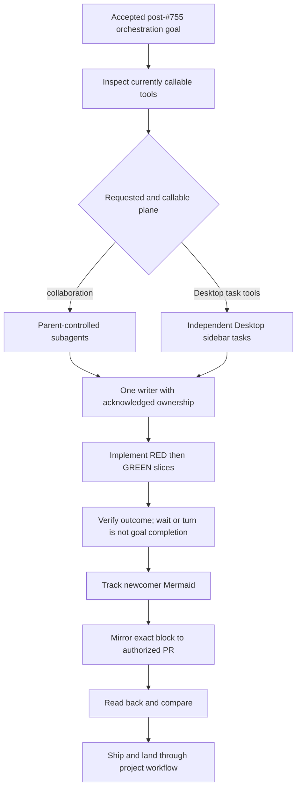

## 2026-08-14 — bound successor creation to Wayfinder transfers

- **Iteration ID:** `dotfiles-goal-20260814-003`
- **Prior goal digest:** `sha256:123c4c2c1ae590ecc2f24123e89ec840bd4aae809f3ba3a448856d384277ae9f`
- **Current goal digest:** `sha256:d50b4e3afefdc2a6310cce301ae6ad62327b57fa8a54275d75a97549fd28b521`
- **Changed requirement:** At a completed Wayfinder ticket or explicit
  ownership-transfer boundary, use a content-addressed handoff and a verified
  successor. Prefer a fresh visible Desktop task only when requested and
  `create_thread` is callable; otherwise disclose a bounded subagent fallback.
- **Reason:** Creating a task is identity setup, not communication, goal
  transfer, or proof that the successor started. Unbounded task-per-step
  creation would manufacture duplicate writers and an unsupported queue.
- **Evidence:** The user-approved refinement requires asynchronous identity
  resolution, peer-owned `create_goal`, full handoff acknowledgment, and
  independent verification before retiring the prior writer. Hostile evals
  14-17 reproduce premature retirement, successor churn, missing goal
  acknowledgment, and unavailable task creation; the focused structured
  contract failed before each corresponding skill rule was added and then passed.
- **Affected tickets:** dotfiles PR #750; dotfiles issue #753; dotfiles PR #755;
  the current post-#755 task-orchestration delivery lane and its future PR.
- **Disposition:** `ACCEPTED_AND_ACTIVE` — the successor-transfer protocol and
  synchronized tracked diagram are implemented locally. Independent review,
  full gates, PR mirror/readback, ship, and landing remain unclaimed.
- **Topology and ownership:** This task remains the sole dotfiles writer in
  `/Users/rmanaloto/dev/github/ray-manaloto/worktrees/dotfiles-codex-task-orchestration-v2`.
  A successor receives no write authority from creation alone. The prior writer
  remains authoritative until the coordinator independently verifies the
  successor's inherited SHA, issue, ownership, first action, return channel,
  checkout identity, and peer-owned goal acknowledgment; then the prior writer
  retires so exactly one writer remains.

### Current goal

> Implement, validate, ship, and land the post-#755 Codex task-orchestration skill update from exact origin/main 307c95baf866b1c3ae591239479cf7e5b815b819. At a completed Wayfinder ticket or explicit ownership transfer, freeze a content-addressed handoff and dispatch a verified successor through callable Desktop task creation or a disclosed bounded subagent fallback while preserving exactly one writer. Keep the tracked Mermaid and authorized PR mirror synchronized; synthetic evals test decisions but do not certify live transport.

### Current workflow

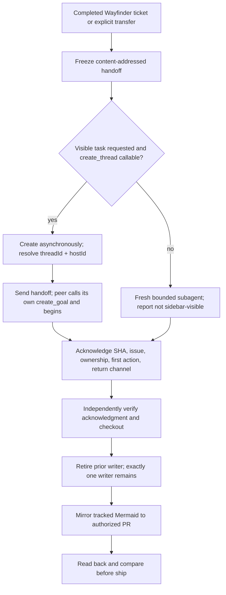

## 2026-08-14 — make successor ownership transfer non-overlapping

- **Iteration ID:** `dotfiles-goal-20260814-004`
- **Prior goal digest:** `sha256:d50b4e3afefdc2a6310cce301ae6ad62327b57fa8a54275d75a97549fd28b521`
- **Current goal digest:** `sha256:16675f8af4fe99579fa867b5a82e1dbc4d4552c18b2dbd37996ba2a8d8959a26`
- **Changed requirement:** Bind handoffs to canonical bytes and a successor-
  acknowledged digest; gate Desktop operations independently; transfer write
  authority only after predecessor relinquishment; recover a spawn thread-limit
  by explicitly reusing a suitable confirmed-idle agent when available.
- **Reason:** Independent review showed that one acknowledgment could authorize
  the successor before the predecessor stopped, while bundled Desktop gating
  unnecessarily rejected existing peers. A live spawn-capacity failure also
  established the safe idle-agent reuse branch.
- **Evidence:** Hostile evals 18-23 cover digest substitution, missing creation
  with existing peers, premature Desktop and subagent starts, safe idle reuse,
  and rejection of active-writer reuse. The parsed structured eval contract
  fails malformed JSON and missing required eval IDs. The operative protocol
  and newcomer diagram are co-located in
  `docs/agents/codex-task-orchestration.md`; synthetic results remain routing
  evidence, not live-transport certification.
- **Affected tickets:** dotfiles PR #750; dotfiles issue #753; dotfiles PR #755;
  the current post-#755 task-orchestration delivery lane and its future PR.
- **Disposition:** `ACCEPTED_AND_ACTIVE` — focused implementation and review are
  active; full gates, remote mirror/readback, PR, ship, and landing are unclaimed.
- **Topology and ownership:** This task remains the sole dotfiles writer. A
  successor stays read-only until the predecessor explicitly relinquishes and
  confirms idle/no ownership, after which the coordinator sends a separate
  bounded start signal. Active agents cannot be repurposed as successors.

### Current goal

> Implement, validate, ship, and land the post-#755 Codex task-orchestration update from exact origin/main 307c95baf866b1c3ae591239479cf7e5b815b819. Bind each successor to canonical handoff bytes and a verified digest, transfer write authority only after read-only acknowledgment and predecessor relinquishment, gate Desktop operations independently, and recover agent-thread capacity only by explicitly reusing a suitable confirmed-idle agent. Keep the tracked Mermaid and authorized PR mirror synchronized; synthetic evals test decisions but do not certify live transport.

### Current workflow

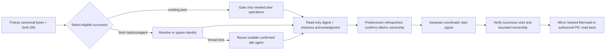

## 2026-08-14 — enforce repository writer ownership with a native lease

- **Iteration ID:** `dotfiles-goal-20260814-005`
- **Prior goal digest:** `sha256:16675f8af4fe99579fa867b5a82e1dbc4d4552c18b2dbd37996ba2a8d8959a26`
- **Current goal digest:** `sha256:09a7817194767104656947976c06e0a6abda9911eec6089d07698273d3fd9944`
- **Changed requirement:** Implement issue #753's executable startup and
  pre-mutation ownership lease after the orchestration protocol landed in PR
  #756. Bind ownership to the shared Git common directory, not a checkout path,
  and prove contention, handoff, and stale recovery through real processes.
- **Reason:** Different tasks, branches, and worktrees do not prove disjoint
  ownership. PR #756 made the handoff ordering explicit but deliberately left
  collision prevention to this follow-up.
- **Evidence:** Canonical `main`, `origin/main`, and GitHub main were verified at
  PR #756 squash `5274363a218b4deaf1bce93ae51392c182a5d047`. The successor
  independently acknowledged canonical handoff digest
  `db873355c4d00e15e7ce3ee210b2446260d0ded60f6af6685dd570d1f4132e19`,
  the predecessor confirmed idle, and the coordinator sent a separate START.
  Graphify is source-fallback because the fresh worktree has no graph artifact.
- **Affected tickets:** dotfiles issue #753 and the future writer-lease PR.
- **Disposition:** `ACCEPTED_AND_ACTIVE` — the Wayfinder design is frozen;
  implementation, review, gates, PR, and landing remain unclaimed.
- **Topology and ownership:** This task is the sole dotfiles writer in
  `/Users/rmanaloto/dev/github/ray-manaloto/worktrees/dotfiles-issue-753-writer-lease`
  on `codex/issue-753-writer-lease`. `/root` remains coordinator. Knowledge-base
  work stays exclusively in its separate lane.

### Current goal

> Design, implement, validate, ship, and land dotfiles issue #753: a project-native startup and pre-mutation repository ownership lease that identifies the Git common directory, fails closed on a live competing writer, supports content-addressed handoff and audited stale-owner recovery, preserves .omc/ and dirty evidence, and is proven by real hostile two-writer and clean handoff controls.

### Current workflow

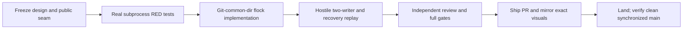

## 2026-08-14 — promote the Codex native hook to the enforcement boundary

- **Iteration ID:** `dotfiles-goal-20260814-006`
- **Prior goal digest:** `sha256:09a7817194767104656947976c06e0a6abda9911eec6089d07698273d3fd9944`
- **Current goal digest:** `sha256:e1c57ba574fd51956530556620e6c4b1945a612af64c2cdd0bc5cda363ccb8f0`
- **Changed requirement:** Replace explicit/manual Codex pre-mutation checks as
  the acceptance boundary with the installed Codex 0.147.0 native synchronous
  `PreToolUse` hook. It must intercept Bash and apply-patch calls for Desktop
  tasks and fallback subagents and deny a non-owner before execution.
- **Reason:** An advisory flock only excludes cooperating processes; prose or
  an optional check cannot intercept a raw Codex filesystem tool. The issue
  requires executable Desktop and fallback-subagent integration.
- **Evidence:** `codex features list` reports stable hooks. The current official
  Hooks reference confirms Bash/unified-exec/apply-patch coverage, synchronous
  pre-execution denial, `Edit|Write` aliases, and parent session IDs for
  subagents. A hostile linked-worktree control wrote its probe, and pinned
  Codex 0.147.0 source explains that linked worktrees intentionally load hook
  declarations from the canonical root checkout. Certification therefore runs
  from an independent temporary clone of the committed candidate.
- **Affected tickets:** dotfiles issue #753 and its writer-lease PR.
- **Disposition:** `ACCEPTED_AND_ACTIVE` — native hook integration and local
  subprocess controls are green; independent-clone Codex replay, reviews,
  gates, ship, and land remain unclaimed.
- **Topology and ownership:** `/root/dotfiles_753_writer_lease` remains the sole
  dotfiles writer in the registered issue #753 worktree; `/root` coordinates.
  The certification clone is disposable test input and never a work lane.

### Current goal

> Complete dotfiles issue #753 by landing a Git-common-dir flock lease with canonical receipts, native Codex and Claude pre-mutation hook enforcement, exact-digest handoff and recovery, real hostile subscription-authenticated Codex replay, synchronized visual documentation, independent review, full gates, and clean remote-main landing.

### Current workflow

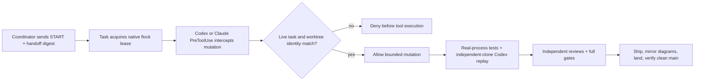

## 2026-08-14 — harden the writer lease after hostile review

- **Iteration ID:** `dotfiles-goal-20260814-007`
- **Prior goal digest:** `sha256:e1c57ba574fd51956530556620e6c4b1945a612af64c2cdd0bc5cda363ccb8f0`
- **Current goal digest:** `sha256:ccdb0f73970ca88baae2f85974abc81986aa83149abc1c1b336570930fa1bccd`
- **Changed requirement:** Keep issue #753 blocked after both frozen reviews found
  eight executable bypasses. Bind the receipt to the actual lock holder, make
  every state path private and no-follow, publish validated state atomically,
  pin bootstrap execution, track in-flight mutations through PostToolUse,
  derive transfer type from audit facts, cover Claude Bash, and preserve all
  dirty and `.omc/` evidence byte-for-byte.
- **Reason:** A cooperative flock and startup-only check could still report a
  false owner, follow hostile filesystem objects, publish partial state, run a
  PATH-substituted command, or transfer while an earlier Bash tool could still
  write. Those behaviors violate the single-writer acceptance boundary.
- **Evidence:** The first frozen hostile replay produced seven RED cases and one
  preservation control. The v1 lease state was retained at
  `/Users/rmanaloto/dev/github/ray-manaloto/dotfiles/.git/codex-writer-lease-v1-preserved-007acb42`.
  The replacement uses a live token challenge plus lock record, private regular
  no-follow files, immutable content-addressed generations, validated canonical
  audit, audit-derived transitions, pinned Pre/Post hook runners, and an exact
  in-flight tool-ID ledger. Nineteen real-process controls now cover the review
  findings; independent review, live Codex replay, full gates, ship, and land
  remain unclaimed.
- **Affected tickets:** dotfiles issue #753 and its writer-lease PR.
- **Disposition:** `ACCEPTED_AND_ACTIVE` — review findings are implemented;
  second frozen review is the next gate.
- **Topology and ownership:** `/root/dotfiles_753_writer_lease` remains the sole
  writer in the registered issue #753 worktree. `/root` coordinates and owns
  reviewer dispatch after the writer freezes the exact diff.

### Current goal

> Complete dotfiles issue #753 by landing a challenge-bound Git-common-dir lease with private transactional content-addressed state, audit-derived transfer, native Codex and Claude Pre/PostToolUse in-flight drain, exact pinned bootstrap, real hostile and subscription-authenticated Codex replay, synchronized visual documentation, independent review, full gates, and clean remote-main landing.

### Current workflow

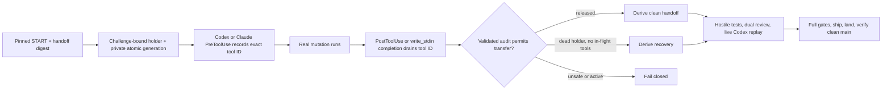

## 2026-08-14 — bound state growth and drain failed tools

- **Iteration ID:** `dotfiles-goal-20260814-008`
- **Prior goal digest:** `sha256:ccdb0f73970ca88baae2f85974abc81986aa83149abc1c1b336570930fa1bccd`
- **Current goal digest:** `sha256:17f5b65417b9cf0d13291a0223ecdb734b1a2680aa2c625a22635673c091c65f`
- **Changed requirement:** Keep the second freeze blocked until immutable state
  has bounded retention, Claude failed tools drain through
  `PostToolUseFailure`, and the branch-write plus token-uniqueness verification
  contracts remain green after the new integration.
- **Reason:** Retaining a complete audit in every immutable generation made
  cumulative disk use quadratic. A failed Claude Bash call emitted a different
  lifecycle event and could strand its in-flight ID forever. The integration
  also changed one branch-guard call-site token and introduced duplicate
  tokens, weakening existing verification even while focused tests passed.
- **Evidence:** The hostile controls now run 32 real Pre/Post pairs and require
  one retained generation, 65 canonical audit events, less than 128 KiB of
  state, no reclaim tombstones, and under 30 seconds. A real `/bin/sh` rc=23
  lifecycle drains via `PostToolUseFailure` and then proves both clean handoff
  and crash recovery. `dotfiles-setup token-audit` reports no binding problems.
- **Affected tickets:** dotfiles issue #753 and its writer-lease PR.
- **Disposition:** `ACCEPTED_AND_ACTIVE` — implementation and focused controls
  are green; full gates and the third frozen dual review remain unclaimed.
- **Topology and ownership:** `/root/dotfiles_753_writer_lease` remains the sole
  writer; `/root` owns reviewer dispatch after the new manifest freeze.

### Current goal

> Complete dotfiles issue #753 by landing a challenge-bound Git-common-dir lease with private transactional state, one retained content-addressed generation carrying the full canonical audit, audit-derived transfer, native Codex and Claude Pre/Post/failure in-flight drain, exact pinned bootstrap, real hostile and subscription-authenticated Codex replay, synchronized visual documentation, independent review, full gates, and clean remote-main landing.

### Current workflow

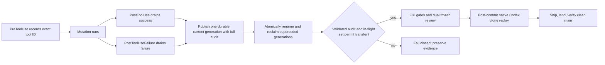

## 2026-08-14 — anchor cleanup and make completion race-safe

- **Iteration ID:** `dotfiles-goal-20260814-009`
- **Prior goal digest:** `sha256:17f5b65417b9cf0d13291a0223ecdb734b1a2680aa2c625a22635673c091c65f`
- **Current goal digest:** `sha256:81f81ed9945e7e51defe002a9d104dcf1a8a59fefa8f150954bfba9858385535`
- **Changed requirement:** Keep the third freeze blocked until generation
  reclaim is anchored to a validated directory descriptor, cleanup failures
  after state publication become non-denying typed debt, and completion plus
  release tolerate bounded state-lock overlap.
- **Reason:** Path validation followed by later path deletion retains a
  parent-swap race. Raising from cleanup after `current` was durably switched
  falsely denied a tool whose `tool_started` had already committed, stranding
  its in-flight ID. Nonblocking completion could lose an ordinary concurrent
  state transaction and create the same strand.
- **Evidence:** Real controls rename the state directory, replace its old path
  with a symlink to an external byte victim, and prove descriptor-relative
  reclaim touches only the originally opened directory. A malformed reclaim
  remains byte-identical typed debt while start and finish both return allow.
  Twenty-four alternating success/failure completions and holder release pass
  while independent processes repeatedly hold the real state lock.
- **Affected tickets:** dotfiles issue #753 and its writer-lease PR.
- **Disposition:** `ACCEPTED_AND_ACTIVE` — the construction controls are green;
  full staged-checkout gates and the fourth frozen dual review remain unclaimed.
- **Topology and ownership:** `/root/dotfiles_753_writer_lease` remains sole
  writer; `/root` owns reviewer dispatch after exact manifest freeze.

### Current goal

> Complete dotfiles issue #753 by landing a challenge-bound Git-common-dir lease with private transactional state, directory-FD-anchored no-follow reclamation, non-denying typed cleanup debt, bounded synchronous completion and release lock retry, native Codex and Claude success/failure drain, exact pinned bootstrap, real hostile and subscription-authenticated Codex replay, synchronized visual documentation, independent review, full gates, and clean remote-main landing.

### Current workflow

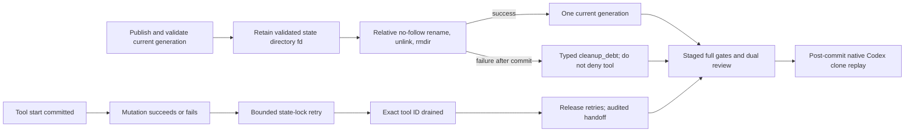

## 2026-08-14 — bind identity tools across host and container

- **Iteration ID:** `dotfiles-goal-20260814-010`
- **Prior goal digest:** `sha256:81f81ed9945e7e51defe002a9d104dcf1a8a59fefa8f150954bfba9858385535`
- **Current goal digest:** `sha256:a48581d1664abbc3f0a34660ff5d7e6bb377f34a1e5bda1a5fd396e0462e194c`
- **Changed requirement:** Keep publication blocked until repository identity,
  bootstrap, and runner executables are explicit and valid on both macOS and
  the supported devcontainer without admitting ambient `PATH` selection.
- **Reason:** The first canonical `ship` reached the real amd64 container and
  found that `/usr/bin/git` does not exist there. Continuing exposed two
  adjacent host-only assumptions: mise under `~/.local/bin` and the project
  environment under `python/.venv`.
- **Evidence:** The Git path is now derived from the one `conda:git` entry in
  the tracked `.devcontainer/mise-system.lock`, resolved once, and checked as
  a regular executable. A hostile lock with that authority removed fails
  closed. Host and real supported-container writer suites both pass 27 tests;
  the container executes the exact locked Git binary. Mise and project Python
  use finite absolute host/container contracts and never search ambient PATH.
- **Affected tickets:** dotfiles issue #753 and its writer-lease PR.
- **Disposition:** `ACCEPTED_AND_ACTIVE` — focused host/container controls are
  green; full gates and a new two-axis frozen review remain required.
- **Topology and ownership:** `/root/dotfiles_753_writer_lease` remains sole
  writer in the canonical checkout during the proven ship path; `/root` owns
  reviewer dispatch after the new freeze.

### Current goal

> Complete dotfiles issue #753 by landing a challenge-bound Git-common-dir lease with private transactional state, lock-derived host/container Git and explicit mise/Python toolchain paths, directory-FD-anchored no-follow reclamation, non-denying typed cleanup debt, bounded synchronous completion and release lock retry, native Codex and Claude success/failure drain, real hostile and subscription-authenticated Codex replay, synchronized visual documentation, independent review, full gates, and clean remote-main landing.

### Current workflow

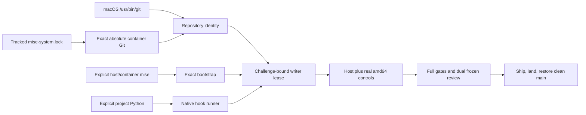

## 2026-08-14 — make the identity executable platform-exclusive

- **Iteration ID:** `dotfiles-goal-20260814-011`
- **Prior goal digest:** `sha256:a48581d1664abbc3f0a34660ff5d7e6bb377f34a1e5bda1a5fd396e0462e194c`
- **Current goal digest:** `sha256:9cb91c80d06dead79e355a7243a7773e95600b2de4a647cc0d0d64610b1c37d9`
- **Changed requirement:** Select exactly one repository-identity Git per
  platform: Darwin only `/usr/bin/git`; Linux only the conda-Git path derived
  from the tracked image lock. Never try the other platform's candidate.
- **Reason:** The lifecycle review accepted the frozen lease state machine, but
  the storage review reproduced a P1: the ordered host/container candidate
  list let Linux accept `/usr/bin/git` if present, bypassing its tracked lock
  authority.
- **Evidence:** Real-file hostile controls install executable host and locked
  candidates under an isolated filesystem root. Linux selects the locked
  candidate while the hostile `/usr/bin/git` exists; Darwin rejects a wrong
  host path even while the Linux candidate exists. The complete writer suite
  passes 29 tests on macOS and the supported amd64 container, whose resolved
  executable is `/usr/local/share/mise/installs/conda-git/2.55.0/bin/git`.
- **Affected tickets:** dotfiles issue #753 and its writer-lease PR.
- **Disposition:** `ACCEPTED_AND_ACTIVE` — the P1 is locally green; full gates
  and a narrow independent exact-head re-review remain required before ship.
- **Topology and ownership:** `/root/dotfiles_753_writer_lease` is the sole
  canonical writer; `/root` dispatches the narrow reviewer after freeze.

### Current goal

> Complete dotfiles issue #753 by landing a challenge-bound Git-common-dir lease with platform-exclusive identity tools (Darwin /usr/bin/git; Linux lock-derived conda Git), explicit mise/Python paths, private transactional state, directory-FD-anchored cleanup, bounded drain and release, native Codex and Claude enforcement, hostile and subscription-authenticated replay, synchronized visual documentation, independent review, full gates, and clean remote-main landing.

### Current workflow

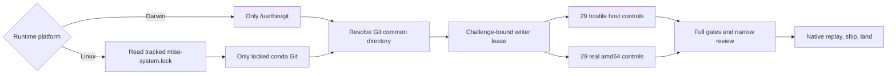

## 2026-08-14 — harden bootstrap portability and audit scaling

- **Iteration ID:** `dotfiles-goal-20260814-012`
- **Prior goal digest:** `sha256:9cb91c80d06dead79e355a7243a7773e95600b2de4a647cc0d0d64610b1c37d9`
- **Current goal digest:** `sha256:7ccc6ae231339e8b2aeba57b1143ba688e50ce7de95f06f4bf9f38e18f8872c5`
- **Changed requirement:** Resolve the five bounded hardening findings retained
  in issue #760 after the issue #753 lease landed: portable Codex bootstrap,
  both supported mise paths in operator docs, duplicate-option denial, bounded
  audit write amplification, and a repository-root-independent drift fixture.
- **Reason:** The landed lease prevents competing writers, but its outer Codex
  command can fail closed before reaching the Linux-aware resolver, and its
  complete-audit generation rewrite has quadratic cumulative write cost during
  long sessions. The remaining parser, documentation, and fixture findings
  make those seams less precise than the enforced implementation.
- **Evidence:** Canonical `main`, `origin/main`, and GitHub main were verified at
  `9a6c7e0bccedf4bfe5c68592c86637bd1ef27a8d`. The successor acknowledged
  canonical handoff digest
  `5689f4e64ec47988b1ab0bcb81103faa608ca5b84465bcb0a06ab8023073d451`;
  `/root` sent START; and the native lease recorded clean handoff receipt
  `432e52306af73f6e437c3e592dc9bc7facec6db490f5f8c9253b95b5ddef4c47`.
  Graphify 0.9.42 reports its graph artifact missing, so source is authority.
- **Affected tickets:** dotfiles issue #760 and its future delivery PR.
- **Disposition:** `ACCEPTED_AND_ACTIVE` — public seams are frozen from the
  issue acceptance contract; RED/GREEN implementation, review, gates, remote
  visual mirror, ship, and land remain unclaimed.
- **Topology and ownership:** `/root/dotfiles_753_writer_lease` is repurposed as
  the sole #760 writer in the canonical checkout on
  `codex/issue-760-writer-lease-hardening`; `/root` coordinates. `.omc/` and
  dirty evidence remain protected. Knowledge-base, Graphify semantic work,
  unrelated devcontainer files, and issue #753 landed history are excluded.

### Current goal

> Implement, validate, ship, and land dotfiles issue #760: make the Codex hook bootstrap platform-correct on Darwin and supported Linux, document both supported mise paths, reject duplicate bootstrap flags before holder invocation, replace quadratic audit rewriting with integrity-preserving bounded write amplification proven at substantially larger scale, and make the lock-drift fixture repository-root independent; require real subprocess and supported-container evidence, synchronized Mermaid documentation, independent review, and clean remote-main landing.

### Current workflow

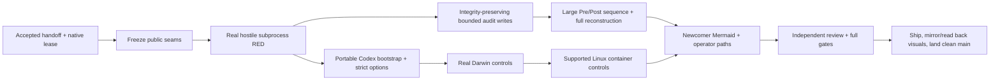

#### Implementation checkpoint

- The portable tracked runner, strict duplicate-option parser, and
  repository-root-independent drift fixture are focused GREEN.
- The 256-pair real subprocess replay reproduced the old full-audit rewrite at
  513 events. The replacement stores immutable private 64-event chunks plus a
  canonical open tail of at most 64 events, reconstructs the complete chain,
  and migrates a legacy JSONL generation on its next publication.
- Current focused evidence reconstructs all 513 events from eight chunks,
  retains one generation, keeps every audit file below 32 KiB and total state
  below 512 KiB, and rejects a corrupted sealed chunk without state mutation.
- Supported Linux execution, full gates, independent review, publication,
  visual read-back, and remote landing remain explicitly unclaimed.

#### Lifecycle review correction

- The first lifecycle review BLOCKED the frozen candidate because Codex runs
  commands from the session `cwd`; the relative tracked-runner path failed
  from a nested repository directory.
- Official Codex Hooks documentation confirms that commands use session `cwd`,
  Codex may start in a subdirectory, and repo-local hooks need stable root
  resolution. It documents no project-root environment variable.
- A real nested-cwd RED now becomes GREEN through pinned system Python that
  selects the outermost ancestor Git marker and executes its tracked runner.
  The locator invokes no Git, mise, `env`, or ambient `PATH`; the runner still
  applies exact platform Git, mise/Python, receipt, and lifecycle validation.
- New exact host and supported-Linux nested Pre/Post/hostile evidence, full
  gates, narrow lifecycle re-review, publication, and landing remain unclaimed.

## 2026-08-14 — select a complete nested hook runtime and bound audit reads

- **Iteration ID:** `dotfiles-goal-20260814-013`
- **Prior goal digest:** `sha256:7ccc6ae231339e8b2aeba57b1143ba688e50ce7de95f06f4bf9f38e18f8872c5`
- **Current goal digest:** `sha256:a7e48b0a98d96773fb524345e4dff662a98ad6ae9b1d4e3ce5c4d71bbacc3eb3`
- **Changed requirement:** Resolve issue #763's bounded review debt without
  reopening #760: nested checkouts require one complete regular tracked runtime,
  missing runtimes block explicitly, the 513-event audit is compared in exact
  order, and one hook validates no more than 8 MiB of sealed history.
- **Reason:** A real outer-repository/inner-dotfiles replay reproduced the
  landed command selecting an unrelated outer marker and exiting `1` before
  reaching the tracked runner. Official Codex Hooks documentation makes exit
  `2` or structured output the blocking contract. The 256-pair scale replay
  also proved complete writes but had not compared exact reconstructed order or
  bounded cumulative sealed-history reads.
- **Evidence:** The manual exact-source replay failed at the outer runner path.
  The public test then went RED and GREEN with exactly one complete
  runner-plus-entrypoint candidate, including missing, wrong-type, symlink, and
  ambiguous-complete outer controls. Missing or ambiguous candidates exit `2`.
  Root and component descriptors bind the executed runner and hook bytes. The real 512-hook replay
  reconstructs all 513 `(sequence, event, tool ID)` tuples in 77.10 seconds;
  its actual chunk chain derived 35,822,208 cumulative sealed bytes and 161,662
  final state bytes. A valid content-addressed 9 MiB hostile chunk now crosses
  the enforced 8 MiB ceiling and denies without changing state.
- **Affected tickets:** dotfiles issue #763 and its future delivery PR.
- **Disposition:** `ACCEPTED_AND_ACTIVE` — root selection, ordered reconstruction,
  read ceiling, and portable Darwin operator text are focused GREEN. Full host
  and supported-container gates, two independent reviews, publication, visual
  read-back, and landing remain unclaimed.
- **Topology and ownership:** `/root/dotfiles_753_writer_lease` is sole writer
  in registered worktree `dotfiles-issue-763` on
  `codex/issue-763-runner-audit`; `/root` coordinates. `.omc/`, knowledge-base,
  Graphify semantic work, SkillOpt, and #760's landed state machine are excluded.

### Current goal

> Land dotfiles issue #763 by requiring exactly one complete regular runner-bearing hook runtime from nested Codex cwd, descriptor-binding the executed runner and hook bytes, explicitly blocking missing or ambiguous runtimes, proving exact 513-event audit order, enforcing an 8 MiB sealed-history read ceiling, documenting portable Darwin bootstrap paths and measured amplification, preserving #760 lease semantics, passing host/container gates and independent review, and shipping through clean synchronized main.

### Current workflow

```mermaid
flowchart LR
    CWD["Codex session cwd"] --> WALK["Walk ancestor Git markers"]
    WALK --> FILTER{"All runtime components plain?"}
    FILTER -->|"no candidate"| BLOCK["Exit 2 before mutation"]
    FILTER -->|"exactly one complete"| RUNNER["Descriptor-bound tracked runner bytes"]
    RUNNER --> LEASE["Existing #760 lease lifecycle"]
    LEASE --> TAIL["Bounded open audit tail"]
    TAIL --> CHUNKS["Content-addressed sealed chunks"]
    CHUNKS --> ADMIT["Fstat against remaining budget"]
    ADMIT --> LIMIT{"Size-exact read within 8 MiB?"}
    LIMIT -->|"exceeded"| DENY["Deny without state mutation"]
    LIMIT -->|"within bound"| ORDER["Compare all 513 ordered events"]
    ORDER --> GATES["Host plus supported container gates"]
    GATES --> REVIEW["Two independent exact-head reviews"]
    REVIEW --> SHIP["Ship, mirror visuals, land clean main"]
```

#### Independent review corrections

- The first exact-freeze lifecycle review reproduced an enclosing repository
  whose `scripts/` and `python/` parents were symlinks. Leaf-only checks selected
  that redirected runtime before lease enforcement. The public Pre/Post replay
  now uses hostile redirected code and proves that parent-directory and `.git`
  symlinks are rejected while the inner holder starts and drains normally.
- The first storage review proved the initial ceiling counted bytes only after
  reading a complete chunk. The reader now admits descriptor size against the
  remaining 8 MiB budget before a size-exact read and revalidates the descriptor;
  an oversized content-addressed chunk is denied without reading to EOF or
  mutating state.
- Both review verdicts were `BLOCK` on freeze manifest
  `sha256:551072dd5473b948e14006fbb36fb793241c96cdb35f8bf10ecd538ec9775eb4`.
  Their findings are preserved; corrected host/container gates and two fresh
  exact-freeze reviews remain required before publication.
- The next exact-freeze review found that a complete regular but untracked outer
  runtime could win pathname-only selection and execute before lease enforcement.
  The public marker replay was RED, then GREEN after ambiguous complete roots
  began exiting `2`, every admitted component used descriptor-relative
  `O_NOFOLLOW` plus `fstat`, and runner/hook execution consumed the already-open
  descriptors. Fresh full gates and two exact-freeze reviews remain required.

## 2026-08-27 — retire the repository writer lease

- **Iteration ID:** `dotfiles-goal-20260827-014`
- **Prior goal digest:** `sha256:a7e48b0a98d96773fb524345e4dff662a98ad6ae9b1d4e3ce5c4d71bbacc3eb3`
- **Current goal digest:** `sha256:902af18f847ff9b231aa9691a63abf67efe72f877f2110ed2b552a310a6079d1`
- **Changed requirement:** The writer lease (#753, #759, #760, #763, #791, #796)
  is removed rather than repaired: no PreToolUse/PostToolUse lease hooks, no
  runner, no `writer-lease` CLI or mise tasks, no `workflow.writer-lease`
  contract, no real-process lease tests, no lease rule or spec. One-writer
  coordination is the manual restart protocol only.
- **Reason:** In one session the lease wedged three times (~2h): a dead
  session's holder with leaked in-flight entries, and twice a challenge-protocol
  change under a live holder (hooks execute working-tree code, the holder runs
  the code it started with). A delegated Codex lane runs under its own session
  id, so the per-session hook denied every Codex call (#796), and the harness
  offers no session-liveness signal for recovery. Ray decided deletion over
  repair: the guarantee it gave is covered by git refusing one branch in two
  worktrees and by one live implementation lane per checkout.
- **Evidence:** Commit `ecd6cc2` on `chore/retire-writer-lease` (29 files,
  +673/−5,086). Gates outside the Codex sandbox: `mise run lint` rc=0; pytest
  2440 passed; `mise run verify` 136/0; `lint-docs` clean; `hook selfcheck`
  PASS; `parity` OK; `git grep` of the commit tree for lease terms outside
  `docs/research`, `docs/receipts` and this file returns nothing. Cold read
  (Opus, cross-family to the Codex implementer) found no dangling reference and
  one process gap — this missing iteration.
- **Affected tickets:** dotfiles #791 and #796 (closed by the commit); #753,
  #759, #760, #763 superseded.
- **Disposition:** `ACCEPTED_AND_ACTIVE` — implemented and gated on the branch;
  PR, CI and landing remain.
- **Topology and ownership:** The Claude session `ad30e818` is the architect and
  sole writer in the canonical checkout on `chore/retire-writer-lease`; a
  Codex implementation lane wrote under it (one live lane per checkout). No
  registered worktree is a writer. `.omc/` and untracked `.agents/skills/*`
  mirrors are excluded.

### Current goal

> Retire the repository writer lease entirely — its hooks, hook runner, CLI subcommand, mise tasks, verification contract, real-process tests and instruction docs — so that no session, lane or contract references or enforces it; keep one-writer coordination as the manual restart protocol backed by git worktree branch exclusivity and one live implementation lane per checkout; ship through clean synchronized main.

### Current workflow

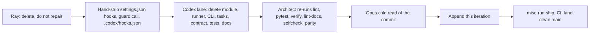

## 2026-09-11 — decouple function-hook adoption from the knowledge-base gate

- **Iteration ID:** `dotfiles-goal-20260911-015`
- **Prior goal digest:** `sha256:902af18f847ff9b231aa9691a63abf67efe72f877f2110ed2b552a310a6079d1`
- **Current goal digest:** `sha256:83cb5c93e477f5471a57174b17850f624727bbbc9c00a321f061889c316de09d`
- **Changed requirement:** #1020's first ask — "dotfiles acts only after
  knowledge-base G04 (`ray-manaloto/knowledge-base#757`) observes a function-hook
  mod actually firing" — no longer binds. Ray's ruling is "don't depend on
  knowledge-base": dotfiles does not block its own work on a knowledge-base
  milestone. Scope is deliberately TIMING only; the five live code couplings
  (the SHA-pinned `kb-setup` dep at `python/pyproject.toml:40`, five `kb_setup`
  imports, `hk.pkl:625`, `ci.yml:202`, the currency engine) are unchanged and
  remain tracked separately. #1020's other three asks are unaffected. The
  evidence bar is NOT relaxed: with no external party producing the first firing
  observation, the two-arm probe becomes dotfiles' own obligation and runs
  BEFORE anything is built on the engine.
- **Reason:** On 2026-09-11 a defect already filed as #877 on 2026-08-31 —
  labelled `ready-for-agent`, carrying a live reproduction and a working fix in
  its comment — was independently re-diagnosed for the third time, after which
  an advisor and two upstream research lanes re-derived that same fix from
  scratch. #998 was closed the same day as its duplicate. Recording was never
  the gap: there are 117 `feedback_*` memory files and two issues for this one
  defect. Retrieval was the gap. Ray chose function hooks as the substrate for
  the fix and removed the knowledge-base dependency that would have deferred it.
- **Evidence:** #877 (OPEN, 2026-08-31, `bug`+`ready-for-agent`, parent #848)
  and its 2026-09-01 comment containing the fix; #998 closed 2026-09-11 as its
  duplicate (`issues/998#issuecomment-5642316997`); the ruling recorded at
  `issues/1020#issuecomment-5642327691`. Advisories persisted in commit `f6ba0ae`
  at `docs/research/kb/reports/agents/2026-09-11-mise-project-root-advisory.md`
  and `-function-hooks-retrieval-advisory.md`. Upstream: jdx/mise PR #9657 and
  `docs/hooks.md` establish `MISE_PROJECT_ROOT` as set in TASK contexts only;
  jdx/hk exposes no project-root variable and runs steps with cwd at the repo
  root. Every claim about the function-hooks engine itself remains
  RUNTIME-UNVERIFIED pending the probe.
- **Affected tickets:** #1020 (gate amended by comment), #877 (the fix lands
  under it), #998 (closed as duplicate), #524 (a verified `branch_guard`
  fail-closed-under-load defect recorded against it), `ray-manaloto/knowledge-base#757`
  (no longer a dotfiles prerequisite).
- **Disposition:** `ACCEPTED_AND_ACTIVE` — ruling made and recorded; the probe
  and both PRs remain.
- **Topology and ownership:** The Claude session `7febd9f8` is the architect and
  sole writer in the canonical checkout, on `fix/877-pre-push-project-root`
  branched from `origin/main` at `9156dcf`. `fix/lock-refresh-producer-swap` is
  shipped as PR #1021 with auto-merge armed and is CLOSED to further writes. Four
  read-only advisory/research lanes ran during this session and wrote only to
  `docs/research/kb/reports/agents/`; none is a writer. No worktree is registered.

### Current goal

> Adopt Claude Code function hooks for issue-retrieval/dedup on dotfiles' own evidence rather than waiting on a knowledge-base milestone; gate adoption on a two-arm firing probe executed in this repo's deployed environment, and stop rather than route around if that probe does not produce a MEASURED result.

### Current workflow

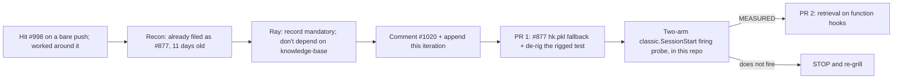

## 2026-09-11 — discharge the function-hooks adoption gate by measurement

- **Iteration ID:** `dotfiles-goal-20260911-016`
- **Prior goal digest:** `sha256:83cb5c93e477f5471a57174b17850f624727bbbc9c00a321f061889c316de09d`
- **Current goal digest:** `sha256:b0b405158cd329931aec937ce8d27a83863c59117de5059bce55ad8653f18726`
- **Changed requirement:** Iteration 015 made the two-arm firing probe dotfiles'
  own obligation and gated PR 2 on it. **The probe ran and produced a MEASURED
  result: the engine fires and enforces.** The gate is discharged, so the goal
  advances from "prove the substrate" to "build on it". Two design constraints
  replace the open question, both measured rather than assumed: no NATIVE
  `tool.call` registration that can reach Bash, and `--debug-file` plus a real
  enforcement control arm in every verification. #1020's own restriction is
  narrowed by measurement — it reads "wildcard observers included", but
  `classic.*` is unaffected, so a session-wide observer and a `hook_guard`
  migration both remain available.
- **Reason:** 015 recorded the decision; this records verified delivery, which
  the append-only contract requires be distinguishable from an accepted
  decision. The probe's stop condition ("if it does not fire, or fires without
  enforcing, work stops and the approach is re-decided") was not triggered.
- **Evidence:** Three probes on `~/.local/share/claude/versions/2.1.269`, each
  with both arms armed.
  (1) **Firing/enforcement** — `classic.SessionStart` injected a fresh nonce into
  the model's context (control: absent without the plugin);
  `classic.PreToolUse{tool=Read}` `deny` was enforced under
  `--permission-mode bypassPermissions` (`Hook result has permissionBehavior=deny`;
  control: the Read succeeded without the plugin).
  (2) **#92533** — reproduced on 2.1.269 (arm B), `on("*")` and bare
  `on("tool.call")` also break worktree Bash (C, D), while `classic.*` (E) and
  `classic.PreToolUse{tool=Bash}` (F) do not — F's hook fired twice on the
  worktree agent's own Bash calls. Control arm A (no plugin) succeeded.
  (3) **Double registration** does NOT silently replace: with the first handler a
  passthrough, the second's deny reached the model, so both are live and nest.
  Reports: `docs/research/kb/reports/agents/2026-09-11-function-hooks-firing-probe.md`
  and `-worktree-bash-probe.md`; five lane reports beside them; posted to
  `issues/1020#issuecomment-5643019562`. Two upstream sources promoted to
  `docs/research/kb/raw/`. **Still UNVERIFIED:** `@skills-dir` deployment
  (DOCUMENTED, and a GitHub sweep found zero users), interactive-session
  behaviour, coexistence with this repo's nine classic registrations, the
  `agentId`/`agent_id` lane-marker trap, and any cost model.
- **Affected tickets:** #1020 (gate discharged by measurement; kept open for
  `@skills-dir` and cost), #877 (fixed and closed by #1022), #524 (unchanged),
  `anthropics/claude-code#92533` (confirmed live on 2.1.269),
  `anthropics/claude-code#92469` (corroborated: `session.authorize` and
  `flag.value` are real shipped capabilities).
- **Disposition:** `ACCEPTED_AND_ACTIVE` — substrate verified; PR 2 unblocked and
  not yet designed.
- **Topology and ownership:** The Claude session `7febd9f8` is the architect and
  sole writer in the canonical checkout, on `feat/function-hooks-probe` branched
  from `origin/main` at `4362a78`. #1021 and #1022 are merged and landed
  (`land -- 1022` rc=0). Six read-only research lanes ran and wrote only to
  `docs/research/kb/reports/agents/` and `.agent/kb/raw/`; none is a writer. One
  lane (`fnhook-codesearch`) declined its task on role grounds and the work was
  re-routed. No worktree is registered in this repository; the #92533 probe
  created worktrees only inside a throwaway scratchpad repository.

### Current goal

> Build issue-retrieval/dedup on Claude Code function hooks in the classic.* namespace, which measurement has established both fires and enforces on 2.1.269; keep every native tool.call registration that can reach Bash out of the design, and carry --debug-file plus a real enforcement control arm through every verification, because a runtime hook failure is silent and fails open.

### Current workflow

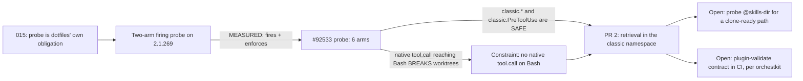

## 2026-09-16 — PR #1154 landed; the handoff workflow itself becomes the goal

- **Iteration ID:** `dotfiles-goal-20260916-017`
- **Prior goal digest:** `sha256:b0b405158cd329931aec937ce8d27a83863c59117de5059bce55ad8653f18726`
- **Current goal digest:** `sha256:92307e302d1678fbf6ef3e50a4f6081eedcfe8fe7f18a745671f22b5b83badac`
- **Changed requirement:** The function-hooks goal (016) is not advanced here;
  the operator redirected the next unit of work to the SESSION WORKFLOW after a
  session in which four codex lanes, six cold reviews and eight verifier passes
  were needed to land one PR. The new goal: `task_plan.md` is the only
  next-task carrier (the handoff's "next task" pointer is retired), session
  review runs through AgentsView and the codex SDLC team, `mise run
  session-review` must parse every current Codex record (it exited 1 today on
  `unknown Codex record 'token_usage_record'` with 19,056 omissions), and each
  session ends with a self-improvement pass. The six operator-stated goals are
  recorded verbatim in `task_plan.md` (Phase 7) and `.agent/plans/session-2026-09-16c.md`.
- **Reason:** Ray, 2026-09-16 (verbatim intent): "fully removed the next task
  pointer and only rely on pwf task plan"; "migrate wherever possible to
  agentsview for reviewing the session"; "utilize the /codex-sdlc-team skill and
  team for any of the steps in /session-handoff"; "self-improve … based on
  learnings from the session"; "find any missing steps that should be added to
  /session-review"; "overall improvement of /session-review". AgentsView is
  maintained by another project: features/issues found are written up as a
  document for that project's agents, not fixed here.
- **Evidence:** PR #1154 merged `24e4a5d`, `mise run land -- 1154` rc=0 (main
  run 35142655392 `conclusion=success`, smoke tiers 1-3 OK). Gate trio on the
  merged tree: lint rc=0, pytest 3525 passed, verify 155/0/4. Evidence chain
  under `docs/research/kb/reports/agents/*2026-09-16.md` (premise-verifier ×8,
  cold reviews of `49d7af6`/`fb93d8a`/`67a6cad`/`6d2881f`/`bdb78b4`/`a8b20b1`,
  four lane settlements, `advisor-ship-6c-p1`). `mise run session-review`
  rc=1 today (see Changed requirement).
- **Affected tickets:** #1154 (merged), #1155 (opened: wrapper/gate residuals),
  #1142 (closed 2026-09-16 while its body still reads "decision 4 open" —
  unresolved), #1141 (agentsview service PR, bot/other-project managed), #1020
  (unchanged; goal 016 paused, not abandoned).
- **Disposition:** `ACCEPTED_AND_ACTIVE` — decision recorded; delivery is the
  next session's (review → typed findings → implement accepted ones, per the
  operator's ruling).
- **Topology and ownership:** The Claude session `dotfiles-20260916.001`
  (Fable 5.1) was the architect and sole writer of the canonical checkout on
  `fix/codex-implementer-wrapper-and-6c-p1` (landed) and now on
  `docs/session-2026-09-16c-handoff`. Implementation writers were four
  sequential `codex-sol-implementer` lanes (codex session ids
  `01a0ab0e-ee79-7a43-8b97-6ff4c75e6a2f` → `67a6cad`,
  `01a0ab3d-c2da-7632-ad5d-cdaa3c6f1391` → `6d2881f`,
  `01a0ab75-5cf9-7a91-99d1-a9dfe49b405b` → `bdb78b4`,
  `01a0ab8f-66cd-7341-845a-d88fbd99c40f` → `a8b20b1`), each owning the checkout
  from dispatch to settlement with no concurrent writer. Read-only lanes:
  `premise-verifier-6c-p1` (8 passes), codex reviewers of `49d7af6` and
  `fb93d8a`, Opus cold reviewers of the four codex commits, `codex-sol-advisor`,
  and — for this handoff — the codex SDLC team (run `session-review-20260916c`,
  review mode) plus an AgentsView search lane. No worktrees.

### Current goal

> Make the session-handoff workflow trustworthy after /clear: the pwf task plan is the ONLY next-task carrier (no separate next-task pointer), session review is done through AgentsView plus the codex SDLC team rather than hand-written summaries, `mise run session-review` parses every current Codex record, and each session's learnings feed a self-improvement pass — with the hardened codex-sol-implementer wrapper (PR #1154) as the implementation lane and issue #1155 carrying the wrapper/gate residuals.

### Current workflow

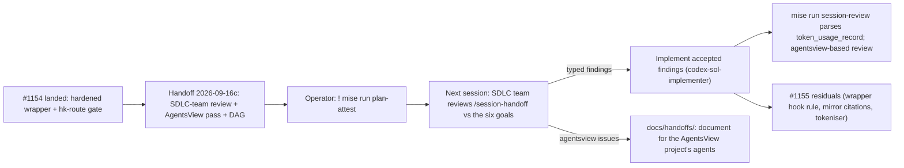

## 2026-09-17 — Phase 7 lands and `/verify` closes the bounded-loop mismatch

- **Iteration ID:** `dotfiles-goal-20260917-018`
- **Prior goal digest:** `sha256:92307e302d1678fbf6ef3e50a4f6081eedcfe8fe7f18a745671f22b5b83badac`
- **Current goal digest:** `sha256:c37f0d20a4c75cb8a6083ce4421bbdce9bd020af70cefc3df0936bc63c3ed1ce`
- **Changed requirement:** Phase 7 landed as PR #1163 at `0865524`: plan-only
  task authority, the orphan/bounded-wait guard, AgentsView census, and a
  self-describing session review. The `/verify` pass found one docs-vs-code
  mismatch: bounded loops were not classified. This iteration closes that
  mismatch. The goal now becomes the nine filed follow-ups #1165–#1173, with
  #1171 (harness-children allowlist) and #1157 (session-review non-record
  residual) first.
- **Reason:** Ray, 2026-09-16/17: one PR; the codex SDLC team does the work;
  continuity is the tracked plan digest pointer only; run `/verify` after the
  PR.
- **Evidence:** PR #1163; `docs/research/kb/reports/agents/*2026-09-16.md`;
  the Phase 7 `/verify` report.
- **Affected tickets:** #1157, #1155, #1165–#1173.
- **Disposition:** `ACCEPTED`.
- **Topology and ownership:** One writer: the Claude architect session.
  Implementation lanes are the codex SDLC team; cold review is Opus.

### Current goal

> Complete the nine filed Phase 7 follow-ups (#1165–#1173), prioritizing #1171 (harness-children allowlist) and #1157 (session-review non-record residual); keep task_plan.md as the sole task authority, use only its tracked digest pointer for continuity, route implementation through the codex SDLC team, and run /verify after each landed PR.

### Current workflow

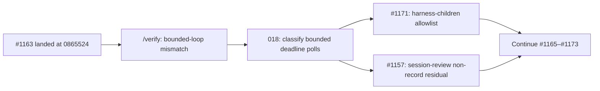

## 2026-09-17 — #1183 lands: the dubious-ownership transient is attributed and closed

- **Iteration ID:** `dotfiles-goal-20260917-019`
- **Prior goal digest:** `sha256:c37f0d20a4c75cb8a6083ce4421bbdce9bd020af70cefc3df0936bc63c3ed1ce`
- **Current goal digest:** `sha256:03c7688170df99ffc246bc81509ea7a2e5dbadba876ab190c5899afddda8cd50`
- **Changed requirement:** Phase 8 item 1 (#1183) landed as PR #1186 at
  `ca109b7`. The mechanism differs from the Phase 8 plan text by ruling: a
  workspace-scoped `safe.directory` rendered by the chezmoi-managed
  `home/dot_gitconfig.tmpl`, not `postStartCommand` or the image. The live arm
  also corrected the diagnosis: the virtiofs mount-root owner FLICKERS to
  `0:0` for single samples under load; it is not a five-minute window. The
  goal advances to #1171, then #1157, then the remaining follow-ups plus the
  new #1185.
- **Reason:** Ray, 2026-09-17: order #1183 → #1171 → #1157; mechanism ruled
  chezmoi `dot_gitconfig` when asked (declarative, no sudo, no base rebuild).
- **Evidence:** PR #1186; `mise run land -- 1186` rc=0 on the first attempt
  (main run 35276009029 success); live arm — git rc=0 on 42 of 42 samples
  including two `0:0` samples (`docs/rules-evidence/persistence-gate-retry.md`);
  `docs/research/kb/reports/agents/cold-review-1183-2026-09-17.md` and
  `cold-review-1183-r2-2026-09-17.md`.
- **Affected tickets:** #1183, #1185, #1165, #1171, #1157.
- **Disposition:** `ACCEPTED`.
- **Topology and ownership:** One writer: the Claude architect session.
  Implementation lanes are the codex SDLC team; cold review is Opus.

### Current goal

> Complete Phase 8 and the remaining Phase 7 follow-ups: #1171 (harness-children allowlist) then #1157 (session-review non-record residual), then #1172, #1173, #1169, #1170, #1165, #1166, #1167, #1168 and #1185; keep task_plan.md as the sole task authority, use only its tracked digest pointer for continuity, route implementation through the codex SDLC team, and run /verify after each landed PR.

### Current workflow

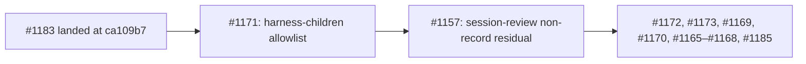
