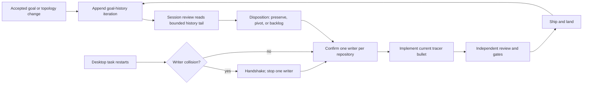
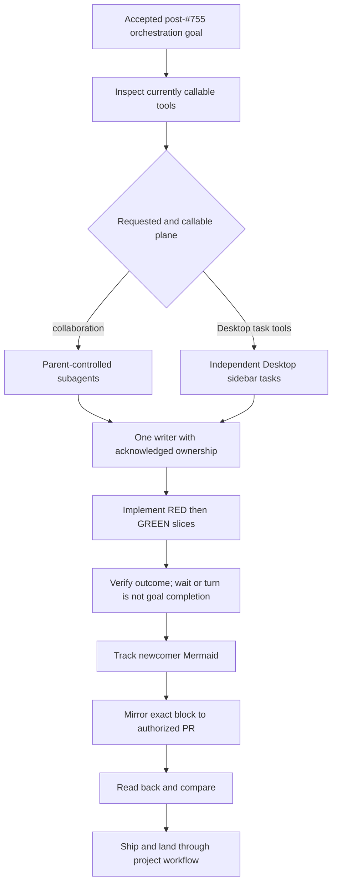
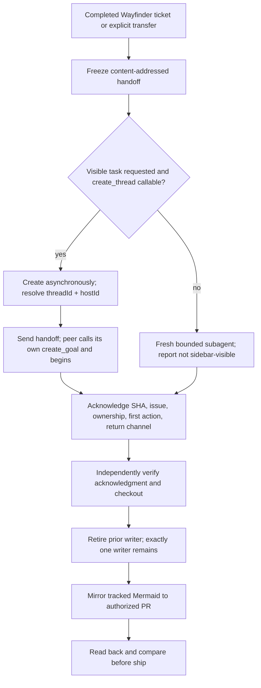
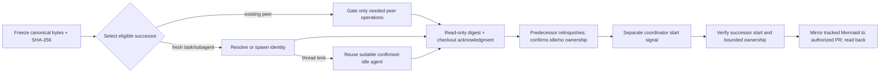

# Dotfiles goal history

This is the append-only record of accepted goal changes for dotfiles. It exists
so session review and SkillOpt can inspect how goals drift, where prompts are
ambiguous, and which orchestration choices repeatedly cost time. An entry
records a decision; it does not certify that the described work landed.

## Entry contract

- Append new iterations at the end. Never rewrite, reorder, squash, or delete
  earlier entries.
- `Prior goal digest` is the SHA-256 of the exact prior iteration's current goal
  text, excluding the Markdown quote prefix and trailing newline. The first
  tracked iteration uses `NONE (bootstrap)`.
- Append-only verification uses the fixed `origin/main` merge-base, checks every
  first-parent branch revision sequentially, then checks the working tree
  against committed `HEAD`. An unresolved baseline fails closed.
- Evidence must be independently inspectable. Missing evidence remains named as
  missing rather than inferred from assistant prose.
- `Topology and ownership` names the single current implementation writer for
  each repository and every handoff or collision risk.
- Every entry includes the current goal text and a current Mermaid workflow.

## 2026-08-14 — establish the tracked orchestration goal

- **Iteration ID:** `dotfiles-goal-20260814-001`
- **Prior goal digest:** `NONE (bootstrap)`
- **Current goal digest:** `sha256:12db9f86a5d17902e58b0cdc7330939cf2f1e025fb2a06d96c056860f6349385`
- **Changed requirement:** Establish an append-only goal history, make it a
  default session-review source, and enforce its required structure. Record the
  move from resumed Desktop tasks to one fallback subagent writer per repository.
- **Reason:** Both Desktop tasks completed their resumed goals. Peer task
  messaging was unavailable, so continued implementation required an explicit
  ownership handoff without allowing two writers to mutate one repository.
- **Evidence:** dotfiles PR #750 landed the task-orchestration skill; PR #752
  landed the final #671 acceptance test; knowledge-base coordination handshake
  v14 is recorded on issue #292. The local Graphify 0.9.42 health check reported
  a missing graph, so source files—not graph output—were authoritative here.
- **Affected tickets:** knowledge-base #292 and #299; dotfiles #750 and #752;
  dotfiles #753; this dotfiles goal-history implementation lane.
- **Disposition:** `ACCEPTED_AND_ACTIVE` — the Graphify-first MVP continues;
  this entry does not claim that knowledge-base #299 or later MVP tickets landed.
- **Topology and ownership:** The supervisor owns cross-repository coordination.
  One fallback subagent owns dotfiles and one owns knowledge-base. If a user
  restarts either Desktop task, that creates a duplicate-writer hazard: the
  Desktop task and fallback writer must handshake, and one must stop before
  either changes repository bytes. This is a manual coordination protocol, not
  executable prevention; dotfiles issue #753 tracks the native ownership lease.

### Current goal

> Implement and land the dotfiles append-only goal-history contract. Keep it discoverable to session review, enforce required iteration structure, and record orchestration topology changes without duplicating knowledge-base Graphify, SkillOpt, shared expert-bundle, or devcontainer work.

### Current workflow

## 2026-08-14 — distinguish subagents from Desktop peer tasks

- **Iteration ID:** `dotfiles-goal-20260814-002`
- **Prior goal digest:** `sha256:12db9f86a5d17902e58b0cdc7330939cf2f1e025fb2a06d96c056860f6349385`
- **Current goal digest:** `sha256:123c4c2c1ae590ecc2f24123e89ec840bd4aae809f3ba3a448856d384277ae9f`
- **Changed requirement:** Update the landed orchestration skill after PR #755
  so it distinguishes parent-controlled subagents from independent Desktop
  sidebar tasks using the current callable tool catalog. Add recovery-vault-first
  missing-file lookup and a tracked Mermaid mirrored and read back from the
  authorized PR.
- **Reason:** Official Subagents documentation now explicitly describes
  enabled, inspectable agent threads under the main task. The installed Desktop
  bundle and reviewed peer-message screenshot describe a separate sidebar-task
  plane. Earlier orchestration could still conflate a finished wait/turn with
  goal completion or infer transport availability from a model slug.
- **Evidence:** `origin/main` was verified at PR #755 squash
  `307c95baf866b1c3ae591239479cf7e5b815b819`; the official Subagents page was
  read on 2026-08-14; the user-supplied Reddit screenshot matched SHA-256
  `cc4411af0b12b75daa23b82dbee63f646f31e3b354742d7961f08f3ecae81c30` and is
  retained only as non-authoritative evidence. Focused RED/GREEN receipts are
  in the branch-local structured contract; they do not certify live transport.
- **Affected tickets:** dotfiles PR #750; dotfiles issue #753; dotfiles PR #755;
  the current post-#755 task-orchestration delivery lane and its future PR.
- **Disposition:** `ACCEPTED_AND_ACTIVE` — implementation and focused
  verification are active. No PR, remote mirror, ship, or landing is claimed by
  this entry.
- **Topology and ownership:** The root supervisor owns cross-repository
  coordination. This task is the sole dotfiles implementation writer in
  `/Users/rmanaloto/dev/github/ray-manaloto/worktrees/dotfiles-codex-task-orchestration-v2`
  on `codex/codex-task-orchestration-v2`; the separate knowledge-base writer
  owns KB work. Parent-controlled subagents remain under their main task;
  independent Desktop tasks remain peer sidebar tasks. A restarted peer must
  handshake and stop one writer before touching this repository.

### Current goal

> Implement, validate, ship, and land the post-#755 Codex task-orchestration skill update from exact origin/main 307c95baf866b1c3ae591239479cf7e5b815b819. Distinguish parent-controlled subagents from independent Desktop sidebar tasks using only currently callable tools, preserve single-writer ownership and recovery-vault-first lookup, and keep the tracked Mermaid synchronized with the authorized PR mirror and readback. Synthetic evals test routing decisions but do not certify live transport.

### Current workflow

## 2026-08-14 — bound successor creation to Wayfinder transfers

- **Iteration ID:** `dotfiles-goal-20260814-003`
- **Prior goal digest:** `sha256:123c4c2c1ae590ecc2f24123e89ec840bd4aae809f3ba3a448856d384277ae9f`
- **Current goal digest:** `sha256:d50b4e3afefdc2a6310cce301ae6ad62327b57fa8a54275d75a97549fd28b521`
- **Changed requirement:** At a completed Wayfinder ticket or explicit
  ownership-transfer boundary, use a content-addressed handoff and a verified
  successor. Prefer a fresh visible Desktop task only when requested and
  `create_thread` is callable; otherwise disclose a bounded subagent fallback.
- **Reason:** Creating a task is identity setup, not communication, goal
  transfer, or proof that the successor started. Unbounded task-per-step
  creation would manufacture duplicate writers and an unsupported queue.
- **Evidence:** The user-approved refinement requires asynchronous identity
  resolution, peer-owned `create_goal`, full handoff acknowledgment, and
  independent verification before retiring the prior writer. Hostile evals
  14-17 reproduce premature retirement, successor churn, missing goal
  acknowledgment, and unavailable task creation; the focused structured
  contract failed before each corresponding skill rule was added and then passed.
- **Affected tickets:** dotfiles PR #750; dotfiles issue #753; dotfiles PR #755;
  the current post-#755 task-orchestration delivery lane and its future PR.
- **Disposition:** `ACCEPTED_AND_ACTIVE` — the successor-transfer protocol and
  synchronized tracked diagram are implemented locally. Independent review,
  full gates, PR mirror/readback, ship, and landing remain unclaimed.
- **Topology and ownership:** This task remains the sole dotfiles writer in
  `/Users/rmanaloto/dev/github/ray-manaloto/worktrees/dotfiles-codex-task-orchestration-v2`.
  A successor receives no write authority from creation alone. The prior writer
  remains authoritative until the coordinator independently verifies the
  successor's inherited SHA, issue, ownership, first action, return channel,
  checkout identity, and peer-owned goal acknowledgment; then the prior writer
  retires so exactly one writer remains.

### Current goal

> Implement, validate, ship, and land the post-#755 Codex task-orchestration skill update from exact origin/main 307c95baf866b1c3ae591239479cf7e5b815b819. At a completed Wayfinder ticket or explicit ownership transfer, freeze a content-addressed handoff and dispatch a verified successor through callable Desktop task creation or a disclosed bounded subagent fallback while preserving exactly one writer. Keep the tracked Mermaid and authorized PR mirror synchronized; synthetic evals test decisions but do not certify live transport.

### Current workflow

## 2026-08-14 — make successor ownership transfer non-overlapping

- **Iteration ID:** `dotfiles-goal-20260814-004`
- **Prior goal digest:** `sha256:d50b4e3afefdc2a6310cce301ae6ad62327b57fa8a54275d75a97549fd28b521`
- **Current goal digest:** `sha256:16675f8af4fe99579fa867b5a82e1dbc4d4552c18b2dbd37996ba2a8d8959a26`
- **Changed requirement:** Bind handoffs to canonical bytes and a successor-
  acknowledged digest; gate Desktop operations independently; transfer write
  authority only after predecessor relinquishment; recover a spawn thread-limit
  by explicitly reusing a suitable confirmed-idle agent when available.
- **Reason:** Independent review showed that one acknowledgment could authorize
  the successor before the predecessor stopped, while bundled Desktop gating
  unnecessarily rejected existing peers. A live spawn-capacity failure also
  established the safe idle-agent reuse branch.
- **Evidence:** Hostile evals 18-23 cover digest substitution, missing creation
  with existing peers, premature Desktop and subagent starts, safe idle reuse,
  and rejection of active-writer reuse. The parsed structured eval contract
  fails malformed JSON and missing required eval IDs. The operative protocol
  and newcomer diagram are co-located in
  `docs/agents/codex-task-orchestration.md`; synthetic results remain routing
  evidence, not live-transport certification.
- **Affected tickets:** dotfiles PR #750; dotfiles issue #753; dotfiles PR #755;
  the current post-#755 task-orchestration delivery lane and its future PR.
- **Disposition:** `ACCEPTED_AND_ACTIVE` — focused implementation and review are
  active; full gates, remote mirror/readback, PR, ship, and landing are unclaimed.
- **Topology and ownership:** This task remains the sole dotfiles writer. A
  successor stays read-only until the predecessor explicitly relinquishes and
  confirms idle/no ownership, after which the coordinator sends a separate
  bounded start signal. Active agents cannot be repurposed as successors.

### Current goal

> Implement, validate, ship, and land the post-#755 Codex task-orchestration update from exact origin/main 307c95baf866b1c3ae591239479cf7e5b815b819. Bind each successor to canonical handoff bytes and a verified digest, transfer write authority only after read-only acknowledgment and predecessor relinquishment, gate Desktop operations independently, and recover agent-thread capacity only by explicitly reusing a suitable confirmed-idle agent. Keep the tracked Mermaid and authorized PR mirror synchronized; synthetic evals test decisions but do not certify live transport.

### Current workflow

