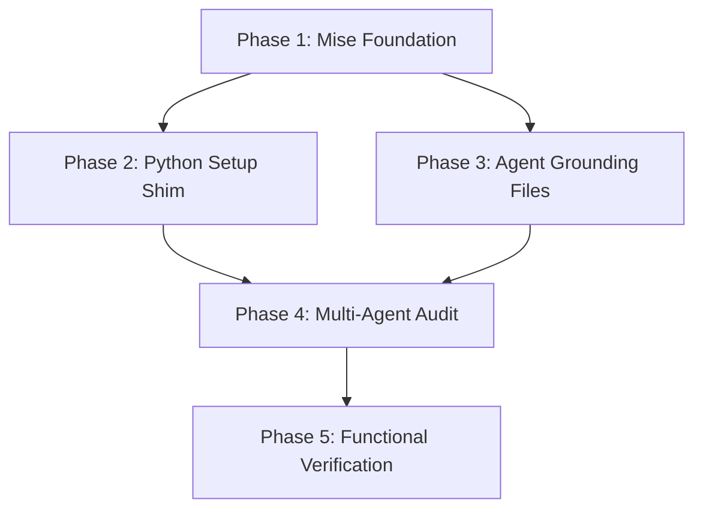

# Implementation Plan: AI/LLM Agent Orchestration

**Task Complexity**: Complex
**Total Phases**: 5
**Execution Mode**: Ask (Recommendation: Parallel Stage 2 & 3)

## 1. Plan Overview
This plan integrates Claude, Codex, and Gemini into the dotfiles environment using a hybrid declarative and Python-driven approach, with centralized grounding via AGENTS.md.

## 2. Dependency Graph

## 3. Execution Strategy
| Stage | Phases | Mode | Agent(s) |
|-------|--------|------|----------|
| 1 | 1 | Sequential | `data_engineer` |
| 2 | 2, 3 | Parallel | `coder`, `content_strategist` |
| 3 | 4 | Sequential | `coder` |
| 4 | 5 | Sequential | `tester` |

## 4. Phase Details

### Phase 1: Mise Foundation
- **Objective**: Add foundation runtimes and declarative agents to Mise.
- **Agent**: `data_engineer`
- **Files**:
    - `home/dot_config/mise/config.toml.tmpl`: Add `node`, `bun`, `npm:@google/gemini-cli`, and `npm:@openai/codex`.
- **Validation**: Run `mise install` and verify binaries.

### Phase 2: Python Setup Shim (Parallel eligible)
- **Objective**: Implement the Claude Code installer and extension logic in Python.
- **Agent**: `coder`
- **Files**:
    - `python/src/dotfiles_setup/ai.py`: Logic for `curl | bash` and extension management.
    - `python/src/dotfiles_setup/main.py`: Register `ai-setup` command.
- **Validation**: `uv run dotfiles-setup ai-setup` completes successfully.

### Phase 3: Agent Grounding Files (Parallel eligible)
- **Objective**: Deploy centralized project grounding via AGENTS.md.
- **Agent**: `content_strategist`
- **Files**:
    - `home/AGENTS.md.tmpl`: The master manifest of project rules and standards.
    - `home/CLAUDE.md.tmpl`: Reference to AGENTS.md.
    - `home/GEMINI.md.tmpl`: Reference to AGENTS.md.
    - `home/CODEX.md.tmpl`: Reference to AGENTS.md.
- **Validation**: Files exist in home directory and correctly link to the master document.

### Phase 4: Multi-Agent Audit
- **Objective**: Extend the audit module to verify AI readiness.
- **Agent**: `coder`
- **Files**:
    - `python/src/dotfiles_setup/audit.py`: Add `audit_ai_agents()` method.
- **Validation**: `uv run dotfiles-setup audit` reports all agents as healthy.

### Phase 5: Functional Verification
- **Objective**: Final end-to-end check in the devcontainer.
- **Agent**: `tester`
- **Files**:
    - `tests/test_ai_agents.py`: Version and auth status tests.
- **Validation**: All tests pass in AMD64 container.

## 5. Cost Summary
| Phase | Agent | Model | Est. Input | Est. Output | Est. Cost |
|-------|-------|-------|-----------|------------|----------|
| 1 | `data_engineer` | Flash | 2000 | 400 | $0.01 |
| 2 | `coder` | Pro | 3000 | 800 | $0.06 |
| 3 | `content_strategist` | Flash | 2500 | 600 | $0.01 |
| 4 | `coder` | Pro | 3500 | 900 | $0.07 |
| 5 | `tester` | Flash | 2000 | 500 | $0.01 |
| **Total** | | | **13000** | **3200** | **$0.16** |

## 6. Execution Profile
- **Total phases**: 5
- **Parallelizable**: 2
- **Estimated sequential time**: 35 mins
- **Estimated parallel time**: 25 mins
