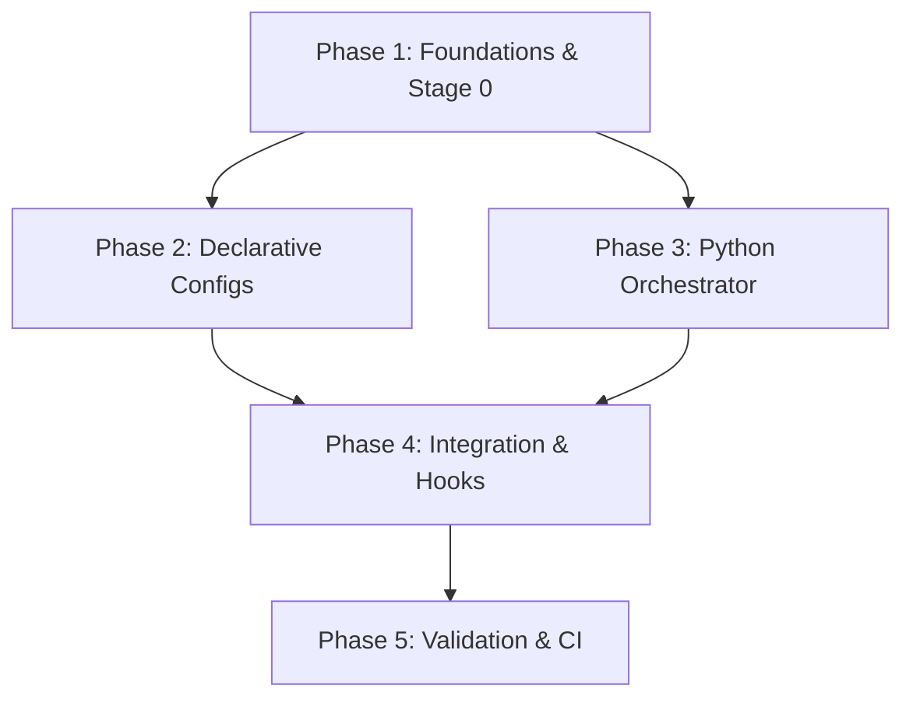

# Implementation Plan: Reproducible Dotfiles

**Task Complexity**: Complex
**Total Phases**: 5
**Execution Mode**: Ask (Recommendation: Parallel Stage 2 & 3)

## 1. Plan Overview
This plan implements the "Bare Minimum Bootstrap" architecture. It prioritizes foundational shims, declarative toolchains, and a modular Python orchestrator.

## 2. Dependency Graph

## 3. Execution Strategy
| Stage | Phases | Mode | Agent(s) |
|-------|--------|------|----------|
| 1 | 1 | Sequential | `coder` |
| 2 | 2, 3 | Parallel | `data_engineer`, `coder` |
| 3 | 4 | Sequential | `refactor` |
| 4 | 5 | Sequential | `tester` |

## 4. Phase Details

### Phase 1: Foundations & Stage 0
- **Objective**: Create the `install.sh` bootstrap and initial repo structure.
- **Agent**: `coder`
- **Files**:
    - `install.sh`: The 20-line bootstrap.
    - `home/.chezmoiroot`: Empty file to mark the root.
    - `home/dot_zshenv.tmpl`: Basic environment variables.
- **Validation**: Run `install.sh` on a bare image and verify `mise` is present.

### Phase 2: Declarative Configs (Parallel eligible)
- **Objective**: Define toolchains for Mise, Pixi, and UV.
- **Agent**: `data_engineer`
- **Files**:
    - `home/dot_config/mise/config.toml.tmpl`: Global tool definitions.
    - `home/dot_pixi.toml.tmpl`: System environments.
    - `home/pyproject.toml.tmpl`: Python project settings.
- **Validation**: `chezmoi execute-template` check.

### Phase 3: Python Orchestrator (Parallel eligible)
- **Objective**: Implement the setup library with strict ruff/mypy.
- **Agent**: `coder`
- **Files**:
    - `python/src/dotfiles_setup/main.py`: The logic engine.
    - `python/pyproject.toml`: Strict quality gates.
- **Validation**: `ruff check .` and `mypy .` with zero errors.

### Phase 4: Integration & Hooks
- **Objective**: Connect Chezmoi lifecycle scripts to the Python library.
- **Agent**: `refactor`
- **Files**:
    - `home/executable_run_once_after_00-install-tools.py.tmpl`: The hook.
- **Validation**: `chezmoi apply` triggers the tool installation.

### Phase 5: Validation & CI
- **Objective**: End-to-end testing in a container.
- **Agent**: `tester`
- **Files**:
    - `.github/workflows/ci.yml`: Weekly build validation.
    - `tests/test_bootstrap.py`: Functional tests.
- **Validation**: GitHub Action passes on Ubuntu 24.04.

## 5. Cost Summary
| Phase | Agent | Model | Est. Input | Est. Output | Est. Cost |
|-------|-------|-------|-----------|------------|----------|
| 1 | `coder` | Pro | 2000 | 500 | $0.04 |
| 2 | `data_engineer` | Flash | 3000 | 800 | $0.01 |
| 3 | `coder` | Pro | 4000 | 1200 | $0.09 |
| 4 | `refactor` | Pro | 2000 | 400 | $0.04 |
| 5 | `tester` | Flash | 3000 | 600 | $0.01 |
| **Total** | | | **14000** | **3500** | **$0.19** |

## 6. Execution Profile
- **Total phases**: 5
- **Parallelizable**: 2
- **Estimated sequential time**: 45 mins
- **Estimated parallel time**: 30 mins
