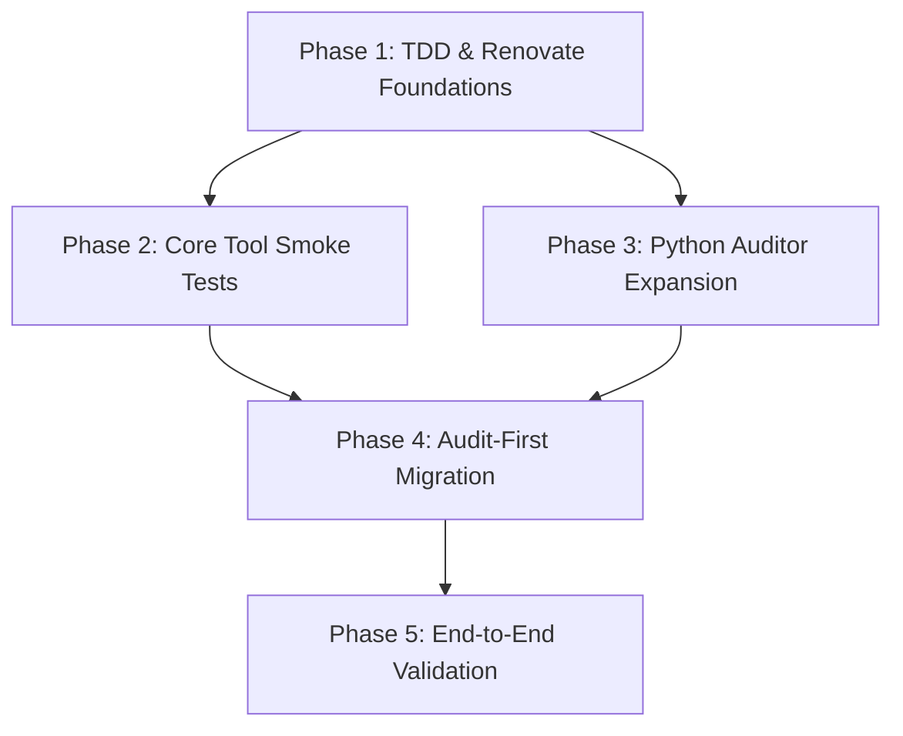

# Implementation Plan: Gold Standard Refinement

**Task Complexity**: Complex
**Total Phases**: 5
**Execution Mode**: Ask (Recommendation: Sequential for Foundations, Parallel for Migration)

## 1. Plan Overview
This plan implements the "Infrastructure Guardian" architecture, establishing a polyglot TDD framework and automated Renovate updates.

## 2. Dependency Graph

## 3. Execution Strategy
| Stage | Phases | Mode | Agent(s) |
|-------|--------|------|----------|
| 1 | 1 | Sequential | `coder` |
| 2 | 2, 3 | Parallel | `tester`, `coder` |
| 3 | 4 | Sequential | `refactor` |
| 4 | 5 | Sequential | `tester` |

## 4. Phase Details

### Phase 1: TDD & Renovate Foundations
- **Objective**: Setup the core configuration for Renovate and the `bats-core` runner.
- **Agent**: `coder`
- **Files**:
    - `renovate.json`: Configure native Mise and regex managers.
    - `home/dot_config/mise/config.toml.tmpl`: Add `bats-core` to tools.
- **Validation**: `mise install` installs bats; `renovate-config-validator` passes.

### Phase 2: Core Tool Smoke Tests (Parallel eligible)
- **Objective**: Create the initial set of shell-level tests for foundational tools.
- **Agent**: `tester`
- **Files**:
    - `tests/infra/foundation.bats`: Binary reachability for mise, chezmoi, uv, pixi.
- **Validation**: `bats tests/infra/foundation.bats` passes in the container.

### Phase 3: Python Auditor Expansion (Parallel eligible)
- **Objective**: Refactor the Python audit module to support the "Acceptance Interview" criteria.
- **Agent**: `coder`
- **Files**:
    - `python/src/dotfiles_setup/audit.py`: Implement logic for capability and path verification.
- **Validation**: `mypy` and `ruff` pass with zero skips.

### Phase 4: Audit-First Migration
- **Objective**: Use the new TDD framework to verify all existing tools before allowing new work.
- **Agent**: `refactor`
- **Files**:
    - `tests/infra/runtimes.bats`: Smoke tests for python, node, go, rust.
- **Validation**: Full `audit` run returns binary "PASS" for all categories.

### Phase 5: End-to-End Validation
- **Objective**: Final project-wide "Gold Standard" verification.
- **Agent**: `tester`
- **Files**:
    - `.github/workflows/ci.yml`: Add `bats` execution step.
- **Validation**: GitHub Action passes with 100% test coverage on infrastructure.

## 5. Cost Summary
| Phase | Agent | Model | Est. Input | Est. Output | Est. Cost |
|-------|-------|-------|-----------|------------|----------|
| 1 | `coder` | Pro | 2500 | 600 | $0.05 |
| 2 | `tester` | Flash | 2000 | 400 | $0.01 |
| 3 | `coder` | Pro | 3000 | 800 | $0.06 |
| 4 | `refactor` | Pro | 3500 | 900 | $0.07 |
| 5 | `tester` | Flash | 2000 | 500 | $0.01 |
| **Total** | | | **13000** | **3200** | **$0.20** |

## 6. Execution Profile
- **Total phases**: 5
- **Parallelizable**: 2 (Phase 2 & 3)
- **Estimated sequential time**: 40 mins
- **Estimated parallel time**: 30 mins
