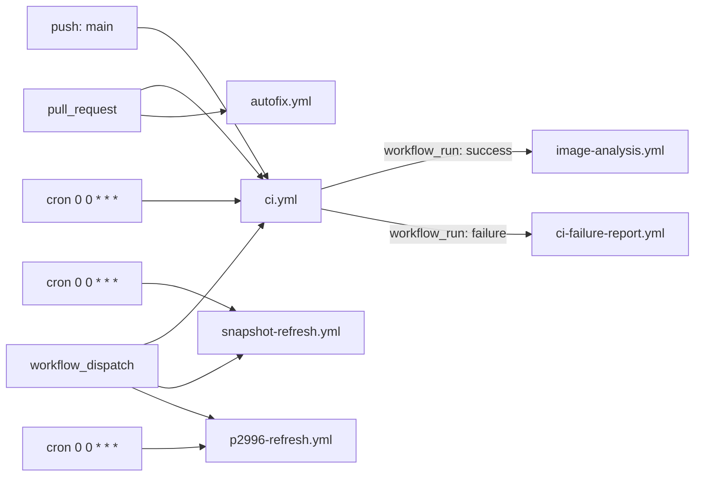
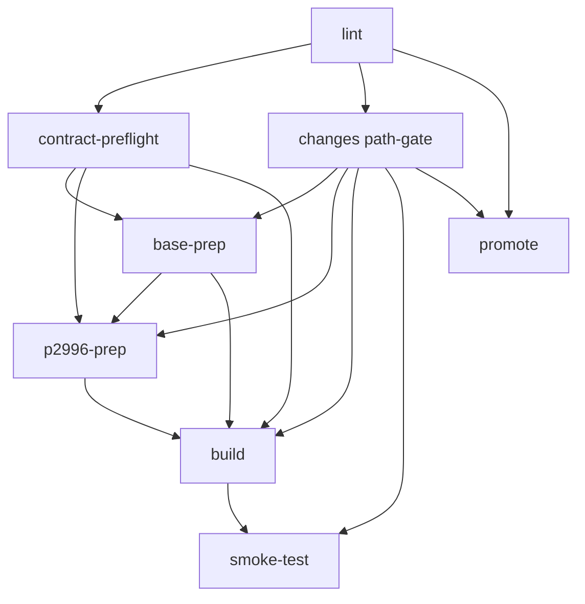
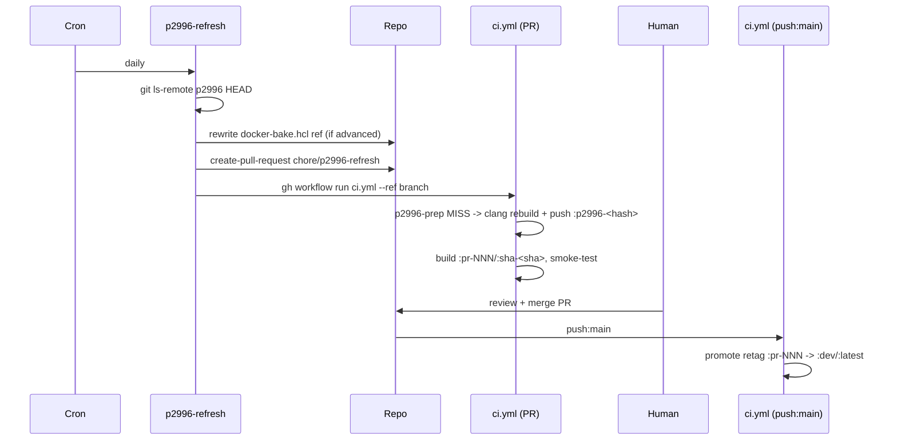
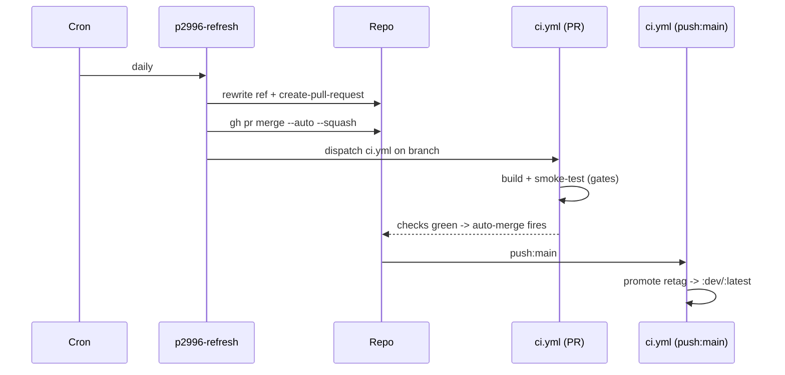
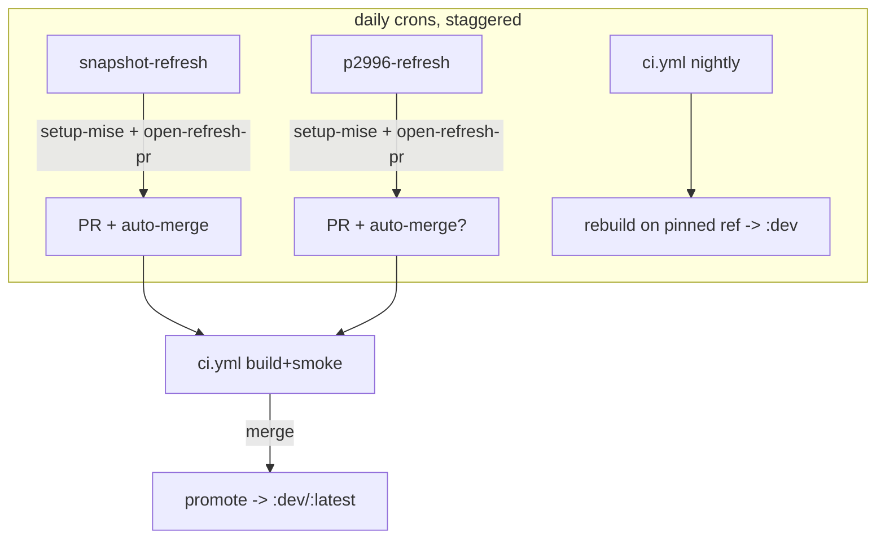

# GHA Workflow Optimization — Deep Dive

Date: 2026-06-29. Scope: all six workflows under `.github/workflows/`,
plus the bake/hash machinery they drive. Goal: identify redundancy and
evaluate two specific ideas — (1) a reusable "latest p2996" action, and
(2) auto-build-and-publish when a new p2996 commit appears — without
breaking the repo's reproducibility invariants.

> Status: **analysis + recommendations**. Nothing here is implemented yet;
> it exists so we can agree a target architecture before changing CI.

## Inventory

| Workflow | Trigger(s) | Purpose |
|----------|-----------|---------|
| `ci.yml` | `pull_request`, `push:main`, `schedule` (daily 00:00 CT), `workflow_dispatch` | Main pipeline + `promote` retag |
| `autofix.yml` | `pull_request` | Auto-format, commit back |
| `ci-failure-report.yml` | `workflow_run` (CI failure) | Async failure diagnostics |
| `image-analysis.yml` | `workflow_run` (CI success, non-push) | Async benchmark + Trivy CVE scan |
| `snapshot-refresh.yml` | `schedule` (daily 00:00 CT), `workflow_dispatch` | PR on conda-forge snapshot drift |
| `p2996-refresh.yml` | `schedule` (daily 00:00 CT), `workflow_dispatch` | PR on new `clang-p2996` HEAD |

**Three workflows now fire on the same daily `0 0 * * *` cron**: `ci.yml`
(nightly build+publish on the *pinned* ref), `snapshot-refresh`, and
`p2996-refresh`.

## Current state — triggers → workflows

## Current state — ci.yml job DAG

- **PR / schedule / dispatch path:** `lint → contract-preflight →
  changes → base-prep → p2996-prep → build → smoke-test`. The
  `base-prep…smoke-test` chain is gated `if: (not push-to-main) &&
  changes.build == true`.
- **push-to-main path:** `lint → promote` (manifest-only retag of the
  merged PR's `:pr-NNN` → `:dev`/`:latest`; ~30s, no rebuild).
- `base-prep` / `p2996-prep` are **content-hash cache probes**: compute a
  16-char hash of inputs, `docker manifest inspect` the
  `:base-<hash>` / `:p2996-<hash>` tag, build+push only on miss.

## Current state — how a new p2996 commit reaches `:dev`

Six hops, one of them a **manual merge**, plus a dependency on the
"Allow GitHub Actions to create and approve pull requests" repo setting
(currently **off** — the reason the first scheduled run pushed its branch
but failed to open the PR; #113 was opened manually instead).

## Redundancy analysis — real vs intentional

| Observation | Verdict |
|---|---|
| `snapshot-refresh` and `p2996-refresh` are ~80% identical (triggers, perms, concurrency, checkout, create-PR, ci dispatch) | **Real, low-ROI.** Differ only in detection (in-container `mise-snapshot` vs on-runner `git ls-remote`+regex). Consolidatable via a shared composite action for the create-PR tail; full merge couples two failure domains. |
| 8 jobs repeat `checkout` + `jdx/mise-action` setup | **Mostly intentional.** Subset installs cache separately (`install_args_hash`) and isolate failures. But the *boilerplate* is duplicable into one composite action with no cache penalty. |
| 3 daily crons (`ci` nightly, `snapshot-refresh`, `p2996-refresh`) | **Partly real.** `ci` nightly rebuilds+publishes on the *pinned* ref (catches base-image CVEs / floating tool drift); the two refresh crons exist to *change* the pin/snapshot. They are complementary, but the timing collision and overlapping intent are confusing and undocumented. |
| `base-prep` / `p2996-prep` cache-probe pattern duplicated | **Intentional.** Two independent cache tiers; the duplication is the design (`P2996-CACHE.md`). Leave as-is. |
| `image-analysis` + `ci-failure-report` both `workflow_run` off CI | **Intentional.** Async, off the PR critical path; correct. |

**Bottom line:** the cache-tier and async-analysis duplication is
deliberate and should stay. The genuinely reducible surface is (a) the
checkout+mise boilerplate, (b) the create-PR tail shared by the two
refresh workflows, and (c) the *manual merge* + *cron overlap* in the
p2996/snapshot publish path.

## Idea 1 — a reusable "latest p2996" action

Today the query is already one CLI call (`dotfiles-setup p2996-refresh`,
`python/src/dotfiles_setup/p2996_refresh.py`) that does ls-remote +
compare + rewrite. The reusable unit worth extracting is not the query
(already DRY) but the **workflow plumbing around it**:

- A composite action `./.github/actions/setup-mise` (inputs:
  `install_args`) wrapping `actions/checkout` + `jdx/mise-action`. Reused
  by all 8 jobs; keeps per-args caching.
- A composite action `./.github/actions/open-refresh-pr` (inputs: branch,
  title, body, paths, label) wrapping `peter-evans/create-pull-request` +
  the `gh workflow run`/auto-merge tail. Reused by both refresh
  workflows.

These are **composite actions**, not reusable workflows — composite
actions compose inside an existing job (no extra runner, no 1-level
nesting limit, no loss of cache isolation).

## Idea 2 — new p2996 commit → build → publish, automatically

The literal "skip the PR, build and push `:dev` directly on detect" is
**not recommended**: it decouples the published image from the pinned
`CLANG_P2996_REF` in `docker-bake.hcl`, which is the content-hash cache
key and the reproducibility anchor. You would lose the "what SHA is in
`:dev`?" guarantee and the audit trail.

The same outcome — *fully unattended* publish of the latest p2996 — is
achievable **without** sacrificing reproducibility by closing the one
manual hop with **auto-merge**:

This keeps the pin in the repo, keeps the CI build+smoke gate, keeps the
PR as the audit record — and removes the human step. It requires:

1. Enable **"Allow GitHub Actions to create and approve pull requests"**
   (`can_approve_pull_request_reviews: true`).
2. Add a `gh pr merge --auto --squash` step after create-PR in both
   refresh workflows (auto-merge waits for required checks).
3. Ensure branch protection requires the `smoke-test` (and lint/
   contract) checks, so auto-merge cannot land a broken image.

If you want a *review gate* for p2996 specifically (a compiler bump is
higher-risk than a snapshot refresh), keep auto-merge **on** for
`snapshot-refresh` and **off** for `p2996-refresh` (human merges the
compiler bump after eyeballing the upstream commit range). That is a
one-line policy difference, not a structural one.

## Recommendations (ranked)

| # | Change | ROI | Effort | Risk |
|---|--------|-----|--------|------|
| R1 | Enable the Actions create-PR setting + `--auto` merge on `snapshot-refresh` (and optionally `p2996-refresh`). Require smoke-test in branch protection. | **High** — delivers the "auto-publish latest" goal, preserves reproducibility | Low | Low (gated by CI) |
| R2 | Extract `./.github/actions/setup-mise` composite; adopt in all 8 jobs | Med — less drift, ~7 fewer copies | Low-Med | Low |
| R3 | Extract `./.github/actions/open-refresh-pr` composite; adopt in both refresh workflows | Med — kills the real duplication | Low-Med | Low |
| R4 | Document the 3 daily crons' distinct roles in `workflows/AGENTS.md`; consider staggering them (e.g. refresh at 00:00, nightly `ci` at 02:00) so a same-day ref bump is what the nightly publishes | Med — removes the confusion that prompted this review | Low | Low |
| R5 | Decide p2996 review policy (auto-merge vs human) and encode it; keep `docker-bake.hcl` pin as the single source of truth either way | Med | Low | Low |

**Not recommended:** merging the two refresh workflows into one file
(couples failure domains for ~80 saved lines); collapsing the base/p2996
cache tiers (the split is the optimization); build-and-push-without-PR
(breaks reproducibility).

## Suggested target state

Net: same number of workflows (each has a distinct job), but the
duplicated plumbing lives in two composite actions, the publish path is
unattended, and the cron roles are documented and staggered.

## GitHub repos touched

- [bloomberg/clang-p2996](https://github.com/bloomberg/clang-p2996) — the tracked upstream whose `p2996` HEAD drives the refresh.
- [peter-evans/create-pull-request](https://github.com/peter-evans/create-pull-request) — PR-creation action in both refresh workflows.
- [jdx/mise-action](https://github.com/jdx/mise-action) — the repeated setup step analyzed for the `setup-mise` composite.
- [aquasecurity/trivy-action](https://github.com/aquasecurity/trivy-action) — image-analysis CVE scan (pin fixed in #112).
- [github/codeql-action](https://github.com/github/codeql-action) — SARIF upload in image-analysis (pin fixed in #112).
