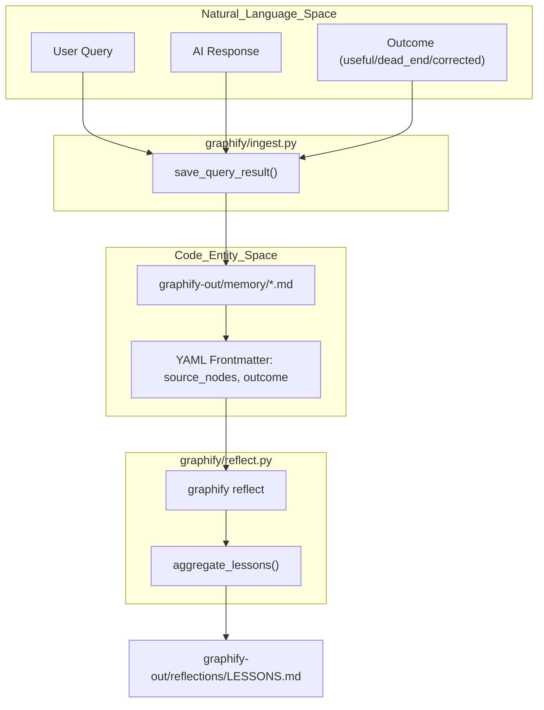
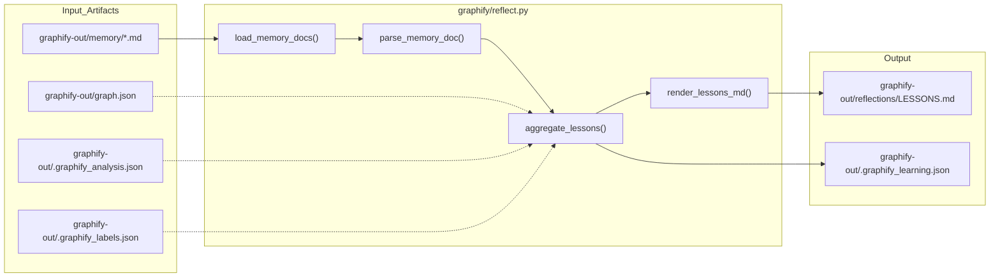

<!-- source: DeepWiki safishamsi/graphify page 2.6, fetched 2026-10-04 via mcp2cli --mcp https://mcp.deepwiki.com/mcp read-wiki-contents (deepwiki.com HTML returned HTTP 429 Vercel checkpoint; firecrawl out of credits) -->
# Page: Work Memory & Reflection

# Work Memory & Reflection

Relevant source files

The following files were used as context for generating this wiki page:

- [graphify/__init__.py](graphify/__init__.py)
- [graphify/ingest.py](graphify/ingest.py)
- [graphify/reflect.py](graphify/reflect.py)
- [tests/test_explain_cli.py](tests/test_explain_cli.py)
- [tests/test_ingest.py](tests/test_ingest.py)
- [tests/test_path_cli.py](tests/test_path_cli.py)
- [tests/test_reflect.py](tests/test_reflect.py)

The Work Memory and Reflection subsystem provides a deterministic, no-LLM mechanism for graphify to "learn" from previous interactions. It bridges the gap between transient AI chat sessions by persisting Q&A outcomes as structured data, which are then aggregated into actionable lessons.

## Overview of Work Memory

Work memory is implemented as a two-stage pipeline:
1.  **Recording**: The `graphify remember` command (and the `save-result` CLI action) captures a Q&A interaction, including the question, answer, source nodes cited, and user-provided outcome signals. These are stored as Markdown files with YAML frontmatter in `graphify-out/memory/`.
2.  **Reflection**: The `graphify reflect` command reads these memory documents, aggregates signals using time-decay scoring, and generates a `LESSONS.md` file in `graphify-out/reflections/`.

This system allows an AI agent to start a new session by reading `LESSONS.md` to identify preferred source nodes, known dead ends, and previous corrections without re-deriving that knowledge.

### Data Flow: Natural Language to Code Entity Space

The following diagram illustrates how natural language queries and AI responses are transformed into structured memory and eventually mapped back to code entities (nodes) within the graph.

**Diagram: Memory Capture and Entity Mapping**

Sources: [graphify/reflect.py:1-27](), [graphify/ingest.py:236-240]()

## Recording Interactions (`graphify remember`)

The `graphify remember` command (invoking `save_query_result`) is responsible for persisting session data. It creates Markdown files that are bypassable by the standard detection logic to prevent recursive indexing of the memory itself.

### The `OUTCOMES` Enum
Signals are restricted to the `OUTCOMES` enumeration to ensure consistent scoring during reflection:
*   `useful`: The answer was correct and helpful.
*   `dead_end`: The query or source nodes led to an unproductive result.
*   `corrected`: The user provided a correction to the AI's answer.

### Implementation Details
*   **File Naming**: Files are named using a `query_[timestamp]_[hash].md` pattern to ensure uniqueness and temporal ordering [graphify/ingest.py:55-61]().
*   **Frontmatter**: Uses a hand-built YAML subset to avoid external dependencies. It includes `source_nodes` (capped at 10 to prevent context bloat), `outcome`, and `correction` [graphify/ingest.py:13-52](), [graphify/ingest.py:236-300]().
*   **Detection Bypass**: The `graphify-out/memory/` directory is explicitly ignored by `detect.py` to ensure the reflection artifacts do not contaminate the structural graph.

Sources: [graphify/ingest.py:236-300](), [graphify/reflect.py:59-101]()

## Reflection Engine (`graphify reflect`)

The reflection engine is deterministic and does not use an LLM. It relies on mathematical aggregation and time-decay scoring to categorize nodes.

### Scoring and Time-Decay
Each signal contributes a signed value to a node's score. To ensure recent information is more relevant, a half-life decay is applied:
*   **Default Half-Life**: 30 days (`_DEFAULT_HALF_LIFE_DAYS`) [graphify/reflect.py:51]().
*   **Scoring Logic**: `useful` provides positive weight; `dead_end` and `corrected` provide negative weight [graphify/reflect.py:7-17]().
*   **Corroboration**: A node is only promoted to "Preferred" if it meets the minimum corroboration threshold (default 2, `_DEFAULT_MIN_CORROBORATION`) [graphify/reflect.py:52]().
*   **Stability**: Scores are rounded to 9 digits (`_SCORE_NDIGITS`) to ensure cross-platform stability [graphify/reflect.py:56]().

### Classification Buckets
| Classification | Description |
| :--- | :--- |
| **Preferred** | Nodes corroborated by multiple `useful` answers [graphify/reflect.py:7](). |
| **Tentative** | Nodes seen as useful only once (not yet corroborated) [graphify/reflect.py:8](). |
| **Contested** | Nodes with both positive and negative signals; recency decides the verdict [graphify/reflect.py:9](). |
| **Dead Ends** | Questions or sources explicitly marked as `dead_end` [graphify/reflect.py:10](). |
| **Corrections** | Explicit user corrections paired with the original question [graphify/reflect.py:11](). |

Sources: [graphify/reflect.py:1-27](), [graphify/reflect.py:50-57]()

### Staleness Checking
The `--if-stale` flag determines if `LESSONS.md` needs regeneration. It checks the modification times of:
1.  The `graphify-out/memory/` directory.
2.  The `graph.json` file.
3.  Sidecar files: `.graphify_analysis.json` and `.graphify_labels.json`.

### Community Grouping
When `graph.json` and `.graphify_analysis.json` are available, `graphify reflect` uses `_load_node_community` to group lessons by their community label. This allows the output to be organized by architectural modules (e.g., "Lessons for Community 0: API Core") [graphify/reflect.py:162-200]().

## System Architecture

The following diagram shows the relationship between the reflection logic, the filesystem, and the core graph assembly components.

**Diagram: Reflection System Architecture**

Sources: [graphify/reflect.py:104-130](), [graphify/reflect.py:133-156](), [graphify/reflect.py:42-46]()

## Key Functions and Classes

### `graphify/reflect.py`
*   `parse_memory_doc(text: str)`: Parses the custom YAML frontmatter using regex (`_SCALAR_RE`, `_LIST_RE`) and `_yaml_unescape` [graphify/reflect.py:104-130]().
*   `load_memory_docs(memory_dir: Path)`: Scans the memory directory and returns parsed records sorted by date then filename [graphify/reflect.py:133-156]().
*   `aggregate_lessons(docs, now, half_life_days, min_corroboration)`: The core logic calculating time-decayed scores and assigning nodes to buckets [graphify/reflect.py:203-300]().
*   `render_lessons_md(aggregated, node_to_community)`: Generates the final Markdown string for `LESSONS.md`, handling the grouping by community [graphify/reflect.py:303-400]().
*   `reflect(...)`: The main entry point for the `graphify reflect` command [graphify/reflect.py:460-500]().

### `graphify/ingest.py`
*   `save_query_result(...)`: The primary interface for saving interactions, handling YAML escaping via `_yaml_str` [graphify/ingest.py:13-52](), [graphify/ingest.py:236-300]().
*   `OUTCOMES`: Enum defining valid signal types (`useful`, `dead_end`, `corrected`) [graphify/ingest.py:231-234]().

Sources: [graphify/reflect.py](), [graphify/ingest.py]()

---

