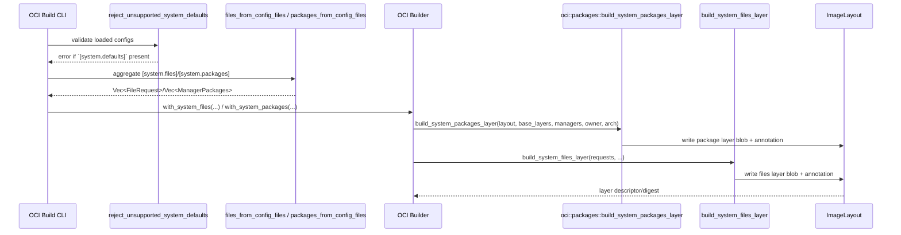

# feat(oci): apply system files and apt packages

- URL: https://github.com/jdx/mise/pull/10373
- state: closed | author: jdx | created: 2026-06-13T02:11:55Z | closed: 2026-06-13T04:37:45Z

## Body

## Summary
- bake project-scoped `[system.files]` into `mise oci` images as a dedicated annotated OCI layer
- support project-scoped `apt:` `[system.packages]` natively by unpacking the base image into a temp rootfs, calling host `apt-get` against that rootfs, and emitting the filesystem diff as an OCI package layer
- reconstruct apt rootfs inputs from gzip, zstd, or uncompressed OCI layers while applying OCI whiteouts, and emit whiteouts for package-layer deletions
- keep `--include-global` behavior aligned with existing OCI scoping, and reject `[system.defaults]` for OCI images

## Tests
- `cargo fmt`
- `cargo check`
- `cargo build`
- `shellcheck e2e/oci/test_oci_build_slow`
- `git diff --check`
- `mise run test:e2e e2e/oci/test_oci_build_slow`
- live smoke: `mise oci build --from debian:bookworm-slim --no-mise` with `[system.packages] "apt:hello" = "latest"`

*This PR was generated by an AI coding assistant.*

<!-- This is an auto-generated comment: release notes by coderabbit.ai -->
## Summary by CodeRabbit

* **New Features**
  * OCI builds now include dedicated system file and apt-based system package layers; the builder accepts injected system files/packages.

* **Bug Fixes**
  * Builds now fail early when unsupported [system.defaults] are present.

* **Documentation**
  * Clarified OCI layer ordering, how system.files (copy/template/symlink) are materialized, ~/→/root/ mapping, apt-only package support, and that [system.defaults]/bootstrap aren’t executed.

* **Tests**
  * Added e2e tests covering system.files materialization and apt-based package failure cases.
<!-- end of auto-generated comment: release notes by coderabbit.ai -->

<!-- CURSOR_SUMMARY -->
---

> [!NOTE]
> **Medium Risk**
> Adds a large apt-in-rootfs path that shells out to `apt-get` and mutates unpacked base filesystems; behavior depends on host tools and network for real Debian bases, though scope is limited to OCI image output rather than host system install.
> 
> **Overview**
> **`mise oci build`** now applies declarative **`[system.files]`** and **`apt:` `[system.packages]`** from the same project-scoped config as tools (optional **`--include-global`**), parallel to `mise bootstrap` / `mise system install` but without running **`[system.defaults]`** or bootstrap tasks.
> 
> **`[system.files]`** become a separate annotated layer (`dev.mise.system.files`). Copy and template modes write real file content; symlink modes are materialized as contents so paths are not tied to the checkout. **`~/`** targets land under **`/root/`**.
> 
> **`[system.packages]`** (apt only for now) unpack base image layers into a temp rootfs (gzip/zstd/tar, with whiteout handling), run host **`apt-get`** / **`dpkg`** against that root, strip apt caches, diff before/after (including whiteouts for removals), and add one **`dev.mise.system.packages=apt`** layer. Non-apt managers and **`scratch`** without **`/etc/apt`** fail with clear errors.
> 
> The OCI builder and layer helpers gain **`with_system_*`**, **`build_layer_from_files_and_dirs`**, and metadata-preserving tar builds for package diffs. Docs and slow e2e cover file/template layers and the apt-on-scratch failure path.
> 
> Reviewed by [Cursor Bugbot](https://cursor.com/bugbot) for commit c6ab69b58158c78030ec337be0fd364a6bf94b0e. Bugbot is set up for automated code reviews on this repo. Configure [here](https://www.cursor.com/dashboard/bugbot).
<!-- /CURSOR_SUMMARY -->

## Comments

### coderabbitai[bot] @ 2026-06-13T02:12:08Z

<!-- This is an auto-generated comment: summarize by coderabbit.ai -->
<!-- review_stack_entry_start -->

<!-- review_stack_entry_end -->
<!-- This is an auto-generated comment: review paused by coderabbit.ai -->

> [!NOTE]
> ## Reviews paused
> 
> It looks like this branch is under active development. To avoid overwhelming you with review comments due to an influx of new commits, CodeRabbit has automatically paused this review. You can configure this behavior by changing the `reviews.auto_review.auto_pause_after_reviewed_commits` setting.
> 
> Use the following commands to manage reviews:
> - `@coderabbitai resume` to resume automatic reviews.
> - `@coderabbitai review` to trigger a single review.
> 
> Use the checkboxes below for quick actions:
> - [ ] <!-- {"checkboxId": "7f6cc2e2-2e4e-497a-8c31-c9e4573e93d1"} --> ▶️ Resume reviews
> - [ ] <!-- {"checkboxId": "e9bb8d72-00e8-4f67-9cb2-caf3b22574fe"} --> 🔍 Trigger review

<!-- end of auto-generated comment: review paused by coderabbit.ai -->
<!-- walkthrough_start -->

📝 Walkthrough

## Walkthrough

Adds OCI build support for project-scoped `[system.files]` and apt-based `[system.packages]` by implementing package-layer and files-layer construction, wiring both into the OCI Builder and CLI (with config validation), refactoring config aggregation, updating deterministic layer emission, and adding tests and docs.

## Changes

**OCI system layers**

|Layer / File(s)|Summary|
|---|---|
|**System packages implementation**   `src/oci/mod.rs`, `src/oci/packages.rs`|New `oci::packages` module implements apt-based package installation into a temp rootfs, snapshots before/after install, computes a filesystem diff, and builds an OCI package layer when changes exist.|
|**System files implementation and Builder wiring**   `src/oci/builder.rs`|`Builder` adds `system_files` and `system_packages` fields and `with_*` methods; `build()` inserts optional system-packages and system-files phases, writes layer blobs with annotations (`dev.mise.system.packages=apt`, `dev.mise.system.files=true`), and includes helpers to materialize FileRequest entries (collect sources, render templates, validate/normalize targets, compute modes).|
|**Layer utilities: deterministic directory emission**   `src/oci/layer.rs`|`build_layer_from_files_and_dirs` accepts an explicit `dirs` list and deterministically emits parent and directory entries before files, de-duplicating emissions.|
|**System config aggregation helpers**   `src/system/files.rs`, `src/system/mod.rs`|Extracted `files_from_config_files` and `packages_from_config_files` to aggregate across config maps (global→local ordering); `render_template` made public for reuse.|
|**CLI validation and builder integration**   `src/cli/oci/common.rs`|`perform_build` now rejects unsupported `[system.defaults]`, aggregates system files/packages from the appropriate config-map set, and passes them into the `Builder` before building.|
|**E2E tests and docs**   `e2e/oci/test_oci_build_slow`, `docs/dev-tools/mise-oci.md`|Adds tests verifying `[system.files]` dedicated layer (copy + template rendering) and a negative test for packages on `--from scratch`; docs updated to describe new layer ordering, symlink/template handling, `~/`→`/root/` mapping, and limitations (apt-only, no `[system.defaults]`/`bootstrap`).|

## Sequence Diagram

🎯 4 (Complex) | ⏱️ ~45 minutes

Possibly related PRs:
- [jdx/mise#10365](https://github.com/jdx/mise/pull/10365): Related work on declarative `[system.files]` support; this PR threads refactored aggregation and template visibility into OCI builder.
- [jdx/mise#10075](https://github.com/jdx/mise/pull/10075): Modifies OCI layer-building APIs and tar ownership behavior used by this change.

> "I nibble bytes and stitch each file,  
> Into a layer, tidy and compile.  
> Symlinks fixed and templates baked,  
> Paths placed under root, no link left naked.  
> A rabbit's patch — build snug and styled. 🐰"

<!-- walkthrough_end -->
<!-- pre_merge_checks_walkthrough_start -->

🚥 Pre-merge checks | ✅ 4 | ❌ 1

### ❌ Failed checks (1 warning)

|     Check name     | Status     | Explanation                                                                           | Resolution                                                                         |
| :----------------: | :--------- | :------------------------------------------------------------------------------------ | :--------------------------------------------------------------------------------- |
| Docstring Coverage | ⚠️ Warning | Docstring coverage is 71.43% which is insufficient. The required threshold is 80.00%. | Write docstrings for the functions missing them to satisfy the coverage threshold. |

✅ Passed checks (4 passed)

|         Check name         | Status   | Explanation                                                                                                                                                                          |
| :------------------------: | :------- | :----------------------------------------------------------------------------------------------------------------------------------------------------------------------------------- |
|         Title check        | ✅ Passed | The title 'feat(oci): apply system files and apt packages' clearly and directly summarizes the main changes: adding support for system files and apt packages in OCI image building. |
|     Linked Issues check    | ✅ Passed | Check skipped because no linked issues were found for this pull request.                                                                                                             |
| Out of Scope Changes check | ✅ Passed | Check skipped because no linked issues were found for this pull request.                                                                                                             |
|      Description Check     | ✅ Passed | Check skipped - CodeRabbit’s high-level summary is enabled.                                                                                                                          |

✏️ Tip: You can configure your own custom pre-merge checks in the settings.

<!-- pre_merge_checks_walkthrough_end -->
<!-- tips_start -->

---

Comment `@coderabbitai help` to get the list of available commands and usage tips.

<!-- tips_end -->
<!-- internal state start -->

<!-- DwQgtGAEAqAWCWBnSTIEMB26CuAXA9mAOYCmGJATmriQCaQDG+Ats2bgFyQAOFk+AIwBWJBrngA3EsgEBPRvlqU0AgfFwA6NPEgQAfACgjoCEYDEZyAAUASpETZWaCrI5Ho6gDYkuAMxLUABT4DPAAlFxo3Nye8oiyiDTMkL7w3siY9FG4PGgMANZopMiBtpBmAIwADADMAOw1YZCQBgCqNgAyXLC4uNyIHAD0g0TqsNgCGkzMg0K0AB6DzEgkg9zYnp6D1fU1zW2IlFxz85CAKAT2+NgUDD4pAbiDIfBg8YkkzGCp6ZCASYSQuGcpE4kGY2gwGkgAGVAbhsAN+NwyJCAMIUB50LgAJiqWIAbGAqgSKjVoLiOBUKhwAKzUgBaGiMUMcYJc/F8jFgmGKbigACE0PkSDwKPgRGJXkwkfQANpvJIab7SAC6KAwBFBK0gAHkUQBJFBg4roDKQJS0eAMah0dAYDD4WE23UGzxoWSUSCBJQSDTLQ4aeUfRVpaRhSHM6L4Ci4ZBS2SDJIxa2DeLMTzwDD5UGKaQAbnssjTGfyGXRoOtFHgaHTAC8bRqlQp1exEPmAH6DAFAkgx8vcAH4SCDUUOwaQ6AfJM0ZDw4VoHgTdMMSDojBKCgAfUTrpokIgGYYnmwSmInkE1ZS+E2+AA7sgSPMkOIMEQdfr7FKM0RIXKEgqlL4aAbDGqqoOi4o0PQvhRm+BrwEa0iMlAACCtD0A4kbRpefC8GKoi4JK+DSug3AguwlbSGqkC/u8zAaNweSFMUqpyJA2AYAxBRfgCsDCgIaCHIaRTChmGrzomUbOPII64L4iAADRqhI+D5NxuC8ZAsD4IkJEEcC6BEOCOnqdQK74A6cmKZkkAfOoz6vupwpKoGyRKJ4gImug9hft4sG5AUwmQK67p8F6JA+n6JABn+QacUx0gALzZGGkA2KI+AYIkFDYGIulmRZyAZusva+KKyREDW8DcIpNaJLQikwex0y8NIhz0M6QVupQyA3ggvlRDEsjcR1vXqCQVwxvmtk5KNNATcg0E4YxwlgMFHpuT28AZYgkIAHIZWA2T+fF5YYMJFAKR+VC4AwsCQPxhyXTB9oYGAAAiJBqJggytAI7FwvdAmUbhtA5cKD4xJa6g2RQooXUhkAdF1fBRuuX5cA9wr/ER4gZRekX3RmUl/AWtHHcJyD/AQV6dSFlOk0kKQhvT8TqrxiDwHW9CDD2DBLCsgxMBgqTfgQaYI7tJA3ppJCeEiF1+MzG6lSwG5CyLyvM7a9BxRTytlWrGUa85A4GUQ6KGTQDMfE2IspGVTPuZQNrq/Ar5gv0CN6swMQfOw1BbVg9o0FwuvGmeozLvBvtsM29AZvYNxPKEazLcUGjw+40i9tZt2iCWvKMECg6+MwuCKVaFBEIOecFBXxf3dgaS0AYUCILxmy11mJBYqszwJtnG7PBuf3NxuiBnjereQKMOQWr4HIQF308E9lWDTpwPfg73yfwAPiRD6EI9N54tDj5P08dJIwqIMwKl3ATzyN83uhfA7ShfRgHACOZ+Q3lGnwJ7wVfvaMABMbxjGoi5eiacVSQAAETZA4B3M88DIAJQQTubO8CjD7RDtYOwpByDXRtKxTAkBkIGiYBaF8JoOaJEwJoIw+hjDgCgGQeg+AORAQIMQMgyhIIKFYOwUOKNhD4WvjIeQ1DlCqHUFoHQLCTBQDgKgVA5CeGECIQIl2LBY4gioNLBwTg2SsRkVQORmhtCv0MKw0wBhaAhEQIMb0YBqaeGcZFMAzxfS0DcPAgJBgLAUL1Hw4h1p0IsmJlwzk3JpBGFaNwWgETIAAANHEMGca49xniVjeNCL41JptbpxJ4sKDJjh2A2lSY/UIz9T5FLWijCgaNaGsQzIcaM3FXZEGuDaXCEFCLEVSTRBUYcVRFOsiM6BzllSNORjIEgi1hSOQLGzaQnNqk8xuvzQ4gsjZuw0GLTw8yQqMgMGlJMtxaA83mAxNc9YNIVP0QHDKkAIHqS8uQaWqSLCWFGR8UCWAOrwQpkUw4YhA5mmkAwSsahaFaR+bUnQo8Gl9mQAM/CQzqkArouMxAczBjTJinRWZRTRKDlWSChCnoDxHhoa+Bg1xVw5FSUg1J3iMCxHsNgTCuAwiKURWk1M6ZMypKJSK4sYAAi3UmWWT8NoBIrmkFeKQUEQxNhoOqZAYllLwHoAIUUQosAZjAELQEGYPSSszJdIVqSOxFIYupUswobyVl6GQNiDy+DipkkSqya5GCukrL4IatCTKstxRoACQF3IEsmYG1Z0cBHXzST/B0WUohFMBIgLMzhhTBxsvMUQeBSHyBqVqJ+qLaCpPOUYIJlhkJO2uoHHVlKnmiGDa8zK7Ii3cCjIImC6wBBLhsuqdQ8B4nT32uQT0zz/a41ehlblJSXwkDDEYK+5BYxcjXX4yAABqGoeJBhgAqEYAAookUFgiZHKokJO6WSzFogg6LeAwAScGt3sVvXe+9cCH3gMfMeE9bz+MCcEyhYSdGRJMfIGJq7ijuA0qk39/cN6AeA6fc+t5wWwqqjke00s0BoWQB1atCgpBUFINhNJUayXazo9A/FczIR6hyKJUUoNbimm+X5DePFTLVoyCaml8JuLEtosGdIcy+zcC/CUOlx5uI/0+fOVJcYE1ZDSdua0qSBVBRCNaHVGkmm2mDikpVqyXJfC1k0gN9AqPwFSJRCNZS+34XrN2HITrYAupFNIdgjG3OrN01bG8SrVzrhtB8u6qT3EJW9LWyA7H0AeMHCR2gvGpaQHIJbVNHUBOLSYySmBAVmKpKsogTp9lBOsuRfU+gEAVbJEQLC6gsqUjaA8e8yB5DKBwzVBaK0tWNGkTAJjA1QMhI0bAiQAAjk3dEtBIQADEiabFkIpVZgAcAntCKPCuUemHty4OfcGBDzHhIKec8nhAC4BDDOGZreIFHsBIt5c3UbO3oBqEITK+BoF8DQPgjlBJ8egQAKgBNnHa9b62Qebd2tt7mlCHmcEj3tEMB02iHYuS0Y7xDiCnVAGdwpAgb05dygU7croEfzPtrH0Y6BrDx8udgE7KKIboBugwW7Oe7tIPuo9NRT3noMFe8QYJb05nvY+myC8B1cAALJ0HgI4D9gTv1gCMIgJOh49792mHfCECsNc4Mg6E7RJDYOsngxyLniAjCpPlotZgWGa2nelhIas+rjM2TyHddE3hvfqkMyR3Rws3aAEwCZAqSXKG0j0QQIYRs2DnAvhW08gWqHAu8KGJkn/xLNjSBIpAgllRj4ifBlikE6qbi0ppQG4iBnn4icxjmKJRtaIjaXwk8doUKBx6b36ZkmLpr3PSgkjrbJGcOIQCYgFoO1WUwWG0h+1rm6QcogtnfKHByNZCB6ITM2wpe51JfIq+UCKQ+9TGhYvjxJZrdIgQNCv5T4x2t9/4/4pf2/yrZSsBcJbg6AepIFa1q1k8tAIt1Bks4AnINVMtTQO55Y0l08xANx2IMJ+0mcz548Y1gJEBs0uQcgmB/pY8o18C41ZNyJJ0MhYVtJYwt8RMps0hQC1MsABsYJepPVMB5B81Lx2IVsUt990tDRsDewNMSEOAOAXJU8hFioVkNIXJHZpBU5ytEI4cG0KFEdF1kdVlUcu1dDMc7lsdOEcJWcCcOdHdp0a4BdXNBwOYiAzo4Qj9jDxDmdh1R1fAmojCYJR95wsocoXDKIE4489d0w/0jcMoM5CDzk+cd04khcagABOU9LES9a9KXXRJQWXHLZ9RXSAFXC0dXT9ZhexXXPmfuatSgGI8Dc3RtS3fha3HlODXtB3J3C/ZuK/T3HlPlDINCbiHGQOC8HbZQ/FB7ayUYklFQxAB7JpQqdUdtYUK3FJalYSNjffUjXLHLaovgBhK2QIOPR/ZyLgAANVEGAHW28DSkW2zj0H/yONog3HxTOIuKV0wHOisFgUQHuKaFi1iSJhHRvh7GBxKFSS/2OOZgeIhKePxX00YwzAnR9zrBkAdDug1EnFwHkFCM6NPiOA4G+V/w0BT3OTemuAkwgJT22w0nkyRFFREkykoBzmn3JhoyaS4GhmEy8hHUEEgBvzSReO/irwf1hO+I3CaX/zdTGkKg40WPcw6mCgmismiA4VNAqiqlOmc2zmhTa0rFIhgkwAs0EXSXCl9BWGiik3xSSlIn/2skQPcyaRjzSXnl8A3H1XJTlKTRpRkjkmdOc1dP1ViOELS0QBrgygtEXWrG5Q6SZNNGUJNnZPeV4iwEeKSCf2kHJWQBemlR9ixPH0a1NB5IED5KrDTWFPj2cnFORklPdRCNlI1FWUVLwGVKRDXDVMqn7DBAwC1J0iUF1IIwNLtAdBSRNIinNJmWZgSlwGyhIFtMDQGlVLq1pkoCdPSX9LdI9wbI0h9NjxdI3KDLgNy0cDL2Wx4C5D2SNyC1dDLx62KywT4Ao3eH6HQDLBIyEHhEETEgYFIND2K1BwZJqxtHmPOUPMbE40UDBmQHjI1TMyyMrGRO7UM0ji4FSWrRFLTMrKaSJPf2H192nCXJlUDwW2wGzlXNDOuFuCKQfCfGYLNCQCdTzkWS5AfRgkm34BTKuJICVxzCKUOKhELFFXyHFVSRRCIlkCKSYE2AzwtHRDECjGkQyi1V7Bgg5hfF3yuBuDzDSX4qLEzAvQDyKXREW3gFcPnBkvwnksuAornEDQi08BLBQBmjALsvyBktSXzFSQnB9iwUMo4W6hLPU3axDhkJJWkJOI4Ci0oC3EnB8pSlSyFio17CMpIuMm8wWI1EQEB2FGdDACDwDikFyGdQCrSWHkBCrh7GeOoFgF4ob24kQCRFCAvF3VoFFVfGK3tX/2SpMu4hUFDKPCtjKuBGQDRMoAgUOAc2VQgm4kxPjFrQ0HBRICIH0UQDipIJYAUIxUoGlXVDZHlj9A5jeTUF7H+Ljw0tuA3DviUF4taG7NODBFzWR1SSqHwDqFevctO1ehuvgFOFnFj2erxAABYAb9NIRkJtKSVOKkYQoL0draDJlvzHANhqA/C6BeUlw/dfNaKyBFoeNIA9sHR7o0SVDGNzK5KXAHsMxvd4LtU61zBG0dDW1TZ9DO10dfCORGdB1zCR18d2cidrCSc8iTCcCmZZYst0A0JMQBSJhp90yERziGBLiQwbiUrcB7iP9h0ZaXjIB5bgB3izpSAKAvj1CfiPS0lcT1xeKwjKiU5diYj9Np0ctPD8c2B1JFB+jzQUKNbfAsAYSMLmZAhDhPBfBFIKzmZXiFbOLla7imgwA9BoRZZfBTbz9L8KBLaKi/1baLp7aBbpYnblwXatIxbMtJbndpbvbet1J0KPhKrjaA6E6Q7H8tada9bPjvi9AY646oQE6k7zbujDj06qiU67awhp4VdXb45vK/Z1REKucULe6KBpDCTX9iTdBO7u6ejETxBkTKJUzq7nItNhVG7vi5CZq+SLKLpPQraM6h6s6R7edLUEi90uAD18Q6hT1kiMjJcUk710QH08iFdowuAAAJN2WAM3Mo7XAwAelOJpWo8Bi3aDZo4xW3Nouw6w1RBaDVIjRgcibehYsBD4SyhU5GJsQIyFQ6+QZiik4UppfWVWfe6FbwS2FZDLbMMsFYzwMsseWhlrWWjcTIDcGSwgmWOWGorh7DHhg2SsgRoRopCLe8eYLVc0U2PIW4UiW0PtJcaGNcrOoKJ8YLQcaaHibScpEy8++QGgyiJQYHZYbs69K0TbDktaqShfRjUM6MZAUmggXaqqy6RyLAYrQiui2S7xix5YXsdQDFfNUPLxqMWgz0JVcgOgbnS8a8G8MtFHMxsm7EmMeutiVShyJQtANgNJaaSCQRky4Rk8UGSGEbKFPffJnvGCJUCbIGHWaJnIWyarQOccDSMqzVILL7SsWhYrWJiiQqY/dEZZTRqGXAFdRS0UKSrIXiEjXtRsciMJpAA6iETQum7Q4HDHLc8pFmltbaNw0w/gLm0dXm2g5hSAVbHw+pt2ZwvpNiJJCJT2surANCyR+hpWGRypwIE4yAAAMhlECBhGGaIEUh1uwAAA49BFJsAagsQwhlQGobxiEuAobKBtRMXKAO7UppBgJgAcWKA+QW81bQjoG95YHdH/hS7izy6fnkY6G3dpG1wKmLogWw7QXwXIWvwYWLj4XEW2IUW0XFIhGuAwWBWXx0X+B8WF7EZkY8XiFCW0oHB3JSXkYKXBAqWUyaXBg6XCDN0H7Ykn7D0sQsRT0qhP6b1sjhRf65d8jAHCjVcSjNcIBIH06XJBhnI4HSiEGVjBFkHol7c0GncfWSU/XmY7aeiihzZFq/cC8gwGNLG6DRRqtbY3ZNJJ0qAbhYB5B+T5w+MOabRkDKBFJUlKzeGelZbAg63gWQXRLE93juAqTGNeVR8d6a2DYekG2t9pWW2RZ38NQNpmHTZ5EYANJLqNgRIfYB13klU3yPz6xBxDVuJQjh23Y23JkzwXwOYciRKt9ktUIIzhjNsq3IrNwwtZyl3kAwQci87L7h14TQzHKi5vnhRZxOE8BD3FDhRZ3vBaaEcDmjCjnoU0dTme0Yky2zCFxua2dx0+a7mz2S6vaAmlZa2t963G3eXm2t823CWdbI7iK7ik6o3aIY30g7bp5TikB4A1B0wsTzXBcULr3orvLrQB3E8h2t9FIjLpXSPbjEh1XiWtXZWiB9XhUk5fX/XdGWsRRJBrRL7vb4SNRn3DiMP7b77t1WPJaD1qhT0ag7Wsj6Af7wpnWAGQQii1dmBwGtcdck5+5LqA2IMGjEGUlQ22QEMI2DAr6XPFA43sG87uUObssfk4SeUBAgO+I+CBjaFGXsx2njbcx/8IZMg1IUNngJKSEnSHxgczpNsSyOYgTku52eUKB58opNDQOU0zmIODDWbGbYOhbOaEPrnkPbnR6ILfI4PPnizLrWS8xJkJaftBwAuU5XOs7TW9OuchcKgbXTPv6ZcnX/6X1ld3X7PSjHOoHnOU58U3P6iQlPOQ2okfPw24lrCz2IvUoPzyvfJJu95DvdG3No5vBlrct8rsr3wU28VvjZMsDF3WJ2I4oerxs2LMYZthR5i1QxJocF383pJzIchnISUBP2JuyEVtJWVsg+FcBhLaBuB8giBJlDIOkcg3MdzPR9tzVwQPQyBRhyADNrIymsvHXxPas0eyYHdPJyEOpUkyXdWBBYCaSLCNn+1RJxHcCj7jaqyQoyfE3mH7wzogSsh1HxllUROSoHYuzzpLp0QXCe1UltR8hAhSd39uD15eJXyyx9sjpkqYcJqRqKAxqOfjLXDszT7UKgZ5fupHUjxkAtIdI2VxtgRCfifSf0Bvc0gVA0h1BZANivU4oZBptYfAhNEwBrGJFaF1TuBBhapcAbl+nFO2ALRxJZAkRtYng+AjR8c5BpwDNcLu3Y9tk+ZsgqLHxEgFj3NQfGIbQdyBOpZayMh1HjtMbBghRZAoXlV/BVxcb32jpu8SEFj/33NEx8pZJLpEAzp+gtISpmZpj9iSAMfje8f9Iu29MP9z+ew1QGFNheKgeulaEhi8ZOHUkzo2AEoqNtnHUOkDMd+UQduBmgMjggJqcFKsLWEohmV/ScPVhmM3kDiZaEI0BAHNDwAzFaM6IO+GqkFh2F2mRVayMugUrcAw0r4dNkuRdIehWIqkNcEsBzBsYOQ+hWAQgM1RGRTsoIAIFjyIDeFOGvPYIFynkCrIoeMlAzNDEN7XBjepvc3hlHXTJZtQWAL6qcGD4RN980QdMJRESAV4dYlAfalCkupaU3k2ZRQZpBx4ylGmpoVIMWnoD6DGMnBC+s5gLC6Vu4sNSiMwHu5l5ywwOSAZshWxMheU4hbiBHHxwN5pAGMIGKtBIb9MCuVAchj7UgQoCxoE0TSJkFaqegiIaAW4sE3Mbt4tqvmcsBQCFAXQDM2fCgLYyfD45ABe/B0LVn5KpIAA6tWHyBvQTKcjSBPLDAB5CNmkAGgTchsExB4Q0IIBshDABYhqQeIZIe3EGIcgLYSNPgM5CsgFsxoYgV5h7HkwjMDS6jQ4sU1oCA1Bg8wOFniA3CA1UkvwNlMwB2HA0q2zgZgLsLQDOBboxw04dcOOEs9SILiSPi+V6T6JSG05IIlCip6q4QmGQTYIVT8xwD1+k4TfpZFsGww4miXG/gTyLQlpF0S5EIVBSL4DZ2KXWNIH0lpp7Mm0YHRmo1xOYY5Wu7heDs+xubE4KEY3Drvjm8IXZF0A3FIN83LKy94oiAP3hQECBNkQQILb2MJChpKlAYhwLkQiDBYfR+y+pCgPKz14G1xRMoFugbSNocj5Wt4LFsqxCiqtK2L5W6EsOCLSssoYnTVrgGADahSIgcbViFGF56BpOT3NQhyNo66d+ciRZ+tSBqCLdCQy3aXDkTW5PprOwDUBg5y9ZOc+YvrabgMHgYedg2Nobznbn07WE9QBrWTtGwjH/5VksXDeojwkLbsiAu7RjFMzyDeMoK0xTXgmwtiIVWI0QosYEPwCRx7YLAAUmKWw6J4PS8PPjM+wrY+p8UbLBPMbH9p4d0gfHVtlEBJJNi5eLYkWKXnShsBTQ6kBOG6gXIg5iCjDJNvhQ1DO5mxfbHDs5ECAgsekUwHcczA7ajRfIqyasWIB7yPM3kgIIUCJhmahA1qiePsIxjLxM9j8HA8qoMDGjQd+AVGdzLhAfTKMekPfM8A41+DN5bs96bqHnhaQ1E4cdXaDnoQ7RQdSR7NNrjjiuY80uu1ItDjrAsIMjYhzI8uj2MnFuxcOR4ocaC1zFEdV62tN4h8WVFt0KOKYqjmmNm4uiLWB6N+mem9EOtci/ojbm62KLbdPWsdOxOwkDQxJM+MY8znohEQrg0ARic7vIDMQ5gLER1BRDYgMDKJp2aie8TJKaIrdhE6oLgNY26z8SeSr2OMYpLXRSIFA64FQJpOsQsIDAMoAAN7wIqAa6PULQHgQcAvJcSDcHCwqB1BkitIAQHUGpChSag8CeSPAl8z+T4EGSLJOFDcTmQPEuya7D4nOFxT4EDCaMHzn8kNB4pHCIqRwDqB4h4pcYpKahHfLvAfsTyEIJUjjh+QzMQzNSIOBCEHZBkXeYZFGhYwH0/u0mCZJ5EOAMQSEy5C+mXmmbWZZA6yDmFzDSRt8sp+yRPEchYAnIQ6CAIHOzyPLMATyQFJ8BoDykyJdWBQUSpPUfBYkkpk8eBAAF95Ink7yaQF8lJSXpJADcESF8AA04WANK0HUDQD4g8piUgKSlJcRpSckWU/JPAF8R5SCpuAcqViGqClS1wSMgGhUGqkqTaptI1ZL8mCS4pZMHUedNPRREQoUREMV0IiWx5IpK0dSatJMjUHxNhpg0j/PRmZhzIa8F2elBJnZR6NwmSOQVLeEcGCVWmbUAnOMxfIc8+qaqcEXGBUC+RGw5qFsELJ+QOoUAD7BcuN2Wl+o5yjU0yMNMoIl5gsKGdNDGGnJZouwuaKWadhyBrxaM5GKvDtFOk5hzp+QS6b7GumyBbpt4B6U9MCk+S/JAUj6SPDhYCAKg4c6kFUAqAkBkiJAEGVVSSloYU4GGYeGhVAw3h4ZZVRGZan8k7BUZtAcqRUFGFYy4MOMousCnfAUYisMEYaQxjcw9I+kw1WdBpjEoH0ZBOmGKnpkUhckTqzWB2LqQ6zVUQ6ssfCB+PNCWgvOJKHfJRGIYhRiqkTczMOTHyMYBINWD8dnjIC3Be0GYrWaCIxSB93M17esF3KtjKzQ8HSfVABymldgKAreTwCdPilnSwJ7s9at4C9lJSy+dnP2c9LiRvTg5QUhgFiAYC0A4WaAakCoBqAMA8QCc9SEnJ3joZB4ac8sndOqnZyi5+IAuUXJqAA1S5tucufeMdkvw8s33aHDpHaoDSAeRBUyI3NMpYA8ebFMsfOWqyxkly1abiIp0Hk3Q7ogEVghXTuj9ZYRfADMMNgDi0IxsBESHtNlBSzZkAXVZbI/PgTPyQgr8q6Qnx9mZzHpv8wOe9KCkVASMdQCoADRIB4gY5cLXwLAtgDwK+4KcpBUfHTmoL8p6C3ORSBqDUgsFLikkO4vynYyAp3FKQM4lXDHl/K1mCYIcFuKh58aPUjPMdgPTsDzsl2E8JBNbwkxDwAQPgHYIezkyoUKzdcKbGghpN3M4OUrFDg3jOyn5rsl+R7PfnqKApd0rRQHNelBzGln02gL4FoDJEAaWIGoD9P4gVBLFSU9OvrkiJ6JoiF0LObPnKl1APF5AYqXgqkgEKNG0cRdvniCo+AQqtEIpMVmah4A6q08vKoIlnzOYixnjckuGg0gUZfMii5RRdLfnUUbpdS32Q0o+n/yWlasV6mgAqB4g8QyRXwHC2SL9L4poM/KeEQNwpwoiJuRABMsKkuLqQ0y+BGVJcWVT5lLgJKYkhb4ClKArud3HIQcbv80CAGTAv4NMJV03cRs4RtZA1A7KrY0FH4NZHxQNjkgqyAaKKF4BVgz5W+GeW9hyCBBklF4Y7CbAkAYpRQvUqUBHjtjOQDMh+dnskFPx4z561+Usp/jGCkr62y9d/FMjvwqrv83xbCo6krAwQNQ7Cl8NcsqUqLql9y72QFK/mOAf5LS15SHIBphSAaAgGoFUBIChSqgyRAZQFKGURFDcoyyFdCpzmzKKQOIGZfHIpAYyUVVq+BEmOnIQVcaqSAlRgUyjEqcCqq8lZKQQC3RHKOiDeaKCAnVIaJWaIfiRnvAB5s2RAMio/n7YdsfyEhCgkXgILUEXBJQZBmpAVkw9GeRVP8l2r5LVgUqLPQNHYJ6jJl1+w5XgVcAvlZkDodYUUKaqUBuyLVH861VtztUvLmlIcnELQGAU7CvVyRKoFUB9Ugrrae8TOlCrQWTLPFmMhFWjJcXdKY1aK95vhWWUeNTYG7WhKESTFKB5gu7IlD+ofBd1ERBAYEDb1XlbF5FsY0sbAmo4rJK+lEQ4kqMoAqiwUVbTitxSuroalaZHRIPCX6FyLZYKSTMdKpNUuyl1VSu5auvgT1L/Zm63RWug3A4g0An0NAF6rhZVAlAJ6w1heuDXlTfpEa/yQDWSJPqApN3bYpFwmCl4U6ItU+Mjk0FlhHeDUlkibGshjFvii6kgMuqo21KaNTyujX/K3VBTqQtwLpWXiqCvUw53G/buepvqXqnF160NXiDhaCaOAcLbxTVICkXpFGi5ZOl0QXoEkpYeqydt2S3pQCilOWFzHJtNin07SWxEpICV8jPs98oJU2P2nWBYJD6TxBhlMh1XG1a05GrTZRrUUPK9NmigzTooAWMbjFAgLEG0rcV4hqQGM6zWesGC8ar1MK0NRUGSI1BXNOIDzb4rjWMl31JbHLDtn4pkxNeTSLJTQH7ChFKS1Cp8WQ2ZJmYiy+TCTIKXTnsi9YWFdVa0M+S8i2tafEhsrMUYVwt8fSdCDBuNqKR2pirZ3haLf48AdwruXUbAE03aaStsam1cwA3WGaGNpANWAIF8B1AfptQGOQIABotbr6/mmInxofX1A+tiOnxWXLE20B6pvYbgOeVWCXlQ8GAYJTP3m1V5k8chVRtOtR6GqNIMZYWupvUL2BZtH24rZ7N020btFTSgHZ9LyACAqgxihgDUBqBoA6gUOoFYnN9U2a2tdm+HaGvxC4K71hch9VFNE3wJxN84IWOeye3jbpiCZZGDNpIBzaUyC2thU7Ky1+10gXIopEQKTKeo48CdC0qbozIayPqOZUiIn0K2fbmdpWn7X9sq1vL/lVQXwG6u63AK/l0OwerDvGUdaQ1karEAcL62x6Ud+CtHRjoxTY79kJkwjATs3YG7idGq0UIIXczHYzMX5BtbRiTTDaQ2WurWE+UZ3mqdNpW1nfaqM2MbAIFQakLuuqBOrnNoem2pLsj3lS3VvWuXf3q+VK66h46uaZNtgQ3zqK3fRSFKVfW9g1tEHOecKPtLzg8+mpfwL2RhR6lvGS8x0PQFHJml/QzGb4taQJ4TUFybZB0iQzXILwNychVZKkCK7Q8/S9+wMgVoqUUba9X2z+euueX/aqtgOioKAv+WvUUWcc4XQlNF2nqYdeJCgHDr70uL+dLmofcgeimj7x9ShSvT8DMwz6Ywc+kfo5RkAt4maGkFfc2XFpF0Z4HZTfdqT7L4ZpR++kct6GP1RQJy6QKcjOT1kkRWyYtRsrfr3LukyD8BF/TIuFB36AyWWT/UorNW3Lf9a6kSd7vZ1AHPpAerEFFOSICArQSgOoN3ts3h77NCM/vYDVc3HpZdnm5Xejo/Ip6gYae74fjoOmT4v12e5uCTtL1U6aUx2J8io2/Lk6PDBaKWNymLpXayYwFN3UzpqX179NbOkgA6r0UuqsQvgZImgBRZoA8QehkXXArF2tb2tDmzrZGpqDx7EVoaoo1VIT0LKk9Nhs8nYdx0Z6nDhO1w6fHcN/kZ2mAHsgRHn11VZtvhkva0cCM3hgjtI5QuEa/1Faf9Hu2NQ3vo2qGNwyRBgK9VB09aedUU/QxLsMNS7CjyRcoyUa2PlHLDdU6o1jtqPyS8dmelw9LxaOU6JDIih8BoCEChkMAcjd1N0b129H/D/RiTUMeUYjGFkNe+Q5MY0XKG4jTewHT3AaC/SBAySXwCArWN5HjDLixrd4t2P+S4WKRJXd7BjgtgVNMFE7dtF+FESB1I+P3ORU0qtg6K9VIeZRFYipIMNPFYpFeG8C5RnILiSpnPsaHg0nB+lTrCwNJM8YGofAa9gjynBaUEqrCwaj2Hk1ZU/ImNYqqklKreZKq6kGqtzOUyJc2wRSVYT1UDQEqoUMSTAllWHBEbxABVOao6l8ZhB8w1KyiF0L2pbNGatQvk59P0HvVVGiNLBKlJqbo18K5Ak6hNqSCQ1kYMNacnDVfHG6n9G2G+UVD/b/HVFgJgKQgCIBWKADPukOWXhjm7rwFANZI7FKyNWKcjf6Y1psbzmUhXNxciw4NtQo0NWWvDBhtgzxWx4WWIUXsRyzPiyN+FGjb3u2aAS3AJqVZ7hjWakb/NOW7Z8CtxmgESa/SCsPlpJ1kwTTimPYD0KeOFAtQJpdVC5n/TvC9o68xNcgdZBYGynRmi50oYiXsY2RdB0RCIxMaiPfb/9FWlQ28tpBRy8QUCqEx6pgV5nBl4uos0ga604KyzQNJXSrsnMtQcy9pt5GeCIioiwOlEfAP+OswXMdGhBRSNNBEzyBdBtCCaUFjGa0FqSnqVC/7lzUsDImeTapmjUnmCJ+S1mLkKeVQzhNym3ZnsD3PLxlhzxXfLniGG2rTlNm3TQ6otQ6SxmV1umr3SmYfMhyOloUv5buu520Bcz0B7I7AcC4rYI9+RqPXnMH0onXFQFrYqNtzoWFNx+W6LpmI3GGs0xcpjWkN3xRpdBLdeqYzEcb0c7+GgM2OfiDyC0AFjaxl7kYecVdbXN2xjEztUTWuDeu12YPLLD8h48bMDKp/rgHzAAQzWlQ4AZ0x2rSQ9dR+BdFCkOKrZEAwZlwA8Wyu5XZAAAaREXwlrI73Ker2FWTPt+z2GPLRyPN0pBJ4XASSkydUF2zcNBBok3hRXPoguqHMfCocUxhiiHiCIiPiTweIrSO+BmPvq9ih6w9T84kSEYP2VTz65w6janpjRDq78kr90Fi6sEBzA47+gITYN2kUgQDt6GjHKokFkC+QXSWQ7JhNXEEUAUyUgi3nIywPOwbZ+2JTcpT4D7ZuejMB3DZYUPwJEzyZ+8yCccuxzIpdQKoGxoD3c7PLGmlSwidDXJFUDml4uVUAxOT1PurclxgBmyAbhfrwjMSEQCV4qcyAXa9XjkDlEehSbNeJwhXgpM02eYuZdC4xO6gTVeFnDBwbwSd1HR6bwi4VYFlDyBB/iARUwhDJqY2g7BejUTiDfjPwIRLkN+I4xtdUkBKpdQAIP4DhbxzPzBZ/uF5eLNhqsQAFis6jrjV43sTqSWa/kBHi+95ichMCSpyh5FlF8jY1JAKNIBCi8A/+bvNbxtjFtIO61I/Ns2VTh4KA4+HRLfIlm4X7A7R8QHWBvlbXeD3KBIWgN7CgwZ+F4ledZHtvKowQ1MsgW2vBGhZlrKPOSErZvN/6lDolqG7Me6VwtQd8N0KUoDhbI3jaiB1S0XIBo7H71XW+PQca2JmZmo4dqFNn1iEFiAgeSwO+jDextXkAefAvnVATDOARROOLAF/LQBuIENPKBeN9UoipALo5cAAl1k2Cp9XsGoOvgwAmyyArYHSBqiiOKwb7rIhfeqNCkAjAROpcdl3m7xruWq6738hu+rcB1HrTFtQSqXCzhYMABAXdx0ajZ8uRqKgLdpHYPssOYmPu2JvIZlVC2cxEKhxNJZgC5FKnqqTQDUASvQACA+qpaVOCygBBUAf+/K9ajIO1SKRM740dAQNG9OZXQ+g0TDLNC4cE8mgxWdIbcSz5ZNQmOQigB0Kqr5DChl0ayIDY+BuJvMRduCxeEOJYC4Ln03zOpxXEbR8KgqzxlI7iaUQkBr4a1PkEOgRYywLtEjNQDQCAPqNqt2I2A8+n4hudvyhgADTcXZmEHFMHu2jej1uK+tdQc2xUdRUBSsHlV2PMTYp5Rk3SixEm1XbJuGM01im4imY3oBE8SegwI6PsQGH0qjlF4HCzafYt38r5R8tJ6fzSQIi3m3bdMeOvtmh89It/RJw/w7McowAoCTp54FyozjY40hxjK/xf3tDNeH/Bc9/26iBw/+doQVuttoQ7lsUtN94ST0RC6EXHwlu8+49BOfSiQJAfuz3H90cbqQgT9OEg8c3R6hdZhqoANqtuxP8bq5/NPw1IipOCochdEGtbyi0LEKJsQQh6GTVpOprNpS4N0JIDT8vwBT9RgeamZH3CNc/EQ8KahFRNnU2zz3bs4cuzHfAwC4TbUCa3w34HhtxSwdxRveXrn/kt1fCs0soHcbWJ7VPU/ecyR+GVcdJz8Oyi5Q2n+Pca1Hw5T4AJKF238UCBalVWVxy2KR7pHWevhynJQZoQFohyKRkIVgaANIWQiLCaAyw9EJKw+E9OZIPBnGtdmDi5UUeTQOVX00rsFQMXdl8rXs8cuARwpfykBckas0kvDWJt384UYBo420DpR2kPS+weMvk17EN5wBnD4hblIQoJl+08REnU3oF6PkHqGQi7QNwq2GwNqF2jQAL0u0N6AlBeiiRlAkKKQP/gjgF69EmQHm91g7P3L6d1AAYQRtDs/GMRsMK3UHaERdl44M4NNd+Vag8DrXQJ0B/s6OEkA3FdQf5b9Iied23X4uj173fQM0vB7hRl8wG7ifRvWXeozV8EU1MDQOFDsDqPcNQH4RXmWUBTCo3UYHv9RTcoflNVoREq+UiqDV0e6Pz9vHltr7F28txfzGznUCv6VO/kv5nSXz3cl6bePTInF3Qmx9VE9jVPPsTJQsoWeZUetYdr+/eyChUSv785GjQj8dT0CAPhEle0mSME2IMJ0DM1bTkRs18or4xaXQnoW428Y2g+hh8qEEMJGFjDMBi1WYTMT7MunHdigsBDmDAQCQhQnCBQbdT5KMFMogIUPIYIOiKCX3KtrFzMbeW4gxh1QKEwDTQh+Tp3rW2dyE4g+y7NLE7ld593usXXawhDmpBWG8F1gKmC8eEmpJ9jOAVM+1gp4Pj2LIeM0ikYNsNHfBCP5o7H7Af0l8a0pVTDKEUOxG4h+fS0uTsx2yAcACBpyJAUMCHVUjRBuITUPAfHepNtMsRPQugTkWIo+48y7yF4+GgQ3PZSkUXrq7nHRBiLXwn+d7cAE/4kA1agqpVWtY3BVeZDNyuM7XYTOgNgTHjjcK+Z+Xw2flpi859p7/S6fkHQm/5a5upDIzjPttuMBuAo+mwzPmyOigvCy/pUli23jkAgJau1f8KsruDbRR4fxMFNDHnMJdAVSEbekwaLj4xlhQYgSxTg5udyjeTGCgW3WQYkHFk9ifis1j3b1Kr6iupnAXAtxql7WGvg735IiWfIB6HlLZD3+gE314U/121bQ78BbQG0P933R/OtABc8QhXOCj/kxbxpfA80gPRy3oN3vgur0mxIaguIPR+0EnneLMHUT99TlMM+7TnPilYGlARQWZPn1W6vJ+mOAG3lySPnQDTyAmaIFFiqb3J1jZk+1LHATBb6+j37HBt6Kv3HjNzHkpsx4L49iOO4CZkQyXUrAH1KihXn0fQD194N5x9mLBdLd3dVoeh0q+aOavoucXLLOQfLDaUefMWJKxSYGM5YtcVCnaSBXuMEmXtqrEHHSA9xJa9tgfUurOZSBaSeP27n7YEdE8o7QcOOxU4ah1A+YDMZQFmwwXhq/41uYnllqm1f6MEs94NBngt5qw6U1aEZk4a6PYY1TjqWRrGPu6Mfbj99yHIaBHrBdGRmoAIC73K/o28nCl+T44A4KfXtL710rpRBoNUCflG9qfLvYPpSu8fFjopzZXe4Bqg4Z9rFiSHVgvBX63sI4ReZlhWKigV3YP8iMO+ytTv+10LvSO4hszeINACgNgVSjiSB8vYJ1m8KQETS1885KAJHsK5MQkXZ2qFPzkIYrCLWlgekLPkrApAehQpsKxFES7EJfeyyU8Q5BgFQdi5Xx0h0SMYl3/cvzMMVTEguH308VNfLGw0MldIPyLEowWPFIltxRPB44RYYcRHY2xeAVHl8sWhEXEVSZcRoUoyLgK3EE/SiST99xLfEPE6/SVW685DXrw/9JfVMyCkSACfx1tzFKKQ8s5/NiQYDF/dX2LkoArG350ArBNXHMZAicR4D+xZ/ET9xRFP3rUTvPaTYByqawSiA6PI5VoRjsC2WYdOGWoRcCNAYfBSpICX+iuM+APlU8BfgV2278qMSsByIy8KhijB5PES2VAJJMdE4RuEPAC0QjJaXHT0zJHsAsk5JVIJfkWiFBg+l7JcxCcl5EFyXEldJI3HUB9yEm0s4pYOgHHhs5bSR0k2EGyFdV/dBoAYBx3NvSOdkiWS1jkAA+Y1GDZLYTVuB3VIXQ0NfAYsiUQBg98yxA0AMBVEAQFKKStYUjd1V8B4bNAHmNfAYuQ9FTguFjQhnXOX20ldJHYQEB3NOoFksKgXF1AVfpdIyxBtjK0GpBfAPEFdVOlNE1GEagUBR+kYTe4IGCAad0VxAoTVB1qA8fb5RSI6AZIh1t8fWkB2ESAaKWjlaACzRxBkiPoJaC9ENoMDIOgzc26COESEIgAAsC6gr9PpLuE5EEZPoPckDAZoHgQkAWwDdk6AS6X0QrAHHjoB/JC+3GpWQhBCQBtQZIP1QlADAEFDAIDxBP4RQ5KScQQzF8FEoqMYSHjVKAIrhhBrQQUJZDmgNkL9UwVPeAhU4dLgD1D9QtkIIATrB5kZFW0QUNwURQi0PgRCJXQjqExgN6CVCoWKFS4AjFR0MgBHpP0MA8jWZGFNDIAc0KdCrQ6sBtDYhb0MgBzbP0LZCXQ1tDdD1ID0MyRlQogFjCAaP0IDCnQkAI+BzvUMPDD9Q+BEjDPAaMN0J7Q+SATCEEJMO2gUw2ADTCT3A9kFC8QHMOrC8w8XV40zQmsNLDJ1CsLtCfQ3rV7C6wzKAbCmwjMNjDz0C0NzCSw912A8ewi0MtD+w68UyhBQrEAdClw2sNXDEAccM9CFMdcPbDAw/MJmAIxXUN7CywgcO2h1wjsKXDnQncL3D0wr0MFC4WHMJFDZw1HxIAbABoNwA6hUUBoArACgA8A5mSNSFD5QtkNdBEgTf3zgNWAgkFCZQP0OLC2QruF2gFzQUPgRgI3yC7g4pXsKKdYw34XAi7wymQ+JF0dCMPJCcXyAAByfwCCBngCIHTs4gHA2gF5yDXm+JKIoNHSVgjQNC8ZuUbzk2QPxYuywAHcSIAS4rHdNQp09iJiIu9WI42iog1iGjGNVvwHCK3CVbHMHQi7HLgWUi7w2SiFdQI2UOFCVIuJiZ5qwaCIKBUItgHQiKI+OSPCLQpCIQQUItCK4B4ECcJn5VQ5QFIAtIvMNhB4QGUOrADIoiLuRXQZwkDh0IlyM3w1Q2RUgBDFDQD8cAAUiTJLQO6DUQ01Q+1CB2AXpnd4lsR5CPwtIU+Ed0ONDQCPVYox+V7Cj8K8F2UModCL/CxoM0H3CD2AIxSAdwzUG6ZzlG2AyoA4RAFDQy3CKMUIcoq8BWxPIksP0F1IyHy/BBotkKMiNsUyPyBzI0CMVCnwg8Jsj9QuyKUUXsGaMciEELdGE8UsarBSpOQfOHGiEEPCMFCCI28KdDiI4KMqinI6aPsAYfUhFEAgIMHEHBBKG0C2Y9o9JjLBoIfPVaNUADLU4ZfrEqJUjhopyI0ixos6JLDJoormmjZo9CJejaAPUF2jpAZCBYVqsfRBwQZw8GJWiHIiyKcjtQdARiQoQMVUgBN/K7n2iCgQ6Ic04QfCJnJwYtkIuju0dCJujc0KqGIgy8K0FnB2BOGI1kHASiA+inIadSghKdX6I2B/ozq0Bi7w4GIQRQYl8ApjIYkyLWiYYpyImhtQXwEJju8EmLslkYx6Fvh2AdGP1DZw5oCxiFYjaOcid9AjChRpoimOOiuAU6N7D6Y0iOui1o26JZibQKAFEolAb8MsQnScG1WhwocKxslUAamzV5xYp0Mlj4EaWKIBZYysGMjPAaGJNiGDXfRCi3w5oHRYFQyCNwBbASUUYMHY2sKjlYHEHS+V0jUBWPQBdWB06V3LOByS8Y9NvQEBqQP6S1sAAvEBHckvV1Uh0QDcHW6VjFaKVjlFvKdzTiBIDOJsBMIuaJfM8QYAm2NVAO4SqBI5FFmpciXdT0Bxjg9yyqAGAJrVuBW47nSKMrWMYTxAdhOrWgdo5SkCjktI/KS0gNgWgDdlbAXyLlDbw5KX1QbAdiCzjE4jKEti/APyMIi742gAfiMAYeNfjGHEilviLQL+MfiQgSTkQA/4giIMB7pHIJahaQ8qjVg1o8j0DR1g6kM0RKqWcB6DrQTBKwhXJTyXTiviH9mQhcANKHJDaAHkPUBRKf6Ap9oE/oNQSCg9BNFFj+Nb2QTmggYILcXrasEwSaAMkIY4MobBJyBcE8ONrJXlaOTjlgdeoDAA8Qb4IBowAOGzuFDoPx2SIJsHBT8dY5EdxdU/JGhN0l2Eori4TPpJ1m2ZmEprFjogAA== -->

<!-- internal state end -->

### greptile-apps[bot] @ 2026-06-13T02:16:08Z

<h3>Greptile Summary</h3>

This PR extends `mise oci build` to materialise declarative `[system.files]` entries (copy/template/symlink-each) and `apt:`-prefixed `[system.packages]` entries into dedicated OCI layers, and rejects `[system.defaults]` at build time. The apt path unpacks the pulled base image into a temporary rootfs, runs host `apt-get` with a custom `Dir=` configuration, diffs the filesystem, and emits the changes as a gzip layer.

- **`src/oci/packages.rs`** (new): full apt rootfs unpack → install → diff → layer pipeline, including OCI whiteout handling and gzip/zstd/tar layer sniffing.
- **`src/oci/builder.rs`**: adds `with_system_files` / `with_system_packages` builder methods and inserts system-package layer (step 3) and system-files layer (step 5) into the existing build sequence.
- **`src/oci/layer.rs`**: adds `build_layer_from_dir_preserve_metadata` and `build_layer_from_files_and_dirs`; refactors `collect_sorted_entries` to carry per-entry owner so metadata-preserving paths work correctly.

<h3>Confidence Score: 4/5</h3>

Safe to merge for the common case (fresh apt install with no deletions); the whiteout parent-directory mode issue only manifests when apt removes files whose parent directory has non-default permissions.

The apt diff pipeline contains a correctness gap in write_whiteout/materialize_diff: parent directories are created with default umask mode, and when those directories are unchanged between snapshots they land in the package layer with wrong permissions. The primary install-only use case does not trigger this, but upgrade or conflict-resolution runs that delete files would silently corrupt directory modes.

src/oci/packages.rs — specifically write_whiteout and materialize_diff

<h3>Important Files Changed</h3>

| Filename | Overview |
|----------|----------|
| src/oci/packages.rs | New file: implements apt-based package layer via host apt-get against an unpacked rootfs. Contains a correctness issue where whiteout helper creates parent dirs in diff_dir with default umask-derived mode, potentially overriding base-image directory permissions in the emitted layer. |
| src/oci/builder.rs | Adds system-package and system-files layer slots (steps 3 and 5) into the existing build pipeline; layer sequencing and annotation logic looks correct. |
| src/oci/layer.rs | Adds build_layer_from_dir_preserve_metadata and build_layer_from_files_and_dirs; adds owner per-Entry so metadata-preserving paths don't share the global owner. Logic is sound. |
| src/cli/oci/common.rs | Adds reject_unsupported_system_defaults guard and wires system_files/system_packages into both the --include-global and project-scoped paths; logic is symmetric and correct. |
| src/system/files.rs | Refactors files_from_config into files_from_config_files accepting a ConfigMap, and exposes render_template; clean split with no logic changes. |
| src/system/mod.rs | Extracts packages_from_config_files helper analogous to the files refactor; logic is preserved correctly. |
| e2e/oci/test_oci_build_slow | Adds e2e tests for system.files materialization and a failure-path test for apt on scratch; coverage looks appropriate. |
| docs/dev-tools/mise-oci.md | Documentation updates accurately reflect new system.packages / system.files behavior and limitations. |

<!-- greptile_other_comments_section -->

Reviews (9): Last reviewed commit: ["feat(oci): apply system config to images"](https://github.com/jdx/mise/commit/c6ab69b58158c78030ec337be0fd364a6bf94b0e) | [Re-trigger Greptile](https://app.greptile.com/api/retrigger?id=37359919)

### github-actions[bot] @ 2026-06-13T02:22:55Z

## Hyperfine Performance
### `mise x -- echo`
| Command | Mean [ms] | Min [ms] | Max [ms] | Relative |
|:---|---:|---:|---:|---:|
| `mise-2026.6.5 x -- echo` | 18.2 ± 0.7 | 17.2 | 23.5 | 1.00 |
| `mise x -- echo` | 19.0 ± 2.1 | 17.5 | 51.5 | 1.04 ± 0.12 |
### `mise env`
| Command | Mean [ms] | Min [ms] | Max [ms] | Relative |
|:---|---:|---:|---:|---:|
| `mise-2026.6.5 env` | 18.0 ± 0.6 | 16.8 | 22.2 | 1.00 |
| `mise env` | 18.6 ± 0.7 | 17.5 | 23.7 | 1.03 ± 0.06 |
### `mise hook-env`
| Command | Mean [ms] | Min [ms] | Max [ms] | Relative |
|:---|---:|---:|---:|---:|
| `mise-2026.6.5 hook-env` | 18.8 ± 0.7 | 17.5 | 23.6 | 1.00 |
| `mise hook-env` | 19.4 ± 0.7 | 18.2 | 23.7 | 1.03 ± 0.05 |
### `mise ls`
| Command | Mean [ms] | Min [ms] | Max [ms] | Relative |
|:---|---:|---:|---:|---:|
| `mise-2026.6.5 ls` | 15.1 ± 0.6 | 13.9 | 19.3 | 1.00 |
| `mise ls` | 15.8 ± 0.7 | 14.6 | 20.3 | 1.04 ± 0.06 |
## `xtasks/test/perf`
| Command    | mise-2026.6.5 | mise | Variance |
|------------|-----------|------|----------|
| install (cached) |    134ms |    135ms | +0% |
| ls (cached) |     59ms |     60ms | -1% |
| bin-paths (cached) |     64ms |     65ms | -1% |
| task-ls (cached) |    125ms |    129ms | -3% |

<!-- thollander/actions-comment-pull-request "hyperfine" -->
