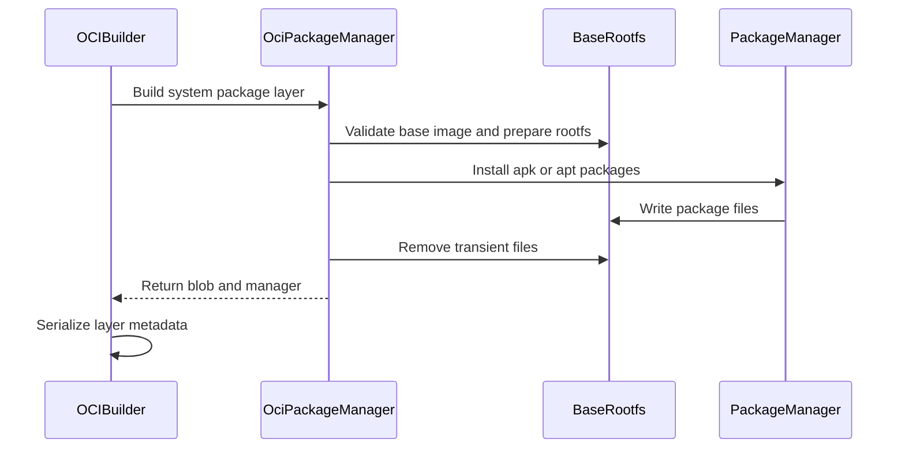

# feat(oci): support apk bootstrap packages

- URL: https://github.com/jdx/mise/pull/12083
- state: closed | author: jdx | created: 2026-08-17T00:11:15Z | closed: 2026-08-17T01:39:37Z

## Body

## Summary
- support `apk:` entries in OCI `[bootstrap.packages]` for Alpine/Wolfi base images
- reuse the existing rootfs snapshot/diff pipeline and annotate package layers with the active manager
- reject mixed apt/apk entries and document host apk, Linux, and root requirements
- add manager-selection, architecture, transient-cleanup, and OCI scratch validation coverage

## Why
Wolfi is a glibc-based, apk-managed base that avoids Alpine's musl constraints. Supporting `apk add --root` lets `mise oci build` add Wolfi system packages directly instead of requiring a separately prepared apko base image.

## Validation
- `cargo test --bin mise oci::packages::tests`
- `mise run test:e2e e2e/oci/test_oci_build_slow`
- `mise run lint-fix`
- `git diff --name-only -z | hk run check --safe --format json --files0-from -`
- real Wolfi build using `cgr.dev/chainguard/wolfi-base:latest`; verified the package layer annotation and `usr/bin/jq` payload

Closes https://github.com/jdx/mise/discussions/12081

*AI-assisted — Tool: Codex; model: openai/gpt-5; version: unavailable.*

<!-- CURSOR_SUMMARY -->
---

> [!NOTE]
> **Medium Risk**
> Runs host package managers against unpacked image rootfs (apk requires root on Linux); mistakes could affect image contents, but the design mirrors the existing apt path with new tests and guards against mixed managers.
> 
> **Overview**
> **`mise oci build` can install `[bootstrap.packages]` with `apk:` on Alpine/Wolfi bases**, using the same unpack → install into rootfs → diff → single layer flow as `apt:`. Package layers are tagged with `dev.mise.system.packages` set to `apk` or `apt` (via a new `SystemPackagesLayer` wrapper in the builder).
> 
> **Validation and constraints:** mixed `apk:` and `apt:` entries are rejected; `scratch` errors name the active manager; apk installs run `apk add --root` with `--no-cache`, then strip apk cache/log files. Apk builds require a **Linux host**, `apk` on `PATH`, and **root** (chroot scripts). Docs reorder the layer list so bootstrap packages sit before per-tool layers.
> 
> **Tests:** unit coverage for manager selection, arch mapping, apk cleanup, and apt snapshot/diff behavior; e2e asserts apk-on-`scratch` fails like apt.
> 
> Reviewed by [Cursor Bugbot](https://cursor.com/bugbot) for commit 8e7ff5eae3e6253f046bcb9d9a06787018d2d541. Bugbot is set up for automated code reviews on this repo. Configure [here](https://www.cursor.com/dashboard/bugbot).
<!-- /CURSOR_SUMMARY -->

<!-- This is an auto-generated comment: release notes by coderabbit.ai -->
## Summary by CodeRabbit

* **New Features**
  * OCI builds now support installing system packages with either `apt` or `apk`.
  * Package layers identify the package manager used and remove temporary installation files.
* **Bug Fixes**
  * Added validation for compatible base images, host prerequisites, architectures, and unsupported or mixed package-manager requests.
  * Improved package-layer metadata and artifact handling.
* **Documentation**
  * Updated OCI guidance with package-manager requirements, caching behavior, and cleanup details.
* **Tests**
  * Added coverage for Alpine package installation and invalid base-image combinations.
<!-- end of auto-generated comment: release notes by coderabbit.ai -->

## Comments

### coderabbitai[bot] @ 2026-08-17T00:11:46Z

<!-- This is an auto-generated comment: summarize by coderabbit.ai -->
<!-- review_stack_entry_start -->

<!-- review_stack_entry_end -->
<!-- recent_review_start -->

No actionable comments were generated in the recent review. 🎉

ℹ️ Recent review info

⚙️ Run configuration

**Configuration used**: Repository YAML (base), Central YAML (inherited), Organization UI (inherited)

**Review profile**: CHILL

**Plan**: Pro Plus

**Run ID**: `fdd365b3-2202-43c2-b6e8-89a6c4c4ae40`

📥 Commits

Reviewing files that changed from the base of the PR and between 4a85b9571051ac975138b2c2285d95d7cc8cbd17 and 8e7ff5eae3e6253f046bcb9d9a06787018d2d541.

📒 Files selected for processing (1)

* `src/oci/packages.rs`

**Included review availability:** Your plan includes up to 10 reviews per rolling hour; 7 remain after this review.

---

<!-- recent_review_end -->
<!-- walkthrough_start -->

📝 Walkthrough

## Walkthrough

OCI system package layers now support `apk` and `apt`. The build validates package-manager compatibility, installs packages into the rootfs, removes transient files, records the selected manager, and documents and tests the behavior.

### Changes

**OCI package-manager support**

|Layer / File(s)|Summary|
|---|---|
|**Package-manager selection and result contract**   `src/oci/packages.rs`|Package collection accepts `apk:` and `apt:` requests, rejects unsupported or mixed managers, and returns the manager with the layer blob.|
|**Base validation and package installation**   `src/oci/packages.rs`|The implementation validates base images, maps apk architectures, installs packages, removes transient files, and tests manager selection, installation, architecture handling, and cleanup.|
|**OCI layer integration and documentation**   `src/oci/builder.rs`, `docs/dev-tools/mise-oci.md`, `e2e/oci/test_oci_build_slow`|Layer serialization uses nested blob metadata and records the actual manager. Documentation and end-to-end tests cover apk requirements and behavior.|

**Estimated code review effort:** 4 (Complex) | ~45 minutes

<!-- final_review_risk_start -->
**Merge Risk:** _⚪ Minimal_ · up to `8e7ff`

The PR adds Alpine/Wolfi bootstrap package support with documented validation and no actionable merge-blocking risk remains beyond normal checks and review.
<!-- final_review_risk_end -->

### Sequence Diagram(s)

**Poem**

> I’m a rabbit with packages to stack,  
> Apt in the front and apk in the pack.  
> Roots get cleaned,  
> Layer names are gleaned,  
> And curl hops safely onto the track.

<!-- walkthrough_end -->
<!-- pre_merge_checks_walkthrough_start -->

🚥 Pre-merge checks | ✅ 5

✅ Passed checks (5 passed)

|         Check name         | Status   | Explanation                                                                                                     |
| :------------------------: | :------- | :-------------------------------------------------------------------------------------------------------------- |
|     Docstring Coverage     | ✅ Passed | No functions found in the changed files to evaluate docstring coverage. Skipping docstring coverage check.      |
|     Linked Issues check    | ✅ Passed | Check skipped because no linked issues were found for this pull request.                                        |
| Out of Scope Changes check | ✅ Passed | Check skipped because no linked issues were found for this pull request.                                        |
|      Description Check     | ✅ Passed | Check skipped - CodeRabbit’s high-level summary is enabled.                                                     |
|         Title check        | ✅ Passed | The title clearly and concisely describes the primary change: adding support for apk bootstrap packages in OCI. |

<!-- pre_merge_checks_walkthrough_end -->
<!-- tips_start -->

---

Thanks for using [CodeRabbit](https://coderabbit.ai?utm_source=oss&utm_medium=github&utm_campaign=jdx/mise&utm_content=12083)! It's free for OSS, and your support helps us grow. If you like it, consider giving us a shout-out.

❤️ Share

- [X](https://twitter.com/intent/tweet?text=I%20just%20used%20%40coderabbitai%20for%20my%20code%20review%2C%20and%20it%27s%20fantastic%21%20It%27s%20free%20for%20OSS%20and%20offers%20a%20free%20trial%20for%20the%20proprietary%20code.%20Check%20it%20out%3A&url=https%3A//coderabbit.ai)
- [Mastodon](https://mastodon.social/share?text=I%20just%20used%20%40coderabbitai%20for%20my%20code%20review%2C%20and%20it%27s%20fantastic%21%20It%27s%20free%20for%20OSS%20and%20offers%20a%20free%20trial%20for%20the%20proprietary%20code.%20Check%20it%20out%3A%20https%3A%2F%2Fcoderabbit.ai)
- [Reddit](https://www.reddit.com/submit?title=Great%20tool%20for%20code%20review%20-%20CodeRabbit&text=I%20just%20used%20CodeRabbit%20for%20my%20code%20review%2C%20and%20it%27s%20fantastic%21%20It%27s%20free%20for%20OSS%20and%20offers%20a%20free%20trial%20for%20proprietary%20code.%20Check%20it%20out%3A%20https%3A//coderabbit.ai)
- [LinkedIn](https://www.linkedin.com/sharing/share-offsite/?url=https%3A%2F%2Fcoderabbit.ai&mini=true&title=Great%20tool%20for%20code%20review%20-%20CodeRabbit&summary=I%20just%20used%20CodeRabbit%20for%20my%20code%20review%2C%20and%20it%27s%20fantastic%21%20It%27s%20free%20for%20OSS%20and%20offers%20a%20free%20trial%20for%20proprietary%20code)

Comment `@coderabbitai help` to get the list of available commands.

<!-- tips_end -->

### greptile-apps[bot] @ 2026-08-17T00:14:18Z

<h3>Greptile Summary</h3>

The PR adds apk bootstrap-package support for Alpine and Wolfi OCI base images while retaining the existing rootfs snapshot/diff pipeline.
- Selects apt or apk from bootstrap package declarations and rejects mixed managers.
- Validates apk host, base-image, and architecture requirements.
- Annotates package layers with the selected manager and removes transient apk state.
- Adds focused unit, documentation, and scratch-image validation coverage.

<h3>Confidence Score: 5/5</h3>

The PR appears safe to merge.

No blocking failure remains; the previously reported apt snapshot issue is fixed by preparing the rootfs before taking the baseline snapshot.

<h3>Important Files Changed</h3>

| Filename | Overview |
|----------|----------|
| src/oci/packages.rs | Adds apk package installation and manager selection; the revised apt preparation boundary resolves the previously reported temporary-path leakage. |
| src/oci/builder.rs | Propagates the selected package manager into OCI layer annotations through the new package-layer wrapper. |
| e2e/oci/test_oci_build_slow | Adds validation that apk bootstrap packages cannot be installed into a scratch base image. |
| docs/dev-tools/mise-oci.md | Documents apk support, package-layer ordering, manager compatibility, and host requirements. |

<!-- greptile_other_comments_section -->

Reviews (3): Last reviewed commit: ["fix(oci): satisfy clippy for package roo..."](https://github.com/jdx/mise/commit/8e7ff5eae3e6253f046bcb9d9a06787018d2d541) | [Re-trigger Greptile](https://app.greptile.com/api/retrigger?id=53842720)

### github-actions[bot] @ 2026-08-17T01:37:32Z

<!-- mise-perf-pr -->
### Instruction counts

| benchmark | trend | instructions | Δ | wall (min) | Δ |
|---|---|---:|---:|---:|---:|
| env | `▁▂▂███` | 81,433,377 → 81,460,984 | **+0.03%** | 19.06 → 18.10ms | -5.04% |
| hook-env | `▁▁▁██▇` | 82,885,907 → 82,850,813 | **-0.04%** | 19.31 → 18.83ms | -2.53% |
| ls | `▁▂▂██▇` | 74,098,044 → 74,008,540 | **-0.12%** | 16.96 → 17.20ms | +1.36% |
| registry | `▄▁▁▇▇█` | 44,014,162 → 44,047,315 | **+0.08%** | 28.93 → 12.38ms | -57.21% |
| startup | `▁▁▁██▇` | 15,818,312 → 15,786,967 | **-0.20%** | 10.33 → 10.40ms | +0.70% |

No instruction-count regression above 1%.

Only instruction counts gate. Wall clock is shown for context — on identical hardware it moves 4-20% run to run.

Measured by [tak](https://github.com/jdx/tak) — instruction-counted CLI benchmarks, stored in this repository's git notes.

`8e7ff5eae3e6` vs `682026dcfe79` · measured on the runner, not pushed to the history.
