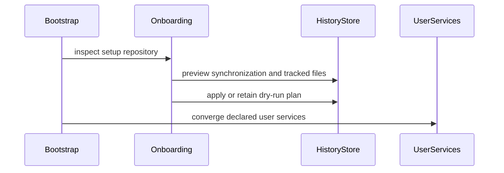

# feat(bootstrap): track dotfiles with one synchronized git history

- URL: https://github.com/jdx/mise/pull/12918
- state: closed | author: jdx | created: 2026-09-07T10:11:57Z | closed: 2026-09-07T18:41:31Z

## Body

## Summary
Replace the unreleased dotfiles architecture with explicit tracking → ordinary Git commits → normal origin synchronization.

- Track exact files and recursive directories explicitly, independently of deployment declarations. Keep live files in place and one separate bare repository.
- Preserve ordinary commit ancestry indefinitely, platform variants, manual-save policies, and whole-setup conflict pauses.
- Encrypt shared files before Git storage and audit reachable history before publication. Remove filtered publication, local-only policies, machine backups, and backup encryption.
- Preserve tracked rollback/undo, command boundaries, private interrupted-write recovery, bootstrap onboarding, remote authentication, and default-on notifications.
- Update schemas, CLI help, generated docs, setup guides, and notification helper packaging.

## Stack
The prerequisite #12916 has landed. This implementation PR is followed by acceptance-test PR #12919. These replace the old unreleased stack; no migration shims are included.

## Verification
Full workspace/all-feature/all-target Clippy with warnings denied and repository lint-fix pass. All 727 system unit tests and all 149 history unit tests after restacking pass. Tracked bootstrap and captured-command undo preserve actual manual-file preimages without promoting unrelated edits or publishing untracked recovery copies. Focused e2e passes include two-machine synchronization, crash recovery, rollback, encrypted synchronization/diff/restore, directory permissions, explicit enrollment, and onboarding. Broader acceptance verification and CI are ongoing; follow-up fixes will land here.

## Limitations
Non-UTF-8 filenames and enrollment through symlink/junction parents below portable roots are rejected; explicitly enroll the link and real target instead. Metadata and inactive-variant conflicts can require ordinary Git reconciliation. Incoming application is preflighted and recoverable, not an atomic filesystem transaction. Historical plaintext blocks encrypted-path publication rather than triggering automatic history rewriting.

Do not merge until the replacement stack is validated.

*AI-assisted — Tool: Codex; model: unavailable; version: unavailable.*

<!-- CURSOR_SUMMARY -->
---

> [!NOTE]
> **High Risk**
> Large surface area: live file writes, Git sync/conflict resolution, encryption publication checks, and cross-platform user services integrated with bootstrap and remote provisioning.
> 
> **Overview**
> Introduces **dotfiles history**: explicitly enrolled `mode = "track"` files stay in place while mise commits changes to a separate bare Git store, with checkpoints, rollback/undo, capture around external commands, and optional origin sync (`save`, `sync`, `pull`, `origin set`, `history`, etc.).
> 
> Adds a **`history-watch` user service** (`bootstrap.services` `scope = "user"`, Linux/macOS/Windows) that watches autosaved paths (`notify`), reconciles on a schedule, and syncs per `settings.history.sync`. macOS conflict notifications compile a small bundled helper via `build.rs`. Mutating bootstrap and dotfiles commands record before/after checkpoints; **setup repositories** (`.mise-history/format.toml`) change `--from-git` / remote bootstrap to pull into the history store instead of cloning into `$MISE_CONFIG_DIR`, with fuller remote **dry-run** previews.
> 
> **`[bootstrap.services]`** expands beyond Linux systemd system units to cross-platform user-defined services plus `services remove`. Docs, CLI/man pages, schema tests, and e2e coverage follow; `age` gains the `plugin` feature for encrypted tracked files.
> 
> Reviewed by [Cursor Bugbot](https://cursor.com/bugbot) for commit 53008089a373331445f6e54f5065ad74ad2c1cda. Bugbot is set up for automated code reviews on this repo. Configure [here](https://www.cursor.com/dashboard/bugbot).
<!-- /CURSOR_SUMMARY -->

<!-- This is an auto-generated comment: release notes by coderabbit.ai -->
## Summary by CodeRabbit

* **New Features**
  * Added dotfile tracking, automatic history checkpoints, rollback, undo, recovery, diff, capture, and synchronization commands.
  * Added setup-repository onboarding, conflict handling, encryption options, notifications, and history health reporting.
  * Added cross-platform user services for systemd, macOS LaunchAgents, and Windows Scheduled Tasks.
  * Added remote bootstrap dry-run previews and SSH repository preview options.
  * Added validation for conflicting service configuration fields.

* **Documentation**
  * Expanded bootstrap, dotfiles history, service, setup, and command reference documentation.
  * Updated installation guidance and macOS service failure handling.
<!-- end of auto-generated comment: release notes by coderabbit.ai -->

## Comments

### greptile-apps[bot] @ 2026-09-07T10:12:03Z

<!-- greptile-status -->
Too many files changed for review (163 files, 100 file limit).

Bypass the limit by tagging `@greptile-apps` to review.

### socket-security[bot] @ 2026-09-07T10:12:35Z

**Review the following changes in direct dependencies.** Learn more about [Socket for GitHub](https://socket.dev?utm_medium=gh).

<table>
<thead>
<tr>
<th>Diff</th>
<th width="200px">Package</th>
<th align="center" width="100px">Supply Chain Security</th>
<th align="center" width="100px">Vulnerability</th>
<th align="center" width="100px">Quality</th>
<th align="center" width="100px">Maintenance</th>
<th align="center" width="100px">License</th>
</tr>
</thead>
<tbody>
<tr><td align="center"></td><td><a href="https://socket.dev/dashboard/org/jdx/diff-scan/cc806f70-168b-4382-bafe-ade6b46b81a6?tab=dependencies&dependency_item_key=82652926461">cargo/​file-id@​0.2.3</a></td><td align="center"></td><td align="center"></td><td align="center"></td><td align="center"></td><td align="center"></td></tr>
<tr><td align="center"></td><td><a href="https://socket.dev/dashboard/org/jdx/diff-scan/cc806f70-168b-4382-bafe-ade6b46b81a6?tab=dependencies&dependency_item_key=63793301312">cargo/​notify@​8.2.0</a></td><td align="center"></td><td align="center"></td><td align="center"></td><td align="center"></td><td align="center"></td></tr>
<tr><td align="center"></td><td><a href="https://socket.dev/dashboard/org/jdx/diff-scan/cc806f70-168b-4382-bafe-ade6b46b81a6?tab=dependencies&dependency_item_key=101858711173">cargo/​notify-debouncer-full@​0.7.0</a></td><td align="center"></td><td align="center"></td><td align="center"></td><td align="center"></td><td align="center"></td></tr>
</tbody>
</table>

[View full report](https://socket.dev/dashboard/org/jdx/diff-scan/cc806f70-168b-4382-bafe-ade6b46b81a6?tab=dependencies)

<!-- overview-comment -->

### coderabbitai[bot] @ 2026-09-07T10:13:10Z

<!-- This is an auto-generated comment: summarize by coderabbit.ai -->
<!-- review_stack_entry_start -->

<!-- review_stack_entry_end -->
<!-- This is an auto-generated comment: review paused by coderabbit.ai -->

> [!NOTE]
> ## Reviews paused
> 
> It looks like this branch is under active development. To avoid overwhelming you with review comments due to an influx of new commits, CodeRabbit has automatically paused this review. You can configure this behavior by changing the `reviews.auto_review.auto_pause_after_reviewed_commits` setting.
> 
> Use the following commands to manage reviews:
> - `@coderabbitai resume` to resume automatic reviews.
> - `@coderabbitai review` to trigger a single review.
> 
> Use the checkboxes below for quick actions:
> - [ ] <!-- {"checkboxId":"7f6cc2e2-2e4e-497a-8c31-c9e4573e93d1"} --> ▶️ Resume reviews
> - [ ] <!-- {"checkboxId":"e9bb8d72-00e8-4f67-9cb2-caf3b22574fe"} --> 🔍 Trigger review

<!-- end of auto-generated comment: review paused by coderabbit.ai -->
<!-- recent_review_start -->

No actionable comments were generated in the recent review. 🎉

ℹ️ Recent review info

⚙️ Run configuration

**Configuration used**: Repository YAML (base), Central YAML (inherited), Organization UI (inherited)

**Review profile**: CHILL

**Plan**: Team

**Run ID**: `6a0ee825-f5a0-4c4b-ad0a-15d43280ef58`

📥 Commits

Reviewing files that changed from the base of the PR and between d22ad443b3c3250bdbdfd22bf562ae23e2bef1ba and 9241572227c8cb97a53ccc5893a90db15b0ea8eb.

📒 Files selected for processing (19)

* `docs/bootstrap/remote.md`
* `docs/cli/bootstrap/dotfiles/track.md`
* `docs/history.md`
* `e2e/cli/test_dotfiles_bootstrap_compatibility`
* `e2e/cli/test_ssh`
* `e2e/config/test_schema_bootstrap_services`
* `man/man1/mise.1`
* `mise.usage.kdl`
* `schema/mise.json`
* `src/cli/dotfiles/track.rs`
* `src/cli/settings/unset.rs`
* `src/system/files.rs`
* `src/system/history/checkpoint.rs`
* `src/system/history/journal.rs`
* `src/system/history/manifest.rs`
* `src/system/history/scope.rs`
* `src/system/history/select.rs`
* `src/system/history/store.rs`
* `src/system/history/tracked.rs`

🚧 Files skipped from review as they are similar to previous changes (9)

* docs/cli/bootstrap/dotfiles/track.md
* docs/bootstrap/remote.md
* mise.usage.kdl
* schema/mise.json
* e2e/config/test_schema_bootstrap_services
* src/system/history/checkpoint.rs
* src/cli/dotfiles/track.rs
* man/man1/mise.1
* src/system/history/scope.rs

**Included review availability:** Your plan provides up to 10 included reviews per hour; 6 remain after this review.

---

<!-- recent_review_end -->
<!-- walkthrough_start -->

📝 Walkthrough

## Walkthrough

The change adds tracked dotfile history with checkpoint capture, rollback, undo, synchronization, encryption, watcher support, setup-repository onboarding, cross-platform user services, and related CLI and documentation updates.

### Changes

**Dotfiles history and bootstrap services**

|Layer / File(s)|Summary|
|---|---|
|**Tracked dotfiles and operation journaling**   `src/system/files.rs`, `src/system/history/*`, `src/cli/dotfiles/*`, `src/cli/bootstrap.rs`, `src/system/edits.rs`|Adds `mode = "track"`, tracked-file policies, checkpoint storage, operation scopes, write-ahead journals, recovery, rollback, undo, watcher support, and new dotfiles commands.|
|**Repository synchronization and onboarding**   `src/system/history/sync/*`, `src/cli/ssh.rs`, `src/system/remote*.rs`, `src/git.rs`, `src/agecrypt.rs`|Adds encrypted setup-repository synchronization, conflict reconciliation, complete dry-run previews, onboarding from history repositories, Git isolation, and age plugin support.|
|**Cross-platform user services**   `src/system/services_common.rs`, `src/system/user_services.rs`, `src/system/scheduled_tasks.rs`, `src/system/launchd.rs`, `src/system/systemd.rs`, `src/cli/bootstrap.rs`|Adds system and user service scopes, built-in `history-watch`, service removal, and platform implementations for systemd, LaunchAgents, and Scheduled Tasks.|
|**Configuration, CLI references, tests, and documentation**   `schema/mise.json`, `settings.toml`, `mise.usage.kdl`, `docs/*`, `man/man1/mise.1`, `e2e/*`, `Cargo.toml`, `build.rs`|Adds history and service schemas and settings, command references, setup and history guides, end-to-end coverage, dependencies, and the macOS notification helper build.|

**Estimated code review effort:** 5 (Critical) | ~120 minutes

<!-- final_review_risk_start -->
**Merge Risk:** _🟡 Moderate_ · up to `92415`
<!-- final_review_risk_coverage:{"sourceCommitId":"9241572227c8cb97a53ccc5893a90db15b0ea8eb","coveredCommitId":"9241572227c8cb97a53ccc5893a90db15b0ea8eb","kind":"reviewed"} -->

This change introduces dotfile history, recovery, synchronization, and watcher services, but unresolved issues can affect restore correctness, cross-platform file selection, synchronization performance, and command behavior. These should be resolved or explicitly accepted before merge.
<!-- final_review_risk_end -->

### Sequence Diagram(s)

<!-- walkthrough_end -->
<!-- pre_merge_checks_walkthrough_start -->

🚥 Pre-merge checks | ✅ 4 | ❌ 1

### ❌ Failed checks (1 warning)

|     Check name     | Status     | Explanation                                                                                                                                                                                               | Resolution                                                                         |
| :----------------: | :--------- | :-------------------------------------------------------------------------------------------------------------------------------------------------------------------------------------------------------- | :--------------------------------------------------------------------------------- |
| Docstring Coverage | ⚠️ Warning | Docstring coverage is 49.37% which is insufficient. The required threshold is 80.00%. Docstring coverage is scoped to functions touched by this diff. Analyzed 719 functions across 73 files. (9 skipped… | Write docstrings for the functions missing them to satisfy the coverage threshold. |

✅ Passed checks (4 passed)

|         Check name         | Status   | Explanation                                                                                                                                   |
| :------------------------: | :------- | :-------------------------------------------------------------------------------------------------------------------------------------------- |
|     Linked Issues check    | ✅ Passed | Check skipped because no linked issues were found for this pull request.                                                                      |
| Out of Scope Changes check | ✅ Passed | Check skipped because no linked issues were found for this pull request.                                                                      |
|      Description Check     | ✅ Passed | Check skipped - CodeRabbit’s high-level summary is enabled.                                                                                   |
|         Title check        | ✅ Passed | The title clearly and concisely summarizes the primary change: tracking dotfiles with synchronized Git history through the bootstrap feature. |

Full details: Docstring Coverage

**Explanation**

Docstring coverage is 49.37% which is insufficient. The required threshold is 80.00%. Docstring coverage is scoped to functions touched by this diff. Analyzed 719 functions across 73 files. (9 skipped: 9 unsupported.)

<!-- pre_merge_checks_walkthrough_end -->
<!-- tips_start -->

---

Thanks for using [CodeRabbit](https://coderabbit.ai?utm_source=oss&utm_medium=github&utm_campaign=jdx/mise&utm_content=12918)! It's free for OSS, and your support helps us grow. If you like it, consider giving us a shout-out.

❤️ Share

- [X](https://twitter.com/intent/tweet?text=I%20just%20used%20%40coderabbitai%20for%20my%20code%20review%2C%20and%20it%27s%20fantastic%21%20It%27s%20free%20for%20OSS%20and%20offers%20a%20free%20trial%20for%20the%20proprietary%20code.%20Check%20it%20out%3A&url=https%3A//coderabbit.ai)
- [Mastodon](https://mastodon.social/share?text=I%20just%20used%20%40coderabbitai%20for%20my%20code%20review%2C%20and%20it%27s%20fantastic%21%20It%27s%20free%20for%20OSS%20and%20offers%20a%20free%20trial%20for%20the%20proprietary%20code.%20Check%20it%20out%3A%20https%3A%2F%2Fcoderabbit.ai)
- [Reddit](https://www.reddit.com/submit?title=Great%20tool%20for%20code%20review%20-%20CodeRabbit&text=I%20just%20used%20CodeRabbit%20for%20my%20code%20review%2C%20and%20it%27s%20fantastic%21%20It%27s%20free%20for%20OSS%20and%20offers%20a%20free%20trial%20for%20proprietary%20code.%20Check%20it%20out%3A%20https%3A//coderabbit.ai)
- [LinkedIn](https://www.linkedin.com/sharing/share-offsite/?url=https%3A%2F%2Fcoderabbit.ai&mini=true&title=Great%20tool%20for%20code%20review%20-%20CodeRabbit&summary=I%20just%20used%20CodeRabbit%20for%20my%20code%20review%2C%20and%20it%27s%20fantastic%21%20It%27s%20free%20for%20OSS%20and%20offers%20a%20free%20trial%20for%20proprietary%20code)

Comment `@coderabbitai help` to get the list of available commands.

<!-- tips_end -->

### jdx @ 2026-09-07T10:15:47Z

Replacement acceptance coverage is now open in #12919. The full documentation render also passed. Follow-up e2e verification found and fixed watcher policy reloads: observing the global configuration directory does not enroll or capture it, but enrollment/exclusion edits must still cause the watcher to reload. Fix: e2ffdc0d8; repository lint-fix passed. The focused watcher rerun and remaining acceptance checks are ongoing.

*AI-assisted — Tool: Codex; model: unavailable; version: unavailable.*

### github-actions[bot] @ 2026-09-07T11:18:04Z

<!-- mise-perf-pr -->
### Instruction counts

The comparison never ran — an earlier step failed.

`824d3e778121` vs `` · measured on the runner, not pushed to the history.

### jdx @ 2026-09-07T13:03:55Z

Regarding the outside-diff recovery suggestion in review 5132016255: this conflates PathSnapshot::Directory (a shallow directory/permission preimage) with PathSnapshot::Dir (a recursive content preimage). The populated-directory guard only permits the shallow Directory case, which restores permissions without deleting children. The recursive Dir case is deliberately rejected before restore when the destination is populated. Replacing remove_leaf with recursive deletion would weaken that safety boundary, so I am not making that change. Normal recovery preserves the files and pending record; explicit recover --keep-current is the escape hatch after inspection.

*AI-assisted — Tool: Codex; model: unavailable; version: unavailable.*

### jdx @ 2026-09-07T13:13:59Z

Review-body follow-up in a087f00a1: shell status now treats Tracked as converged in both paths; whole-setup holding is an explicit all-or-nothing branch; dropped-path lookup uses a set; obsolete backup/protective-history comments were corrected; launchd keep-alive options are documented as mutually exclusive; and the recover source mapping was fixed in the source asset and regenerated. Verification: 133 history tests, seven tracked-path tests, compatibility e2e, full Clippy, full render, and lint-fix passed. This does not mark the remaining capture, subprocess, or performance findings addressed.

*AI-assisted — Tool: Codex; model: unavailable; version: unavailable.*

### jdx @ 2026-09-07T14:54:30Z

Addressed the outside-diff notification-helper repair finding in f3286a75f. Installation now checks the executable, plist, and icon, and moves an incomplete bundle into a uniquely named inspection directory under the install lock before installing the complete signed replacement. It does not delete the incomplete contents. Native macOS tests cover missing executable and missing icon, preservation of an extra file, bundle signature, and helper identity without sending desktop notifications. All three notification tests, lint-fix, and full workspace/all-features/all-targets Clippy pass.

*AI-assisted — Tool: Codex; model: unavailable; version: unavailable.*

### jdx @ 2026-09-07T15:10:30Z

Addressed the outside-diff async lock-wait finding in af5a3da7f: save, track baseline, and untrack move the operation-lock wait and capture to spawn_blocking. Declaration coordination and error handling remain intact. Full workspace/all-features/all-targets Clippy and the review-safety e2e pass, including tracking, saves, selected manual-file restoration/undo, and global sync from a project directory.

*AI-assisted — Tool: Codex; model: unavailable; version: unavailable.*

### jdx @ 2026-09-07T16:38:28Z

@coderabbitai resume

Integrated the remaining review cleanup in 5a7c7dbdb: explicit alias-parent rejection, strict format-header validation without collapsing duplicate keys, bounded enrollment scan, unsupported Git network-option rejection, watcher signal readiness, and removal of obsolete pin/operation state. Also fixed the relative global-config checkout regression exposed by CI and added the introduction blog link. Local validation: 727 system tests, 149 history tests after restacking, full workspace/all-feature/all-target Clippy, lint, and bootstrap/alias/manual-preimage e2e pass. Please review the current head; updated CI is running.

*AI-assisted — Tool: Codex; model: unavailable; version: unavailable.*

### coderabbitai[bot] @ 2026-09-07T16:38:33Z

<!-- This is an auto-generated reply by CodeRabbit -->
Your [plan](https://docs.coderabbit.ai/management/plans#fair-usage-limits-policy) includes PR reviews subject to [rate limits](https://docs.coderabbit.ai/management/plans#rate-limits). Reviews are available now.
