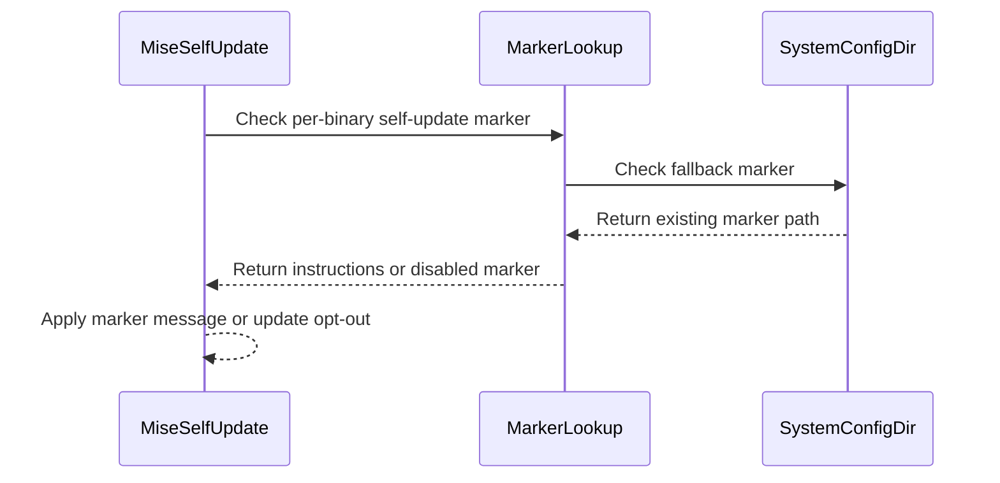

# feat(self-update): let a distribution disable self-update machine-wide

- URL: https://github.com/jdx/mise/pull/13454
- state: closed | author: jdx | created: 2026-09-21T20:33:14Z | closed: 2026-09-21T21:41:12Z | merged_pr: n/a
- labels: 

## Body

<!-- entire-trail-link-start -->
https://entire.io/gh/jdx/mise/trails/85
<!-- entire-trail-link-end -->

## The problem

A packager can turn off `mise self-update` with a `.disable-self-update` marker or an instructions file, but both are found *relative to the running binary* — two levels up from the canonicalized path. That covers the install the packager laid down and nothing else.

On a distribution that manages mise for its users, that is not enough. Omarchy ships mise as the `mise-bin` pacman package, which installs `/usr/bin/mise` plus `/usr/lib/mise/.disable-self-update`, and updates it through `omarchy update`. A second mise installed alongside it — the `/usr/local/bin/mise` the install script leaves behind, or `~/.local/bin/mise` — finds no marker, self-updates happily, and then shadows the packaged copy on `PATH`, because `/usr/local/bin` comes first. The machine ends up running a mise that nothing updates, and the marker that was supposed to prevent exactly this never gets consulted.

## Now

Both files are also read from the system config directory (`/etc/mise`, or `MISE_SYSTEM_CONFIG_DIR`). That path is not relative to any binary, so one file covers every mise on the machine:

```toml
# /etc/mise/mise-self-update-instructions.toml
message = "mise is managed by pacman on Omarchy. To update it, run:\n\n  omarchy update\n"
```

```
$ /usr/local/bin/mise self-update
mise WARN  mise is managed by pacman on Omarchy. To update it, run:

  omarchy update

mise ERROR mise is installed via a package manager, cannot update
```

The same message replaces the otherwise dead-end `mise 2026.9.12 available` warning, so a user on an unmanaged copy is told what to run rather than being pointed at a self-update that should not happen.

`/etc/mise/.disable-self-update` works the same way without a message of its own. For a machine-wide marker the instructions file is usually the better of the two, since it is read by binaries the packager never installed, whose users need to be told what to run instead.

Unchanged from the per-binary markers:

- Per-binary markers keep their meaning and are checked first. They remain the right choice for a package installed on systems it does not own, such as Homebrew or a `.deb`.
- `MISE_SELF_UPDATE_AVAILABLE=true` still overrides, for a user deliberately running a standalone mise alongside the packaged one.
- `mise self-update --force` still bypasses the availability check.
- `mise doctor` reports `self_update_available: no` and prints the instructions, as it does for the existing markers.

Nothing changes on a machine with no `/etc/mise` marker, which is every machine today.

## Validation

- New e2e test `e2e/cli/test_self_update_system_marker`, covering both files, the version-available warning, and the `MISE_SELF_UPDATE_AVAILABLE=true` override. The e2e harness already isolates the system config directory, so the test writes to its own `/etc/mise`.
- Packager documentation in `docs/contributing.md` gains the two paths and a section on when a machine-wide marker is the right one.
- `mise run lint-fix`, `cargo clippy --workspace --all-features --all-targets -- -D warnings`.

Companion change on the distribution side (not in this PR): Omarchy would ship `/etc/mise/mise-self-update-instructions.toml` pointing at `omarchy update`.

🤖 Generated with [Claude Code](https://claude.com/claude-code)

*AI-assisted — Tool: Claude Code; model: anthropic/claude-opus-5; version: 2.1.270.*

<!-- CURSOR_SUMMARY -->
---

> [!NOTE]
> **Medium Risk**
> Changes how self-update availability is resolved for all mise binaries when `/etc/mise` markers exist; misconfiguration could block updates or show wrong packager messages, but behavior is opt-in and overridable.
> 
> **Overview**
> Distributions can now **disable or redirect `mise self-update` for every mise binary on the host**, not only the install next to a packager marker.
> 
> **Runtime:** After the existing prefix-relative search (`lib/`, `lib/mise/`, etc.), mise also looks in the system config directory (`/etc/mise` or `MISE_SYSTEM_CONFIG_DIR`) for `.disable-self-update` and `mise-self-update-instructions.toml`. Per-binary markers are unchanged and still win when present; `MISE_SELF_UPDATE_AVAILABLE=true` and `mise self-update --force` behave as before.
> 
> **Docs:** `docs/contributing.md` documents the two `/etc/mise` paths and when a machine-wide marker fits (e.g. distro-managed mise vs Homebrew).
> 
> **Tests:** New E2E `e2e/cli/test_self_update_system_marker` covers instructions and bare markers, the “newer version available” message, and the env override.
> 
> <sup>Reviewed by [Cursor Bugbot](https://cursor.com/bugbot) for commit a1b9065c209bda11cc8fd82cbe84321c670f2124. Bugbot is set up for automated code reviews on this repo. Configure [here](https://www.cursor.com/dashboard/bugbot).</sup>
<!-- /CURSOR_SUMMARY -->

<!-- This is an auto-generated comment: release notes by coderabbit.ai -->

## Summary by CodeRabbit

* **New Features**
  * Added support for machine-wide self-update markers and instructions.
  * Users can now see package-manager-specific guidance when self-updates are unavailable.
  * System-wide markers apply to all mise installations on the machine, including package-manager-installed binaries.

* **Documentation**
  * Clarified that self-update marker and instruction paths are relative to the install prefix unless explicitly identified as machine-wide.
  * Documented the machine-wide configuration locations and behavior.

<!-- end of auto-generated comment: release notes by coderabbit.ai -->

## Comments

### coderabbitai[bot] @ 2026-09-21T20:33:35Z

<!-- This is an auto-generated comment: summarize by coderabbit.ai -->
<!-- review_stack_entry_start -->

<a href="https://app.coderabbit.ai/change-stack/jdx/mise/pull/13454#gh-light-mode-only"></a><a href="https://app.coderabbit.ai/change-stack/jdx/mise/pull/13454#gh-dark-mode-only"></a>

**Understand this PR’s impact**

Explore downstream dependencies and potential security impact with Blast Radius.

[View blast radius →](<https://app.coderabbit.ai/change-stack/jdx/mise/pull/13454?view=blast-radius>)

<!-- review_stack_entry_end -->
<!-- recent_review_start -->

No actionable comments were generated in the recent review. 🎉

<details>
<summary>ℹ️ Recent review info</summary>

<details>
<summary>⚙️ Run configuration</summary>

**Configuration used**: Repository YAML (base), Central YAML (inherited), Organization UI (inherited)

**Review profile**: CHILL

**Plan**: Advanced

**Run ID**: `9ba1ba18-bcc1-43bd-a340-26e87cf0766e`

</details>

<details>
<summary>📥 Commits</summary>

Reviewing files that changed from the base of the PR and between 0313d48d784e40eaa5a4595bbe9cdb06288871fe and a1b9065c209bda11cc8fd82cbe84321c670f2124.

</details>

<details>
<summary>📒 Files selected for processing (3)</summary>

* `docs/contributing.md`
* `e2e/cli/test_self_update_system_marker`
* `src/env.rs`

</details>

**Included review availability:** Your plan provides up to 10 included reviews per hour; 4 remain after this review.

</details>

---


<!-- recent_review_end -->
<!-- walkthrough_start -->

<details>
<summary>📝 Walkthrough</summary>

## Walkthrough

The change adds system-wide self-update markers under `MISE_SYSTEM_CONFIG_DIR`. Self-update now checks these markers after per-binary markers. End-to-end tests cover marker messages and the opt-out variable. Contributing documentation describes the machine-wide paths and behavior.

### Changes

**System-wide self-update markers**

|Layer / File(s)|Summary|
|---|---|
|**System marker resolution** <br> `src/env.rs`|Self-update instruction and disable-marker lookups now fall back to existing files in `MISE_SYSTEM_CONFIG_DIR`.|
|**Marker behavior and documentation** <br> `e2e/cli/test_self_update_system_marker`, `docs/contributing.md`|Tests cover instruction markers, disable markers, newer-version output, and `MISE_SELF_UPDATE_AVAILABLE=true`. Documentation describes machine-wide marker paths and behavior.|

<!-- change_assessment_start -->
**Priority:** ⬇️ Low

**Estimated code review effort:** 2 (Simple) | ~15 minutes

<!-- change_assessment_commit:"a1b9065c209bda11cc8fd82cbe84321c670f2124" -->
**Change:** Feature
<!-- change_assessment_end -->

**Suggested reviewers:** `jambalaya56562`

### Sequence Diagram(s)



</details>

<!-- walkthrough_end -->
<!-- pre_merge_checks_walkthrough_start -->

<details>
<summary>🚥 Pre-merge checks | ✅ 4 | ❌ 1</summary>

### ❌ Failed checks (1 warning)

|     Check name     | Status     | Explanation                                                                                                                                                                                               | Resolution                                                                         |
| :----------------: | :--------- | :-------------------------------------------------------------------------------------------------------------------------------------------------------------------------------------------------------- | :--------------------------------------------------------------------------------- |
| Docstring Coverage | ⚠️ Warning | Docstring coverage is 33.33% which is insufficient. The required threshold is 80.00%. Docstring coverage is scoped to functions touched by this diff. Analyzed 3 functions across 1 files. (2 skipped: 2… | Write docstrings for the functions missing them to satisfy the coverage threshold. |

<details>
<summary>✅ Passed checks (4 passed)</summary>

|         Check name         | Status   | Explanation                                                                                                                   |
| :------------------------: | :------- | :---------------------------------------------------------------------------------------------------------------------------- |
|      Description Check     | ✅ Passed | Check skipped - CodeRabbit’s high-level summary is enabled.                                                                   |
|         Title check        | ✅ Passed | The title clearly and concisely describes the main change: allowing a distribution to disable self-update across the machine. |
|     Linked Issues check    | ✅ Passed | Check skipped because no linked issues were found for this pull request.                                                      |
| Out of Scope Changes check | ✅ Passed | Check skipped because no linked issues were found for this pull request.                                                      |

</details>

<details>
<summary>Full details: Docstring Coverage</summary>

**Explanation**

Docstring coverage is 33.33% which is insufficient. The required threshold is 80.00%. Docstring coverage is scoped to functions touched by this diff. Analyzed 3 functions across 1 files. (2 skipped: 2 unsupported.)

</details>

</details>

<!-- pre_merge_checks_walkthrough_end -->

- [ ] <!-- {"checkboxId":"585bb3f6-faf5-4dbf-96d2-74e382adf19a"} --> Fix all pre-merge checks with AI
<!-- tips_start -->

---

Thanks for using [CodeRabbit](https://coderabbit.ai?utm_source=oss&utm_medium=github&utm_campaign=jdx/mise&utm_content=13454)! It's free for OSS, and your support helps us grow. If you like it, consider giving us a shout-out.

<details>
<summary>❤️ Share</summary>

- [X](https://twitter.com/intent/tweet?text=I%20just%20used%20%40coderabbitai%20for%20my%20code%20review%2C%20and%20it%27s%20fantastic%21%20It%27s%20free%20for%20OSS%20and%20offers%20a%20free%20trial%20for%20the%20proprietary%20code.%20Check%20it%20out%3A&url=https%3A//coderabbit.ai)
- [Mastodon](https://mastodon.social/share?text=I%20just%20used%20%40coderabbitai%20for%20my%20code%20review%2C%20and%20it%27s%20fantastic%21%20It%27s%20free%20for%20OSS%20and%20offers%20a%20free%20trial%20for%20the%20proprietary%20code.%20Check%20it%20out%3A%20https%3A%2F%2Fcoderabbit.ai)
- [Reddit](https://www.reddit.com/submit?title=Great%20tool%20for%20code%20review%20-%20CodeRabbit&text=I%20just%20used%20CodeRabbit%20for%20my%20code%20review%2C%20and%20it%27s%20fantastic%21%20It%27s%20free%20for%20OSS%20and%20offers%20a%20free%20trial%20for%20proprietary%20code.%20Check%20it%20out%3A%20https%3A//coderabbit.ai)
- [LinkedIn](https://www.linkedin.com/sharing/share-offsite/?url=https%3A%2F%2Fcoderabbit.ai&mini=true&title=Great%20tool%20for%20code%20review%20-%20CodeRabbit&summary=I%20just%20used%20CodeRabbit%20for%20my%20code%20review%2C%20and%20it%27s%20fantastic%21%20It%27s%20free%20for%20OSS%20and%20offers%20a%20free%20trial%20for%20proprietary%20code)

</details>


<sub>Comment `@coderabbitai help` to get the list of available commands.</sub>

<!-- tips_end -->

### greptile-apps[bot] @ 2026-09-21T20:37:02Z

<!-- greptile_summary -->

<h2><a href="https://app.greptile.com/api/retrigger?id=67142400"><picture><source media="(prefers-color-scheme: dark)" srcset="https://greptile-static-assets.s3.amazonaws.com/badges/RetriggerDark.svg?v=2"><source media="(prefers-color-scheme: light)" srcset="https://greptile-static-assets.s3.amazonaws.com/badges/Retrigger.svg?v=2"></picture></a>Confidence Score: 5/5</h2>

The PR appears safe to merge with no actionable correctness, security, or repository-rule violations identified.

<h3>Summary</h3>

Adds machine-wide self-update controls under the system configuration directory.
- Extends instruction and disable-marker discovery to `/etc/mise` or `MISE_SYSTEM_CONFIG_DIR`.
- Preserves explicit overrides, forced updates, and per-binary lookup precedence.
- Adds end-to-end coverage for instructions, version warnings, bare markers, and user overrides.
- Documents when distributions should use machine-wide rather than per-install markers.

<sub>Reviews (1) · Last reviewed commit: ["feat(self-update): let a distribution di..."](https://github.com/jdx/mise/commit/a1b9065c209bda11cc8fd82cbe84321c670f2124)</sub>

### jdx @ 2026-09-21T21:41:11Z

Closing: the machine-wide lookup is the wrong shape. A marker that is not relative to a binary cannot say anything about which install it covers, so it necessarily catches a mise a user deliberately installed outside the package manager — and that install should stay updatable.

The prefix-relative lookup already handles the case this came from. `/usr/local/bin/mise` canonicalizes to prefix `/usr/local`, so `/usr/local/lib/mise/mise-self-update-instructions.toml` covers it, while `~/.local/bin/mise` (prefix `~/.local`) is untouched and self-updates normally. Verified on a debug build:

```
$ ./prefix/usr-local/bin/mise self-update
mise WARN  mise in /usr/local is managed by pacman on Omarchy. To update it, run:

  omarchy update

mise ERROR mise is installed via a package manager, cannot update

$ ./prefix/home-local/bin/mise self-update
mise is already up to date
```

No mise change needed; this is a packaging decision about whether a distribution claims the `/usr/local` prefix. #13453 (a clear error instead of `Permission denied … .mise.__temp__XKV5Oz`) stands on its own and stays open.

*AI-assisted — Tool: Claude Code; model: anthropic/claude-opus-5; version: 2.1.270.*

## Review comments

## Reviews

## Files
- docs/contributing.md +18/-1
- e2e/cli/test_self_update_system_marker +41/-0
- src/env.rs +39/-19
