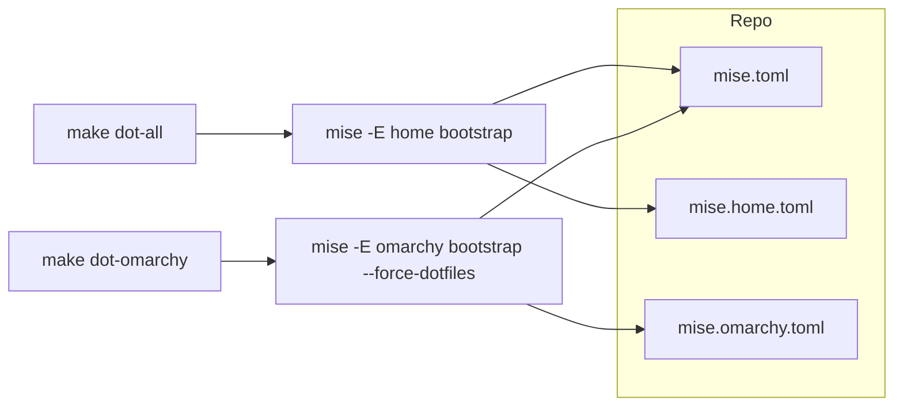

# feat(dotfiles): manage machine files with mise

- URL: https://github.com/mikeastock/dotfiles/pull/121
- author: mikeastock-bot state: closed created: 2026-09-17T03:57:47Z merged: 2026-09-17T15:56:22Z
- fetched: 2026-09-29 via gh api (lane X)

## Body

Machine setup is now declared in mise and applied with `make dot-all` / `make dot-omarchy`. `make install-configs` and the Makefile/Brewfile symlink installer are gone.



```bash
make dot-all       # macOS / Ubuntu: terminals, brew packages, TPM
make dot-omarchy   # Omarchy: skip Ghostty/Alacritty/Starship, claim around Omarchy files
make dot-clean     # mise unapply for both profiles
```

Shared copies now include Amp, OpenCode, Codex, Pi settings/models, and `AGENTS.md`:

```toml
"~/.config/amp/settings.json" = { source = "amp-configs/settings.json", mode = "copy" }
"~/.codex/config.toml" = { source = "configs/codex-config.toml", mode = "copy" }
"~/.pi/agent/settings.json" = { source = "pi-configs/pi-settings.json", mode = "copy" }
```

Omarchy still leaves Ghostty, Alacritty, and Starship on Omarchy's copies. Copy-mode apply overwrites the live file; capture local edits with `mise dot add` first. OpenCode keeps `{env:…}` keys in git.


## Comments
## Changed files
- renamed .codex/config.toml (+9/-0)
- renamed .config/amp/settings.json (+0/-0)
- renamed .config/omarchy/hooks/post-update.d/drop-omarchy-tmux.hook (+0/-0)
- renamed .config/opencode/opencode.jsonc (+0/-0)
- modified .github/workflows/test.yml (+5/-0)
- modified .gitignore (+6/-1)
- renamed .pi/agent/models.json (+0/-0)
- renamed .pi/agent/settings.json (+8/-2)
- modified .tmux.conf (+0/-5)
- modified AGENTS.md (+7/-5)
- removed Brewfile (+0/-3)
- modified Makefile (+6/-194)
- modified README.md (+36/-33)
- removed configs/codex/rules/default.rules (+0/-77)
- added mise.home.toml (+14/-0)
- added mise.omarchy.toml (+30/-0)
- added mise.toml (+38/-0)
- modified scripts/build.py (+0/-336)
- removed scripts/dot-omarchy.sh (+0/-268)
- added scripts/dotfiles.sh (+153/-0)
- removed tests/test-dot-omarchy.sh (+0/-187)
- added tests/test-dotfiles.sh (+278/-0)
- removed tests/test-install-configs.sh (+0/-331)
