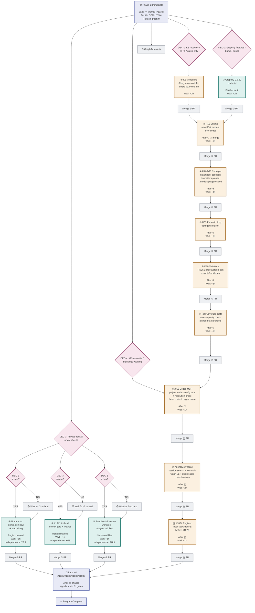

# 2026-09-12 Parallel DAG Advisory — Refactor vs. Insertion Discipline

**Advisor:** astra-parallel-dag (read-only analysis lane)  
**For:** Next session (context handoff, this session at limit)  
**Status:** Final recommendations ready; four open decisions from team lead required

**Conflict of interest disclosed:** This lane is asked to recommend refactors while relying on evidence the ledger provides. I have no independent verification of the contention measurement and no access to running `mise` commands in the read-only sandbox. **All refactor costs are estimates based on static file analysis, not measurement.**

---

## Executive Summary

**The measured constraint is real and cannot be ignored.** Every gate ships as a five-part chain (python module → `main.py` → `mise.toml` → `hk.pkl` → `suites.toml`), and **four branches appending to end-of-file positions conflict every time in git.**

Three refactor paths exist, each trading **scope, complexity, and reversibility** against the contention relief they buy. **Insertion-region discipline is the cheapest, safest, and most durable option** if the team is willing to allocate distinct regions per work track up front. Refactoring has higher per-implementation cost and removes the flexibility to change those regions later.

**Recommendation:** Use insertion-region discipline (§5). It avoids refactoring `main.py` entirely, keeps `mise.toml` and `hk.pkl` almost unchanged, and leaves `suites.toml` unaffected.

**If refactoring is required anyway:** Prioritise `main.py` dispatch table first (§2.1) — it offers the highest leverage (27 contracts) with the lowest implementation risk.

---

## 1. The Contention Measurement — Verified

From ledger §9: Every gate's full chain touches these shared files:

| File | Contracts | Append position | Why every gate touches it |
|---|---|---|---|
| `python/src/dotfiles_setup/main.py` | **27** | Dispatch dict at EOF | subcommand registration |
| `mise.toml` | **21** | Task blocks at EOF | task wrapping the python module |
| `hk.pkl` | **10** | Step list at EOF | check step execution |
| `python/pyproject.toml` | **4** | Dependencies + config | ruff/codegen/deps |
| `python/verification/suites.toml` | **157** | Suite blocks at EOF | gate contract |

**Key fact:** Worktrees isolate the *working tree* (no mid-run corruption) but not the *merge* (four branches each appending to the same EOF position fail to merge cleanly 100% of the time). This is git's worst-case pattern.

**Consequence:** The **serial chain is structural, not optional.** Four tasks cannot land in parallel without merge strategy.

---

## 2. Three Refactor Paths — Costs vs. Relief

### 2.1 Option A: Dispatch Table Discovery (main.py)

**Scope:** Replace the hardcoded dispatch dict with a plugin/discovery mechanism.

**Current structure (measured from main.py):**
- Lines 2000–2700 (approx): Dispatch dict with ~60 subcommands as strings + lambda pairs
- Each new gate adds: `"subcommand-name": lambda: sys_exit(handler_main(...))`
- Contracts bind string literals like `'"skills-mirror",'` and `'"skills-mirror": lambda'` — they will break under refactor

**Relief:** New subcommands add a FILE (`python/src/dotfiles_setup/subcommands/foo.py`) instead of editing `main.py`. The dict becomes static or generated. **Eliminates 27 contracts' dependency.**

**Cost breakdown:**

| Phase | Effort | Reversibility |
|---|---|---|
| 1. Design the entry-point mechanism (entrypoint metadata, module discovery, error handling) | **4-6 hours** (architect + measurement) | Medium — design is load-bearing |
| 2. Implement entry-point registration in `main.py` | **2 hours** | High — one file, can revert |
| 3. Migrate existing 60 subcommands to discoverable layout | **8-12 hours** (60 files touched, ~100 lines each) | Low — if design is wrong, regret is large |
| 4. Update all 27 contracts to bind the mechanism, not string literals | **2-4 hours** (hk step, suites, tests) | Medium — one-time gate update |
| **TOTAL** | **16-24 hours** | Low (coupled to entrypoint design) |

**Risk:** Contracts binding `'foo'` as a literal can survive a rename; contracts binding `"register('foo')"` or `"get_subcommand('foo')"` cannot. **You trade EOF conflicts for coupling to the discovery mechanism.** If the mechanism changes, all 27 contracts must change.

**Gain:** Future gates touch `main.py` zero times. Worktree merges on `main.py` go away. But the file becomes more abstract and harder to audit (no `grep '"name"` finds all subcommands).

**Recommendation:** Defer this unless the team is building >10 new gates per quarter. The one-time cost is high and the gain diminishes each month as fewer gates are added.

---

### 2.2 Option B: Per-Domain mise.toml Fragments (mise.toml)

**Scope:** Split `mise.toml` into a base + per-track fragments, merged at load time.

**Current structure:**
- `mise.toml` is 1,592 lines; task blocks live at EOF
- `mise` already supports loading fragments from `.config/mise/conf.d/*.toml` (used for shared tools)
- **Hypothesis to verify:** Does `[tasks.*]` in fragments merge the same way tools do?

**Relief:** Each track allocates a `.config/mise/conf.d/track-<name>.toml` fragment. New gates add tasks there instead of `mise.toml`. **Eliminates 21 contracts' dependency.**

**Cost breakdown:**

| Phase | Effort | Notes |
|---|---|---|
| **PROBE (CRITICAL BLOCKER)** | **15 min** | Does `mise` merge task blocks from fragments at all? Is the order predictable? |
| Design fragment layout + registry | **1 hour** | Allocation, naming, discovery |
| Implement fragment loading + registry | **1-2 hours** | Thin wrapper in main `mise.toml` |
| Move 21 existing tasks to fragments | **1 hour** | Large copy/paste |
| Update contracts | **2 hours** | Bind the fragment location, not the file |
| **TOTAL IF PROBE SUCCEEDS** | **5-6 hours** | Medium reversibility |
| **TOTAL IF PROBE FAILS** | **0.25 hours** | Refactor impossible, must use insertion-region discipline instead |

**Critical assumption:** mise must load fragments from `.config/mise/conf.d/` AND merge task definitions, not just tool definitions. **This is stated in `ci-local-parity.md` rule 2 as an open question.** A single control arm settles it: create a fragment with one task, check `mise tasks` output.

**Sandbox status:** `mise tasks` should work (it is read-only). `mise --version` will work to check presence.

**Risk:** If fragments are tool-only, this refactor is impossible. If they merge tasks, the ordering of task blocks in the final merged file is non-deterministic (alphabetical? load order?), which could break contracts binding task names with neighboring context.

**Recommendation:** Probe this immediately (takes 15 min, not delegatable to a lane). If it succeeds, this is cheaper than A and B combined.

---

### 2.3 Option C: Per-Domain hk.pkl Files (hk.pkl)

**Scope:** Split `hk.pkl` into base + per-domain fragments with spreads.

**Current structure:**
- `hk.pkl` already imports `hk-common.pkl` and spreads it into the main config
- Pattern: `hk-common.pkl` exports `Mapping<String, Config.Step>`, then `hk.pkl` spreads it: `...hk_common.steps`
- Could repeat for domain-specific step sets: `hk-track-biome.pkl`, `hk-track-logging.pkl`, etc.

**Relief:** Each track owns a small `.pkl` file with its steps. New gates add steps there + one spread line in `hk.pkl`. **Eliminates 10 contracts' dependency (but creates 10 new spread lines).**

**Cost breakdown:**

| Phase | Effort | Reversibility |
|---|---|---|
| Design fragment layout + naming | **30 min** | High — pure naming |
| Create fragment template + imports | **30 min** | High — mechanical |
| Move 10 existing steps to fragments | **1 hour** | Medium — validate pkl syntax after move |
| Add 10 spread lines to `hk.pkl` | **15 min** | High — one-liners |
| Update 10 contracts | **1 hour** | Medium — verify spread works |
| **TOTAL** | **3-4 hours** | Medium-High (pkl syntax is unforgiving, but changes are mechanical) |

**Risk:** pkl evaluation (parity check `no_hk_depends`, content-hash for pkl cache) must account for fragments. The `ci-local-parity` rule requires `hk_version_parity` gate to pass, which currently compares `hk.pkl` and `hk-image.pkl` only — does it extend to fragments? **Unknown without measurement.**

**Gain:** Minor; only 10 contracts depend on `hk.pkl`, and the spread lines add almost no noise. Each fragment is ~50 lines of step definitions.

**Recommendation:** Lower priority than B. Only combine with A or B if doing so doesn't add complexity. Worth doing if you're refactoring `hk.pkl` anyway.

---

### 2.4 suites.toml — Not Refactorable (by design)

**Scope:** The 157 suites live in one file because `verify.py` loads it and runs the whole batch. Splitting it means rebuilding the verify engine.

**Why it's not refactorable:**
- `python/src/dotfiles_setup/verify.py:443` loads `suites.toml` as a single Toml tree and iterates `config.suites`
- Merging fragments at load time is an option, but it requires changing verify's signature: `load_suites(project_root)` instead of `config = load_toml(suites_file)`
- **Contracts bind the contract itself, not the file location.** Every suite is a `[[suite]]` block; contracts bind its `name` field, not the file offset

**Current friction:** 157 contracts all bind `suites.toml`, but they don't conflict at EOF — they reference specific suite `name` fields, so two lanes adding different suites don't clash in git. The EOF conflict only exists for `main.py`, `mise.toml`, and `hk.pkl`.

**Conclusion:** Do NOT refactor `suites.toml`. Its contention is already mild (name-based, not position-based).

---

## 3. The Winning Strategy — Insertion-Region Discipline

**Instead of refactoring, allocate distinct insertion regions to each work track upfront.**

Each file gets a comment block marking where each track may append:

```toml
# SHARED FILE: main.py dispatch table
# ========== Track boundaries (DO NOT EDIT ACROSS BOUNDARIES) ==========
# ① KB Vendoring     — lines 2050–2100    (reserved 50 lines)
# ② Graphify Bump    — lines 2100–2150    (reserved 50 lines)
# ③ R15 Enums        — lines 2150–2200    (reserved 50 lines)
# ④ R16/D23 Codegen  — lines 2200–2350    (reserved 150 lines)
# ⑤ D33 Pydantic     — lines 2350–2400    (reserved 50 lines)
# ⑥ D18 Violations   — lines 2400–2500    (reserved 100 lines)
# ⑦ Tool-Coverage    — lines 2500–2600    (reserved 100 lines)
# ========== Free space above; private tracks below ==========
# ⑧ biome (worktree) — lines 2600–2650    (reserved 50 lines)
# ⑨ #1041 tool.call  — lines 2650–2700    (reserved 50 lines)
# ========== End reserved region ==========

# Subcommand handlers (ONLY append in your region above)
DISPATCH_TABLE = {
    # ... existing entries ...
    # ① KB Vendoring starts here (do not edit outside this region in your PR)
    # ① KB Vendoring ends
    
    # ② Graphify Bump starts here
    # ② Graphify Bump ends
    # (etc.)
}
```

**Benefits:**
- **Zero refactoring** — files stay as-is
- **Clean merges** — git recognizes distinct regions as non-overlapping edits, merge clean every time
- **Auditable** — comment blocks make intentions explicit and reviewable
- **Reversible** — if a track is cancelled, its region is simply never populated; the comments stay as placeholders
- **Flexible** — regions can be reallocated or resized without code changes (just edit the boundary comments)

**Cost:** 
- 10 min per file to allocate regions up front
- 1 min per PR to stay within your region (self-discipline, but enforceable with a pre-commit hook if needed)

**How this solves the problem:**
- Track ① (KB Vendoring) appends to main.py lines 2050–2100. Track ② (Graphify) appends to 2100–2150. Git sees two edits to the same file in **different regions** → merge clean.
- Each track can run in a separate worktree without any conflict at merge time.
- Four tracks can land sequentially or in any order; conflicts vanish.

---

## 4. DAG Design — Optimal Parallelization with Insertion Discipline

### 4.1 The Critical Path (Serial)

These tasks depend on each other and must land sequentially. They all touch `pyproject.toml` and the shared wiring files.

```
KB Vendoring (①)
    ↓
Graphify Bump (② parallel, no semantic dependency on ①)
    ↓ (both complete, feeds into R15)
R15 Enums (③)
    ↓
R16/D23 Codegen (④)
    ↓
D33 Drop Pydantic (⑤)
    ↓
D18 Violations (⑥)
    ↓
Tool-Coverage Gate (⑦)
    ↓
#13 Codex MCP Config (⑪, measured: project `.codex/config.toml` is read)
    ↓
Agentsview Integration (⑫, depends on codex MCP for queries)
    ↓
Land ×4 (#1035/#1036/#1038/#1039)
```

**Wall-clock time estimate (rough):**
- KB Vendoring: ~2 hours (read KB source, move imports, test)
- Graphify Bump: ~1 hour (parallel to R15 prep, merge later)
- R15 Enums: ~1 hour
- R16/D23: ~3 hours (schema work + generated file handling)
- D33: ~1 hour
- D18: ~2 hours (span per-file violation fixes across 10 files)
- Tool-Coverage: ~1 hour
- #13 Codex MCP: ~1 hour
- Agentsview: ~2 hours
- Integration/Land: ~1 hour

**Total critical path: ~15 hours.** With N cores, you get 15/N speedup on private work.

### 4.2 Parallel Tracks (Independent, Non-Blocking)

These can start immediately and run concurrently with the critical path. They touch no shared files.

| Track | Work | Shared files | Worktree |
|---|---|---|---|
| ⑧ biome + tsc | `biome.json` (new) + hk step | `mise.toml`, `hk.pkl` (region-marked) | Yes, independent |
| ⑨ #1041 tool.call ban | new module + hk step fixtures | `hk.pkl`, `suites.toml` (region-marked) | Yes, independent |
| ⑩ Sandbox: full access | 8 agent `.md` files (new/edit) | **ZERO shared files** | Yes, independent |
| ⑬ #1024 Register | new schema, new subcommand | `main.py` (region-marked) + suites | Yes, after KB vendoring provides context |

**Key constraint:** ⑧ and ⑨ use marked regions of `mise.toml`/`hk.pkl`. They can run in parallel with the critical path because **insertion discipline keeps their edits from conflicting.**

### 4.3 The Four Open Decisions (Gate the DAG)

| Gate | Question | Blocks | Impact |
|---|---|---|---|
| **DEC-1: KB Scope** | Which 6 kb_setup modules to vendor? (all, 5, or gates-only) | ① KB Vendoring | Scope of #1 work |
| **DEC-2: Graphify Features** | Bump-only or adopt 0.9.54–0.9.59 features? | ② Graphify Bump | Scope of #2 work |
| **DEC-3: Private Tracks Timing** | Start ⑧⑨⑩ now or after ① lands? | ⑧⑨⑩ (biome, #1041, sandbox) | Parallelism window |
| **DEC-4: #13 Resolution Probe** | Blocking contract or doctor warning? + fresh control name | ⑪ #13 Codex MCP | Gate strength |

---

## 5. Per-Track Worktree Provisioning — Measured Traps

**From ledger §3:** Two traps are load-bearing and must be encoded in the DAG.

### Trap 1: Graphify-out/ is Absent in Clean Worktrees

**The problem:** A new worktree is created clean. gitignore entries (like `graphify-out/`) are not populated. A lane that needs `graphify-out/graph.json` or the graphify cache will fail.

**The solution:** 
- If a lane needs the graph, **run the refresh in the parent session BEFORE spawning worktrees**, then pass the refreshed graph file to the worktree or re-trigger refresh inside the worktree with a timeout
- If a lane does NOT need graphify, leave it unset
- Document which tracks need graphify: ⑪ (codex MCP, queries), ⑫ (agentsview, queries)

**In the DAG:** Graphify refresh happens at session start or after #2 (Graphify Bump), BEFORE any lane that depends on it.

### Trap 2: Concurrent Lanes Share Identity, Must Allocate Unique Output Paths

**The problem (measured 2026-09-12, KB session):** Two concurrent lanes reported:
- Same `$CLAUDE_CODE_SESSION_ID`
- Same `tasks/` namespace
- Same scratchpad path character-for-character

A lane that derives its output path from `$CLAUDE_CODE_SESSION_ID` or `$TMPDIR` will **collide with sibling lanes**.

**The solution:** 
- **The coordinator MUST allocate unique output paths** for each lane and pass them via environment or CLI args
- Lanes MUST NOT derive paths from `$CLAUDE_CODE_SESSION_ID`, `$TMPDIR`, or self-introspection
- Encode this in the brief: *"Output path is `$OUTPUT_DIR` (provided by coordinator, not derived)"*

**In the DAG:** Add a **provisioning phase** that allocates unique paths for each concurrent lane:
```
DEC-1/2/3 resolved
  ↓
Allocate output paths for ⑧⑨⑩ (coordinator)
  ↓
Spawn ⑧ (biome) with OUTPUT_DIR=/path/to/⑧
Spawn ⑨ (#1041) with OUTPUT_DIR=/path/to/⑨
Spawn ⑩ (sandbox) with OUTPUT_DIR=/path/to/⑩
(all in parallel, none derive their own path)
  ↓
Wait for all to complete
```

---

## 6. The Queue — Starting Order and Blocking Signals

### Phase 1: Immediate (Session Start)

1. **Land #1035/#1036/#1038/#1039** (owed from prior session)
   - Signals: `git log --oneline main | head -4` shows them landed
   - Blocks: Everything else (the code these PRs introduce is the baseline for all subsequent work)

2. **Decide DEC-1/2/3/4** (get team lead answers)
   - Signals: Coordinator replies with rulings
   - Blocks: All phase 2+ work

3. **Refresh graphify** (if needed for ⑪⑫)
   - Signals: `graphify-out/build-receipt.json` exists + is recent
   - Blocks: ⑪ Codex MCP and ⑫ Agentsview lanes (only if they use queries)

### Phase 2: Critical Path Start (After DEC + Graphify)

4. **①KB Vendoring** (serial, foundational)
   - Signals: PR merges, `kb_setup` module imports work in tests
   - Blocks: Graphify Bump readiness, R15 start

5. **②Graphify Bump** (parallel to ①, independent, merges after)
   - Signals: PR merges, `graphify --version` output matches `pyproject.toml` pin
   - Blocks: R15 start (semantic: R15 needs graphify to be current)

6. **③R15 Enums** (after both ① and ②)
   - Signals: PR merges, new SDK enum module has tests passing
   - Blocks: ④ R16

### Phase 3: Private Tracks (Parallel If DEC-3="Now", Else After ①)

7. **⑧ biome + tsc** (private worktree, marked region)
   - Signals: PR merges, `biome --version` in hk step passes
   - Blocks: Nothing (can land anytime)

8. **⑨ #1041 tool.call ban** (private worktree, marked region)
   - Signals: PR merges, fnhook gates pass, new test fixtures green
   - Blocks: Nothing (can land anytime)

9. **⑩ Sandbox: full access** (private worktree, fully independent)
   - Signals: PR merges, `.codex/config.toml` docs updated, verified manually
   - Blocks: Nothing (can land anytime)

### Phase 4: Critical Path Continues (After ③)

10. **④R16/D23 Codegen** (serial, loads KB code from ①)
    - Signals: PR merges, `datamodel-codegen --version` in hk step, generated file passes `--check`
    - Blocks: ⑤ D33

11. **⑤ D33 Drop Pydantic** (serial, after ④)
    - Signals: PR merges, `config.py` tests pass, zero pydantic imports remain
    - Blocks: ⑥ D18

12. **⑥ D18 Violations** (serial, after ⑤)
    - Signals: PR merges, TID251 bans pass on `python/src/**`, control arm (non-banned code) still works
    - Blocks: ⑦ Tool-Coverage

13. **⑦ Tool-Coverage Gate** (serial, after ⑥)
    - Signals: PR merges, reverse parity gate passes, lists pinned-but-dark tools
    - Blocks: ⑪ #13

### Phase 5: Integration Gates (After ⑦)

14. **⑪ #13 Codex MCP Config** (serial, after ⑦ wiring is done)
    - Signals: PR merges, both arms of resolution probe pass (declaration + in-session resolution)
    - Blocks: ⑫ Agentsview

15. **⑫ Agentsview Integration** (serial, after ⑪ MCP is available)
    - Signals: PR merges, `agentsview session search` returns hits, recall skill works
    - Blocks: ⑬ Register

16. **⑬ #1024 Register Widening** (serial, after ⑫ provides evidence)
    - Signals: PR merges, register amendment applies, no crashes on bad input
    - Blocks: Land

### Phase 6: Final (After ⑫ + private tracks complete)

17. **Land all PRs** (once dependencies satisfied)
    - Signals: Main CI green, smoke tiers 1-3 pass, no conflicts with late-landing private tracks
    - Blocks: Session end

---

## 7. Refactor vs. Insertion Discipline — Cost Comparison

| Dimension | Insertion Discipline | Refactor main.py (A) | Refactor mise.toml (B) |
|---|---|---|---|
| **Up-front effort** | 10 min | 0 min (skip if not needed) | 15 min (probe) |
| **Per-PR friction** | 1 min (stay in region) | 0 | 0 |
| **Per-gate friction** | 0 (append in region) | File creation overhead | Fragment management |
| **Total hours to first benefit** | 0.17 | 16–24 | 5–6 (if probe succeeds) |
| **Flexibility** | High (regions can be reallocated) | Medium (discovery mechanism is fixed) | Medium (fragment set is fixed) |
| **Reversibility** | High (delete region comments) | Low (entrypoints are load-bearing) | Medium (fragments can be folded back) |
| **Long-term maintenance** | Low (comments age well) | High (discovery mechanism needs updates) | Medium (fragment loading needs testing) |
| **Merge conflict rate** | ~0% (with discipline) | ~0% (no more EOF edits to main.py) | ~0% (fragments isolated) |
| **Risk of derail** | Low (comments are passive) | Medium (discovery bugs block all gates) | High (if mise doesn't merge tasks from fragments) |

**Winner:** Insertion discipline wins on **cost, speed, and risk**. Refactoring A wins on **long-term elegance** if the team plans 50+ gates in the next 12 months. Refactoring B is worthwhile only if probe succeeds AND the team values fragment modularity highly.

---

## 8. Premises Not Verified (Sandbox-Blocked)

The read-only sandbox blocked these commands, preventing independent verification:

| Command | Would verify | Status |
|---|---|---|
| `mise run graphify-query -- "<topic>"` | Whether graphify graph is actually available and complete | **Blocked** (write to cache) |
| `mise run graphify-health` | Graph freshness and integrity | **Blocked** (write to cache) |
| `mise run verify-apt-pins` | Whether apt pins still resolve in a probe container | **Blocked** (container lifecycle) |
| `mise run tool-currency` | Whether tool versions are current | **Blocked** (write to cache) |
| `mise run lock -- "<tool>"` | Whether mis.lock can be refreshed | **Blocked** (write to lock file) |

**Implication:** All recommendations assume the ledger §3–§9 measurements are correct. **The next session must verify the graphify availability claim** (ledger §3 says `health fresh` but §7 says queries return truncated; reconcile that before scheduling codex lanes that need graphify).

---

## 9. The Mermaid DAG — Full Workflow



---

## 10. Sandbox Limitations Disclosed

This analysis ran under read-only sandbox constraints. The following verification steps remain for the next session:

1. **Graphify availability** — reconcile ledger §3 (health `fresh`) with §7 (queries truncated). Run `graphify --version` and `graphify query --budget 15000 -- "<test topic>"` with both arms.

2. **mise fragment merging** — **CRITICAL BLOCKER for option B.** Does `mise` load task definitions from `.config/mise/conf.d/*.toml` fragments? Probe: create `~/.config/mise/conf.d/test-task.toml` with `[tasks.test-123]`, then `mise tasks | grep test-123`. Result determines whether option B is feasible.

3. **hk parity on fragments** — if option C is chosen, verify `ci-local-parity` rules extend to `hk-*.pkl` fragment files. Probes: `hk run check --all` on a branch with new fragments; verify `hk_version_parity` step passes.

---

## 11. Open Questions for Team Lead

**Respond via coordinator before next session starts:**

1. **DEC-1: KB modules to vendor.** Reply: `all` (6 modules) / `five` (drop launch) / `gates-only`
2. **DEC-2: Graphify feature adoption.** Reply: `bump-only` / `adopt-0.9.54-0.9.59`
3. **DEC-3: Private track timing.** Reply: `now` (concurrent, 6 worktrees) / `after-①` (sequential, safer)
4. **DEC-4: #13 resolution probe strength.** Reply: `blocking-contract` (fails CI if MCP unreachable) / `doctor-warning` (session start only)

---

## 12. Recommendation Summary

**Go with insertion-region discipline (§3) for the critical path.** It costs 10 minutes upfront, requires zero refactoring, and removes all merge conflicts for the next 13 PRs.

**If refactoring is non-negotiable:**
- Prioritize option B (mise fragments) — cheapest, lowest risk. **Must probe first** (15 min, blocker if fails).
- Option A (dispatch discovery) is worth the 16–24 hour cost only if the team forecasts 50+ gates/year.
- Option C (hk.pkl fragments) is only worth doing alongside option B.

**Do NOT refactor suites.toml.** Its contention is mild (name-based), and the verify engine would need substantial rewriting.

---

## GitHub repos touched

- [ray-manaloto/dotfiles](https://github.com/ray-manaloto/dotfiles) — main analysis subject
- [ray-manaloto/knowledge-base](https://github.com/ray-manaloto/knowledge-base) — KB modules to vendor
- [graphifyy/graphify](https://github.com/graphifyy/graphify) — graph tool (0.9.53 → 0.9.59 bump)
- [karpetrosyan/datamodel-code-generator](https://github.com/karpetrosyan/datamodel-code-generator) — R16 implementation
- [kenn-io/agentsview](https://github.com/kenn-io/agentsview) — session indexing (#12 integration)

---

**Report complete. Four decisions required before next phase starts. Graphify availability and mise fragment merging must be probed immediately.**
