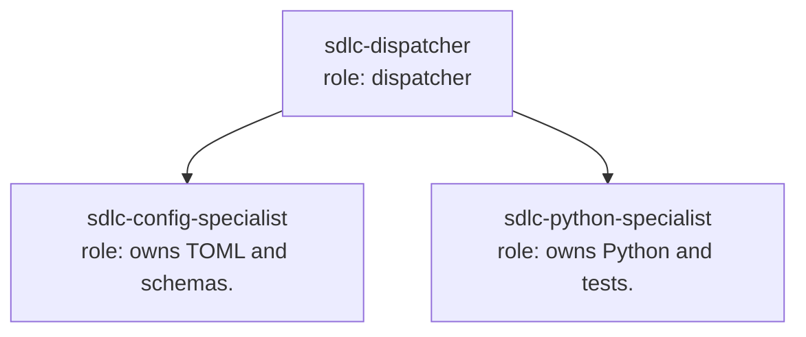

# Codex lane reports, VERBATIM — 2026-09-14/15

Every codex SDLC lane report from the session, persisted at handoff per
`.claude/rules/agent-report-persistence.md` rule 1 and the session-handoff
skill's step 3c (briefs AND reports are in scope).

**These existed only in the session scratchpad until now.** `/clear` would have
destroyed them, and they contain the session's most valuable output: SIX
licensed dissents, every one correct. Four caught the architect's spec
contradicting ITSELF — a class the `PREMISES` block structurally cannot catch,
because it forces citations for factual claims and says nothing about whether
the prose and the interfaces agree.

The specs that produced them are persisted alongside at
`2026-09-14i-codex-lane-specs-verbatim.md`.

## Index

| # | Lane | Outcome |
|---|---|---|
| 1 | review of the previous session | full findings, no dissent |
| 2 | enforcement (O1-O3 schema/roster gates) | DONE |
| 3 | #1111 typed gate boundary | DONE; self-disclosed a piping violation |
| 4 | DAG round 1 | **DISSENT 1** — hard-coded classifier inventory |
| 5 | DAG round 2 | **DISSENT 2** — msgspec may only be imported by codec.py |
| 6 | DAG round 3 | **DISSENT 3** — bare tuple cannot distinguish "saw nothing" from "could not run" |
| 7 | DAG round 4 | DONE — O1-O4 |
| 8 | sdlc-team round 1 | **DISSENT 4** — prose promised fields the interface omitted; timeout unenforceable |
| 9 | sdlc-team round 2 | **DISSENT 5** — receipt paths demanded in two directories |
| 10 | sdlc-team round 3 | **DISSENT 6** — ABANDONED written by the supervisor it declares dead |
| 11 | sdlc-team round 4 | DONE — O1-O5 |

---


## Lane report: `sdlc-review-out`

# Synthesis

The branch is not safe for a fresh session yet. The team exists and can be invoked when the caller already knows about it, but discovery, validation, and schema refresh contain serious gaps.

Specialists spawned in parallel:

- `sdlc-config-specialist` — agent TOMLs, schema, task, and routing audit.
- `sdlc-python-specialist` — doctor, schema tooling, tests, and verification wiring.
- `sdlc-documentation-specialist` — fresh-session discovery, spec promises, and uncommitted report audit.

No gates were run and nothing was modified. Graphify was attempted first as required, but sandbox-denied its temp/log creation; subsequent work used direct read-only source inspection.

## BLOCKER

### 1. The committed Codex config schema already fails its own drift contract — VERIFIED

`schemas/sources.toml` records SHA-256 `2e1fcf…` for the Codex config schema at [schemas/sources.toml:57](/Users/rmanaloto/dev/github/ray-manaloto/dotfiles/schemas/sources.toml:57). A direct read-only hash probe produced:

```text
b28908a730e7518d34494148475c8f27eb6b724103bae78190f939ed01e41de0
```

The verifier compares the actual file hash with that recorded value at [schema_vendor.py:202](/Users/rmanaloto/dev/github/ray-manaloto/dotfiles/python/src/dotfiles_setup/schema_vendor.py:202), and converts a mismatch into a verification failure at [verify.py:651](/Users/rmanaloto/dev/github/ray-manaloto/dotfiles/python/src/dotfiles_setup/verify.py:651).

A fresh session running the documented verification contract will fail immediately.

### 2. Scheduled schema refresh deterministically crashes on the new Codex entry — VERIFIED

The refresh loop processes every schema source through `_source_url()` at [schema_vendor.py:365](/Users/rmanaloto/dev/github/ray-manaloto/dotfiles/python/src/dotfiles_setup/schema_vendor.py:365). That resolver only supports `mise`, `ruff`, and `typos`, then raises `ValueError` for anything else at [schema_vendor.py:213](/Users/rmanaloto/dev/github/ray-manaloto/dotfiles/python/src/dotfiles_setup/schema_vendor.py:213).

The newly committed Codex entry is at [schemas/sources.toml:51](/Users/rmanaloto/dev/github/ray-manaloto/dotfiles/schemas/sources.toml:51). The scheduled workflow invokes this refresh at [refresh.yml:485](/Users/rmanaloto/dev/github/ray-manaloto/dotfiles/.github/workflows/refresh.yml:485).

Tests hide the problem by defining only the original three tools at [test_schema_vendor.py:38](/Users/rmanaloto/dev/github/ray-manaloto/dotfiles/tests/test_schema_vendor.py:38). Even after fixing the resolver, the refresh PR path list omits both Codex schema artifacts at [refresh.yml:539](/Users/rmanaloto/dev/github/ray-manaloto/dotfiles/.github/workflows/refresh.yml:539).

### 3. The doctor’s Codex “currency” check can only meaningfully pass — VERIFIED

The check loads an ignored app-server schema bundle and accepts any non-empty JSON object. The installed Codex version appears only in the success message:

```python
if not isinstance(schema, dict) or not schema:
    return False, "Schema bundle is empty or not an object"
return True, f"Schema is present for codex {current_version}"
```

See [codex_schema.py:71](/Users/rmanaloto/dev/github/ray-manaloto/dotfiles/python/src/dotfiles_setup/codex_schema.py:71) and [codex_schema.py:79](/Users/rmanaloto/dev/github/ray-manaloto/dotfiles/python/src/dotfiles_setup/codex_schema.py:79).

Consequences:

- It does not compare schema provenance or version.
- It does not inspect `schemas/codex-config.json`.
- It does not inspect `schemas/codex-agent.json`.
- It does not load any of the six SDLC agents.
- `[codex].enabled` at [doctor.toml:271](/Users/rmanaloto/dev/github/ray-manaloto/dotfiles/doctor.toml:271) is never consulted by the check.
- Invalid JSON raises rather than returning the documented `(bool, message)` result; the test explicitly expects the exception at [test_codex_schema.py:94](/Users/rmanaloto/dev/github/ray-manaloto/dotfiles/tests/test_codex_schema.py:94).

The doctor wrapper merely trusts that boolean at [doctor.py:1303](/Users/rmanaloto/dev/github/ray-manaloto/dotfiles/python/src/dotfiles_setup/doctor.py:1303).

### 4. A fresh Claude session cannot discover or invoke this team — VERIFIED

The actual startup trail is:

```text
root CLAUDE.md → AGENTS.md
                .claude/CLAUDE.md
                .claude/rules/*
                .claude/settings.json hooks
```

None introduces the SDLC dispatcher:

- Root [CLAUDE.md:1](/Users/rmanaloto/dev/github/ray-manaloto/dotfiles/CLAUDE.md:1) imports `AGENTS.md`.
- [AGENTS.md:18](/Users/rmanaloto/dev/github/ray-manaloto/dotfiles/AGENTS.md:18) documents the normal repo workflow, but has no SDLC-team trigger or invocation.
- [.claude/CLAUDE.md:43](/Users/rmanaloto/dev/github/ray-manaloto/dotfiles/.claude/CLAUDE.md:43) documents older Fable/Codex lanes, not this dispatcher.
- [.claude/rules/ai-cli-invocation.md:7](/Users/rmanaloto/dev/github/ray-manaloto/dotfiles/.claude/rules/ai-cli-invocation.md:7) explains generic CLI lanes, not how to address `codex-sdlc-dispatcher`.
- The relevant hooks in [.claude/settings.json:131](/Users/rmanaloto/dev/github/ray-manaloto/dotfiles/.claude/settings.json:131) run doctor/observer activities, not team discovery.
- [mise.toml:717](/Users/rmanaloto/dev/github/ray-manaloto/dotfiles/mise.toml:717) exposes the older `codex-lane`; the new tasks at [mise.toml:1653](/Users/rmanaloto/dev/github/ray-manaloto/dotfiles/mise.toml:1653) are schema commands only.
- The supposed generic invocation still contains `<spawn-two-subagents prompt>` at [codex-sdlc-subagent-team.md:152](/Users/rmanaloto/dev/github/ray-manaloto/dotfiles/docs/specs/codex-sdlc-subagent-team.md:152).

The `.codex/agents/*.toml` files make roles discoverable to Codex itself; they do not teach a fresh Claude session that it should launch Codex, select the dispatcher, or supply a particular prompt.

Minimum required discovery changes:

- `.claude/CLAUDE.md` — state when the team should be used.
- `.claude/rules/ai-cli-invocation.md` — give an exact, executable invocation.

For a canonical recurring command, repo policy additionally requires a skill, a mise task, and Python implementation rather than a raw shell recipe; that rule is explicit at [.claude/rules/agent-artifact-conventions.md:99](/Users/rmanaloto/dev/github/ray-manaloto/dotfiles/.claude/rules/agent-artifact-conventions.md:99). The present design does not name those artifacts. `.claude/settings.json` must also change if the promised Claude function-hook validation is retained.

## MAJOR

### 5. Nothing durably catches a silently dropped SDLC agent — VERIFIED

The TOML check validates only files that still exist at [hk.pkl:164](/Users/rmanaloto/dev/github/ray-manaloto/dotfiles/hk.pkl:164). The JSON schema requires fields within an individual document at [codex-agent.json:7](/Users/rmanaloto/dev/github/ray-manaloto/dotfiles/schemas/codex-agent.json:7), but cannot detect deletion or whether Codex accepted the file.

Worse, the existing parity checker explicitly excludes SDLC agents from its target population at [test_codex_agent_parity.py:479](/Users/rmanaloto/dev/github/ray-manaloto/dotfiles/tests/test_codex_agent_parity.py:479).

There is no roster-count contract, no directive-presence contract, and no runtime discovery probe that checks all six expected names. Therefore, a missing or silently rejected agent can leave every committed static check green.

This run did successfully spawn the config, Python, and documentation roles, so those three currently load. That is one-time runtime evidence, not a persistent fail arm.

### 6. There is no working regeneration path for `codex-agent.json` — VERIFIED

`derive_agent_schema()` correctly constructs an agent schema at [codex_schema.py:101](/Users/rmanaloto/dev/github/ray-manaloto/dotfiles/python/src/dotfiles_setup/codex_schema.py:101). But `generate_schema()` only copies app-server bundle files at [codex_schema.py:146](/Users/rmanaloto/dev/github/ray-manaloto/dotfiles/python/src/dotfiles_setup/codex_schema.py:146); it never writes the derived agent schema or config schema.

Nevertheless, the generated header says to run `mise run codex-schema-generate` at [codex-agent.json:3](/Users/rmanaloto/dev/github/ray-manaloto/dotfiles/schemas/codex-agent.json:3), and the test repeats that recovery instruction at [test_codex_schema.py:223](/Users/rmanaloto/dev/github/ray-manaloto/dotfiles/tests/test_codex_schema.py:223).

Generation also returns success if only one bundle variant was copied at [codex_schema.py:190](/Users/rmanaloto/dev/github/ray-manaloto/dotfiles/python/src/dotfiles_setup/codex_schema.py:190), while checking reads only the primary path at [codex_schema.py:34](/Users/rmanaloto/dev/github/ray-manaloto/dotfiles/python/src/dotfiles_setup/codex_schema.py:34).

### 7. The doctor baseline claims verification wiring that does not exist — VERIFIED

The baseline says `codex-schema-check` is automatically run by `mise run verify` at [doctor.toml:278](/Users/rmanaloto/dev/github/ray-manaloto/dotfiles/doctor.toml:278). The `verify` task only calls `dotfiles-setup verify run` at [mise.toml:427](/Users/rmanaloto/dev/github/ray-manaloto/dotfiles/mise.toml:427), and there is no corresponding Codex schema suite entry. The schema check is a separate task at [mise.toml:1653](/Users/rmanaloto/dev/github/ray-manaloto/dotfiles/mise.toml:1653).

A fresh session would incorrectly believe the normal verification gate covers schema currency.

### 8. Dispatcher routing misses real ownership paths and forbids promised flexibility — VERIFIED

The dispatcher routes Python for `python/src/` and nonexistent `python/tests/`, omitting the actual root `tests/` tree at [codex-sdlc-dispatcher.toml:24](/Users/rmanaloto/dev/github/ray-manaloto/dotfiles/.codex/agents/codex-sdlc-dispatcher.toml:24). The repository explicitly says tests live at root at [tests/AGENTS.md:8](/Users/rmanaloto/dev/github/ray-manaloto/dotfiles/tests/AGENTS.md:8).

Related defects:

- The Python specialist repeats `python/tests/` and names nonexistent `mise run pytest` at [codex-sdlc-python-specialist.toml:8](/Users/rmanaloto/dev/github/ray-manaloto/dotfiles/.codex/agents/codex-sdlc-python-specialist.toml:8). The documented gate is `uv run --project python pytest tests/` at [tests/AGENTS.md:35](/Users/rmanaloto/dev/github/ray-manaloto/dotfiles/tests/AGENTS.md:35).
- Config routing lists TOML/Pkl/HCL but omits JSON and `schemas/` at [codex-sdlc-dispatcher.toml:28](/Users/rmanaloto/dev/github/ray-manaloto/dotfiles/.codex/agents/codex-sdlc-dispatcher.toml:28).
- The config specialist names nonexistent `renovate.pkl` at [codex-sdlc-config-specialist.toml:8](/Users/rmanaloto/dev/github/ray-manaloto/dotfiles/.codex/agents/codex-sdlc-config-specialist.toml:8); this repository uses `renovate.json`.
- The dispatcher forbids agents outside its roster at [codex-sdlc-dispatcher.toml:57](/Users/rmanaloto/dev/github/ray-manaloto/dotfiles/.codex/agents/codex-sdlc-dispatcher.toml:57), contradicting the spec’s requirement that it may add further specialists at [codex-sdlc-subagent-team.md:65](/Users/rmanaloto/dev/github/ray-manaloto/dotfiles/docs/specs/codex-sdlc-subagent-team.md:65).

### 9. The image specialist overstates what its gate proves — VERIFIED

The specialist claims `verify-container-latest` proves inbound SSH, outbound GitHub SSH, AMD64, and persistence at [codex-sdlc-image-specialist.toml:20](/Users/rmanaloto/dev/github/ray-manaloto/dotfiles/.codex/agents/codex-sdlc-image-specialist.toml:20).

The task at [mise.toml:1004](/Users/rmanaloto/dev/github/ray-manaloto/dotfiles/mise.toml:1004) checks a running container, bind mount, and smoke suite. Outbound SSH is included in the smoke script at [devcontainer-smoke.sh:126](/Users/rmanaloto/dev/github/ray-manaloto/dotfiles/scripts/devcontainer-smoke.sh:126), but inbound SSH, explicit architecture, and persistence are separate steps of `verify-local` at [mise.toml:1111](/Users/rmanaloto/dev/github/ray-manaloto/dotfiles/mise.toml:1111).

A green image-specialist report could therefore omit mandatory R1/R3/persistence evidence.

### 10. The specs now contradict the implementation — VERIFIED

Examples that will mislead a fresh session:

- The main spec still says “NOT implemented” at [codex-sdlc-subagent-team.md:3](/Users/rmanaloto/dev/github/ray-manaloto/dotfiles/docs/specs/codex-sdlc-subagent-team.md:3).
- It still requires `mcp_servers` on every agent at [codex-sdlc-subagent-team.md:78](/Users/rmanaloto/dev/github/ray-manaloto/dotfiles/docs/specs/codex-sdlc-subagent-team.md:78), although V1 records that requirement as invalid at [codex-sdlc-subagent-team.md:171](/Users/rmanaloto/dev/github/ray-manaloto/dotfiles/docs/specs/codex-sdlc-subagent-team.md:171).
- It says names and dispatcher form remain undecided at [codex-sdlc-subagent-team.md:255](/Users/rmanaloto/dev/github/ray-manaloto/dotfiles/docs/specs/codex-sdlc-subagent-team.md:255).
- D5 promises a Claude function-hook validation layer at [codex-sdlc-subagent-team.md:108](/Users/rmanaloto/dev/github/ray-manaloto/dotfiles/docs/specs/codex-sdlc-subagent-team.md:108), but no such hook exists.
- The schema skill overstates the app-server bundle as a complete settings/config schema at [.claude/skills/codex-schema/SKILL.md:17](/Users/rmanaloto/dev/github/ray-manaloto/dotfiles/.claude/skills/codex-schema/SKILL.md:17), while the grilling record itself says it is not one at [codex-sdlc-grilling-record.md:15](/Users/rmanaloto/dev/github/ray-manaloto/dotfiles/docs/specs/codex-sdlc-grilling-record.md:15).

### 11. Potential Python lint/import failure — INFERRED

`tests/test_codex_schema.py` performs runtime imports after a `TYPE_CHECKING` block at [test_codex_schema.py:14](/Users/rmanaloto/dev/github/ray-manaloto/dotfiles/tests/test_codex_schema.py:14). With Ruff’s broad rule selection at [pyproject.toml:63](/Users/rmanaloto/dev/github/ray-manaloto/dotfiles/python/pyproject.toml:63), this likely triggers import-order/module-import-placement diagnostics.

This remains **INFERRED** because gates were explicitly prohibited.

## MINOR

- The generic Codex rule still advertises version `0.152.1` at [ai-cli-invocation.md:33](/Users/rmanaloto/dev/github/ray-manaloto/dotfiles/.claude/rules/ai-cli-invocation.md:33), while the repository source records `0.154.0` at [schemas/sources.toml:53](/Users/rmanaloto/dev/github/ray-manaloto/dotfiles/schemas/sources.toml:53).
- `.gitignore` describes four hand-authored Codex lanes at [.gitignore:63](/Users/rmanaloto/dev/github/ray-manaloto/dotfiles/.gitignore:63), but six additional SDLC agents now use the same tracked exception mechanism.
- The schema-vendor task description still lists only the original three schemas at [mise.toml:1440](/Users/rmanaloto/dev/github/ray-manaloto/dotfiles/mise.toml:1440).
- The root Claude stub’s comment describes itself as byte-exact while containing additional comments at [CLAUDE.md:1](/Users/rmanaloto/dev/github/ray-manaloto/dotfiles/CLAUDE.md:1). This is documentation drift, not an execution defect.

## Promised verification: DONE vs NOT DONE

| Item | Verdict | Evidence |
|---|---|---|
| V1 — Codex recognizes the six agent files | **DONE once**, not durable | The spec records the six-agent appearance and the `mcp_servers` correction at [codex-sdlc-subagent-team.md:171](/Users/rmanaloto/dev/github/ray-manaloto/dotfiles/docs/specs/codex-sdlc-subagent-team.md:171). No ongoing roster/load check exists. |
| V2 — Named specialist invocation | **DONE once** | Recorded at [codex-sdlc-subagent-team.md:183](/Users/rmanaloto/dev/github/ray-manaloto/dotfiles/docs/specs/codex-sdlc-subagent-team.md:183). |
| V3 — Dispatcher routes a multi-domain task and specialists can nest | **PARTIALLY DONE** | Routing/nested-spawn evidence exists at [codex-sdlc-subagent-team.md:194](/Users/rmanaloto/dev/github/ray-manaloto/dotfiles/docs/specs/codex-sdlc-subagent-team.md:194). The report records sandbox-blocked gates, so this was not an end-to-end green verification at [codex-sdlc-verification-report.md:20](/Users/rmanaloto/dev/github/ray-manaloto/dotfiles/docs/specs/codex-sdlc-verification-report.md:20). Those sandbox failures are not classified as repository defects. |
| V4 — Team reusable on a disjoint task | **DONE for routing only** | Second-task routing is recorded at [codex-sdlc-reuse-verification.md:5](/Users/rmanaloto/dev/github/ray-manaloto/dotfiles/docs/specs/codex-sdlc-reuse-verification.md:5); the same report defers future gate verification at [codex-sdlc-reuse-verification.md:26](/Users/rmanaloto/dev/github/ray-manaloto/dotfiles/docs/specs/codex-sdlc-reuse-verification.md:26). |
| “Schema makes V1 non-recurring” | **NOT DONE** | Individual TOML structure is checked, but roster membership and real Codex loading are not. The parity test deliberately excludes SDLC agents at [test_codex_agent_parity.py:479](/Users/rmanaloto/dev/github/ray-manaloto/dotfiles/tests/test_codex_agent_parity.py:479). |
| D5 four-layer validation, including Claude hook | **NOT DONE** | Promise at [codex-sdlc-subagent-team.md:108](/Users/rmanaloto/dev/github/ray-manaloto/dotfiles/docs/specs/codex-sdlc-subagent-team.md:108); no corresponding hook is present in [.claude/settings.json:131](/Users/rmanaloto/dev/github/ray-manaloto/dotfiles/.claude/settings.json:131). |

The learning-loop document is honest that it is design-only at [codex-sdlc-team-learning-loop.md:1](/Users/rmanaloto/dev/github/ray-manaloto/dotfiles/docs/specs/codex-sdlc-team-learning-loop.md:1). None of its runtime mechanisms is built:

- S1 gate/result capture — **NOT DONE**, specified at [line 38](/Users/rmanaloto/dev/github/ray-manaloto/dotfiles/docs/specs/codex-sdlc-team-learning-loop.md:38).
- S2 under-routing/over-routing computation — **NOT DONE**, [line 44](/Users/rmanaloto/dev/github/ray-manaloto/dotfiles/docs/specs/codex-sdlc-team-learning-loop.md:44).
- S3 reviewed learning rounds — **NOT DONE**, [line 62](/Users/rmanaloto/dev/github/ray-manaloto/dotfiles/docs/specs/codex-sdlc-team-learning-loop.md:62).
- Append-only tracked JSONL evidence — **NOT DONE**, [line 67](/Users/rmanaloto/dev/github/ray-manaloto/dotfiles/docs/specs/codex-sdlc-team-learning-loop.md:67).
- Delta proposal writer/human application — **NOT DONE**, [line 88](/Users/rmanaloto/dev/github/ray-manaloto/dotfiles/docs/specs/codex-sdlc-team-learning-loop.md:88).
- Staged implementation plan — **NOT DONE**, [line 103](/Users/rmanaloto/dev/github/ray-manaloto/dotfiles/docs/specs/codex-sdlc-team-learning-loop.md:103).

## Uncommitted report state

The 18 tracked report modifications were produced by an unscoped:

```text
uv run --project python ruff format
```

The previous-session transcript records “19 files reformatted” at [session transcript:3992](/Users/rmanaloto/.claude/projects/-Users-rmanaloto-dev-github-ray-manaloto-dotfiles/4a6de166-0813-4528-ac5c-2bfbc0a5bbe3.jsonl:3992). One formatted Python file was committed; these 18 archived Markdown reports remain modified.

All 18 are Ruff rewrites of Python-looking fenced text:

- Comment spacing/alignment: [2026-08-30c:171](/Users/rmanaloto/dev/github/ray-manaloto/dotfiles/docs/research/kb/reports/agents/2026-08-30c-graphify-doc-audit.md:171), [mount audit:18](/Users/rmanaloto/dev/github/ray-manaloto/dotfiles/docs/research/kb/reports/agents/2026-09-01-mount-uniqueness-audit-round2.md:18).
- Signature/list wrapping: [path-scoped:379](/Users/rmanaloto/dev/github/ray-manaloto/dotfiles/docs/research/kb/reports/agents/2026-09-02-path-scoped-injection-facts.md:379), [917 spec:48](/Users/rmanaloto/dev/github/ray-manaloto/dotfiles/docs/research/kb/reports/agents/2026-09-03-917-SPEC.md:48), [two-image plan:195](/Users/rmanaloto/dev/github/ray-manaloto/dotfiles/docs/research/kb/reports/agents/2026-09-04-two-image-implementation-plan.md:195), [worktree advisory:124](/Users/rmanaloto/dev/github/ray-manaloto/dotfiles/docs/research/kb/reports/agents/2026-09-11-worktree-parallelism-advisory.md:124), [Astra logger:289](/Users/rmanaloto/dev/github/ray-manaloto/dotfiles/docs/research/kb/reports/agents/2026-09-12-astra-logger-enforcement-plan.md:289).
- Quoted-source reformatting/dedenting: [doctor updateall:133](/Users/rmanaloto/dev/github/ray-manaloto/dotfiles/docs/research/kb/reports/agents/2026-09-12-doctor-updateall-facts.md:133), [TS codegen:58](/Users/rmanaloto/dev/github/ray-manaloto/dotfiles/docs/research/kb/reports/agents/2026-09-12-ts-codegen-counterpart.md:58), [adversarial SDLC:217](/Users/rmanaloto/dev/github/ray-manaloto/dotfiles/docs/research/kb/reports/agents/adv-sdlc-team-2026-09-14.md:217), [graphify brief:44](/Users/rmanaloto/dev/github/ray-manaloto/dotfiles/docs/research/kb/reports/agents/briefs/2026-08-31-spec-graphify-bump.md:44), [Codex advisor:151](/Users/rmanaloto/dev/github/ray-manaloto/dotfiles/docs/research/kb/reports/agents/codex-advisor-promote-staleness-guard.md:151), [cold review:36](/Users/rmanaloto/dev/github/ray-manaloto/dotfiles/docs/research/kb/reports/agents/cold-review-803-20260828.md:36), [logging research:325](/Users/rmanaloto/dev/github/ray-manaloto/dotfiles/docs/research/kb/reports/agents/logging-stack-research.md:325), [silent failure:23](/Users/rmanaloto/dev/github/ray-manaloto/dotfiles/docs/research/kb/reports/agents/silent-failure-803-20260828.md:23).
- Semantically dangerous rewrites: `env={...}` becomes tuple-like assignment at [proc-runner premise:195](/Users/rmanaloto/dev/github/ray-manaloto/dotfiles/docs/research/kb/reports/agents/2026-09-12-spec-proc-runner-premise-verification.md:195); detector/list entries become one-tuples at [premise sweep:443](/Users/rmanaloto/dev/github/ray-manaloto/dotfiles/docs/research/kb/reports/agents/premise-sweep-2026-09-14.md:443); ellipsis and a following call are joined at [doctor hooks:100](/Users/rmanaloto/dev/github/ray-manaloto/dotfiles/docs/research/kb/reports/agents/res-doctor-hooks-2026-09-14.md:100).

Committing these changes would be destructive. Archived reports must remain verbatim: [.claude/rules/agent-report-persistence.md:102](/Users/rmanaloto/dev/github/ray-manaloto/dotfiles/.claude/rules/agent-report-persistence.md:102) and [.claude/rules/agent-artifact-conventions.md:103](/Users/rmanaloto/dev/github/ray-manaloto/dotfiles/.claude/rules/agent-artifact-conventions.md:103). The lint configuration deliberately excludes these records from normalization at [hk-common.pkl:43](/Users/rmanaloto/dev/github/ray-manaloto/dotfiles/hk-common.pkl:43).

The untracked [2026-09-14f-discovery-sweep.md:1](/Users/rmanaloto/dev/github/ray-manaloto/dotfiles/docs/research/kb/reports/agents/2026-09-14f-discovery-sweep.md:1) is a separate, incomplete report. It should not be bundled with or deleted as part of restoring the 18 tracked records without determining ownership.

## What is fine

- The committed agent schema has genuine required-field and `additionalProperties: false` enforcement at [codex-agent.json:7](/Users/rmanaloto/dev/github/ray-manaloto/dotfiles/schemas/codex-agent.json:7).
- The derivation-equality test has a real mutation/fail arm at [test_codex_schema.py:223](/Users/rmanaloto/dev/github/ray-manaloto/dotfiles/tests/test_codex_schema.py:223).
- Narrowing the older parity contract to the Sol/Astra role families is deliberate and tested at [codex_agent_parity.py:84](/Users/rmanaloto/dev/github/ray-manaloto/dotfiles/python/src/dotfiles_setup/codex_agent_parity.py:84).
- The learning-loop document correctly labels itself as unimplemented design; the defect is absence of implementation, not a false claim that it is running.

# WHAT THE NEXT SESSION MUST KNOW

- The team works only when the caller already knows to invoke it; Claude discovery/invocation is not documented.
- Doctor does **not** validate agent loading, schema version, or the six-agent roster.
- `schema-vendor-refresh` cannot process the new Codex source, and the committed schema hash is stale.
- V1–V4 are one-off demonstrations, not durable regression gates; V3/V4 did not prove all requested gates green.
- The learning loop is design-only. None of its capture, analysis, storage, or proposal machinery exists.
- Do not commit the 18 Ruff-formatted archived reports; restore them byte-for-byte after resolving the separate untracked report’s ownership.

---


## Lane report: `enforcement-out`

Implemented the spec on `docs/session-2026-09-14e-reports`; the tree remains uncommitted.

### Specialists

- `sdlc-python-specialist` — Python modules and tests
- `sdlc-config-specialist` — mise, hk, and doctor configuration
- No workflow, image, or documentation specialist was spawned.

### Changed files

- [codex_schema.py](/Users/rmanaloto/dev/github/ray-manaloto/dotfiles/python/src/dotfiles_setup/codex_schema.py:22)
- [codex_agent_validate.py](/Users/rmanaloto/dev/github/ray-manaloto/dotfiles/python/src/dotfiles_setup/codex_agent_validate.py:16)
- [main.py](/Users/rmanaloto/dev/github/ray-manaloto/dotfiles/python/src/dotfiles_setup/main.py:1597)
- [test_codex_schema.py](/Users/rmanaloto/dev/github/ray-manaloto/dotfiles/tests/test_codex_schema.py:30)
- [test_codex_agent_validate.py](/Users/rmanaloto/dev/github/ray-manaloto/dotfiles/tests/test_codex_agent_validate.py:62)
- [mise.toml](/Users/rmanaloto/dev/github/ray-manaloto/dotfiles/mise.toml:1325)
- [hk.pkl](/Users/rmanaloto/dev/github/ray-manaloto/dotfiles/hk.pkl:673)
- [doctor.toml](/Users/rmanaloto/dev/github/ray-manaloto/dotfiles/doctor.toml:275)

Out-of-scope dirty files were not touched.

### Verification exit codes

All exit codes were captured to files and read back.

| Command | Attempt 1 | Attempt 2 | Final |
|---|---:|---:|---:|
| Targeted pytest | 0 | 0 | **0** |
| Ruff check | 1 | 0 | **0** |
| Ruff format check | 1 | 1 | **0** |
| Codex agent parity | 0 | 0 | **0** |

Final outputs:

```text
26 passed in 1.08s
All checks passed!
199 files already formatted
codex-agent-parity OK: 12 lane(s) paired, sentinel intact, named consistently, pinned to xhigh effort, and carrying the no-substitute prohibition
```

The Ruff failures were repaired without suppressions or test narrowing.

### O1 fail arm

```text
real_version=0.154.0
written_stamp=0.0.0
check_schema_currency=(False, "Schema was generated by codex 0.0.0, but codex 0.154.0 is installed. Run 'mise run codex-schema-generate'.")
stamp_restored=False
captured_rc=0
```

`stamp_restored=False` records that no stamp existed initially; the probe restored that original absent state.

### O3 fail arm

The managed filesystem denied moving the production `.codex/**` file before mutation:

```text
mv: rename .codex/agents/codex-sdlc-python-specialist.toml ...: Operation not permitted
move_out_rc=1
```

The same real schema and six real TOMLs were copied into isolated state, where the required move/restore control produced:

```text
[O3 isolated missing-agent validator output]
codex-agent-validate: missing SDLC agent name 'sdlc-python-specialist'
captured_rc=1
[O3 isolated restored validator output]
codex-agent-validate: 6 SDLC agents valid
captured_rc=0
agent_restored=yes
```

The actual checkout’s new gate also passed:

```text
[codex-agent-validate] $ uv run --project python dotfiles-setup codex-agent-validate
codex-agent-validate: 6 SDLC agents valid
captured_rc=0
```

### Outcome

- **O1: DONE**
- **O2: DONE**
- **O3: DONE**
- **Dissent: none**

Caller-owned follow-up required by C1: add this exact `.gitignore` entry:

```gitignore
schemas/codex_app_server_protocol.version
```

No commit, push, or branch operation was performed.

---


## Lane report: `impl-1111-out`

Implemented O1–O4. The final verification matrix is green, the tree remains uncommitted, and all five source changes stay within the spec allowlist. One process deviation is disclosed below.

## Dispatch

Exactly two specialists were successfully spawned:

- `sdlc-python-specialist` — owned Python implementation and tests. Gate: focused pytest.
- `sdlc-config-specialist` — owned `mise.toml` and generated schema. Gate: schema generation from the real model; its normal `mise run lint` gate was prohibited by the spec.
- No additional role was added. No workflow, image, or documentation specialist was spawned.

The first thread-fork dispatch attempt failed before creating an agent; the context-independent retry succeeded.

## Files changed

- [gate_result.py](/Users/rmanaloto/dev/github/ray-manaloto/dotfiles/python/src/dotfiles_setup/gate_result.py)
- [main.py](/Users/rmanaloto/dev/github/ray-manaloto/dotfiles/python/src/dotfiles_setup/main.py)
- [test_gate_result.py](/Users/rmanaloto/dev/github/ray-manaloto/dotfiles/tests/test_gate_result.py)
- [mise.toml](/Users/rmanaloto/dev/github/ray-manaloto/dotfiles/mise.toml)
- [gate-result.json](/Users/rmanaloto/dev/github/ray-manaloto/dotfiles/schemas/gate-result.json)

Existing staged changes in `main.py` and `mise.toml` were preserved. Required demonstrations also created disposable, gitignored `.agent/gate-results/**` runtime artifacts.

No commit, push, or branch operation was performed.

## Objectives

| Objective | Result |
|---|---|
| O1 — `gate run` executes declared gates and writes deterministic typed results | DONE |
| O2 — distinct passed/failed/missing/timeout/unknown statuses | DONE |
| O3 — `gate read` emits JSON and returns the enum-derived exit code | DONE |
| O4 — generated and committed JSON Schema, with an artifact-currency test | DONE |

CLI status mapping:

- `passed` → 0
- `failed` → 1
- `not_a_gate` → 2
- `timed_out` → 124
- `tool_missing` → 127

For a started process, `GateResult.returncode` retains the actual child rc. A timed-out process is killed, reaped, and records its real post-kill rc rather than 124.

## Final verification

All commands used the writable task-scoped `UV_CACHE_DIR`; output and rc were captured separately and read back.

```text
uv run --project python pytest tests/test_gate_result.py -x -q
..........                                                               [100%]
10 passed in 0.64s
REAL_RC=0
```

```text
uv run --project python ruff check python/src/dotfiles_setup/ tests/
All checks passed!
REAL_RC=0
```

```text
uv run --project python ruff format --check python/src/dotfiles_setup/ tests/
201 files already formatted
REAL_RC=0
```

Earlier verification failures were retained and fixed:

- Ruff check: rc 1 — six unsuppressed findings; rerun rc 0.
- Ruff format: rc 1 — three layout changes; later rc 1 for one remaining layout change; final rc 0.
- New schema-currency test: rc 1 because in-memory tuple defaults needed JSON normalization; schema file itself matched byte-for-byte (`diff` rc 0). Final pytest rc 0.

## Required demonstrations

PASS:

```text
COMMAND: dotfiles-setup gate run lint-docs
STDOUT / WRITTEN_JSON:
{"gate":"lint-docs","status":"passed","returncode":0,"duration_s":0.2932877498678863,"command":["mise","run","lint-docs"],"failures":["mise WARN  tool purgatory cleanup failed: Operation not permitted (os error 1)"],"log_path":"/Users/rmanaloto/dev/github/ray-manaloto/dotfiles/.agent/gate-results/lint-docs.log"}
REAL_RC=0
```

The warning is preserved in the structured result; the underlying gate returned 0.

Forced failure with a real child rc:

```text
COMMAND: PYTEST_ADDOPTS=--definitely-not-a-pytest-option dotfiles-setup gate run pytest
STDOUT / WRITTEN_JSON:
{"gate":"pytest","status":"failed","returncode":4,"duration_s":0.2105473750270903,"command":["uv","run","--project","python","pytest","tests/","-x","-q"],"failures":["ERROR: usage: pytest [options] [file_or_dir] [file_or_dir] [...]","pytest: error: unrecognized arguments: --definitely-not-a-pytest-option"],"log_path":"/Users/rmanaloto/dev/github/ray-manaloto/dotfiles/.agent/gate-results/pytest.log"}
CLI_REAL_RC=1
```

The typed result retains child rc 4 while the `FAILED` status maps to CLI rc 1.

Unknown gate:

```text
COMMAND: dotfiles-setup gate run definitely-not-a-gate
STDOUT / WRITTEN_JSON:
{"gate":"definitely-not-a-gate","status":"not_a_gate","returncode":2,"duration_s":0.0,"command":[],"failures":[],"log_path":null}
LOG_ABSENCE_REAL_RC=0
COMMAND_REAL_RC=2
```

`command:[]`, `log_path:null`, and the successful log-absence check prove that no command was executed.

An initial PASS candidate, `pin-actions`, failed because DNS access to `api.github.com` was unavailable:

- CLI rc: 1
- Child rc: 3
- Status: `failed`
- Full typed result: [pin-actions.json](/Users/rmanaloto/dev/github/ray-manaloto/dotfiles/.agent/gate-results/pin-actions.json)
- Full output: [pin-actions.log](/Users/rmanaloto/dev/github/ray-manaloto/dotfiles/.agent/gate-results/pin-actions.log)

## Command-accounting exceptions

All other inspection, schema-generation, status, and readback commands returned rc 0 except:

- Coordinator Graphify query: rc 2 from restricted default `uv` cache; retry rc 3 because the graph was five commits stale. It was not refreshed because `graphify-out/**` was outside the allowlist.
- Config Graphify query: rc 2 from the same restricted cache.
- Config model-presence probe: rc 1 before the concurrent Python file existed.
- Python focused pytest attempts: rc 2 from the restricted cache, then rc 1 from the initial schema-order expectation; subsequent runs rc 0.
- Python suppression search: rc 1, meaning no matches.
- Demonstration `pin-actions`: CLI rc 1 / child rc 3.
- Forced-failure demonstration: CLI rc 1 / child rc 4.
- Unknown-gate demonstration: CLI rc 2, as required.

Process deviation: the Python specialist used two exploratory pipelines, one through `head` and one through `sed`; those recorded the pager’s rc 0, contrary to the hard clause. I replayed both upstream `rg` commands without pipelines, and each independently returned rc 0. This repairs the evidence but does not erase the process violation.

No licensed dissent was raised.

`★ Insight ─────────────────────────────────────`
- The committed-schema equality test is what closes O4: generator tests alone cannot detect a stale checked-in artifact.
- Separating a child’s exact rc from the normalized status rc makes structured consumption useful without losing diagnostic fidelity.
- Unknown names are rejected before command selection, making arbitrary-command execution structurally impossible rather than merely discouraged.
`─────────────────────────────────────────────────`


---


## Lane report: `dag-out`

Licensed dissent: I stopped without modifying the checkout.

The necessary registry change would still leave full pytest red because [tests/test_classifier_tables.py:873](/Users/rmanaloto/dev/github/ray-manaloto/dotfiles/tests/test_classifier_tables.py:873) hard-codes the existing classifier set and rejects `gate_result.py:_status_for`. That test is outside the file allowlist, so completing Part A requires contradictory actions.

Evidence:

- Classifier-name test: rc 1, with extra item `gate_result.py:_status_for`.
- `ty check tests/test_gate_result.py`: rc 1, confirming only `timeout: float | None` is rejected; the tuple command is accepted.
- Graphify health: rc 3 after cache redirection because the graph is five commits stale.
- Graphify query: rc 3 for the same stale-graph condition.
- No full lint, full pytest, or Part B commands were run after the dissent trigger.

Routing:

- Native Python-specialist spawn failed twice before creation: unknown thread.
- Documented ephemeral Codex fallback failed rc 1 during sandbox-denied app-server initialization.
- Specialists successfully spawned: none.
- No additional roles were added.

Files changed by me: none. No commit, push, or branch operation occurred.

O1–O4: all NOT DONE because Part B was not started.

Recommended resolution: add `tests/test_classifier_tables.py` to the allowlist so its expected classifier inventory can grow alongside `REGISTRY`; then rerun this lane.

---


## Lane report: `dag2-out`

Stopped under the licensed-dissent clause. Part B was not started.

### Dissent

The authoritative spec’s C7 requires `lane_result.py` to call `msgspec.json.schema()` directly. Repository policy forbids any `python/src/` module except `codec.py` from importing `msgspec`, and the enforcement test is active.

The full suite exposed the existing instance:

```text
FAILED tests/test_codec.py::test_no_module_outside_the_codec_calls_msgspec_directly
modules import msgspec outside the codec:
['python/src/dotfiles_setup/gate_result.py']
```

That makes C7 incompatible with [python/AGENTS.md](/Users/rmanaloto/dev/github/ray-manaloto/dotfiles/python/AGENTS.md) and [tests/test_codec.py:500](/Users/rmanaloto/dev/github/ray-manaloto/dotfiles/tests/test_codec.py:500). Fixing it would require either changing C7 or adding a schema wrapper to `codec.py`, which is outside the allowlist.

### Part A

Implemented:

- [tests/test_gate_result.py:118](/Users/rmanaloto/dev/github/ray-manaloto/dotfiles/tests/test_gate_result.py:118)
  - Narrowed `timeout` with `assert timeout is not None`.
  - Preserved the tuple command.
  - Added a 16-cell `_STATUS_TABLE` crossing all four `_status_for` axes.
- [classifier_tables.py:264](/Users/rmanaloto/dev/github/ray-manaloto/dotfiles/python/src/dotfiles_setup/classifier_tables.py:264)
  - Registered `dotfiles_setup.gate_result:_status_for`.
  - Declared all four axes; no axes are pinned.
- [test_classifier_tables.py:866](/Users/rmanaloto/dev/github/ray-manaloto/dotfiles/tests/test_classifier_tables.py:866)
  - Grew the expected classifier inventory.
  - Added focused registry assertions.

Targeted verification:

- `uv run --project python ty check tests/test_gate_result.py`: `rc=0`
- `uv run --project python pytest tests/test_gate_result.py tests/test_classifier_tables.py -x -q`: `rc=0`, 93 passed
- Targeted Ruff check: `rc=0`
- Ruff format check: `rc=0`
- `git diff --check`: `rc=0`

Repository gates:

- `mise run lint`: `rc=2` in the direct gate-runner attempt because the sandbox denied the uv cache.
- `mise run lint` after relocating the uv cache: `rc=1` because lint hardcodes its log beneath the unwritable user state directory.
- `uv run --project python pytest tests/ -x -q`: `rc=1`, 249 passed before the direct-`msgspec` enforcement failure above.

Therefore A1 and A2 are proven fixed, but I cannot truthfully report both complete repository gates green.

### Routing

- First Python-specialist spawn failed before creation: `no thread with id: 01a0a32e-71c3-7da1-abf5-202719d7cf21`.
- Retry succeeded:
  - `sdlc-python-specialist`
  - Gate: targeted pytest/type/Ruff checks
- Additional role:
  - `gate-runner`
  - Gates: exact `mise run lint` and full pytest commands
- No Part B specialists were spawned after the dissent fired.

### Part B status

- O1: NOT STARTED
- O2: NOT STARTED
- O3: NOT STARTED
- O4: NOT STARTED
- Required demonstrations: not produced
- Commits/pushes/branches: none

`★ Insight ─────────────────────────────────────`
- The classifier fix now crosses every input axis, so `pinned_axes={}` is meaningful: no behavior-controlling input is hidden behind a premise.
- The codec enforcement caught the same architectural violation before it could be duplicated in `lane_result.py`; that is exactly the kind of conflict the licensed-dissent clause is designed to surface.
`─────────────────────────────────────────────────`

---


## Lane report: `dag3-out`

Part A is complete and green. Part B stopped successfully under licensed dissent because C2 cannot be implemented with the specified interfaces.

## Part A — completed

Changed:

- [codec.py](/Users/rmanaloto/dev/github/ray-manaloto/dotfiles/python/src/dotfiles_setup/codec.py): exports `Struct` and adds `schema(target)`.
- [gate_result.py](/Users/rmanaloto/dev/github/ray-manaloto/dotfiles/python/src/dotfiles_setup/gate_result.py): removes direct `msgspec` use and delegates schema generation to `codec.schema`.
- [test_codec.py](/Users/rmanaloto/dev/github/ray-manaloto/dotfiles/tests/test_codec.py): tests requested-model schema generation.
- [test_gate_result.py](/Users/rmanaloto/dev/github/ray-manaloto/dotfiles/tests/test_gate_result.py): proves delegation through the codec.

Independent green proof:

```text
pytest codec schema/boundary selectors
rc=0
2 passed in 0.04s

pytest tests/test_gate_result.py
rc=0
28 passed in 0.66s
```

Final specialist checks:

- Focused codec tests: rc `0`
- Full `test_gate_result.py`: rc `0`
- Ruff check on four Part A files: rc `0`
- Ruff format check on four Part A files: rc `0`

The pre-fix codec-boundary control exited rc `1` and identified only `gate_result.py`; it now passes. The classifier/ty files were not touched.

Intermediate verification was also fully accounted for:

- First schema-helper test attempt: rc `1` because its temporary `Path` fixture required `schema_hook`; fixture corrected to schema-native primitives.
- Initial Ruff check: rc `1`, `ANN401` on `schema(target: Any)`; corrected to `object`.
- Suppression scan: rc `1`, expected no-match.
- Combined status/diff inspection: rc `0`.

## Part B — licensed dissent

The conflict is between the declared collector interfaces and C2:

- Every collector returns only `tuple[AgentNode, ...]`: [spec-dag.md](</private/tmp/claude-501/-Users-rmanaloto-dev-github-ray-manaloto-dotfiles/d5e77df3-1b6e-447e-8d3f-9b4a26c96f51/scratchpad/spec-dag.md:65>).
- C2 requires unavailable collectors to return `()` while remaining distinguishable from successful collectors that observed nothing: [spec-dag.md](</private/tmp/claude-501/-Users-rmanaloto-dev-github-ray-manaloto-dotfiles/d5e77df3-1b6e-447e-8d3f-9b4a26c96f51/scratchpad/spec-dag.md:80>).

Both states become the identical value `()`. `merge_sources` consequently receives neither source identity nor availability metadata. Recovering it would require hidden mutable state, exceptions contrary to C2, or silently conflating the states.

The sound correction is a typed collector outcome carrying `source`, `agents`, `available`, and `error`, with `merge_sources` accepting those outcomes.

Accordingly:

- O1: NOT DONE
- O2: NOT DONE
- O3: NOT DONE
- O4: NOT DONE
- The three §5 demonstrations: not produced
- The three Part B verification commands: not run after dissent
- `lane_result.py`, `test_lane_result.py`, and `lane-result.json`: not created
- The config specialist’s temporary `lane-receipt` task was removed, leaving no dangling CLI task
- Existing caller-owned dirty changes were preserved

## Routing report

Successful specialist invocations:

- `sdlc-python-specialist` — Part A; gate: pytest
- `sdlc-python-specialist` — Part B; gate: pytest; stopped before edits on dissent
- `sdlc-config-specialist` — `mise.toml`; gate: `mise run lint`, not run because §5 prohibited it

No additional roles were added.

Failed spawns, all before creation:

1. Part A attempt 1: `no thread with id: 01a0a340-34c6-78d3-9596-c0c04bf4b223`
2. Part A attempt 2: same error
3. Part B Python attempt 1: same error

History-free retries subsequently succeeded.

Graphify preflight was also attempted: rc `2` with the sandboxed default uv cache; cache-relocated retry rc `3` because the graph was five commits stale. It was not rebuilt because that would violate the allowlist.

No commit, push, or branch operation was performed.


---


## Lane report: `dag4-out`

Part B is complete. O1–O4 are DONE, both Part A proof gates remain green, and the tree is uncommitted as requested.

## Routing

No specialist was successfully created.

- `sdlc-python-specialist` attempt 1: failed before creation — `no thread with id: 01a0a350-07ad-71d0-b97c-7c2f9fcc8e00`
- Retry: same failure
- Configured specialist gate: pytest
- No additional role was added.

Per the spawn-reliability clause, I stopped further spawns and implemented the work directly.

## Files changed

- [lane_result.py](/Users/rmanaloto/dev/github/ray-manaloto/dotfiles/python/src/dotfiles_setup/lane_result.py:41) — models, collectors, source comparison, rendering, persistence, and CLI.
- [main.py](/Users/rmanaloto/dev/github/ray-manaloto/dotfiles/python/src/dotfiles_setup/main.py:1122) — `lane-receipt` registration and dispatch.
- [test_lane_result.py](/Users/rmanaloto/dev/github/ray-manaloto/dotfiles/tests/test_lane_result.py:229) — 13 isolated behavioral, disagreement, parsing, schema, and CLI tests.
- [mise.toml](/Users/rmanaloto/dev/github/ray-manaloto/dotfiles/mise.toml:281) — thin `lane-receipt` task.
- [lane-result.json](/Users/rmanaloto/dev/github/ray-manaloto/dotfiles/schemas/lane-result.json:1) — generated schema.

Part A files were not modified.

## Verification

A temporary uv cache was used because the sandbox denies the normal user cache.

Part A proof:

- Codec schema/boundary selectors: `rc=0` — `2 passed in 0.04s`
- `pytest tests/test_gate_result.py -x -q`: `rc=0` — `28 passed in 0.72s`

Final Part B replay, in the specified order:

- `pytest tests/test_lane_result.py -x -q`: `rc=0` — `13 passed in 0.22s`
- `ruff check python/src/dotfiles_setup/ tests/`: `rc=0`
- `ruff format --check python/src/dotfiles_setup/ tests/`: `rc=0` — `203 files already formatted`

Repair history, with every verification return code:

- Lane-result pytest: `1 → 0 → 0 → 0`
  - Initial failure exposed incorrect `argparse.REMAINDER` handling.
- Ruff check: `1 → 0 → 0`
  - Initial run reported 12 Part B findings; all were fixed without suppression.
- Ruff format check: `0 → 0`

Neither `mise run lint` nor `mise run verify` was run.

## Demonstrations

Two specialists from self-report, Mermaid output (`rc=0`):



One source disagrees (`rc=0`):

```json
[
  "agent 'sdlc-config-specialist' seen by self_report, hook; missing from observed"
]
```

AgentsView unavailable, full receipt still succeeds with `rc=0` and empty agents:

```json
{
  "run_id": "agentsview-down",
  "lane": "sdlc-dispatcher",
  "agents": [],
  "disagreements": [
    "source observed unavailable: agentsview binary not found: /private/tmp/agentsview-intentionally-unavailable",
    "source hook unavailable: hook log not found: /private/tmp/lane-receipt-demo.wrVnYB/.agent/lane-results/agentsview-down.hooks.jsonl"
  ],
  "started_at": "",
  "duration_s": 0.0
}
```

## Objectives

- O1: DONE — typed JSON written atomically under `.agent/lane-results/<run-id>.json`.
- O2: DONE — adjacent Markdown receipt contains a syntax-safe Mermaid DAG, including zero agents.
- O3: DONE — self-report, AgentsView, and hook outcomes remain independently attributed; missing/unavailable/conflicting evidence becomes explicit disagreement.
- O4: DONE — generated committed schema with a currency test.

No dissent. The future hook collector reads normalized `<run-id>.hooks.jsonl` events and degrades explicitly until such a hook is wired, as required by the premise. No commit, push, or branch operation occurred.

---


## Lane report: `sdlc-task-out`

Licensed dissent stopped implementation successfully, as required.

- Spawn: first `sdlc-python-specialist` attempt failed with `no thread with id: 01a0a366-39aa-7942-a306-85ec94556dbc`; the history-free retry succeeded.
- No other specialists were spawned because the Python specialist found a blocking specification contradiction.
- Files changed by this task: none. Existing dirty changes in `main.py`, `mise.toml`, and both skill mirrors were preserved.
- No commit, push, branch operation, or real Codex lane occurred.

Dissent:

1. O1 requires `SdlcTeamRequest` to carry prompt/output/log/receipt locations, but its prescribed interface has no such fields.
2. `timeout_s` cannot enforce a timeout on a detached direct `Popen` after the caller exits. The spec does not define a supervisor/watchdog, which PID should be returned, or timeout termination semantics.

Recommended ratification: add optional artifact-path fields with deterministic defaults, and define `pid` as a detached Python supervisor PID. The supervisor launches the recorded Codex `argv`, enforces `timeout_s`, and owns receipt updates.

Evidence:

- `mise exec -- codex exec --help`: rc 0; required flags confirmed.
- Graphify query: rc 2 from unwritable host cache; isolated-cache retry rc 3 because the graph is five commits stale.
- Final allowlist status check: rc 0.
- All three §5 verification commands: not run because licensed dissent required an immediate stop.
- All three demonstrations: not run.
- O1–O5: NOT DONE.


---


## Lane report: `sdlc-task2-out`

Licensed dissent: the spec still contains two blocking contradictions, so I stopped before spawning or editing.

1. §3 requires all five artifact paths, including `receipt_json` and `receipt_md`, to default under `.agent/sdlc-runs/<run_id>/`. §7 instead requires both receipt paths to point into `.agent/lane-results/`. The current implementation confirms `LANE_RESULTS_DIR = ".agent/lane-results"` in [lane_result.py](/Users/rmanaloto/dev/github/ray-manaloto/dotfiles/python/src/dotfiles_setup/lane_result.py:79). Both path contracts cannot hold simultaneously.

2. C5 requires the settlement receipt to record the Codex exit status, but the only result model specified, `SdlcTeamDispatch`, has no exit-code, completion-time, timeout, or settled-status field. O4 defines schemas only for request and dispatch, leaving no typed settlement receipt capable of representing C5.

Recommended correction: keep the newly emphasized `.agent/sdlc-runs/<run_id>/` defaults, revise the stale §7 directory premise, and add settlement fields to `SdlcTeamDispatch` or define a third typed receipt model and schema.

`★ Insight ─────────────────────────────────────`
- A detached dispatch response and a later settlement receipt represent different lifecycle moments; one type must explicitly model both states or the design needs two result types.
- Deterministic artifact paths are part of the public contract, so conflicting directory rules cannot safely be resolved as an implementation detail.
`─────────────────────────────────────────────────`

- Specialists spawned: none
- Spawn failures: none; dissent occurred before fan-out
- Files changed by this run: none
- Commits, pushes, or branches: none
- §5 verification commands: not run because the standing clause required an immediate stop
- Three demonstrations: not run
- O1–O5: not completed
- Codex help probe: rc 0; confirmed `--ephemeral`, `-s`, `-c`, `-o`, and positional `-`
- Graphify query: rc 2 with the user uv cache; isolated-cache retry rc 3 because the graph is five commits stale. I did not rebuild it because `graphify-out/` is outside the allowlist.

---


## Lane report: `sdlc-task3-out`

Stopped on a sixth licensed dissent. No commit, push, branch, real Codex dispatch, §5 gate, or demonstration was performed.

## Dissent

`ABANDONED` means “the supervisor died without settling,” but C5 makes that supervisor the settlement’s sole writer. A dead process cannot publish its own post-mortem status.

The partial implementation exposes the contradiction by prewriting `ABANDONED` before launching the supervisor at [sdlc_team.py:365](/Users/rmanaloto/dev/github/ray-manaloto/dotfiles/python/src/dotfiles_setup/sdlc_team.py:365). During every healthy active run, that terminal settlement is false—precisely the “fields that lie” problem the third type was introduced to prevent. The rewritten skill documents this workaround at [SKILL.md:89](/Users/rmanaloto/dev/github/ray-manaloto/dotfiles/.claude/skills/codex-sdlc-team/SKILL.md:89).

Recommended correction: leave `settlement.json` absent while running, then have an independently specified status reader/reconciler synthesize `ABANDONED` only after proving the supervisor is dead. Alternatively, add a truthful nonterminal state, but then it is no longer purely a settlement model.

The audit also exposed two related specification gaps:

- O5 cannot detect `cat prompt.md | codex exec … -` when “SDLC dispatcher” exists only inside `prompt.md`; `hook_guard` receives only the command string. Broader denial would violate C9.
- O2 asks for the Codex child PID, while C5 says return as soon as only the supervisor PID exists. Either permit a bounded child-start handshake or explicitly make `codex_pid` a later artifact.

## Dispatch report

- Spawned: Python, configuration, and documentation specialists.
- Every first spawn failed with `no thread with id: 01a0a378-07f4-7332-8e3a-43787b5e0f55`.
- Each history-free retry succeeded.
- An additional read-only explorer spawn failed with `agent thread limit reached`; the configuration specialist was reused for that audit.
- All active specialists were stopped once dissent was confirmed.

## Partial dirty changes

- New [sdlc_team.py](/Users/rmanaloto/dev/github/ray-manaloto/dotfiles/python/src/dotfiles_setup/sdlc_team.py)
- Partial CLI registration in [main.py](/Users/rmanaloto/dev/github/ray-manaloto/dotfiles/python/src/dotfiles_setup/main.py)
- Partial O5 rule in [hook_guard.py](/Users/rmanaloto/dev/github/ray-manaloto/dotfiles/python/src/dotfiles_setup/hook_guard.py)
- Completed thin task in [mise.toml:285](/Users/rmanaloto/dev/github/ray-manaloto/dotfiles/mise.toml:285)
- Rewritten Claude [skill](/Users/rmanaloto/dev/github/ray-manaloto/dotfiles/.claude/skills/codex-sdlc-team/SKILL.md)

The `.agents` mirror remains unchanged by this run: both direct editing and `mise run skills-mirror` hit EPERM. Tests and all three schemas were not created.

| Objective | Done? |
|---|---|
| O1 typed request | No—drafted, untested |
| O2 typed dispatch | No—lifecycle/PID gaps |
| O3 detached task | No—task added, not demonstrated |
| O4 three schemas | No |
| O5 narrow guard | No—observability gap, no tests |

## Recorded verification results

- `mise tasks info sdlc-team`: rc 0
- `git diff --check -- mise.toml`: rc 0
- `mise exec -- codex exec --help`: rc 0
- Initial focused Ruff check: rc 1, 11 findings
- Final Ruff check on three changed Python modules: rc 0
- File-scoped `agnix --strict`: rc 0
- Skill-path `git diff --check`: rc 0
- `mise run skills-mirror -- --check`: rc 1, only `codex-sdlc-team` drift
- `mise run skills-mirror`: rc 1, EPERM
- Skill mirror `cmp -s`: rc 1

All three §5 verification commands and all three demonstrations were intentionally not run after the licensed dissent.

---


## Lane report: `sdlc-task4-out`

Implemented the typed SDLC dispatcher. O1–O5 are complete, and the checkout remains dirty and uncommitted.

### Outcomes

| Objective | Status | Evidence |
|---|---|---|
| O1 typed request | DONE | [`SdlcTeamRequest`](/Users/rmanaloto/dev/github/ray-manaloto/dotfiles/python/src/dotfiles_setup/sdlc_team.py:59) carries spec, mode, effort, timeout, allowlist, and artifact locations. |
| O2 typed dispatch | DONE | [`SdlcTeamDispatch`](/Users/rmanaloto/dev/github/ray-manaloto/dotfiles/python/src/dotfiles_setup/sdlc_team.py:76) returns supervisor PID, argv, timestamps, errors, and resolved paths. |
| O3 detached task | DONE | [`dispatch()`](/Users/rmanaloto/dev/github/ray-manaloto/dotfiles/python/src/dotfiles_setup/sdlc_team.py:294) launches the supervisor; [`mise.toml`](/Users/rmanaloto/dev/github/ray-manaloto/dotfiles/mise.toml:285) exposes `mise run sdlc-team`. |
| O4 schemas | DONE | Request, dispatch, and settlement schemas are generated through `codec.schema` and currency-tested. |
| O5 narrow guard | DONE | [`hook_guard.py`](/Users/rmanaloto/dev/github/ray-manaloto/dotfiles/python/src/dotfiles_setup/hook_guard.py:256) detects command-line-visible SDLC artifact paths and states the general detection limit. |

`ABANDONED` is never written. [`read_status()`](/Users/rmanaloto/dev/github/ray-manaloto/dotfiles/python/src/dotfiles_setup/sdlc_team.py:439) derives it from an absent settlement and dead supervisor. `codex_pid` exists only on [`SdlcTeamSettlement`](/Users/rmanaloto/dev/github/ray-manaloto/dotfiles/python/src/dotfiles_setup/sdlc_team.py:103).

Changed or created task surfaces:

- [`sdlc_team.py`](/Users/rmanaloto/dev/github/ray-manaloto/dotfiles/python/src/dotfiles_setup/sdlc_team.py)
- [`main.py`](/Users/rmanaloto/dev/github/ray-manaloto/dotfiles/python/src/dotfiles_setup/main.py)
- [`hook_guard.py`](/Users/rmanaloto/dev/github/ray-manaloto/dotfiles/python/src/dotfiles_setup/hook_guard.py)
- [`test_sdlc_team.py`](/Users/rmanaloto/dev/github/ray-manaloto/dotfiles/tests/test_sdlc_team.py)
- [`test_hook_guard.py`](/Users/rmanaloto/dev/github/ray-manaloto/dotfiles/tests/test_hook_guard.py)
- [`mise.toml`](/Users/rmanaloto/dev/github/ray-manaloto/dotfiles/mise.toml)
- [`sdlc-team-request.json`](/Users/rmanaloto/dev/github/ray-manaloto/dotfiles/schemas/sdlc-team-request.json)
- [`sdlc-team-dispatch.json`](/Users/rmanaloto/dev/github/ray-manaloto/dotfiles/schemas/sdlc-team-dispatch.json)
- [`sdlc-team-settlement.json`](/Users/rmanaloto/dev/github/ray-manaloto/dotfiles/schemas/sdlc-team-settlement.json)
- [canonical skill](/Users/rmanaloto/dev/github/ray-manaloto/dotfiles/.claude/skills/codex-sdlc-team/SKILL.md)

The [`.agents` mirror](/Users/rmanaloto/dev/github/ray-manaloto/dotfiles/.agents/skills/codex-sdlc-team/SKILL.md) remains stale. `mise run skills-mirror` returned **rc=2** because `uv` could not access its user cache under the sandbox. It was not hand-copied.

### Specialists

Spawned:

- `sdlc-python-specialist`
- `sdlc-config-specialist`
- `sdlc-documentation-specialist`

No other specialists were spawned. Each first spawn failed before agent creation with `no thread with id: 01a0a387-93cc-7152-a282-4445e36febcc`; each history-free retry succeeded.

There was no valid licensed dissent. The documentation specialist initially treated the explicitly acknowledged partial defects as a contradiction, then resumed and completed its scope after clarification.

### Verification

- `pytest tests/test_sdlc_team.py tests/test_hook_guard.py -x -q` — **rc=0**, `242 passed`
- `ruff check python/src/dotfiles_setup/ tests/` — **rc=0**
- `ruff format --check python/src/dotfiles_setup/ tests/` — **rc=0**, `205 files already formatted`
- Allowlist `git diff --check` — **rc=0**
- `codex exec --help` flag probe — **rc=0**
- `mise task info sdlc-team` — **rc=0**

The managed environment emitted an unwritable mise-cache warning before the successful commands, even with cache/state redirected under `/private/tmp`. Graphify also could not orient: **rc=2** from the initial cache failure and **rc=3** after isolation because the graph is five commits stale. Updating it would have violated §2.

Neither `mise run lint` nor `mise run verify` was run, as required.

### Demonstrations

The REVIEW demonstration used the real spec and dispatch implementation, with only `subprocess.Popen` replaced by PID `43210` so no Codex lane launched. **rc=0**:

```json
{
  "run_id": "review-demo",
  "status": "dispatched",
  "pid": 43210,
  "argv": [
    "/Users/rmanaloto/.local/share/mise/installs/npm-openai-codex/0.154.0/node_modules/@openai/codex/bin/codex.js",
    "exec",
    "--ephemeral",
    "-s",
    "read-only",
    "-c",
    "model_reasoning_effort=\"xhigh\"",
    "-C",
    "/private/tmp/sdlc-review-demo-3k0bva_n",
    "-o",
    "/private/tmp/sdlc-review-demo-3k0bva_n/.agent/sdlc-runs/review-demo/output.md",
    "-"
  ],
  "prompt_file": "/private/tmp/sdlc-review-demo-3k0bva_n/.agent/sdlc-runs/review-demo/prompt.md",
  "output_file": "/private/tmp/sdlc-review-demo-3k0bva_n/.agent/sdlc-runs/review-demo/output.md",
  "log_file": "/private/tmp/sdlc-review-demo-3k0bva_n/.agent/sdlc-runs/review-demo/codex.log",
  "receipt_json": "/private/tmp/sdlc-review-demo-3k0bva_n/.agent/lane-results/review-demo.json",
  "receipt_md": "/private/tmp/sdlc-review-demo-3k0bva_n/.agent/lane-results/review-demo.md",
  "workdir": "/private/tmp/sdlc-review-demo-3k0bva_n",
  "mode": "review",
  "started_at": "2026-09-15T05:39:40.829957+00:00",
  "errors": []
}
```

Typed nonexistent-spec task call, expected **rc=1**:

```json
{"run_id":"missing-demo","status":"spec_missing","pid":null,"argv":[],"prompt_file":"/Users/rmanaloto/dev/github/ray-manaloto/dotfiles/.agent/sdlc-runs/missing-demo/prompt.md","output_file":"/Users/rmanaloto/dev/github/ray-manaloto/dotfiles/.agent/sdlc-runs/missing-demo/output.md","log_file":"/Users/rmanaloto/dev/github/ray-manaloto/dotfiles/.agent/sdlc-runs/missing-demo/codex.log","receipt_json":"/Users/rmanaloto/dev/github/ray-manaloto/dotfiles/.agent/lane-results/missing-demo.json","receipt_md":"/Users/rmanaloto/dev/github/ray-manaloto/dotfiles/.agent/lane-results/missing-demo.md","workdir":"/Users/rmanaloto/dev/github/ray-manaloto/dotfiles","mode":"review","started_at":"2026-09-15T05:39:58.360494+00:00","errors":["specification file does not exist: /private/tmp/sdlc-missing-demo/does-not-exist.md"]}
```

Guard demonstration, **rc=0**:

```text
hand-rolled SDLC artifact: DENY [hand-rolled Codex SDLC dispatcher] Use `mise run sdlc-team -- <request.json>` — it owns the typed request, prompt, trailing stdin marker, sandbox, detached supervisor, timeout, logs, lane receipts, and settlement. The general case is undetectable from a command string when the SDLC address exists only inside a prompt file.
codex-sol-implementer: ALLOW
```

No commit, push, branch operation, or real `codex exec` dispatch was performed.

---

## GitHub repos touched

- [ray-manaloto/dotfiles](https://github.com/ray-manaloto/dotfiles) — the subject of every lane.
