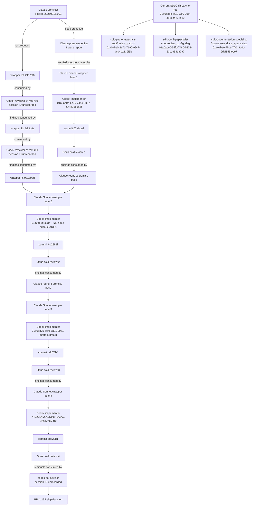

# codex SDLC team — session review of `dotfiles-20260916.001` (2026-09-16), verbatim

Brief: `mise run sdlc-team` review mode, run `session-review-20260916c`, spec `sdlc-review-session-2026-09-16c.md` (scratchpad; the prompt is at `.agent/sdlc-runs/session-review-20260916c/prompt.md`). Settlement: `completed`, rc=0, claimed == observed = {sdlc-python-specialist, sdlc-config-specialist, sdlc-documentation-specialist}, errors=[]. The AgentsView and graphify steps were BLOCKED by the read-only sandbox (expected: see the skill's caveat); the Claude AgentsView lane covered that pass separately. Output copied verbatim; the architect's dispositions follow.

---

# Session review: `dotfiles-20260916.001`

The handoff is not ready for `/clear`. It contains stale recovery instructions, an incomplete residual list, an incorrect DAG, and placeholders for this review and the AgentsView pass. The parser and workflow-policy gaps are also broader than the handoff currently states.

No repository gates were run, and neither the checkout nor external systems were modified. Memory was used only to orient provenance checks; findings below were reverified against current artifacts.

## Findings

| Severity | Claim | File:line or artifact | Evidence |
|---|---|---|---|
| HIGH | The handoff violates the decision that `task_plan.md` is the only next-task carrier. | [handoff:7](/Users/rmanaloto/dev/github/ray-manaloto/dotfiles/.agent/plans/session-2026-09-16c.md:7), [task_plan.md:968](/Users/rmanaloto/dev/github/ray-manaloto/dotfiles/task_plan.md:968), [goal-history.md:917](/Users/rmanaloto/dev/github/ray-manaloto/dotfiles/docs/agents/goal-history.md:917) | The handoff retains `NEXT TASK` and a separate fallback despite the explicit “only carrier” ruling. |
| HIGH | The handoff does not yet contain the promised SDLC findings or AgentsView worked example. | [task_plan.md:991](/Users/rmanaloto/dev/github/ray-manaloto/dotfiles/task_plan.md:991), [handoff:44](/Users/rmanaloto/dev/github/ray-manaloto/dotfiles/.agent/plans/session-2026-09-16c.md:44) | It contains placeholder nodes but no findings table or AgentsView session/ordinal citations. |
| HIGH | The seven-item follow-up inventory omits two residuals explicitly assigned to follow-up. | `cold-review-bdb78b4-2026-09-16.md:154-157`; [task_plan.md:1006](/Users/rmanaloto/dev/github/ray-manaloto/dotfiles/task_plan.md:1006); `advisor-ship-6c-p1-2026-09-16.md:25-35` | Missing: false candidates when the final argument segment is `hk`/`mise`, and raw `PermissionError`/`UnicodeDecodeError` from `hk.pkl` or action readers. Issue #1155 could not be checked. |
| HIGH | `token_usage_record` is parser-blocking, but it is only part of the failure. | [session_ledger.py:2536](/Users/rmanaloto/dev/github/ray-manaloto/dotfiles/python/src/dotfiles_setup/session_ledger.py:2536), `.agent/session-review.md.omissions.json:1` | Current evidence has 20,121 omissions, including 1,113 `token_usage_record` records and 14,554 unknown Claude attachment records. The handoff’s 19,056 count and single-record framing are stale and under-scoped. |
| HIGH | Workflow setup ordering false-passes when the setup step is conditional or allowed to fail. | [workflow_claude_code.py:603](/Users/rmanaloto/dev/github/ray-manaloto/dotfiles/python/src/dotfiles_setup/workflow_claude_code.py:603), [workflow_claude_code.py:786](/Users/rmanaloto/dev/github/ray-manaloto/dotfiles/python/src/dotfiles_setup/workflow_claude_code.py:786) | `_ordered_steps` discards `if:` and `continue-on-error`; public probes accepted both `if: ${{ false }}` and `continue-on-error: true` before a gated hk step. |
| HIGH | Exact Codex identities are not durably captured. | [.claude/agents/codex-sol-implementer.md:167](/Users/rmanaloto/dev/github/ray-manaloto/dotfiles/.claude/agents/codex-sol-implementer.md:167), `:272-284`; [sdlc-team-settlement.json:52](/Users/rmanaloto/dev/github/ray-manaloto/dotfiles/schemas/sdlc-team-settlement.json:52) | Four implementer IDs survive only in raw startup banners. The two Codex reviewers and advisor reports omit their IDs, while settlement stores the parent and specialist names but not child thread IDs. |
| MEDIUM | Segmented session-review writes leave obsolete sidecars behind. | [session_review.py:921](/Users/rmanaloto/dev/github/ray-manaloto/dotfiles/python/src/dotfiles_setup/session_review.py:921); `.agent/session-review.md.*.json` | Current disk state has 118 unreferenced segments across omissions, cutoffs, claims, and semantic dispositions. Glob-based review can mix generations. |
| MEDIUM | Setup-action identity is suffix-based and accepts unrelated nested actions. | [workflow_claude_code.py:66](/Users/rmanaloto/dev/github/ray-manaloto/dotfiles/python/src/dotfiles_setup/workflow_claude_code.py:66) | `./vendor/.github/actions/setup-claude-code` satisfies both installation predicates. |
| MEDIUM | Mise task aliases are ignored by route construction. | [workflow_claude_code.py:397](/Users/rmanaloto/dev/github/ray-manaloto/dotfiles/python/src/dotfiles_setup/workflow_claude_code.py:397), [mise.toml:480](/Users/rmanaloto/dev/github/ray-manaloto/dotfiles/mise.toml:480) | Entries retain `alias`, but only canonical task names are indexed. |
| MEDIUM | The handoff’s checkout recovery state is stale. | [handoff:92](/Users/rmanaloto/dev/github/ray-manaloto/dotfiles/.agent/plans/session-2026-09-16c.md:92) | It says `main`, clean, at `24e4a5d`; current read-only probes found branch `docs/session-2026-09-16c-handoff`, HEAD `ad3f9aa…`, ahead 1/behind 1. |
| MEDIUM | Licensed dissent: the prescribed range cannot prove “14 commits.” | Direct `git log --oneline 13ff702..24e4a5d`; `git rev-list --count` | The range contains two commits: `24e4a5d` and `f38871c`. The landed PR is represented by one squash commit. The review did not invent topic-branch history. |
| MEDIUM | `.agent/session-review.md` is incomplete and not self-describing about its failure. | `.agent/session-review.md:156-166`; [handoff:18](/Users/rmanaloto/dev/github/ray-manaloto/dotfiles/.agent/plans/session-2026-09-16c.md:18) | It labels all 480 promises `UNREVIEWED` but does not itself mention `token_usage_record` or the omission count. |
| MEDIUM | The existing handoff DAG reverses/collapses review dependencies. | [handoff:28](/Users/rmanaloto/dev/github/ray-manaloto/dotfiles/.agent/plans/session-2026-09-16c.md:28); `codex-review-49d7af6…:266-277`; `codex-review-fb93d8a…:99-108` | Actual sequence is `49d7af6 → reviewer → fb93d8a → reviewer → 9e1b9dd`, not one wrapper node feeding both reviews. |
| MEDIUM | Static agent-parity checks do not cover important wrapper behavior. | [codex_agent_parity.py:130](/Users/rmanaloto/dev/github/ray-manaloto/dotfiles/python/src/dotfiles_setup/codex_agent_parity.py:130), `:299-371` | Atomic claims, bounded waits, refusal classification, process settlement, and report completeness escaped the static gate and were found by later reviews. |
| MEDIUM | The advisor’s 72-hour follow-up commitment is absent from tracked next-session carriers. | `advisor-ship-6c-p1-2026-09-16.md:18-20`; direct no-match in handoff/task plan | It may exist in issue #1155, but GitHub was unreachable. |
| LOW | A new test is coupled to an internal helper call count. | [test_workflow_claude_code.py:878](/Users/rmanaloto/dev/github/ray-manaloto/dotfiles/tests/test_workflow_claude_code.py:878), [tests/AGENTS.md:53](/Users/rmanaloto/dev/github/ray-manaloto/dotfiles/tests/AGENTS.md:53) | A behavior-preserving refactor can fail the test despite unchanged public behavior. |
| LOW | PR #1154 and issue #1155 were not live-verified. | Direct `gh pr view` / `gh issue view` | Both returned `rc=1`, `error connecting to api.github.com`. |
| BLOCKED | The required AgentsView pass produced no archive evidence. | Six direct AgentsView probes | Every request returned `rc=1`, `dial tcp 127.0.0.1:8080: connect: operation not permitted`; therefore no valid session/ordinal citations exist. |
| BLOCKED | Mandatory Graphify orientation could not execute. | Direct `mise run graphify-query` | It returned `rc=1` because the read-only sandbox denied mise log/temp creation. |

## Codex/Claude dependency DAG

Unknown reviewer/advisor IDs are explicitly marked rather than inferred.

Historical identity evidence:

- Implementer 1: `.agent/kb/raw/codex-sol-implementer-log-6cp1-98735-1789576272.txt:10,107183,108270`.
- Implementer 2: `.agent/kb/raw/codex-sol-implementer-log-86330-1789579339.txt:10,84266,85505`.
- Implementer 3: `.agent/kb/raw/codex-sol-implementer-log-86361-1789582985.txt:10,22591,22990`.
- Implementer 4: `.agent/kb/raw/codex-sol-implementer-log-6c-p1-r4-34727-1789584683.txt:10,4737,4828`.
- Eight verifier passes and six cold reviews: [goal-history.md:935](/Users/rmanaloto/dev/github/ray-manaloto/dotfiles/docs/agents/goal-history.md:935), [goal-history.md:956](/Users/rmanaloto/dev/github/ray-manaloto/dotfiles/docs/agents/goal-history.md:956).
- Current-run IDs: direct `printenv CODEX_THREAD_ID` from the dispatcher and each spawned specialist, reconciled with collaboration spawn receipts.

## AgentsView pass

AgentsView v0.43.0 was invoked against the specified archive server and token-file path for:

- `dotfiles-20260916.001` in `tool_input,tool_result`
- `promised not delivered`
- `owed deferred residual`
- `contradiction exit code unread`
- `mise run ship`
- `token_usage_record`

All searches failed before returning hits with `rc=1`: `connect: operation not permitted`.

Consequences:

- No promise, contradiction, deferred-item, or unread-exit-code claim can be attributed to fresh AgentsView evidence.
- No `session:ordinal` citations are available.
- The handoff must mark the pass blocked; it must not label the placeholder as completed.
- A local SQLite fallback was not used because it would silently query a different corpus.

## Required fail arms

| Contract | Positive arm | Realistic fail arm |
|---|---|---|
| Record classification | Parse a real `token_usage_record` without omission. | Mutate it to an unknown future type and require incomplete coverage. |
| Segmented artifacts | Run session review twice; second run has fewer segments and exactly matches its manifest. | Retain one prior-run segment and require failure. |
| Conditional setup | Unconditional setup before hk passes. | `if: false` or `continue-on-error: true` before hk fails. |
| Action identity | Exact approved local/action reference passes. | Nested action with the same suffix fails. |
| Mise aliases | Alias of a gated task is detected. | Alias of an ungated task remains clean. |
| Session provenance | Valid startup banner and child IDs settle. | Missing/malformed child ID fails reconciliation. |
| Wrapper supervision | Public launcher handles normal completion. | Exercise delayed completion, refusal-with-rc0, empty output, timeout/reaping, and surviving-process cases. |

## Gaps for the next session

| Carrier | Required additions |
|---|---|
| Handoff | Remove `NEXT TASK` lines 7–16; replace stale checkout state; include this findings table and corrected DAG; mark AgentsView blocked; replace the single-record parser summary with the complete omission census. |
| `task_plan.md` | Add the two omitted round-three residuals; record segment cleanup; require child thread IDs in settlement; retain the parser failure until coverage is complete; carry the 72-hour commitment if still binding. |
| Issue #1155 | Verify the live body includes the two omitted residuals plus conditional setup semantics, exact action identity, mise aliases, the implementation-coupled test repair, structured session-ID capture, and public wrapper-supervision arms. |
| Memory | After curation, preserve the review disposition, AgentsView-blocked status, authoritative residual ownership, and the durable parser rule. Do not preserve volatile omission counts as timeless facts. |

No workflow or image specialist was routed because the reviewed PR range contained no `.github/workflows/` or `.devcontainer/` changes.

No others were spawned.

Specialists spawned:

- `sdlc-python-specialist` — `/root/review_python`
- `sdlc-config-specialist` — `/root/review_config_dag`
- `sdlc-documentation-specialist` — `/root/review_docs_agentsview`

---

## Architect dispositions (2026-09-16, at handoff)

| finding | disposition |
|---|---|
| HIGH handoff still carries a NEXT TASK section | handoff section reduced to a pointer at `task_plan.md` Phase 7; the "cheap first PR" fallback moved into Phase 7 |
| HIGH handoff lacks this review + the AgentsView example | both persisted under `docs/research/kb/reports/agents/` and summarised in the handoff |
| HIGH #1155 omits two round-3 residuals (path-segment false candidates; raw `PermissionError`/`UnicodeDecodeError` from hk.pkl/action readers) | added by comment on #1155 |
| HIGH `token_usage_record` is only part: 20,121 omissions incl. 1,113 `token_usage_record` + 14,554 unknown Claude attachment records | comment on #1157 with the census; Phase 7 text corrected |
| HIGH setup step with `if:` / `continue-on-error: true` false-passes the order check | added by comment on #1155 as a HIGH gate hole (new) |
| HIGH codex identities not durably captured | the four implementer ids are in goal-history 017; comment on #1155 asks the wrapper report to carry `session id:` and settlement to carry child thread ids |
| MED segmented session-review sidecars; review not self-describing | comment on #1157 |
| MED suffix-based setup-action identity; mise task `alias` ignored (`mise.toml:480`, 2 aliases) | comment on #1155 |
| MED handoff checkout state stale; "14 commits" unprovable from the squash range; DAG collapsed the wrapper→review sequence | handoff corrected (branch/HEAD; "14 branch commits squash-merged as `24e4a5d`"; DAG edges W1→CR1→W2→CR2→W3) |
| MED parity checks do not cover wrapper behaviour; advisor's 72-hour follow-up | comment on #1155 |
| LOW test coupled to a helper call count | comment on #1155 |
| LOW/BLOCKED GitHub, AgentsView, graphify unreachable from the read-only sandbox | expected; the Claude lanes covered AgentsView and live GitHub |
