# Final pre-`/clear` audit

## Verdict

**BLOCK `/clear`.** The prior audit’s main recommendation was partly incorporated, but the durable record remains unsafe for a fresh session:

- mutually exclusive decisions are still labeled final;
- several current-state claims are false;
- tracked reports contain conflicting, unlabeled recommendations;
- implementation-critical workflow and provenance defects remain missing;
- the agent DAG cannot be recovered reliably from generated receipts.

No repository gates, tests, container operations, edits, or report writes were performed. The required Graphify query returned direct `rc=1` because the read-only sandbox prevented mise from creating its temp directory; targeted inspection followed as authorized by the spec.

`★ Insight ─────────────────────────────────────`
- A chronological decision log becomes dangerous when superseded decisions remain labeled “ratified” or “do not re-litigate.”
- The current lane receipts are participation inventories, not authoritative DAGs: identity, parentage, and failed-run descendants are not reliably observable.
`─────────────────────────────────────────────────`

## Critical contradictions

1. **Repository state is stale in both the spec and handoff.**

   The handoff claims HEAD `4f176e1` and three session commits at [session-2026-09-15.md:3](/Users/rmanaloto/dev/github/ray-manaloto/dotfiles/.agent/plans/session-2026-09-15.md:3). Direct probes returned:

   ```text
   git rev-parse HEAD
   97dcb1bbb88314b0e7c74dc8bfe6386ae1cf6b7c

   git rev-parse --short @{u}
   4f176e1

   git rev-list --left-right --count @{u}...HEAD
   0 1
   ```

   Local commit `97dcb1b` tracks the nine session reports, but is one commit ahead of cached upstream. The worktree was clean. Because [findings.md:607](/Users/rmanaloto/dev/github/ray-manaloto/dotfiles/findings.md:607) says the shipped branch is closed to pushes, the next session needs an explicit branch/cherry-pick preservation action. Current PR state is **UNVERIFIABLE**: `gh pr view 1128` returned `rc=1` because GitHub was unreachable.

2. **Q18 has two mutually exclusive “final” answers.**

   [task_plan.md:457](/Users/rmanaloto/dev/github/ray-manaloto/dotfiles/task_plan.md:457) says Q18 is ratified: bake Claude into the image and retain bare-image smoke.

   The later architecture says Claude belongs in the mounted user home, is provisioned during `onCreateCommand`, and must be removed from bare-image smoke: [devcontainer-architecture-review.md:5](/Users/rmanaloto/dev/github/ray-manaloto/dotfiles/docs/research/kb/reports/agents/devcontainer-architecture-review.md:5), [session-2026-09-15.md:222](/Users/rmanaloto/dev/github/ray-manaloto/dotfiles/.agent/plans/session-2026-09-15.md:222).

   The latter is technically coherent because the whole UID-1000 home is mounted over image content, while bare CI smoke runs without lifecycle or mounts. But the durable record never explicitly says the operator overturned Q18. **Authority is therefore unsettled.**

   Required wording if the later design is ratified:

   > Q18 is OVERTURNED. Claude is user-home lifecycle state, provisioned non-root during `onCreateCommand`. It is neither baked into nor required by the published bare image.

3. **Exact installation and `latest` installation are both labeled final.**

   The surviving ruling is “install `latest` only when the canonical native launcher is absent” at [findings.md:774](/Users/rmanaloto/dev/github/ray-manaloto/dotfiles/findings.md:774) and [session-2026-09-15.md:51](/Users/rmanaloto/dev/github/ray-manaloto/dotfiles/.agent/plans/session-2026-09-15.md:51).

   Yet the “do not re-litigate” table still says one exact pin across environments at [session-2026-09-15.md:155](/Users/rmanaloto/dev/github/ray-manaloto/dotfiles/.agent/plans/session-2026-09-15.md:155), and exact-pin rulings remain in [task_plan.md:310](/Users/rmanaloto/dev/github/ray-manaloto/dotfiles/task_plan.md:310) and [task_plan.md:403](/Users/rmanaloto/dev/github/ray-manaloto/dotfiles/task_plan.md:403).

   Even [schemas/sources.toml:78](/Users/rmanaloto/dev/github/ray-manaloto/dotfiles/schemas/sources.toml:78) still calls the reviewed-release value “the pin.”

   Required wording:

   > Q2/Q10/Q15 exact-version installation is superseded. Runtime installation uses upstream `latest` only when the canonical launcher is absent. The repository records the reviewed vendored-artifact release, not the installed runtime version.

4. **The handoff falsely says the reviewed marker is already 2.1.273.**

   [session-2026-09-15.md:58](/Users/rmanaloto/dev/github/ray-manaloto/dotfiles/.agent/plans/session-2026-09-15.md:58) says it “is now 2.1.273.” The actual version and source remain `2.1.272`/`v2.1.272` at [schemas/sources.toml:49](/Users/rmanaloto/dev/github/ray-manaloto/dotfiles/schemas/sources.toml:49). The same handoff later admits the bump is blocked at [session-2026-09-15.md:253](/Users/rmanaloto/dev/github/ray-manaloto/dotfiles/.agent/plans/session-2026-09-15.md:253).

   Required wording:

   > Target reviewed-release marker: 2.1.273. Checked-in marker/source: 2.1.272. The current public refresh interface cannot advance it.

5. **Q12 is simultaneously final and reopened.**

   The handoff’s ruling table says Codex moves from `shared.toml` to the runtime tier at [session-2026-09-15.md:162](/Users/rmanaloto/dev/github/ray-manaloto/dotfiles/.agent/plans/session-2026-09-15.md:162), while [session-2026-09-15.md:319](/Users/rmanaloto/dev/github/ray-manaloto/dotfiles/.agent/plans/session-2026-09-15.md:319) says the host-parity premise failed and the decision must be revisited. Current configuration is unchanged at [.config/mise/conf.d/shared.toml:39](/Users/rmanaloto/dev/github/ray-manaloto/dotfiles/.config/mise/conf.d/shared.toml:39).

   Required wording:

   > Q12 is reopened. Separate image placement from host/image parity, and do not move Codex until the desired parity boundary and host ownership are decided.

## Current claim audit

| Claim | Verdict | Evidence |
|---|---|---|
| `validate_plugin()` is the immediate code blocker | **CONFIRMED code path; current CI state unverified** | It invokes an unversioned Claude backend through mise at [fnhook_gates.py:233](/Users/rmanaloto/dev/github/ray-manaloto/dotfiles/python/src/dotfiles_setup/fnhook_gates.py:233). |
| `tool_spec()` reads Claude’s version from `sources.toml` | **REFUTED** | Its docstring says so, but the Claude branch returns the bare backend without reading the manifest at [fnhook_gates.py:56](/Users/rmanaloto/dev/github/ray-manaloto/dotfiles/python/src/dotfiles_setup/fnhook_gates.py:56). |
| There are “three Claude call sites” | **REFUTED literally** | Only `validate_plugin()` and `_generate_types()` construct CLI commands; `_check_types_current()` is now file/hash logic. |
| `_generate_types()` is dead | **CONFIRMED with control** | Only its definition remains at [fnhook_gates.py:407](/Users/rmanaloto/dev/github/ray-manaloto/dotfiles/python/src/dotfiles_setup/fnhook_gates.py:407); equivalent searches found live callers for the other functions. |
| `_check_types_current()` is fully fail-closed | **REFUTED** | Missing `schemas/sources.toml` skips provenance and still succeeds at [fnhook_gates.py:530](/Users/rmanaloto/dev/github/ray-manaloto/dotfiles/python/src/dotfiles_setup/fnhook_gates.py:530). A positive test currently blesses this at [test_fnhook_gates.py:457](/Users/rmanaloto/dev/github/ray-manaloto/dotfiles/tests/test_fnhook_gates.py:457). |
| The public refresh command can advance Claude | **REFUTED** | Claude has no resolver, `refresh()` reuses `entry.version`, and `refresh_main()` discards argv at [schema_vendor.py:404](/Users/rmanaloto/dev/github/ray-manaloto/dotfiles/python/src/dotfiles_setup/schema_vendor.py:404) and [schema_vendor.py:469](/Users/rmanaloto/dev/github/ray-manaloto/dotfiles/python/src/dotfiles_setup/schema_vendor.py:469). |
| Refresh preserves the authored rationale | **REFUTED** | The renderer emits only generic fields at [schema_vendor.py:264](/Users/rmanaloto/dev/github/ray-manaloto/dotfiles/python/src/dotfiles_setup/schema_vendor.py:264). |
| Drift checking binds version to source URL | **REFUTED** | [schema_vendor.py:173](/Users/rmanaloto/dev/github/ray-manaloto/dotfiles/python/src/dotfiles_setup/schema_vendor.py:173) checks resolved version/hash but not recorded URL/version consistency. |
| Both Claude declarations are vendored | **REFUTED** | Only `claude-code.d.ts` has a manifest row; `claude-code-mcp.d.ts` still identifies itself as `/plugin-types` output at [.claude/types/claude-code-mcp.d.ts:1](/Users/rmanaloto/dev/github/ray-manaloto/dotfiles/.claude/types/claude-code-mcp.d.ts:1). The README claim at [.claude/types/README.md:3](/Users/rmanaloto/dev/github/ray-manaloto/dotfiles/.claude/types/README.md:3) is false. |
| Run `25b17aca…` remains unsettled | **REFUTED** | Its settlement is completed `rc=0` at [settlement.json:1](/Users/rmanaloto/dev/github/ray-manaloto/dotfiles/.agent/sdlc-runs/25b17acadc744d90a6e911bdabe4271b/settlement.json:1). |
| Four false-success notifications occurred | **UNVERIFIABLE count** | Durable findings identify only three at [findings.md:561](/Users/rmanaloto/dev/github/ray-manaloto/dotfiles/findings.md:561). |
| Thirteen tools are still behind | **UNVERIFIABLE current snapshot** | The handoff gives neither a current command nor observation timestamp at [session-2026-09-15.md:190](/Users/rmanaloto/dev/github/ray-manaloto/dotfiles/.agent/plans/session-2026-09-15.md:190). |

## Workflow and lifecycle omissions

1. **Refresh PRs omit two declared outputs.**

   The manifest declares five outputs at [schemas/sources.toml:16](/Users/rmanaloto/dev/github/ray-manaloto/dotfiles/schemas/sources.toml:16), but [refresh.yml:540](/Users/rmanaloto/dev/github/ray-manaloto/dotfiles/.github/workflows/refresh.yml:540) stages only three JSON files and `sources.toml`. Both `schemas/codex-config.json` and `.claude/types/claude-code.d.ts` can be rewritten but omitted from the PR.

   The handoff cites stale line 512 and mentions only the `.d.ts` omission.

2. **The proposed lifecycle architecture has no publication gate.**

   Current `manifest` depends on existing image jobs, not lifecycle smoke, at [build-publish.yml:1190](/Users/rmanaloto/dev/github/ray-manaloto/dotfiles/.github/workflows/build-publish.yml:1190). The handoff’s “split validation” phrase omits the required contract: lifecycle smoke must run with the exact per-leg image and fresh home volume, including cache-hit paths, before publication.

3. **Change routing omits lifecycle-critical files.**

   [ci.yml:284](/Users/rmanaloto/dev/github/ray-manaloto/dotfiles/.github/workflows/ci.yml:284) includes `.devcontainer/**`, Python, and `ci.yml`, but omits `build-publish.yml`, relevant local actions, `home/**`, and `scripts/devcontainer-smoke.sh`. Positive controls confirmed the existing included paths, so this is selective routing loss.

4. **A PR can change smoke logic without executing it.**

   `python/**` is routed, but the dev hash inputs at [p2996_hash.py:480](/Users/rmanaloto/dev/github/ray-manaloto/dotfiles/python/src/dotfiles_setup/p2996_hash.py:480) omit `image.py` and lifecycle inputs. Cache-hit handling can then skip pull, architecture checks, and smoke at [build-publish.yml:885](/Users/rmanaloto/dev/github/ray-manaloto/dotfiles/.github/workflows/build-publish.yml:885).

5. **Persisted-home migration is unspecified.**

   The home volume covers the whole user home at [devcontainer.json:119](/Users/rmanaloto/dev/github/ray-manaloto/dotfiles/.devcontainer/devcontainer.json:119), and current onCreate applies chezmoi before ownership repair at [on-create.sh:40](/Users/rmanaloto/dev/github/ray-manaloto/dotfiles/.devcontainer/scripts/on-create.sh:40). Removing the wrapper requires a byte-exact migration arm that deletes only the retired wrapper and preserves custom launchers.

6. **Two arm64 artifacts can collide.**

   The matrix contains two arm64 rows, while both build-hash and bootstrap-gap artifact names use only `matrix.target.arch` at [build-publish.yml:792](/Users/rmanaloto/dev/github/ray-manaloto/dotfiles/.github/workflows/build-publish.yml:792) and [build-publish.yml:1023](/Users/rmanaloto/dev/github/ray-manaloto/dotfiles/.github/workflows/build-publish.yml:1023). Both need the unique `tag_suffix`.

## Planning-document defects and vagueness

- [task_plan.md:11](/Users/rmanaloto/dev/github/ray-manaloto/dotfiles/task_plan.md:11) summarizes Phase 1 checks differently from the detailed status at [task_plan.md:16](/Users/rmanaloto/dev/github/ray-manaloto/dotfiles/task_plan.md:16).
- Phase 4 is labeled “NOT STARTED” at [task_plan.md:178](/Users/rmanaloto/dev/github/ray-manaloto/dotfiles/task_plan.md:178), despite completed 4a research at [task_plan.md:278](/Users/rmanaloto/dev/github/ray-manaloto/dotfiles/task_plan.md:278).
- “Two catch-22s” introduces three numbered defects at [session-2026-09-15.md:70](/Users/rmanaloto/dev/github/ray-manaloto/dotfiles/.agent/plans/session-2026-09-15.md:70).
- “FIVE codex SDLC reviews” lists six reports at [session-2026-09-15.md:215](/Users/rmanaloto/dev/github/ray-manaloto/dotfiles/.agent/plans/session-2026-09-15.md:215); the local report commit contains nine.
- `task_plan.md` still describes `64a2b1f8…` as live at [task_plan.md:468](/Users/rmanaloto/dev/github/ray-manaloto/dotfiles/task_plan.md:468), despite its completed settlement.
- `findings.md` introduces “The actual DAG” at [findings.md:823](/Users/rmanaloto/dev/github/ray-manaloto/dotfiles/findings.md:823) but never contains the graph.
- The handoff, `task_plan.md`, and `findings.md` remain ignored. `git ls-files --error-unmatch` returned `rc=1` and `git check-ignore` returned `rc=0` for all three; the tracked reports are durable only in local commit `97dcb1b`.

The tracked reports also need a precedence map. In particular, `codesearch-analysis.md` and `mise-lifecycle-research.md` retain exact-install recommendations, while `claude-2.1.273-review.md` contradicts the later mounted-home architecture. They should be labeled “historical evidence; implementation recommendation superseded.”

## Required missing items before `/clear`

1. Record local HEAD `97dcb1b`, cached upstream `4f176e1`, and the branch/cherry-pick recovery action.
2. Explicitly settle Q18; do not infer operator ratification from a review report.
3. Mark Q2/Q10 exact installation as superseded and Q12 as reopened.
4. Add a report-precedence map.
5. Correct the marker state to “target 2.1.273; repository still 2.1.272.”
6. Define ownership/provenance for `claude-code-mcp.d.ts`.
7. Add target-version input, source/URL consistency, rationale preservation, and missing-manifest fail-closed contracts.
8. Derive refresh staging from every `[[schema]].file`.
9. Specify cache-independent lifecycle smoke, change routing, persisted-home migration, readiness waiting, and separate bare/lifecycle contracts.
10. Complete Q14’s required explanation that `mise latest` is a query-only oracle.
11. Record runs `2dab7794…`, `54914e99…`, `7ff5aaf3…`, and the otherwise omitted `smoke-real` control.

## Codex and Claude agent DAG

Solid child edges are reconstructed from dispatcher self-reports. Dotted coordinator edges are logical dispatch relationships, not observed parent-session telemetry.

```mermaid
flowchart TD
    S["2026-09-15 Claude coordinator<br/>logical parent; session id unavailable"]

    S -. "non-Codex, outside receipts" .-> KB["kb-cold"]
    S -. "non-Codex, outside receipts" .-> CL["claude-install-lane"]
    S -. "non-Codex, outside receipts" .-> VT["vendor-types-lane"]
    S -. "non-Codex, outside receipts" .-> MT["mise-topology-advisor"]

    S -.-> SM["smoke-real<br/>completed rc=0"]
    SM --> SMC["config_smoke_review"]

    S -.-> R25["25b17aca… mise lifecycle<br/>completed rc=0"]
    R25 --> C25["config /root/mise_config_review"]
    R25 --> W25["workflows /root/mise_workflow_review"]
    R25 --> I25["image /root/mise_image_review"]

    S -.-> R64["64a2b1f8… code search<br/>completed rc=0"]
    R64 --> C64["config /root/config_review"]
    R64 --> D64["docs /root/docs_review"]
    R64 --> P64["python /root/python_review"]
    C64 --> W64["workflows /root/config_review/gha_postinstall_review"]
    C64 --> I64["image /root/config_review/devcontainer_claude_review"]

    S -.-> F999["999e1250… failed rc=1: capacity"]
    F999 -.-> U999["descendants unverified<br/>no output"]
    S -.-> F7["7f7ae971… failed rc=1: capacity"]
    F7 -.-> U7["descendants unverified<br/>no output"]

    S -.-> RF["f77e1da4… session audit<br/>completed rc=0"]
    RF --> RFC["config session_config_audit"]
    RF --> RFD["docs session_docs_audit"]
    RF --> RFP["python session_python_audit"]
    RF --> RFI["image session_image_audit"]
    RF --> RFW["workflows session_workflow_audit"]

    S -.-> R0["0f8b6973… devcontainer architecture<br/>completed rc=0"]
    R0 --> R0C["config"]
    R0 --> R0D["documentation"]
    R0 --> R0P["python"]
    R0 --> R0I["image"]
    R0 --> R0W["workflows"]

    S -.-> R2["2dab7794… Claude 2.1.273 review<br/>completed rc=0"]
    R2 --> R2C["config"]
    R2 --> R2D["documentation"]
    R2 --> R2P["python"]
    R2 --> R2I["image"]
    R2 --> R2W["workflows"]

    S -.-> R5["54914e99… drift disposition<br/>completed rc=0"]
    R5 --> R5C["config /root/config_drift_review"]
    R5 --> R5D["docs /root/docs_drift_review"]
    R5 --> R5P["python /root/python_drift_review"]
    R5 --> R5I["image /root/image_drift_review"]

    S -.-> CUR["7ff5aaf3… final audit<br/>active until this response settles"]
    CUR --> CURC["config final_audit_config"]
    CUR --> CURD["documentation final_audit_docs"]
    CUR --> CURP["python final_audit_python"]
    CUR --> CURI["image final_audit_image"]
    CUR --> CURW["workflows final_audit_workflows"]
```



Known DAG limitations:

- `SdlcTeamRequest` has no `parent_session_id`, and the current `sdlc-team` supervisor hard-codes observed collection unavailable at [sdlc_team.py:59](/Users/rmanaloto/dev/github/ray-manaloto/dotfiles/python/src/dotfiles_setup/sdlc_team.py:59) and [sdlc_team.py:463](/Users/rmanaloto/dev/github/ray-manaloto/dotfiles/python/src/dotfiles_setup/sdlc_team.py:463).
- No hook JSONL producer is wired at [lane_result.py:367](/Users/rmanaloto/dev/github/ray-manaloto/dotfiles/python/src/dotfiles_setup/lane_result.py:367).
- `_AGENT_LINE` rejects Codex’s real ``name as /root/path`` format at [lane_result.py:87](/Users/rmanaloto/dev/github/ray-manaloto/dotfiles/python/src/dotfiles_setup/lane_result.py:87). Merely accepting `as` is insufficient because `/root/path` is an instance identity, not a role, and merge logic currently collapses nodes by specialist name.
- Run `64a2…` had nested workflow/image children under config, but its receipt flattened every parent to the dispatcher.
- Empty receipts for the two capacity failures prove source unavailability, not that no agents spawned.
- The roster’s “spawn all applicable specialists in parallel” requirement is impossible when five domains apply but only three child slots are available. It should require filling available slots and dispatching remaining applicable specialists as slots free.

## Specialists spawned:

- `sdlc-documentation-specialist` — durable documents and rules; `mise run lint-docs` **not run by review contract**.
- `sdlc-python-specialist` — Python modules and tests; pytest **not run by review contract**.
- `sdlc-config-specialist` — TOML/schema/agent configuration; `mise run lint` **not run by review contract**.
- `sdlc-image-specialist` — devcontainer and image architecture; `mise run verify-container-latest` **not run by review contract**.
- `sdlc-workflows-specialist` — GitHub Actions routing and publication; `mise run pin-actions` **not run by review contract**.
- No other specialists were spawned.

Each initial full-history spawn failed once with `no thread with id`; every lane succeeded on its single permitted history-free retry.

