# Session review verdict

**Do not `/clear` yet.** Licensed dissent applies: the handoff is unsafe because its central implementation instructions were superseded later in the same session. It also omits completed research, newly discovered code and workflow bugs, and two unresolved image-design blockers.

No repository gates, tests, builds, writes, staging, or commits were performed. Graphify query and health were attempted first; both returned rc=1 because the read-only sandbox prevented mise from creating its temporary directory. Targeted source inspection followed under the repository’s documented fallback.

`★ Insight ─────────────────────────────────────`
A handoff must describe the final ruling, not preserve every intermediate decision as equally actionable. Here, the plan contains the newer truth, while the document labeled “START HERE” sends the next session toward the abandoned design.
`─────────────────────────────────────────────────`

## Highest-impact findings

1. **The handoff carries a superseded implementation.** It says to invoke bare `claude` from PATH, install an exact version from `schemas/sources.toml`, and use a mise lifecycle event ([handoff:43](/Users/rmanaloto/dev/github/ray-manaloto/dotfiles/.agent/plans/session-2026-09-15.md:43)). Later rulings require:

   - Invoke the absolute native launcher because the mise shim wins PATH ([task_plan.md:441](/Users/rmanaloto/dev/github/ray-manaloto/dotfiles/task_plan.md:441)).
   - Install `latest` only when the native launcher is absent.
   - Treat `schemas/sources.toml` as the last release whose notes and declarations were reviewed, rather than an installation pin ([task_plan.md:450](/Users/rmanaloto/dev/github/ray-manaloto/dotfiles/task_plan.md:450)).
   - Use an explicit fail-closed task for host/CI; top-level mise hooks warn and continue on failure ([task_plan.md:425](/Users/rmanaloto/dev/github/ray-manaloto/dotfiles/task_plan.md:425)).
   - Bake Claude into the image in the follow-up PR ([task_plan.md:457](/Users/rmanaloto/dev/github/ray-manaloto/dotfiles/task_plan.md:457)).

2. **The vendored Claude marker cannot advance through its documented command.** The manifest says never hand-edit the version and promises that `schema-vendor-refresh` will update it ([sources.toml:1](/Users/rmanaloto/dev/github/ray-manaloto/dotfiles/schemas/sources.toml:1), [sources.toml:74](/Users/rmanaloto/dev/github/ray-manaloto/dotfiles/schemas/sources.toml:74)). In reality, Claude’s missing resolver is replaced with `entry.version`, and the CLI discards all arguments ([schema_vendor.py:405](/Users/rmanaloto/dev/github/ray-manaloto/dotfiles/python/src/dotfiles_setup/schema_vendor.py:405), [schema_vendor.py:469](/Users/rmanaloto/dev/github/ray-manaloto/dotfiles/python/src/dotfiles_setup/schema_vendor.py:469)). The current command can refetch 2.1.272 but cannot select 2.1.273.

3. **Schema refresh can silently omit the Claude declaration from its PR.** The producer can rewrite `.claude/types/claude-code.d.ts` ([schema_vendor.py:401](/Users/rmanaloto/dev/github/ray-manaloto/dotfiles/python/src/dotfiles_setup/schema_vendor.py:401)), but the workflow stages only three JSON files and `schemas/sources.toml` ([refresh.yml:512](/Users/rmanaloto/dev/github/ray-manaloto/dotfiles/.github/workflows/refresh.yml:512)). Declaration-only drift produces no complete PR; mixed drift omits the declaration.

4. **Refreshing any row destroys the detailed Claude rationale.** `_render_sources_toml()` emits only a generic header and scalar fields ([schema_vendor.py:264](/Users/rmanaloto/dev/github/ray-manaloto/dotfiles/python/src/dotfiles_setup/schema_vendor.py:264)), so a refresh deletes the authored explanation at [sources.toml:55](/Users/rmanaloto/dev/github/ray-manaloto/dotfiles/schemas/sources.toml:55).

5. **The proposed image design has two unresolved blockers.**

   - Installing natively during the existing Dockerfile flow would run as root, while the eventual devcontainer uses a UID-1000 home mounted as a persistent volume. Root’s successful CI smoke can coexist with the actual developer user having no Claude. The user and home transition occurs at [Dockerfile.host-user:33](/Users/rmanaloto/dev/github/ray-manaloto/dotfiles/.devcontainer/Dockerfile.host-user:33), and the home mount is defined at [devcontainer.json:119](/Users/rmanaloto/dev/github/ray-manaloto/dotfiles/.devcontainer/devcontainer.json:119).
   - Resolving remote `latest` during build is absent from `dev-hash`. A constant Dockerfile and lock input can therefore map to different Claude bytes, or a cache hit can retain an old version indefinitely. The content-hash contract is at [p2996_hash.py:132](/Users/rmanaloto/dev/github/ray-manaloto/dotfiles/python/src/dotfiles_setup/p2996_hash.py:132), and CI skips build and smoke on a matching hash at [build-publish.yml:416](/Users/rmanaloto/dev/github/ray-manaloto/dotfiles/.github/workflows/build-publish.yml:416).

6. **Python cleanup is materially incomplete.** Besides `_generate_types` and `CLAUDE_TOOL`, the obsolete generation surface includes `_FUNCTION_HOOKS_FLAG`, restoration/comparison helpers, public no-op refresh commands, tests that preserve those commands, and stale documentation. More seriously, `_check_types_current()` skips provenance checking when `schemas/sources.toml` is absent despite its fail-closed documentation ([fnhook_gates.py:498](/Users/rmanaloto/dev/github/ray-manaloto/dotfiles/python/src/dotfiles_setup/fnhook_gates.py:498), [fnhook_gates.py:530](/Users/rmanaloto/dev/github/ray-manaloto/dotfiles/python/src/dotfiles_setup/fnhook_gates.py:530)).

## Handoff claim audit

| Claim | Verdict | Evidence |
|---|---|---|
| Branch, HEAD, and three listed commits | **CONFIRMED** | Direct `git branch --show-current`, `git rev-parse`, and `git log`; matches [handoff:3](/Users/rmanaloto/dev/github/ray-manaloto/dotfiles/.agent/plans/session-2026-09-15.md:3). |
| PR #1128 is open, red, auto-merge armed | **UNVERIFIABLE current state** | `gh pr view` returned rc=1 because GitHub was unreachable. Historical state is recorded at [findings.md:566](/Users/rmanaloto/dev/github/ray-manaloto/dotfiles/findings.md:566). |
| KB PR #785 merged as `e8fe42ae`, four commits, three reviews | **PARTIAL** | The sibling repo contains `e8fe42ae fix/tracked files fail loud (#785)`. Merge/review counts were not independently available. |
| Session began with `ship` failing at `sync-full` | **CONFIRMED as recorded** | [findings.md:461](/Users/rmanaloto/dev/github/ray-manaloto/dotfiles/findings.md:461). |
| `validate_plugin()` is the immediate Claude blocker | **CONFIRMED** | It constructs the strict validator through `mise exec` at [fnhook_gates.py:233](/Users/rmanaloto/dev/github/ray-manaloto/dotfiles/python/src/dotfiles_setup/fnhook_gates.py:233). |
| “Three Claude call sites” | **REFUTED literally** | There are two command constructors, `validate_plugin()` and `_generate_types()`. `_check_types_current()` was a third affected logical node before the migration. |
| `_check_types_current()` no longer invokes Claude | **CONFIRMED, overstated** | It reads files and hashes at [fnhook_gates.py:498](/Users/rmanaloto/dev/github/ray-manaloto/dotfiles/python/src/dotfiles_setup/fnhook_gates.py:498), but only the main declaration has a vendored source/hash row. |
| `_generate_types()` is dead | **CONFIRMED with control arm** | Only its definition remains at [fnhook_gates.py:407](/Users/rmanaloto/dev/github/ray-manaloto/dotfiles/python/src/dotfiles_setup/fnhook_gates.py:407); the same search shape found live callers for `validate_plugin` and `_check_types_current`. |
| `validate_plugin()` remains live | **CONFIRMED** | Called for every discovered plugin at [fnhook_gates.py:567](/Users/rmanaloto/dev/github/ray-manaloto/dotfiles/python/src/dotfiles_setup/fnhook_gates.py:567). |
| Removing `CLAUDE_CODE_VERSION` left an unversioned mise request | **CONFIRMED** | Claude’s `tool_spec()` branch returns the bare backend at [fnhook_gates.py:56](/Users/rmanaloto/dev/github/ray-manaloto/dotfiles/python/src/dotfiles_setup/fnhook_gates.py:56); its consumer still wraps it in `mise exec`. |
| That request resolves exactly to `@latest` | **CONFIRMED as recorded, not rerun** | Historical observation at [findings.md:648](/Users/rmanaloto/dev/github/ray-manaloto/dotfiles/findings.md:648). |
| `tool_spec()` reads Claude’s version from `sources.toml` | **REFUTED** | The Claude branch returns before reading the file or version. |
| `tool_spec()` enforces exact versions for other tools | **REFUTED** | It accepts any string, including `latest`, at [fnhook_gates.py:73](/Users/rmanaloto/dev/github/ray-manaloto/dotfiles/python/src/dotfiles_setup/fnhook_gates.py:73). |
| `CLAUDE_CODE_VERSION` is gone | **CONFIRMED for active config/code** | Controlled search returned rc=1 while the same search found `DOTFILES_PLATFORM`. Historical references remain in reports. |
| Invoke `claude` from PATH | **REFUTED** | Later measurement requires the absolute native launcher ([findings.md:737](/Users/rmanaloto/dev/github/ray-manaloto/dotfiles/findings.md:737)). |
| Install the exact `sources.toml` version | **REFUTED** | Superseded by install-`latest` ruling ([findings.md:774](/Users/rmanaloto/dev/github/ray-manaloto/dotfiles/findings.md:774)). |
| Delete `_generate_types` and `CLAUDE_TOOL` | **CONFIRMED as pending cleanup** | Both remain at [fnhook_gates.py:52](/Users/rmanaloto/dev/github/ray-manaloto/dotfiles/python/src/dotfiles_setup/fnhook_gates.py:52) and [fnhook_gates.py:407](/Users/rmanaloto/dev/github/ray-manaloto/dotfiles/python/src/dotfiles_setup/fnhook_gates.py:407). |
| Host/CI first; image in a follow-up PR | **CONFIRMED as the surviving sequence** | [handoff:54](/Users/rmanaloto/dev/github/ray-manaloto/dotfiles/.agent/plans/session-2026-09-15.md:54); no later ruling reverses the sequencing. |
| Preserved 740-line patch exists | **CONFIRMED, but stale** | `dead-claude-install/staged.patch` is 740 lines and still assumes the removed env pin. |
| Install only when absent | **CONFIRMED** | The settled code-search review defines presence by the canonical native path at [run 64 output:47](/Users/rmanaloto/dev/github/ray-manaloto/dotfiles/.agent/sdlc-runs/64a2b1f8379840b2af5eabee6b6bb3ee/output.md:47). |
| Native installer owns PATH | **REFUTED** | The mise shim is first ([task_plan.md:441](/Users/rmanaloto/dev/github/ray-manaloto/dotfiles/task_plan.md:441)). |
| Run `25b17…` remains unsettled | **REFUTED** | Completed rc=0 in [settlement.json:1](/Users/rmanaloto/dev/github/ray-manaloto/dotfiles/.agent/sdlc-runs/25b17acadc744d90a6e911bdabe4271b/settlement.json:1). |
| No once-only mise lifecycle exists | **CONFIRMED by captured research** | [run 25 output:28](/Users/rmanaloto/dev/github/ray-manaloto/dotfiles/.agent/sdlc-runs/25b17acadc744d90a6e911bdabe4271b/output.md:28). |
| Root `postinstall` fires once per invocation, including no-op installs | **CONFIRMED by captured research** | [run 25 output:32](/Users/rmanaloto/dev/github/ray-manaloto/dotfiles/.agent/sdlc-runs/25b17acadc744d90a6e911bdabe4271b/output.md:32). |
| Required provisioning can use that hook | **REFUTED** | Hook failures warn and continue ([run 25 output:3](/Users/rmanaloto/dev/github/ray-manaloto/dotfiles/.agent/sdlc-runs/25b17acadc744d90a6e911bdabe4271b/output.md:3)). |
| Lint setup invokes mise install twice | **CONFIRMED** | CI calls the composite once, and the composite invokes `jdx/mise-action` twice ([setup-mise action:24](/Users/rmanaloto/dev/github/ray-manaloto/dotfiles/.github/actions/setup-mise/action.yml:24)). |
| Cache restoration prevents the second install/hook | **REFUTED** | The current comment at [ci.yml:136](/Users/rmanaloto/dev/github/ray-manaloto/dotfiles/.github/workflows/ci.yml:136) is stale. |
| Topology advisor is a current report | **REFUTED** | Its retained sections still reference the deleted env variable and exact image pin ([advisor:37](/Users/rmanaloto/dev/github/ray-manaloto/dotfiles/docs/research/kb/reports/agents/mise-topology-advisor.md:37)). |
| `mise latest claude` is maintained upstream | **PARTIAL** | Cached source supports the registry change; the claimed regression-test details were not fully re-derived. |
| Mise has no externally managed tool declaration | **CONFIRMED within the searched source corpus** | Controlled search and alternatives are recorded at [run 25 output:75](/Users/rmanaloto/dev/github/ray-manaloto/dotfiles/.agent/sdlc-runs/25b17acadc744d90a6e911bdabe4271b/output.md:75). “Nobody proposes it upstream” remains unverified beyond that corpus. |
| Q11, Q12, Q13, and Q6 remain rulings | **CONFIRMED, mostly unimplemented** | [task_plan.md:201](/Users/rmanaloto/dev/github/ray-manaloto/dotfiles/task_plan.md:201) and [task_plan.md:335](/Users/rmanaloto/dev/github/ray-manaloto/dotfiles/task_plan.md:335). |
| Q14’s documentation condition is fulfilled | **REFUTED** | `claude_doctor.py` and AGENTS.md do not explain the special query-only use of mise. |
| Q15 exact image install remains current | **REFUTED** | Superseded by install `latest` plus Q18 image-build ruling. |
| Devcontainer’s `claude-code = "latest"` must leave | **CONFIRMED, not implemented** | Declaration remains at [mise-runtime.toml:58](/Users/rmanaloto/dev/github/ray-manaloto/dotfiles/.devcontainer/mise-runtime.toml:58); lock remains 2.1.270 at [mise-runtime.lock:583](/Users/rmanaloto/dev/github/ray-manaloto/dotfiles/.devcontainer/mise-runtime.lock:583). |
| Runtime backend is `http:claude` | **REFUTED** | The committed lock resolves `aqua:anthropics/claude-code`. |
| Host was not a valid CI control | **CONFIRMED as recorded** | [findings.md:593](/Users/rmanaloto/dev/github/ray-manaloto/dotfiles/findings.md:593) and [findings.md:634](/Users/rmanaloto/dev/github/ray-manaloto/dotfiles/findings.md:634). |
| `gh search issues` silently returned zero | **UNVERIFIABLE live** | Recorded with its control at [findings.md:684](/Users/rmanaloto/dev/github/ray-manaloto/dotfiles/findings.md:684); GitHub was unavailable now. |
| Harness notification lied four times | **UNVERIFIABLE count** | Durable findings identify only three at [findings.md:561](/Users/rmanaloto/dev/github/ray-manaloto/dotfiles/findings.md:561). The fourth is unnamed. |
| Every Codex lane idled without a report | **REFUTED as current wording** | Both research runs now have completed outputs. The historical “3 of 3” set has no run IDs. |
| AGENTS file budgets are at the stated limits | **CONFIRMED** | Direct counts returned root 11,997 bytes and `.devcontainer/AGENTS.md` 200 lines. |
| Thirteen tools remain behind | **UNVERIFIABLE current snapshot** | No currency query was run in review mode; the handoff needs the command and observation time. |
| Env and inline-table pins were currency blind spots | **PARTIAL** | The env pin is removed; inline codex remains. Historical evidence is at [handoff:145](/Users/rmanaloto/dev/github/ray-manaloto/dotfiles/.agent/plans/session-2026-09-15.md:145). |
| Phase 4 remains open | **CONFIRMED** | [task_plan.md:178](/Users/rmanaloto/dev/github/ray-manaloto/dotfiles/task_plan.md:178). |
| KB PR parsing still merges stderr at four sites | **CONFIRMED with naming correction** | The final function is `_open_or_update_pr`, with a leading underscore. |
| Plan is tampered | **CONFIRMED by the current planning-with-files signal** | Handoff records it at [handoff:161](/Users/rmanaloto/dev/github/ray-manaloto/dotfiles/.agent/plans/session-2026-09-15.md:161). Re-attestation was prohibited and remains operator-owned. |

## Missing durable items

- Rewrite the handoff around the final absolute-launcher, install-`latest`, absence-only, explicit-task, and Q18 image-build rulings.
- Record both completed Codex runs:
  - `25b17…`: completed rc=0 with three specialists.
  - `64a2…`: completed rc=0 with five specialists.
- Record failed review attempts `999e1250…` and `7f7ae971…`; both ended rc=1 on model-capacity errors and produced no `output.md`.
- Promote or commit the current report files. Direct `git status --short` showed:
  - modified `mise-topology-advisor.md`
  - untracked `codesearch-analysis.md`
  - untracked `codesearch-mise-claude-installer.md`
  - untracked `mise-lifecycle-research.md`
- The handoff, `findings.md`, and `task_plan.md` are themselves ignored. `.agent/plans` is explicitly disposable under `git clean -xdf` ([artifact conventions:11](/Users/rmanaloto/dev/github/ray-manaloto/dotfiles/.claude/rules/agent-artifact-conventions.md:11)). Final rulings need a tracked carrier before `/clear`.
- Add an explicit marker-advancement interface for vendored Claude declarations.
- Include `.claude/types/claude-code.d.ts` in refresh PR paths and derive a topology test from every `file` entry in `schemas/sources.toml`.
- Preserve Claude-specific provenance outside the destructive generic renderer.
- Decide the ownership of `claude-code-mcp.d.ts`; it is required as part of a pair but has no vendored source/hash row.
- Remove or redesign the public no-op `fnhook-types-refresh` and `plugin-health-types-refresh` routes.
- Make missing `schemas/sources.toml` or a missing Claude row fail closed in the production gate.
- Define how the image seeds the eventual UID-1000 persistent home.
- Bind the resolved Claude artifact/version into `dev-hash` before using remote `latest`.
- Remove the stale `mise.toml:212-214` comment and the stale CI cache comment.
- Complete Q14’s required documentation.
- Resolve the review spec’s own contradiction: it says “three Claude subagents” but enumerates four names ([spec:42](/private/tmp/claude-501/-Users-rmanaloto-dev-github-ray-manaloto-dotfiles/e0321143-b348-4af2-ba87-bf8a28c1ea67/scratchpad/spec-session-review.md:42)).

## Sharper handoff wording

- Replace **“the one remaining defect”** with:  
  “The immediate PR blocker is `validate_plugin`; additional open work includes obsolete fnhook-generation surfaces, vendored-source refresh defects, image provenance, and Phase 4.”

- Replace **“invoke `claude` from PATH”** with:  
  “Invoke the native launcher through an absolute, expanded home path. Reject bare PATH and mise-shim resolution.”

- Replace **“install at the pinned version”** with:  
  “When the canonical launcher is absent, invoke the native installer’s `latest` channel. `schemas/sources.toml` records the last release whose notes and declarations were reviewed.”

- Replace **“wired to a mise lifecycle event”** with:  
  “Host and CI invoke a normal fail-closed task. Do not use top-level hooks for required provisioning.”

- Replace **“image follow-up”** with:  
  “Before the image PR, settle UID-1000 persistent-home seeding and include the resolved Claude artifact in `dev-hash`; then remove the runtime declaration and regenerate both image locks.”

- Replace **“settlement absent while live”** with the exact terminal status and timestamp from each settlement.

- Replace **“13 tools behind”** with the exact currency command, captured output, and observation time.

- Replace **“three Claude subagents”** after determining whether the intended count or four-name list is authoritative.

## Required repair arms

- **Validator selection:** isolated HOME with a valid native launcher and a competing PATH shim; the public gate must execute the native launcher. Reverting to bare PATH must fail.
- **Missing launcher:** the public gate must return nonzero. A fake runner that silently accepts missing Claude must fail the test.
- **Vendored provenance:** missing `sources.toml`, missing Claude row, wrong SHA, and correct SHA need distinct assertions; deleting the provenance check must fail at least one arm.
- **Marker advancement:** request a fixture version newer than the recorded row and prove refresh updates URL, version, bytes, and hash. Ignoring the requested version must fail.
- **Workflow paths:** every manifest `file` must be included in the refresh PR path set. Omitting the current d.ts must fail.
- **Image user:** run smoke as the eventual UID-1000 user with the persistent home mounted; a root-only install must fail.
- **Image cache:** changing the resolved Claude artifact must change `dev-hash`; removing that input must fail.
- **Lifecycle:** cold and warm setup paths must each record two real installs and two hook firings; help probes must never count as installs.

## Codex agent DAG

```mermaid
graph TD
    S["Long-running Claude coordinator session"]

    S -. "named outside Codex receipts" .-> KB["kb-cold reviewer<br/>non-Codex"]
    S -. "named outside Codex receipts" .-> CL["claude-install-lane<br/>non-Codex"]
    S -. "named outside Codex receipts" .-> VT["vendor-types-lane<br/>non-Codex"]
    S -. "named outside Codex receipts" .-> MT["mise-topology-advisor<br/>non-Codex"]

    S --> R25["25b17acadc744d90a6e911bdabe4271b<br/>completed rc=0"]
    R25 --> C25["sdlc-config-specialist<br/>/root/mise_config_review"]
    R25 --> W25["sdlc-workflows-specialist<br/>/root/mise_workflow_review"]
    R25 --> I25["sdlc-image-specialist<br/>/root/mise_image_review"]
    R25 -. "parser rejected separator 'as'" .-> SR25["self-report unavailable in receipt"]
    R25 -. "no parent_session_id" .-> OB25["observed source unavailable"]
    R25 -. "no hook JSONL" .-> HK25["hook source unavailable"]

    S --> R64["64a2b1f8379840b2af5eabee6b6bb3ee<br/>completed rc=0"]
    R64 --> C64["sdlc-config-specialist<br/>/root/config_review"]
    R64 --> D64["sdlc-documentation-specialist<br/>/root/docs_review"]
    R64 --> P64["sdlc-python-specialist<br/>/root/python_review"]
    C64 --> W64["sdlc-workflows-specialist<br/>/root/config_review/gha_postinstall_review"]
    C64 --> I64["sdlc-image-specialist<br/>/root/config_review/devcontainer_claude_review"]
    R64 -. "receipt flattened nested parents" .-> FL64["self-report topology loss"]
    R64 -. "no parent_session_id" .-> OB64["observed source unavailable"]
    R64 -. "no hook JSONL" .-> HK64["hook source unavailable"]

    S --> F999["999e1250…<br/>failed rc=1, capacity, no output"]
    S --> F7["7f7ae971…<br/>failed rc=1, capacity, no output"]
    F999 -. "unavailable source" .-> N1["empty receipt does not prove zero agents"]
    F7 -. "unavailable source" .-> N2["empty receipt does not prove zero agents"]

    S --> CUR["Current supervisor-captured review<br/>no typed SDLC run id observable"]
    CUR --> DC["sdlc-documentation-specialist<br/>session_docs_audit"]
    CUR --> PC["sdlc-python-specialist<br/>session_python_audit"]
    CUR --> CC["sdlc-config-specialist<br/>session_config_audit"]
    CUR --> IC["sdlc-image-specialist<br/>session_image_audit"]
    CUR --> WC["sdlc-workflows-specialist<br/>session_workflow_audit"]
```

Every initial full-history spawn in this review failed once with `no thread with id: 01a0a6b3-00e2-7652-bd83-82a4d7354d51`. Each was retried exactly once without conversation history and succeeded.

## Specialists spawned:

- `sdlc-documentation-specialist` — `/root/session_docs_audit`
- `sdlc-python-specialist` — `/root/session_python_audit`
- `sdlc-config-specialist` — `/root/session_config_audit`
- `sdlc-image-specialist` — `/root/session_image_audit`
- `sdlc-workflows-specialist` — `/root/session_workflow_audit`
- No other specialists were spawned.

