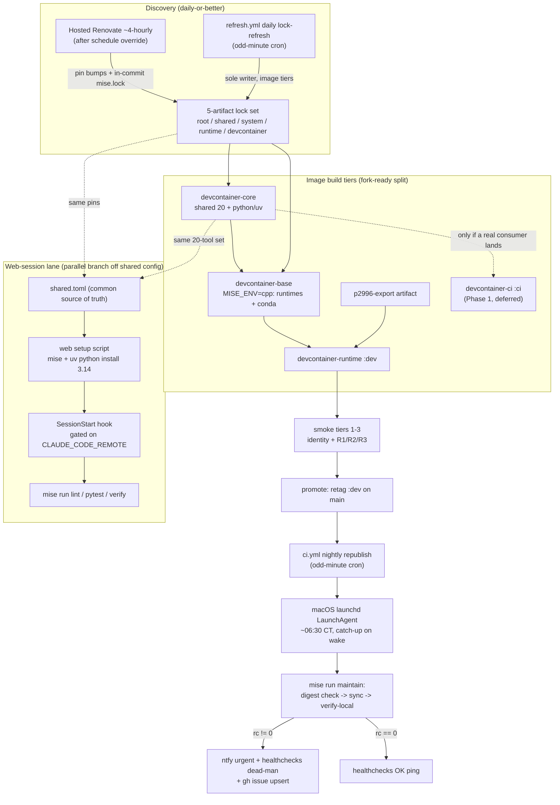

# R2 Deep-Research Synthesis — One Shared Toolchain, Many Thin Consumers

Date: 2026-07-10. Reconciles the seven r2 domain reports (Runs A–G) and the re-verified inventory into one picture. Every load-bearing claim below is sourced to its origin run and, where it rests on a fact, to a repo `file:line` or PR. This report synthesizes; it does not restate the domain reports — read them for the full evidence tables.

**The single through-line.** All seven domains converge on the same architectural verdict, from seven different directions: **this repo does not need a universal image or a self-hosted control plane — it needs to formalize the mise configuration it already has as the ONE shared source of truth, then let thin, per-environment consumers fan out from it.** Web sessions get a setup script that reads `shared.toml`; CI keeps its mise-on-runner install; the devcontainer keeps its heavy image; the Mac gets a launchd job that pulls and verifies that image; the updater keeps discovering pins and regenerating the locks that feed every consumer; and the research corpus that produced all of this finally gets an index. Nobody's ideal "one image everywhere" survives contact with the evidence (Run A, Run B) — but the *shared-config* substance of that ideal is ~90% already delivered and just needs to be made the explicit contract. The work ahead is a dozen small, mostly one-line, mutually-reinforcing fixes — not a rebuild.

---

## 1. Executive summary — the highest-order decisions

1. **Adopt a two-artifact web/devcontainer topology now; do not wait for a convergence date.** A single image usable in web + CI + devcontainer is hard-blocked — web forbids custom base images and caps disk at ~30 GB against a ~37.6 GB image (Run A §5, Run B Q1). The shared artifact is the mise config, not an image. *(Runs A, B)*
2. **Ship the web-session setup script + `CLAUDE_CODE_REMOTE`-gated SessionStart hook that installs mise + `uv python install 3.14` — this un-bricks THIS very session's Bash.** The PreToolUse guard (`.claude/settings.json:9-20`) fails closed because the Anthropic image has no Python ≥3.14 (`python/pyproject.toml:5`); the fix is the same finding Run D reached from the uv-auto-download angle. *(Runs A, D)*
3. **Land the "fork-ready" base-tier split (`core` = 20 shared pinned tools + python/uv; `cpp` = runtimes + ~25 conda C++ packages) now, but publish NO second image until a real consumer exists.** It is cheap (one ~25-min cold base rebuild, zero compiler rebuild), reversible, and valuable under every future. *(Run B Q4)*
4. **Keep the hosted-Renovate + `refresh.yml` hybrid — this reverses r1's self-hosted lean — and fix the two silent bugs it hides.** Mend-hosted now regenerates `mise.lock` in-commit (PR #191, proven), and the real gap is a one-line inherited Friday-only schedule, not a platform limit. *(Run C, Run D)*
5. **Retire the custom code that four now-native tool features supersede, staged behind CI probes**: `mise lock --minimum-release-age 7d` on the composite, the token-free-attestation flip that unlocks deleting `strip_provenance()`, dropping the graduated `experimental=true` flags, and `chezmoi --error-on-conflict`. *(Run D)*
6. **Reject issue #83's in-container "mise-env-fnox + doppler" migration; keep host-side Doppler exactly as-is; give the unused `fnox` pin one narrow job (web/CI age-provider adapter) or retire it.** Three domains independently converge here. *(Runs D, E, inventory)*
7. **Automate the Mac side with a native launchd LaunchAgent → `mise run maintain` (digest-aware sync + verify-local) with a three-channel alert (ntfy + healthchecks dead-man + gh issue); rule out the self-hosted GHA runner because the repo is public.** This consumes the images Run B/C produce. *(Run F)*
8. **Keep markdown + grep as the KB substrate; build a python-native, hk-enforced `docs/research/INDEX.md` now; gate graphify to a Mac-only periodic synthesis pilot.** The corpus this round produced is exactly what needs indexing. *(Run G)*

---

## 2. Cross-domain reconciliations — decide these together

These are the seams where domains intersect. Deciding any one in isolation risks contradicting another.

### (a) The mise base-tier `core`/`cpp` split is the keystone four domains touch
Run B's Phase-0 surgery — split `.devcontainer/mise-system.toml` into `mise-core.toml` (→ `config.toml`, the 20 shared + python/uv) and `config.cpp.toml` (`MISE_ENV=cpp`, runtimes + conda) — is not just a cache-granularity win. It is:
- **The natural home for the web/CI toolchain (Run A).** Run A's setup script should install from `.config/mise/conf.d/shared.toml` (the 20 exact-pinned host↔image tools), which is precisely the `core` set. The web layer and the `core` stage read the *same* pin list — that is the convergence Run A says to design for.
- **Where Run C's artifact-ownership rule applies.** The split adds a third-plus lock to the five-artifact set (`mise-core.lock`/`mise.cpp.lock`); `refresh.yml`'s `open-refresh-pr` `paths:` list and the `changes` path-filter must gain the new filenames in the same PR (Run C Q5, Run B Phase-0). One writer per file stays the invariant.
- **What Run D's experimental-flag and lock-refresh changes touch.** Dropping `experimental=true` at `mise-system.toml:119` (Run D #4) and adding `--minimum-release-age 7d` to the composite (Run D #2) both land on the same files the split reorganizes. Sequence them: split first (or same PR), then the flag/flag-age edits against the new file layout.

**Reconciled call:** do the `core`/`cpp` split as the first structural PR; treat the web setup-script `shared.toml` install, the lock-path additions, and the experimental-flag drop as riders or immediate follow-ups on the new layout. The documented "runtime-tier fork seam" (`mise-runtime.toml:10-12`) is the WRONG seam (Run B Q1) — the true seam is the BASE tier.

### (b) ONE fnox recommendation, reconciled across three domains
The reports appear to diverge but actually agree once aligned:
- **Inventory:** `fnox="latest"` ships unused (`mise-runtime.toml:41`), zero call sites (S8).
- **Run D (release mining):** fnox's doppler provider is mature and jdx-native; the highest-value feature is `fnox mcp env="exec"` (v1.30.0) to stop broadcasting every secret to the AI CLIs via `--env-file`. But the **mise-env-fnox plugin is NOT ripe** (dormant, author says avoid, unfixed race issue #3 = this repo's exact config).
- **Run E (secrets):** independently reaches "reject the in-container mise-env-fnox+doppler migration" — the vendor's own docs now say "we do not recommend" the plugin — and finds fnox's genuine niche is the **`age` provider adapter for Claude-web/CI**, the only path that works under web's default Trusted egress (Doppler's `api.doppler.com` is blocked there, Run A §3).

**Reconciled single fnox recommendation:** Do **not** adopt the mise-env-fnox plugin for anything (D+E agree). Keep host-side Doppler as the sole devcontainer path (E). Give the unused pin exactly one job — a narrow, plugin-free `fnox exec` + committed age-ciphertext adapter for the low-blast-radius research keys (EXA/BRAVE) a web session needs (E §2.3) — **or retire the pin** if no consumer lands within a month or two (D #5 / E's tool-currency call agree). Correct `.devcontainer/AGENTS.md:54-55`'s "Future: migrate to mise-env-fnox" note in the same change (D + E). The `fnox mcp env="exec"` idea (D #6) is a *later* opt-in that must route through `mcp2cli`, never the Claude CLI's `mcp add` subcommand (`no_mcp_registration`).

### (c) The web-session fix is one fix wearing three hats
Run A's web-env remedy (setup script + `CLAUDE_CODE_REMOTE`-gated SessionStart hook + `uv python install 3.14`) IS Run D's uv-auto-download finding (D #14) AND is what fixes **this session's own brick** — the fail-closed PreToolUse guard with no Python ≥3.14. All three are the same intervention. Build it once, in the web environment config + repo SessionStart hook, scoped to the `shared.toml` toolset (not the full ~40-tool root `mise.toml`, which blows the 5-minute cache budget). Consider additionally making the guard itself no-op when its interpreter is absent (Run A open-Q6) as belt-and-braces.

### (d) The Friday-only Renovate schedule — found twice, fixed once
Run C (updater) and Run D (release mining) **independently discovered** the same silently-inherited `"schedule": ["* * * * 5"]` from `github>jdx/renovate-config` that `renovate.json` never overrides — throttling all PR creation to Fridays and contradicting the repo's own `prConcurrentLimit`/`prHourlyLimit`. One fix serves both: add `"schedule": ["at any time"]` to `renovate.json`, unlocking the hosted app's ~4-hourly "activated" cadence. This is the entire "daily-or-better" gap on the Renovate surface — no new infrastructure. *(Run C change-list #1, Run D #24, both CONFIRMED 3/3.)*

### (e) The lifecycle loop closes: F consumes B/C; G indexes this round
- **Run F's Mac automation consumes the images Run B/C produce.** The launchd `mise run maintain` job pulls the `:dev` image that Run C's pipeline republishes nightly and Run B's topology builds; its digest-awareness is load-bearing *because* Run C/inventory establish the nightly (not weekly) republish cadence (F community-digest #1). The staleness check compares registry `:dev` digest vs local — the two-image split (B) doesn't change this, since the Mac only ever consumes the heavy `:dev` leaf.
- **Run G's knowledge base indexes the very corpus this round produced.** The seven r2 reports + inventory are exactly the `docs/research/`/`docs/research/runs/` artifacts Run G's Layer-1 INDEX and Layer-2 graphify pilot are designed to catalog. G's open-Q1 (promote durable run outputs to `docs/research/runs/<slug>/`) is what makes THIS round's outputs visible to fresh clones — otherwise they share the fate of the 104-agent Mac-only r1 run.

---

## 3. Reconciliation with the r1 round — where r2 corrected r1

r2 was commissioned to re-open everything after r1. Two r1 recommendations are now **overturned** on new empirical evidence, plus a framing correction:

1. **r1's self-hosted-Renovate recommendation is REVERSED (Run C).** r1's strongest argument — "hosted Renovate can never regenerate `mise.lock` in-commit" — is empirically dead: on 2026-07-08 the Mend-hosted app regenerated root `mise.lock` in the same renovate[bot] commit as the pin bump (PR #191, commit `2aa8722`, fresh per-platform sha256s; CONFIRMED 3/3). The unsafe-execution path shipped v43.186.0, was gated behind `allowedUnsafeExecutions: ["mise"]` in v43.210.1, and Mend has enabled it. The real "daily-or-better" gap was never a platform limit — it was the inherited Friday schedule (§2d). **Keep hosted.**
2. **r1's "lean `:ci` image for CI" premise is REFUTED (Run B, measured telemetry).** The claim "container jobs beat cached mise-on-runner" was refuted 0/3 against the repo's own Actions telemetry: lint runs 45-48s total (20-25s warm install) vs a measured **5m27s** full-image pull with no cross-run hosted-runner cache; even a lean 2-4 GB `:ci` image is a wash on lint and a strict regression on the 6-7s python+uv jobs. The runner install is *itself* the test surface gating the daily lock-refresh auto-merge. **mise-on-runner is already near-floor and structurally correct; no `container:` keys enter `ci.yml`, ever.**
3. **Framing correction (Run E):** repo docs saying R2/Colima is "hard-locked to Docker Desktop, no Colima equivalent" are REFUTED — Colima has a native but buggy `--ssh-agent` mechanism (abiosoft/colima#942, #1330). Issue #78 already frames this correctly; the flatter doc language should be corrected to match.

---

## 4. End-state pipeline

---

## 5. Consolidated open questions for Ray (deduped, prioritized)

Each carries the synthesized recommendation. Grouped by theme; P0 = do this cycle, P1 = soon, P2 = deferred/decision-gated.

### Image / build topology *(Runs A, B)*
- **P0 — Land the `core`/`cpp` base split now (before any second image)?** → **Yes.** One ~25-min cold base build; valuable under every future; the only one-way door is itself a cache-granularity win. *(B Q1)*
- **P1 — Replace the "~38 GB" doc figure with a measured, dated number?** → **Yes, cheap.** Pull the run-29013595948 metrics artifact (expires 2026-10-07) in a shell-enabled session; also settles the refuted per-tier apportionment. *(B Q4)*
- **P2 — What triggers publishing the `:ci` leaf (Phase 1)?** → **Only a confirmed consumer** — a web compose-sidecar workflow that beats the setup-script path, or Anthropic shipping custom web base images. Until then the leaf has no load-bearing consumer. *(B Q2)*

### Updater *(Runs C, D)*
- **P0 — Override the inherited Friday schedule (`"schedule": ["at any time"]`)?** → **Yes, immediately.** The entire daily-or-better gap; one line. *(C #1 = D #24)*
- **P0 — Fix `refresh.yml`'s `open-refresh-pr` `paths:` omission of `.devcontainer/mise-runtime.lock`?** → **Yes, first.** Today the runtime lock is regenerated then silently discarded — runtime tools (claude-code, gemini-cli, codex, fnox) are never actually refreshed. *(C #2)*
- **P0 — Ship `mise lock --minimum-release-age 7d` on the composite (`lock-refresh/action.yml:31,58`)?** → **Yes.** Closes the PR #169 fail-close class; decide the `minimum_release_age_excludes` fate in the same PR. *(D #2; note: flag shipped v2026.5.6, not v2026.5.7.)*
- **P1 — Add the ~40-line regen-push micro-workflow for devcontainer-feature + MISE_VERSION bumps?** → **Yes.** Upgrades the two remaining hard-red two-PR windows to same-PR at ~zero cost; reuse the App token, add it to `gitIgnoredAuthors`, make it a required check. *(C #5)*
- **P1 — Automate the gcc-deb sha256 recompute in a trusted CI job (same-PR hash + ARG)?** → **Yes, with a documented posture change** against #160 T13 — the human gate adds TOFU friction, not verification. If no, accept ~weekly human latency and blocked PR #189-style PRs by design. Ray's call. *(C #2)*
- **P1 — Keep git-refs for the p2996 pin, or resurrect the retired in-repo `p2996-refresh` job?** → **Keep git-refs** (config-only, ~4h after the schedule fix); resurrect only for a guaranteed cadence bound, and delete the customManager in the same change (one writer). *(C #3)*
- **P2 — External minute-accurate cron-drift dispatcher for `refresh.yml`?** → **Defer** until measured local drift shows the 00:00→02:00 stagger actually inverting; do the free hygiene now (move both crons off `:00`). *(C #5, D watch)*

### Secrets *(Runs D, E)*
- **P0 — Fix the two devcontainer-Doppler bugs?** → **Yes.** (i) download-to-temp-then-`mv` so a network failure never destroys the last-good `doppler.env`; (ii) tighten the canary gate to require ≥1 *non-metadata* key (today a zero-real-secret download passes both `verify-secrets` and smoke tier-2). *(E deltas #1-2)*
- **P0 — Correct `.devcontainer/AGENTS.md:54-55`'s issue-#83 mischaracterization?** → **Yes**, same change as the fnox decision. #83 is about OAuth-token injection for AI CLIs (still open/hard), NOT static-secret migration. *(D #7, E §2.1)*
- **P1 — Build the fnox-age web/CI adapter, or retire the unused fnox pin?** → **Build it narrowly** (`fnox exec` + committed age ciphertext) only if a near-term web/CI research-key consumer is expected; **otherwise retire the pin.** Do not adopt mise-env-fnox. *(D #5, E §2.3 — reconciled in §2b)*
- **P1 — Bring the `doppler` CLI under mise management?** → **Yes**, low-risk, independent — it's the single most security-critical tool currently unmanaged (registry short-name `doppler` → `github:DopplerHQ/cli`). *(E delta #5)*
- **P2 — Promote git-over-HTTPS (App installation tokens) into R2's durable AGENTS.md criteria as an additive lane?** → **Recommend formalizing**, but this needs your explicit sign-off per the durable-criteria governance rule; run issue #78's Colima probe first. Do NOT deliver a static deploy key or adopt SSH certs (github.com won't honor CA certs for a personal repo). *(E §4)*

### Web *(Run A)*
- **P0 — Adopt the two-artifact topology + setup-script/SessionStart web lane now?** → **Yes.** No convergence date exists; it un-bricks web sessions this week and converges naturally (both artifacts read `shared.toml`). Network policy: **Trusted (default)** suffices for lint/pytest/verify. Set a read-only `GITHUB_TOKEN` env var (anonymous 60/hr rate-limiting is the dominant real-world mise-in-web failure). *(A open-Q 1,2,5)*
- **P1 — First live-session probe (one ~15-min session)?** → **Yes**: `check-tools`, run the setup script, the three gates, `$HTTPS_PROXY/__agentproxy/status` after `mise install`, and confirm warm snapshot on a second session. *(A open-Q8)*

### Mac automation *(Run F)*
- **P0 — Ship plain launchd `mise run maintain` now, or adopt pitchfork?** → **Plain launchd now** (zero new dependency for a credential-bearing job); revisit pitchfork via `tool-currency-check` once its young cron path has more mileage. Alert via ntfy + healthchecks dead-man + gh issue (explicit `GH_TOKEN`). Alert secrets in `mise.local.toml [env]`, not Doppler (avoids stacking keychain-under-launchd risk). *(F Q1,Q5)*
- **P2 — Repo→private, reopening the self-hosted-runner venue?** → **Scope question for Ray**; Q4's public-repo ruling depends entirely on visibility. *(F Q7)*

### Knowledge base *(Run G)*
- **P0/P1 — Build the python-native `docs/research/INDEX.md` + front-matter + hk validator?** → **Yes** (one PR, zero recurring cost); closes an enforcement gap two existing rules already promise. *(G Layer 1)*
- **P1 — Corpus-boundary decision: promote durable run outputs to `docs/research/runs/<slug>/`?** → **Yes** — otherwise this round's outputs stay clone-invisible like the r1 Mac run. *(G Q1)*
- **P2 — Graphify pilot cadence?** → **Monthly/on-demand, Mac-only, gated go/no-go** (LazyGraphRAG economics: periodic synthesis, never the hot query path). Keep markdown+grep primary. *(G Q2-3)*

---

## 6. Refuted / corrected claims roll-up

Nothing load-bearing should rest on these. Every r2 refutation/correction, in one place:

| # | Domain | Claim | Verdict / correction |
|---|---|---|---|
| 1 | r1→C | Hosted Renovate can never regenerate `mise.lock` in-commit → self-host | **OVERTURNED.** PR #191 proves in-commit regen on hosted (2026-07-08). |
| 2 | r1→B | A lean `:ci` container image beats cached mise-on-runner in CI | **REFUTED 0/3** by repo telemetry (45-48s install vs 5m27s pull, no hosted-runner cache). |
| 3 | B | "Base toolset = 4.83 GB of a 5.06 GB compressed image" | **REFUTED 0/3.** Figures appear nowhere; conflicts with the ~38 GB doc figure. Per-tier apportionment is unmeasured — pull the metrics artifact. |
| 4 | C | "Hosted Mend does not permit postUpgradeTasks" (absolute) | **PARTIALLY REFUTED (2/3).** A limited undocumented Mend-approved allowlist exists; only *arbitrary* commands remain self-hosted-only. |
| 5 | C | Effective Renovate cadence is fine / daily | **CORRECTED.** It is silently WEEKLY (Friday-only inherited schedule); daily-or-better unmet by config, not platform. |
| 6 | C | "refresh.yml regenerates all committed lockfiles"; "three lockfiles" | **CORRECTED.** Runtime lock is regenerated then discarded (paths bug); the real set is **five**. |
| 7 | C | Hosted tracks Renovate releases "within days" | **CORRECTED.** Measured lag ~5-13 days; treat as 1-2 weeks. |
| 8 | D | `mise lock --minimum-release-age` shipped v2026.5.7 (2026-05-13) | **REFUTED.** Shipped **v2026.5.6 (2026-05-11)**. Mechanism/adoption argument NOT refuted. |
| 9 | D | Experimental-flag drop is one action gated by the Dockerfile ARG | **CORRECTED.** Two independent installs: `mise.toml:47` (host) is NOT ARG-gated; only `mise-system.toml:119` is. |
| 10 | D | Token-free attestation flip is "safe to execute" | **CORRECTED (2/3).** "Unlocked" ≠ proven; `lock_refresh.py` docstring says provenance is still recorded — stage behind a CI probe before deleting `strip_provenance()`. |
| 11 | E | Rotation collapses to exactly two manual points | **REFUTED (1/3).** At least **three** surfaces (Doppler dashboard, GH Actions App secrets, host `doppler login` + macOS SSH-agent identities). |
| 12 | E | DD `ssh-auth.sock` forwarding has no Colima equivalent → R2 hard-locks to Docker Desktop | **REFUTED 0/3.** Colima has a native but buggy `--ssh-agent` (#942, #1330). "Buggy," not "absent." |
| 13 | E | "Zero SSH key material anywhere in the stack" | **CORRECTED (2/3).** True for R2 *client* key; the R1 sshd feature auto-generates a *host* keypair. Say "zero R2 client key material at rest." |
| 14 | E | Doppler `secrets-fetch-action` v2.0.0 staleness | **INCONSISTENT.** Verifiers split 2025-03-19 vs 2026-03-19. Don't cite a staleness figure without re-checking; recommendation unaffected. |
| 15 | F | `docker/cli#6837` is an open `docker desktop start` bug | **REFUTED.** Transferred to docker/desktop-feedback#238, closed 2026-07-08, fixed DD 4.70.0. Prefer first-party `docker desktop start`. |
| 16 | F | "Claude routines/dispatch cannot execute locally at all" | **REFUTED (over-broad).** Desktop scheduled tasks + `/loop` run locally. Correct claim: "no *cloud* surface can reach or wake an idle Mac." |
| 17 | G | "Anthropic guidance recommends grep over RAG" verdict shown as REFUTED 0/3 | **NOT a refutation — UNVERIFIED (credit-exhausted verifier).** A 3/3-passed near-duplicate claim in the same run confirms the substance. |
| 18 | A | (none refuted) — 10/10 CONFIRMED 3/3 | Caveats only: fail-closed-on-hook-start is *observed* not documented; "docs-allowlisted" ≠ runtime guarantee (GHCR blob-CDN gap #71629); inactivity/disk-quota windows unquantified. |

---

## 7. GitHub repos touched

Merged and deduped across all seven reports.

- [ray-manaloto/dotfiles](https://github.com/ray-manaloto/dotfiles) — the subject repo; all baseline file:line + PR (#78, #80, #83, #116, #160, #169, #187–#192) evidence across every run.
- [anthropics/claude-code](https://github.com/anthropics/claude-code) — web/scheduled-tasks/remote-control/channels/memory docs + many issues (web env, secrets, egress, routines).
- [anthropics/claude-code-action](https://github.com/anthropics/claude-code-action) — headless agentic CI automation mode.
- [anthropics/claude-plugins-community](https://github.com/anthropics/claude-plugins-community) / [claude-plugins-official](https://github.com/anthropics/claude-plugins-official) — plugin marketplaces enumerated for KB/memory plugins.
- [jdx/mise](https://github.com/jdx/mise) — backends, MISE_ENV/per-env locks, `lock --minimum-release-age`, attestations, feature graduations, native sops/age, registry short-names; CI/Docker cookbook.
- [jdx/mise-action](https://github.com/jdx/mise-action) — cache mechanism, install_args behavior.
- [jdx/hk](https://github.com/jdx/hk) — no-native-timeout confirmation, version-parity, mise integration.
- [jdx/pklr](https://github.com/jdx/pklr) — evaluator-semantics fix cadence (1.0.0→1.1.3).
- [jdx/pitchfork](https://github.com/jdx/pitchfork) — launchd-booted cron/retrigger/mise-wrap/lifecycle-hooks; maturity signals.
- [jdx/fnox](https://github.com/jdx/fnox) — provider model (doppler/age/1password/infisical/bitwarden), `doppler.rs`, v1.30.0 `mcp env="exec"`, vendor rec against the plugin.
- [jdx/mise-env-fnox](https://github.com/jdx/mise-env-fnox) — plugin fail-open/caching, author warning, immaturity (issues #1/#3/#8/#11/#13).
- [jdx/renovate-config](https://github.com/jdx/renovate-config) — verbatim `default.json` (Friday schedule, minimumReleaseAge, mise-lock postUpgradeTask, lockFileMaintenance); zero customManagers.
- [jdx/aube](https://github.com/jdx/aube) — new jdx project spotted in preset census (unresearched; catalog-queue candidate).
- [renovatebot/renovate](https://github.com/renovatebot/renovate) — mise manager source, git-refs/custom datasource, hosted-app scheduling, 43.x releases, PRs #42591/#43606, unsafe-execution gating.
- [renovatebot/base-image](https://github.com/renovatebot/base-image) — mise added to the Renovate image (PR #3183).
- [mend/renovate-ce-ee](https://github.com/mend/renovate-ce-ee) — CE/EE scheduling defaults, hosted checkbox.
- [twpayne/chezmoi](https://github.com/twpayne/chezmoi) — `--error-on-conflict` (v2.71.0), unknown-config-field detection, cron-guard discussion #3513.
- [astral-sh/uv](https://github.com/astral-sh/uv) — auto Python download, `uv check`/`format`/`audit` preview surfaces, issue #19768.
- [astral-sh/ruff](https://github.com/astral-sh/ruff) — PEP 758 formatter change, spaced suppressions, `--add-ignore` (rejected).
- [astral-sh/ty](https://github.com/astral-sh/ty) — 0.0.x beta cadence, late-2026 stabilization target.
- [astral-sh/python-build-standalone](https://github.com/astral-sh/python-build-standalone) — CPython 3.14 binary source for mise/uv.
- [apple/pkl](https://github.com/apple/pkl) — pkl release-binary source (oracle for parity probe).
- [aquaproj/aqua-registry](https://github.com/aquaproj/aqua-registry) — registry compiled into mise (tool-install-path evidence).
- [DopplerHQ/cli](https://github.com/DopplerHQ/cli) — auth model, service tokens, offline-fallback scope (`doppler run` only).
- [DopplerHQ/secrets-fetch-action](https://github.com/DopplerHQ/secrets-fetch-action) — GHA fetch-action; release-date discrepancy flagged.
- [Infisical/infisical](https://github.com/Infisical/infisical) + [Infisical/cli](https://github.com/Infisical/cli) + [Infisical/secrets-action](https://github.com/Infisical/secrets-action) — designated fallback secrets platform, OIDC machine identities, offline gap #216.
- [tellerops/teller](https://github.com/tellerops/teller) — dormancy confirmation (do not adopt).
- [1Password/load-secrets-action](https://github.com/1Password/load-secrets-action) + [onepassword-sdk-python](https://github.com/1Password/onepassword-sdk-python) + [onepassword-sdk-js](https://github.com/1Password/onepassword-sdk-js) — service-account caps, SSH-key formatting, lifecycle/rate-limit gaps.
- [abiosoft/colima](https://github.com/abiosoft/colima) — native `--ssh-agent` exists but buggy (#942/#1330), refuting "no equivalent".
- [lima-vm/lima](https://github.com/lima-vm/lima) — `forwardAgent` mechanics under Colima.
- [rancher-sandbox/rancher-desktop](https://github.com/rancher-sandbox/rancher-desktop) — VM→container agent-socket recipe (Colima-probe adjacent).
- [docker/for-mac](https://github.com/docker/for-mac) — magic-socket forwarding limits (#4242, #6504).
- [docker/cli](https://github.com/docker/cli) + [docker/desktop-feedback](https://github.com/docker/desktop-feedback) — `docker desktop start` bug (#6837 → #238, closed/fixed).
- [docker/buildx](https://github.com/docker/buildx) + [docker/docs](https://github.com/docker/docs) — bake target dedup, contexts, gha cache scope.
- [devcontainers/images](https://github.com/devcontainers/images) — image-family layout, one-version-all-variants tag discipline.
- [devcontainers/ci](https://github.com/devcontainers/ci) + [devcontainers/cli](https://github.com/devcontainers/cli) + [devcontainers/spec](https://github.com/devcontainers/spec) — prebuild/configFile/imageName semantics; prebuild-cadence census.
- [github/docs](https://github.com/github/docs) — runner specs, container-job mechanics, Codespaces prebuild billing, self-hosted-runner security, deploy-key/App-token/SSH-CA docs, `workflow_run`.
- [github/roadmap](https://github.com/github/roadmap) — cron `timezone:` feature (#1187).
- [actions/runner](https://github.com/actions/runner) + [actions/runner-images](https://github.com/actions/runner-images) — cron-drift (#2977/#4468), macOS LaunchAgent template, >50 GB VM-image delivery model.
- [community/community](https://github.com/orgs/community/discussions) — GHCR degradation (#173607), cron drift (#196910), no hosted-runner image cache (#25975/#47550).
- [cli/cli](https://github.com/cli/cli) — `gh auth setup-git`, non-TTY keychain silent-unauth fallback (#13317/#10108/#13330).
- [bloomberg/clang-p2996](https://github.com/bloomberg/clang-p2996) — `p2996.atom` feed, commit cadence, HEAD SHA.
- [jwakely/pkg-gcc-latest](https://github.com/jwakely/pkg-gcc-latest) + [gcc-mirror/gcc](https://github.com/gcc-mirror/gcc) — gcc-deb Atom feed + weekly snapshot cadence.
- [peter-evans/repository-dispatch](https://github.com/peter-evans/repository-dispatch) + [create-pull-request](https://github.com/peter-evans/create-pull-request) — GHA dispatch + add-paths staging semantics.
- [suzuki-shunsuke/guide-github-action-renovate](https://github.com/suzuki-shunsuke/guide-github-action-renovate) — push-to-renovate-branch App pattern.
- [newreleasesio/client-go](https://github.com/newreleasesio/client-go) — release-watch surface (dismissed).
- [lowlydba/cron-drift](https://github.com/lowlydba/cron-drift) — drift measurement tooling.
- [DeterminateSystems/update-flake-lock](https://github.com/DeterminateSystems/update-flake-lock) — reference self-updating-repo action mirroring `refresh.yml`.
- [Homebrew/homebrew-autoupdate](https://github.com/Homebrew/homebrew-autoupdate) — prior-art LaunchAgent for the Mac maintain job.
- [binwiederhier/ntfy](https://github.com/binwiederhier/ntfy) + [healthchecks/healthchecks](https://github.com/healthchecks/healthchecks) — alert push + dead-man switch.
- [gsd-build/gsd-2](https://github.com/gsd-build/gsd-2) — osascript notification silently dropped (disqualifier).
- [julienXX/terminal-notifier](https://github.com/julienXX/terminal-notifier) + [vjeantet/alerter](https://github.com/vjeantet/alerter) — local-toast (unmaintained vs maintained).
- [Kong/jdx-mise-action](https://github.com/Kong/jdx-mise-action) + [step-security/mise-action](https://github.com/step-security/mise-action) — corporate mise-in-CI adoption signals.
- [freqtrade/freqtrade](https://github.com/freqtrade/freqtrade), [LadybirdBrowser/ladybird](https://github.com/LadybirdBrowser/ladybird), [SerenityOS/serenity](https://github.com/SerenityOS/serenity), [jesec/flood](https://github.com/jesec/flood), [GoogleChrome/webstatus.dev](https://github.com/GoogleChrome/webstatus.dev), [rsim/oracle-enhanced](https://github.com/rsim/oracle-enhanced) — devcontainer prebuild-cadence evidence.
- [NixOS/nixpkgs](https://github.com/NixOS/nixpkgs) + [containerd/stargz-snapshotter](https://github.com/containerd/stargz-snapshotter) — layered-image byte-sharing + lazy-pull survey.
- [jlumbroso/free-disk-space](https://github.com/jlumbroso/free-disk-space) — measured free-disk cost in the build job.
- [Graphify-Labs/graphify](https://github.com/Graphify-Labs/graphify) — KB deep review: query surface, ingestion, storage, work-memory loop, benchmarks.
- [getzep/graphiti](https://github.com/getzep/graphiti) + [getzep/zep-papers](https://github.com/getzep/zep-papers) — graph-memory candidate + LoCoMo score-correction dispute (#5).
- [mem0ai/mem0](https://github.com/mem0ai/mem0), [topoteretes/cognee](https://github.com/topoteretes/cognee), [basicmachines-co/basic-memory](https://github.com/basicmachines-co/basic-memory), [run-llama/semtools](https://github.com/run-llama/semtools) — agent-memory field candidates (reject/defer/escape-hatch).
- [modelcontextprotocol/servers](https://github.com/modelcontextprotocol/servers) — reference "memory" server, source-verified as unranked substring search (rejected).
- [thedotmack/claude-mem](https://github.com/thedotmack/claude-mem), [keshrath/agent-knowledge](https://github.com/keshrath/agent-knowledge), [mnardit/agent-recall](https://github.com/mnardit/agent-recall), [severity1/claude-code-auto-memory](https://github.com/severity1/claude-code-auto-memory) — community memory plugins (all MCP-bundled except auto-memory; disabled/rejected).
- [microsoft/graphrag](https://github.com/microsoft/graphrag) — GraphRAG→LazyGraphRAG cost lesson.
- [AnswerDotAI/llms-txt](https://github.com/AnswerDotAI/llms-txt) + [sveltejs/svelte](https://github.com/sveltejs/svelte) — INDEX.md/llms.txt shape precedent.
- [openai/agents.md](https://github.com/openai/agents.md) + [sourcegraph/cody-public-snapshot](https://github.com/sourcegraph/cody-public-snapshot) — AGENTS.md layering + Cody's embeddings removal.
- [matrix-org/matrix.org](https://github.com/matrix-org/matrix.org) + [readthedocs/readthedocs.org](https://github.com/readthedocs/readthedocs.org) — SSH-agent-hijacking exemplar + deploy-key deprecation rationale.
- Exemplar web-session hook repos: [jonpulsifer/infra](https://github.com/jonpulsifer/infra), [datenknoten/freundebuch](https://github.com/datenknoten/freundebuch), [joeblew999/vm-uncloud](https://github.com/joeblew999/vm-uncloud), [hco/dependency-dir-analyzer](https://github.com/hco/dependency-dir-analyzer), [wado-lang/wado](https://github.com/wado-lang/wado), [entireio/cli](https://github.com/entireio/cli), [StoDevX/AAO-React-Native](https://github.com/StoDevX/AAO-React-Native), [richardthe3rd/cambridge-beer-festival-app](https://github.com/richardthe3rd/cambridge-beer-festival-app) — `CLAUDE_CODE_REMOTE` + mise SessionStart patterns.
