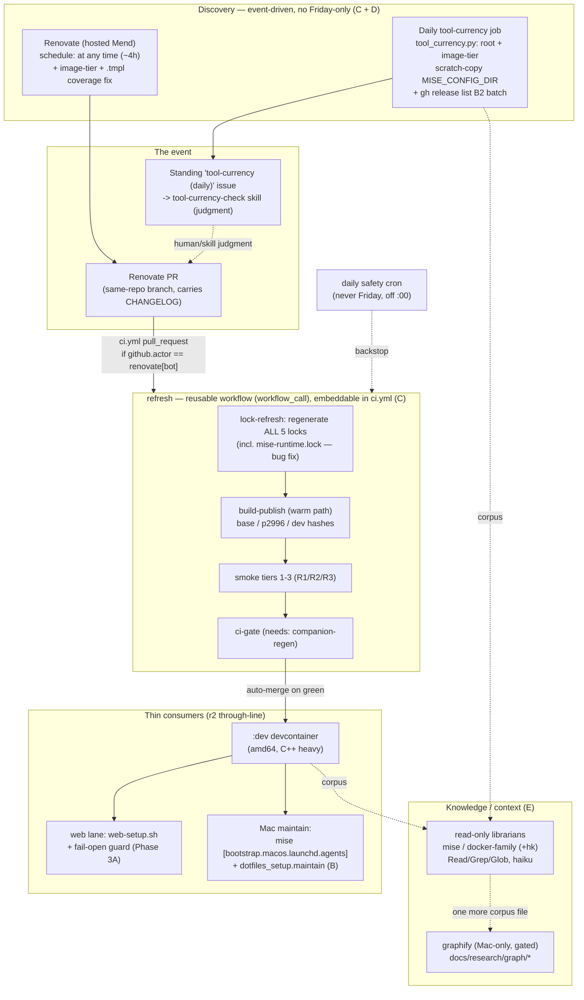

# r3 Deep-Research — Cross-Domain Synthesis

Run: `research-20260710-r3-synthesis` · 2026-07-10 · remote web session.
Reconciles the five r3 domain reports (all under
`docs/research/runs/research-20260710-r3-*/report.md`) and the relevant r2
conclusions they extend or overturn.

Domains: **A** mise dotfiles vs chezmoi · **B** mise bootstrap suite · **C**
event-driven triggers (Renovate-PR-as-event) · **D** complete tool watch-list +
release-note automation + missed mise releases · **E** graphify + per-tool
subagent pilot.

Method: each domain ran angle fan-out → 3-vote adversarial verification →
opus synthesis (146 agents, ~12.7M tokens). Refuted claims are quarantined per
domain and rolled up below.

---

## The through-line

r2 established the architecture: **one shared mise toolchain, many thin
per-environment consumers.** r3 answers *"now make the automation and knowledge
layers around that toolchain event-driven, complete, and low-context"* — and
the answer has a consistent shape across all five domains:

> **Prefer the native mechanism where it maps cleanly; refuse it where it
> collides; and before you automate an "event," make sure the event actually
> sees everything.**

Concretely:

- **C (triggers):** the update loop becomes event-driven — a Renovate PR is the
  "event," `refresh.yml` becomes a reusable workflow embeddable in `ci.yml`, and
  Friday-only dies. This is adopt-in-full, all-additive, no new infrastructure.
- **D (watch-list):** but the event is currently **half-blind** — ~58 of ~108
  tracked tools (the two image tiers + the `.tmpl` tier) are invisible to both
  `mise outdated` and Renovate. Closing that blind spot is the precondition that
  makes C's event-driven loop trustworthy. This is the single highest-leverage
  finding of the round.
- **B (bootstrap):** mise's new native `[bootstrap.macos.launchd.agents]`
  cleanly retires the *hand-rolled plist* half of r2 Run F's Mac automation —
  but does **not** simplify `web-setup.sh` or pick the devcontainer shell (it
  collides with existing mechanisms there).
- **A (dotfiles):** mise `[dotfiles]` is refused — chezmoi stays. The native
  feature genuinely can't cover this repo's one hard requirement (interactive
  prompt-and-persist host setup), so "prefer native" correctly yields to "refuse
  where it collides."
- **E (knowledge):** the cheap sure win for the token/context problem is
  **read-only subagent librarians**, not graphify. Graphify is a real KB but its
  build is 100%-LLM-priced, so it stays a gated, Mac-only, periodic experiment —
  never in the hot query path.

And one cross-cutting correction: **a standing rule file contains a factual
error** (`tool-currency-and-native-first.md` claims mise's conda backend now
writes sha256+transitive deps to the lockfile — refuted 0/3). It must be fixed,
and no plan step may retire the custom conda-snapshot machinery on its basis.

---

## Per-domain recommendations (one line each)

| Domain | Verdict | Recommendation |
|---|---|---|
| **A — mise dotfiles vs chezmoi** | **NEITHER (keep chezmoi)** | mise `[dotfiles]` has no equivalent for chezmoi's `promptBoolOnce` host setup; no hybrid driver (home/ has no foreign-owned files); `os_family()` can't split darwin/linux. Re-evaluate only on a concrete trigger, not a calendar. |
| **B — mise bootstrap suite** | **ADOPT (narrow)** | Use `[bootstrap.macos.launchd.agents]` to replace only the plist-authoring/loading layer of Run F's LaunchAgent (keep the `maintain` python module + alerting). Do **not** use mise for the devcontainer shell or `web-setup.sh`. |
| **C — event-driven triggers** | **ADOPT (full)** | `renovate.json "schedule": ["at any time"]` kills Friday-only; scope a Renovate-PR-triggered refresh+build with `if: github.actor == 'renovate[bot]'`; extract `refresh.yml` into a reusable **workflow** (not composite — secrets); keep a daily safety cron off `:00`. |
| **D — watch-list + release notes** | **ADOPT + FIX RULE** | Bump `MISE_VERSION` 2026.7.2→2026.7.5 first; close the ~58-tool image-tier blind spot in `tool_currency.py` (scratch-copy + `MISE_CONFIG_DIR`); add a `DIVE_VERSION` customManager; `gh release list` batch for floating Docker-family tools; **correct the conda claim in the rule file**. |
| **E — graphify + subagents** | **PILOT subagents; GATE graphify** | Build `mise-librarian` + `docker-family-librarian` read-only subagents (`.claude/agents/`, `Read/Grep/Glob`, haiku, ~700-tok cap); measure main-loop context growth (GO bar ≤0.35 ratio + coverage ≥ baseline). Graphify stays Mac-only, periodic, gated on explicit approval. |

---

## End-state workflow (Mermaid)

---

## Refuted / corrected claims roll-up (do NOT assert downstream)

| # | Domain | Claim | Verdict | Consequence |
|---|---|---|---|---|
| 1 | D | mise conda backend writes per-platform sha256 + transitive deps to `mise.lock` (retires custom snapshot) | **REFUTED 0/3** | The custom `mise_snapshot.py` / `mise-system-resolved.json` machinery must **NOT** be retired. **`tool-currency-and-native-first.md` states this as fact and is wrong — fix the rule file.** (`jdx/mise#7700` still open; conda not in any lockfile tier.) |
| 2 | D | Of 8 Docker-family items, only 2 are watched; buildkit has zero coverage | **REFUTED (1/3)** | Corrected to **3 of 8**: buildkit's syntax frontend IS watched via the `docker/dockerfile` digest (Renovate `dockerfile` manager, PR #187). Buildx binary + buildkit daemon remain genuinely unwatched. |
| 3 | B | `mise generate bootstrap` downloads from GitHub Releases, dodging the `mise.run` allowlist need | **REFUTED 0/3** | It fetches from `mise.jdx.dev/install.sh`, equally not-allowlisted under Claude-web's Trusted policy. Do **NOT** action this as the web-setup allowlist fix. |
| 4 | B | `/etc/profile.d` alone delivers cross-shell determinism; repo has no login-shell selection | **REFUTED 0/3** | Real activation is the chezmoi-templated `~/.bashrc`/`~/.zshrc`; `/etc/profile.d/mise.zsh` is likely dead code (Ubuntu `/etc/profile` globs only `*.sh`). Login shell IS set by `useradd -s /bin/bash` (`Dockerfile.host-user:39`). Conclusion unaffected; mechanism was mischaracterized. |
| 5 | A | "No prior-art comparison of mise dotfiles vs chezmoi exists" | **REFUTED** | `blog.verybadfrags.com` (2026-06-13) explicitly compares them. The real blocker is `promptBoolOnce`, not absence of comparisons. |
| 6 | A | mise `os()`/`os_family()` cover the same darwin/linux split as `chezmoi.os` | **REFUTED** | `os_family()` returns only `unix`/`windows`; `os()` returns `macos` not `darwin`. `.chezmoiignore:52`'s gate needs a rewritten literal, not a drop-in — strengthens "keep chezmoi." |
| 7 | E | "mise+docker-first will show *measurable* token savings hk wouldn't" | **UNVERIFIED (predictive)** | The corpus-depth proxy is solid; the savings prediction is the pilot's hypothesis, not evidence. Treat build-order as a prior, savings as TBD. |
| 8 | E | Graphify pilot is "user-approved" | **PROVENANCE UNVERIFIED** | The *subagent* pilot-first choice WAS approved this session (AskUserQuestion, 2026-07-10). The graphify **seed/cadence** specifically is still a P2 open question — get explicit sign-off before spending build-time LLM tokens. |

Everything else across the five domains was CONFIRMED 3/3 against re-fetched
primary sources (image tiers invisible to tool-currency; Renovate hyphen-glob +
`.tmpl` misses; `MISE_VERSION` 3 behind; v2026.7.4 bootstrap/dotfiles stable
graduation; Renovate PRs fire same-repo `pull_request` with secrets; reusable
workflow needed for App-token secrets; subagent context isolation is
free/automatic; graphify is a real deterministic KB).

---

## Consolidated open questions for Ray (with recommendations)

**P0 — decide before Phase 0/1 implementation**

1. **Fix `tool-currency-and-native-first.md`'s conda claim now?** *Rec: yes —
   it's a factual error currently licensing a wrong retirement.* (D)
2. **`renovate.json "schedule": ["at any time"]` to kill Friday-only?** *Rec:
   yes — one line, directly satisfies "no Friday schedules."* (C)
3. **Let Renovate bump `MISE_VERSION`→2026.7.5, then drop `experimental=true` in
   a separate gated PR?** *Rec: yes, in that order — dropping the flag first on
   the 2026.7.2 pin breaks `[bootstrap.packages]`.* (D/B)

**P1 — decide before Phase 2/3**

4. **Reusable workflow vs composite action for `refresh`?** *Rec: reusable
   workflow — composites can't read the App-token secrets.* (C)
5. **Adopt `[bootstrap.macos.launchd.agents]` for Run F's plist layer?** *Rec:
   yes for plist authoring + drift detection; keep the `maintain` module.* (B)
6. **Where does the tracked `watchlist.toml` live?** *Rec:
   `python/src/dotfiles_setup/watchlist.toml` for diffability.* (D)

**P2 — decide before Phase 4**

7. **Confirm the subagent GO bar (median main-loop token ratio ≤0.35 + coverage
   ≥ baseline)?** *Rec: accept as a starting bar to falsify after the first real
   measurement.* (E)
8. **Approve the graphify seed + its cadence (monthly/on-demand)?** *Rec:
   explicit yes/no before any build tokens; decouple from the subagent pilot,
   which needs no approval to start.* (E)

---

## What r3 explicitly does NOT recommend

- Adopting mise `[dotfiles]` (A) — chezmoi stays.
- `mise generate bootstrap` as the web-setup allowlist fix (B) — refuted.
- Using mise to select the devcontainer login shell (B) — collides.
- Retiring the custom conda-snapshot machinery (D) — the rule that licenses it
  is factually wrong.
- Wiring graphify into the hot retrieval path (E) — gated, periodic, Mac-only.

---

## GitHub repos touched

- [ray-manaloto/dotfiles](https://github.com/ray-manaloto/dotfiles) — all in-repo grounding across the five r3 domains (mise tiers, Dockerfile, renovate.json, refresh.yml/ci.yml, home/ chezmoi templates, tool_currency.py, tool-currency-check skill, .claude/rules/*, .claude/agents/dockerfile-reviewer.md).
- [jdx/mise](https://github.com/jdx/mise) — dotfiles/bootstrap/launchd/shell/user docs; CHANGELOG v2026.7.0–v2026.7.5; conda backend + lockfile docs; discussion #7700.
- [renovatebot/renovate](https://github.com/renovatebot/renovate) — mise-manager file-pattern glob; `github-releases` datasource; schedule/preset override; `gitIgnoredAuthors`.
- [twpayne/chezmoi](https://github.com/twpayne/chezmoi) — `promptBoolOnce`, `chezmoi.os`, `.chezmoiignore`, template data model.
- [moby/buildkit](https://github.com/moby/buildkit) · [docker/buildx](https://github.com/docker/buildx) · [moby/moby](https://github.com/moby/moby) · [docker/setup-buildx-action](https://github.com/docker/setup-buildx-action) — Docker-family watch-list + version-floating behavior.
- [devcontainers/spec](https://github.com/devcontainers/spec) · [devcontainers/features](https://github.com/devcontainers/features) · [devcontainers/cli](https://github.com/devcontainers/cli) — spec `$schema` floating, `sshd` feature coverage, cli corpus.
- [wagoodman/dive](https://github.com/wagoodman/dive) — `DIVE_VERSION` unpinned gap.
- [Graphify-Labs/graphify](https://github.com/Graphify-Labs/graphify) (redirected from [safishamsi/graphify](https://github.com/safishamsi/graphify)) — KB query path, extract flags, `.graphifyignore`, issue #730 cost overrun.
- [anthropics/claude-code](https://github.com/anthropics/claude-code) — subagent context-isolation docs, `/context`/`/usage`, `count_tokens`.
- [cli/cli](https://github.com/cli/cli) — `gh release list` batch for the B2 floating watch-list.
