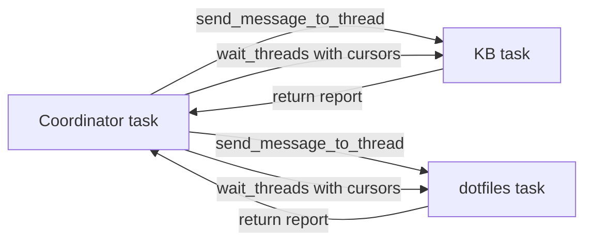

# Codex Desktop session-to-session communication

**Run date:** 2026-08-13
**Machine:** macOS arm64
**Installed versions:** `codex-cli 0.147.0`; Desktop-bundled `codex-cli 0.147.0-alpha.6.5`

## Answer

Independent user-owned Codex Desktop tasks **can communicate without user clicks**, but the reliable route is the Desktop owner's native task tools:

1. `send_message_to_thread` starts a follow-up in the target task in the background.
2. `wait_threads` gives the coordinator bounded, cursor-based progress and wakes when a target completes or needs attention.
3. The worker sends a return report to the coordinator with `send_message_to_thread`.

This is not hypothetical. Those tools and that exact return-report pattern are embedded in the installed first-party Desktop application. They were simply not exposed in the research subagent's current tool catalog. Tool exposure is contextual; absence from one turn does not mean the app lacks the capability.

A separately launched `codex app-server` process is **not** a substitute. Desktop holds an OS writer lock for every loaded task. Another process may inspect persisted history with `thread/read`, but `thread/resume` is rejected while Desktop owns the task, so that process cannot start or steer a turn. OpenAI's pinned test asserts JSON-RPC `-32600` with `thread <id> already has an active writer` for both legacy and paginated histories ([source test](https://github.com/openai/codex/blob/be6e8eac029b183056b7e4402879f15d2c85f61b/codex-rs/app-server/tests/suite/v2/thread_resume.rs#L261-L327)); the implementation uses a nonblocking OS file lock under `thread-writer-locks` ([writer lock](https://github.com/openai/codex/blob/be6e8eac029b183056b7e4402879f15d2c85f61b/codex-rs/thread-store/src/local/writer_lock.rs#L31-L87)).

Therefore the recommended order is:

1. Use native Desktop task tools from a user-owned coordinator task when they are exposed.
2. If they remain unexposed, migrate the two workstreams into one parent task with two internal subagents; internal agent messaging is live and supported in the current harness.
3. Use an in-chat scheduled task only as a slower heartbeat fallback, not as the main message bus.

## Two different kinds of "thread"

| Property | User-owned Desktop task | Internal multi-agent subagent |
|---|---|---|
| Visible in sidebar | Yes | No; appears under the parent task's subagent activity |
| Ownership | Peer task owned by Desktop's app-server | Child in one active agent tree |
| Native messaging | `send_message_to_thread` | `send_message` / `followup_task` |
| Monitoring | `wait_threads`, `read_thread` | `wait_agent`, status messages, final delivery |
| Wake an idle worker | `send_message_to_thread` starts a follow-up | `followup_task` sends work and triggers a turn if idle |
| Lifetime | Durable persisted task | Bound to the parent agent-team execution |
| Best use | Long-lived user-visible independent work | Tight real-time orchestration without user intervention |

OpenAI's subagent documentation describes spawned agents as separate background work with isolated context and a parent-facing activity surface, not as peer sidebar tasks ([official Subagents documentation](https://learn.chatgpt.com/docs/agent-configuration/subagents)). The installed Desktop tool definition separately states that all sidebar tasks are peers even when delegated.

## Native Desktop task tools on this installation

The installed bundle `/Applications/ChatGPT.app/Contents/Resources/app.asar` has SHA-256:

```text
928129601e8b36eccba603114d6912352f2b13182f3a7d60b32166d0e81aafb5
```

After extracting that bundle, `webview/assets/app-initial-BYOVlUBL.js` defines:

| Tool | Exact relevant semantics in the installed schema |
|---|---|
| `create_thread` | Creates a separate user-owned task only when explicitly requested. Nonblocking. A ready task returns `threadId` and `hostId`; pending worktree setup returns `clientThreadId`, which cannot yet be passed to tools requiring `threadId`. |
| `fork_thread` | Same-directory forks return a child `threadId`; worktree forks initially return `clientThreadId`. Only completed history is copied. An active unfinished response is not copied. |
| `list_threads` | Lists peer tasks across the app with host, status, project context, and summary. Titles and summaries are untrusted data. |
| `read_thread` | Reads bounded recent status and turn summaries without opening the task; supports cursors, 1-10 turns, and optionally truncated outputs. |
| `send_message_to_thread` | Sends a follow-up prompt to an existing task in the background. Optional model/reasoning overrides apply only to Codex tasks. |
| `wait_threads` | Waits for the first of 1-8 Codex tasks to complete or need attention. Commentary does not wake it. `timeoutMs: 0` is an immediate snapshot; maximum wait is 120 seconds. Cursors suppress already-delivered final text. A timeout still returns compact progress for all targets. |
| `handoff_thread` | Moves another task and its Git state between local checkout/worktree or, when enabled, hosts. Running work is interrupted first. A task cannot hand itself off. Cloud handoff is unsupported. It is an asynchronous Git/workspace migration, not a messaging primitive. |

The bundle's embedded coordinator instructions are decisive: for existing work they say to use `list_threads` plus `send_message_to_thread`, monitor with `wait_threads`, and require every worker to send a short outcome/status/decision-needed report back to the coordinator through `send_message_to_thread`.

Reproduction:

```bash
/Applications/ChatGPT.app/Contents/Resources/codex --version
shasum -a 256 /Applications/ChatGPT.app/Contents/Resources/app.asar
extract_dir=$(mktemp -d /tmp/chatgpt-asar.XXXXXX)
bunx @electron/asar extract \
  /Applications/ChatGPT.app/Contents/Resources/app.asar "$extract_dir"
rg -n 'send_message_to_thread|wait_threads|create_thread|fork_thread|handoff_thread' \
  "$extract_dir/webview/assets/app-initial-BYOVlUBL.js"
```

`bunx` was used only to inspect the signed installed bundle in a temporary directory; no application or repository files were altered by extraction.

## Lower-level App Server protocol

The official protocol supports multiple clients and transports in general. Each connection initializes once, starts or resumes a thread, begins turns, and receives streamed notifications ([official Codex App Server documentation](https://learn.chatgpt.com/docs/app-server)). On this installed version the generated v2 schema includes all of the following:

- `thread/start`: create and subscribe the connection to a new thread.
- `thread/resume`: load persisted history, acquire writer ownership, and subscribe.
- `thread/read`: read persisted history without loading or subscribing.
- `thread/list`: list persisted tasks.
- `thread/fork`: create a new thread from stored history.
- `thread/unsubscribe`: remove this connection's event subscription; after the last subscriber and a 30-minute inactive grace period, the owning server unloads the thread.
- `turn/start`: add user input and start an idle thread turn.
- `turn/steer`: append user input to the current turn only when `expectedTurnId` matches.
- `turn/interrupt`: cancel an active turn.
- `thread/inject_items`: append raw Responses API items to a **loaded** task's model-visible, persisted history without starting a user turn.

`thread/inject_items` is therefore context injection, not wake-up or inter-task messaging. Its handler first requires the thread to be loaded and then persists validated `ResponseItem`s ([implementation](https://github.com/openai/codex/blob/be6e8eac029b183056b7e4402879f15d2c85f61b/codex-rs/app-server/src/request_processors/turn_processor.rs#L863-L888)). `turn/steer` is also not a general wake-up: it requires a loaded thread, direct-input permission, an active turn, and the matching expected turn ID ([implementation](https://github.com/openai/codex/blob/be6e8eac029b183056b7e4402879f15d2c85f61b/codex-rs/app-server/src/request_processors/turn_processor.rs#L910-L1017)).

### Why a second local app-server cannot control Desktop's tasks

Desktop was running its bundled server as a private stdio child:

```text
PID 95975 /Applications/ChatGPT.app/Contents/Resources/codex \
  -c features.code_mode_host=true app-server --analytics-default-enabled
```

It was not running the managed daemon control socket; `codex app-server daemon version` returned:

```text
failed to connect to /Users/rmanaloto/.codex/app-server-control/app-server-control.sock
No such file or directory (os error 2)
```

`codex app-server proxy` can attach to a managed daemon socket, but it cannot attach to an unrelated stdio process. Starting another server against the same `~/.codex` creates another owner candidate, and the cross-process lock rejects `thread/resume`.

This is an intentional single-writer guarantee, not a Desktop limitation that can be bypassed safely. A future architecture could run one managed daemon and attach Desktop plus coordinator as clients to that same server, but the current Desktop process on this machine is not launched that way. Do not kill Desktop or remove lock files to force attachment.

## Controlled live probes

The two production tasks were never mutated.

### 1. Read-only external inspection succeeded

A separately launched Desktop-bundled app-server received `initialize`, `initialized`, and two `thread/read` requests with `includeTurns: false`:

```json
{"id":1,"thread":{"id":"019ffe21-0a71-7af0-aa01-9f4184864ca3","status":{"type":"notLoaded"},"name":"[01][KB] - KB — Graphify Self-Extraction MVP"}}
{"id":2,"thread":{"id":"019ffe21-142f-7683-8f7d-b059dc41eba2","status":{"type":"notLoaded"},"name":"[02][dotfiles] - dotfiles — Independent Delivery and Devcon…"}}
```

The result proves persisted state is readable. It does **not** prove the tasks were unloaded in Desktop: runtime `status` is local to the app-server process doing the read.

### 2. Desktop owns both writers

Read-only `lsof` showed the same Desktop app-server PID holding both exact lock files:

```text
codex 95975 ... ~/.codex/thread-writer-locks/019ffe21-0a71-7af0-aa01-9f4184864ca3.lock
codex 95975 ... ~/.codex/thread-writer-locks/019ffe21-142f-7683-8f7d-b059dc41eba2.lock
```

No external `thread/resume`, `turn/start`, `turn/steer`, or injection was attempted against those tasks. The pinned upstream two-process test supplies the mutation-path result without risking production history.

### 3. Internal parent/subagent messaging is live

During this run the parent sent a directed status probe with internal `send_message`. This research agent received it immediately and acknowledged it back before continuing. That controlled replay establishes real-time bidirectional messaging inside the current agent tree. This is distinct from Desktop's peer task tools.

### 4. The two-repository migration is live

After the controlled probe, the two independent Desktop goals were confirmed
paused through their owner-controlled state, and the supervisor created
`/root/kb_orchestrator` and `/root/dotfiles_orchestrator` as exclusive
repository children. Both acknowledged their inherited SHA,
ownership, and first action through the parent channel without a user click.
The KB child then validated and closed decisions #294-#296 and returned the
next genuine decision; the dotfiles child independently verified PR #671's
exact head and check state. This is the motivating two-lane workflow, not a
synthetic transport fixture.

### 5. Shared dependencies need one landing owner

The orchestration-skill worktree and the dotfiles PR-repair worker independently
encountered the same missing tracked devcontainer lock artifact. The supervisor
did not allow both lanes to implement it. PR #671's worker owns generation,
validation, bot/CI disposition, landing, and remote-main verification. The
skill lane retains its already validated bytes and waits to rebase on the exact
landed SHA before rerunning full gates.

The worker's completion message is only a candidate receipt. Before unblocking
the skill lane, the supervisor independently resolves the authorized remote
reference, confirms that it contains the reported SHA, and checks the required
remote gates. Landing is performed only when the existing workflow already
authorizes it; otherwise the worker stops at the bounded approval boundary.

This replay adds an important distinction to the transport result: timely
messages alone do not prevent duplicate work. The supervisor must also maintain
a single-owner dependency ledger and use remote landing—not a local commit or a
green focused test—as the release signal for dependent lanes.

### 6. Mutable premise corrections are lane-local pivots

The user rejected a proposed Haiku 4.5 comparison arm and requested Haiku 5.
Anthropic's public model overview did not list an exact Haiku 5 API identifier,
so the supervisor withdrew that comparison instead of calling the obsolete
model or guessing an identifier. The KB lane was redirected to a no-generation
authenticated model-inventory preflight; the unrelated dotfiles lane continued.

This is the smallest safe pivot: invalidate only artifacts derived from the
changed premise, verify the replacement through the provider's primary or
authenticated inventory, update durable decision state, and preserve all
independent work.

The user then resolved the premise with Anthropic's official model overview:
compare immutable `claude-haiku-4-5-20251001` with convenience alias
`claude-haiku-4-5`. The supervisor classified this as an alias-resolution and
receipt-identity experiment, not a comparison of two distinct model families,
and required the KB worker to supersede its already-published interim decision
before any call. This demonstrates why a worker's durable status must be
reconciled after every user pivot rather than treated as current merely because
it was content-addressed.

### 7. Verify native authentication before requesting API credentials

The KB lane initially proposed Anthropic's Messages API and an API key. The
user expected subscription usage and rejected separate API billing. Exact
Graphify 0.9.42 source already contains a `claude-cli` backend that invokes
`claude -p --output-format json` through an existing Claude Pro/Max login, and
Anthropic documents Claude Code access as included with Pro/Max plans. The
installed Claude Code 2.1.231 executable was present but its bounded
`claude auth status --json` result reported `loggedIn: false` and
`authMethod: none`.

The supervisor therefore withdrew the API-key path, selected subscription OAuth
as the candidate boundary, and kept the dotfiles lane running. This adds a
general preflight: inspect the tool's exact native authentication routes before
asking the user for new secrets or spend, and distinguish binary availability
from authenticated readiness.

The user subsequently completed Claude.ai authentication. A filtered supervisor
probe verified `loggedIn: true`, `authMethod: claude.ai`, first-party routing,
and a Max subscription while confirming that neither `ANTHROPIC_API_KEY` nor
`ANTHROPIC_AUTH_TOKEN` was present; personal account fields were not retained.
Only then did the supervisor authorize the smallest one-call Graphify
`claude-cli` observation. The alias arm and all production work remained
deferred until that real boundary produced a trustworthy receipt.

The first bounded command exited 1 without stderr and the wrapper correctly
refused to forward or retain its stdout. A subsequent read-only capability
check showed that installed Claude Code 2.1.231 exposes the other required
flags but no longer lists `--max-turns`, which the harness had inherited from
older documentation. The result was therefore classified as a likely CLI
argument/preflight failure, not a provider or model failure; no retry or alias
call was authorized.

This adds one more preflight requirement: verify every required argument and
output field against the exact installed executable before spending a real-call
budget. Backend support in source and older official documentation do not prove
the current client accepts the same invocation contract.

## Goals and scheduled heartbeats

An active goal can automatically continue an idle task, but only while the owning process has a live thread. The runtime restores only an `active` goal, requires the live thread from its `ThreadManager`, then calls `try_start_turn_if_idle`; non-active states clear continuation accounting ([goal runtime](https://github.com/openai/codex/blob/be6e8eac029b183056b7e4402879f15d2c85f61b/codex-rs/ext/goal/src/runtime.rs#L336-L425)). A terminal turn error changes the active goal to blocked specifically to stop automatic continuation loops. Thus:

- `active`: may continue automatically while the thread is loaded and tools are visible.
- `blocked`, `paused`, `complete`, `usage-limited`: do not continue.
- A goal is persistence/control for one task, not a cross-task message channel.

Scheduled tasks can return to an existing chat and support minute-based intervals for active follow-up loops. Local project schedules require the computer awake and Desktop running ([official Scheduled tasks documentation](https://learn.chatgpt.com/docs/automations)). This can provide a periodic watchdog when no live coordinator is available, but it is slower, creates scheduled turns, and is not event-driven. There is no separate heartbeat primitive in the App Server protocol.

## Recommended architecture

### Preferred: one user-owned coordinator plus two user-owned worker tasks



Operational loop:

1. Coordinator calls `list_threads` once to resolve both IDs and host IDs.
2. Coordinator sends each worker an explicit next action plus: "When you finish or get blocked, send a short message back to this coordinator task using `send_message_to_thread`; include outcome, status, and user decision needed."
3. Coordinator calls one `wait_threads` for both targets, carrying each returned cursor into the next wait.
4. Completion or attention wakes the coordinator. Commentary remains available in timeout snapshots without causing noisy wakeups.
5. Coordinator routes new facts or decisions with `send_message_to_thread` and waits again.
6. A genuine approval or user-input request is left for the user; ordinary blockers are routed between workers.

This is the smallest near-real-time, durable, user-visible architecture. It uses the existing Desktop owner, so there is no writer conflict.

### If task tools remain unexposed: migrate to a parent plus two subagents

Do not keep trying to attach another app-server. Use the currently callable internal collaboration plane:

1. **Freeze the old tasks.** Read their latest summaries and goals with read-only `thread/read` or their rollout files. Do not resume or inject them externally.
2. **Create two child agents from the coordinator.** Assign one exclusive ownership of KB work and one exclusive ownership of dotfiles work; tell both they share the filesystem and must preserve others' edits.
3. **Seed exact state.** Give each child its task ID, objective, current branch/worktree, last verified evidence, outstanding blockers, and the other child's ownership boundary.
4. **Use live internal messaging.** Workers send progress/blockers to the parent with `send_message`; the parent routes facts with `send_message`, and uses `followup_task` to start another turn when a worker is idle.
5. **Keep the coordinator turn alive.** Use `wait_agent` for bounded waits and continue until both streams have completed or reached a genuine user decision. Do not finalize the parent while supervision is still required.
6. **Persist handoff evidence.** Because internal subagents are not durable peer sidebar tasks, record authoritative status in the repository's normal handoff/notepad locations before the parent finishes.
7. **Archive or retain old tasks deliberately.** Once the migrated workers have confirmed inherited state and first action, leave the old tasks as read-only history or archive them through Desktop's native task tool.

Tradeoff: this topology provides the best live communication now, but it is session-scoped and the two workers no longer appear as independent sidebar tasks. If long-lived sidebar continuity matters more, the correct fix is to expose the native Desktop task tools to the coordinator task—not to build a competing app-server writer.

## Risks and non-solutions

- **Deleting `.lock` files:** unsafe. The lock file's existence is not ownership; the kernel lock held by Desktop is. Removing it can defeat coordination and permit concurrent rollout writers.
- **Starting a second app-server:** useful for read-only inspection, not for waking Desktop-owned tasks.
- **`thread/inject_items`:** mutates history and does not start a turn.
- **`turn/steer`:** only works on the owning loaded server and only during a matching active turn.
- **Repeated `read_thread`:** polling-heavy and cannot wake a task; prefer `wait_threads` when available.
- **Goals alone:** blocked goals stop, and unloaded threads cannot auto-continue.
- **Scheduled minute heartbeat:** acceptable fallback, not near-real-time event routing.
- **Shared GitHub issue/file as a bus:** durable but polling-based; useful as a receipt layer, not the primary transport when native messaging exists.

## Source inventory

- [Official Codex App Server documentation](https://learn.chatgpt.com/docs/app-server)
- [Official Scheduled tasks documentation](https://learn.chatgpt.com/docs/automations)
- [Official Codex Subagents documentation](https://learn.chatgpt.com/docs/agent-configuration/subagents)
- [Official Codex SDK documentation](https://learn.chatgpt.com/docs/codex-sdk)
- [OpenAI Codex source, pinned installed release commit](https://github.com/openai/codex/tree/be6e8eac029b183056b7e4402879f15d2c85f61b)
- Installed Desktop bundle and generated `0.147.0-alpha.6.5` protocol schemas under `/Applications/ChatGPT.app/Contents/Resources/` and `/tmp/codex-desktop-schema-20260813/`

No secondary articles were used.
