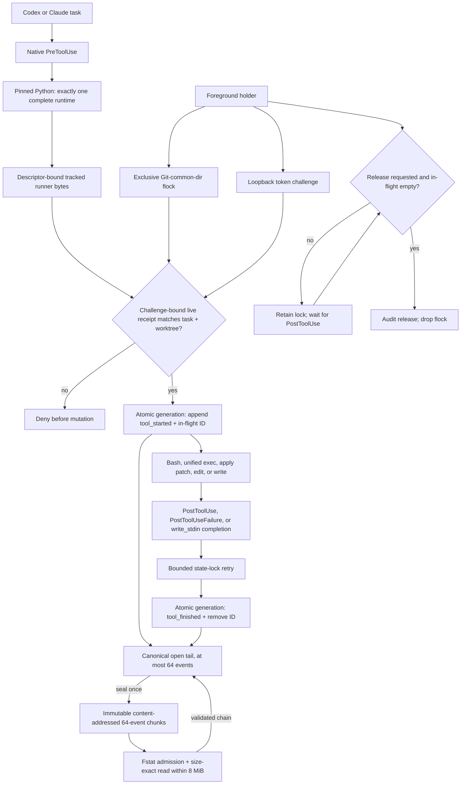
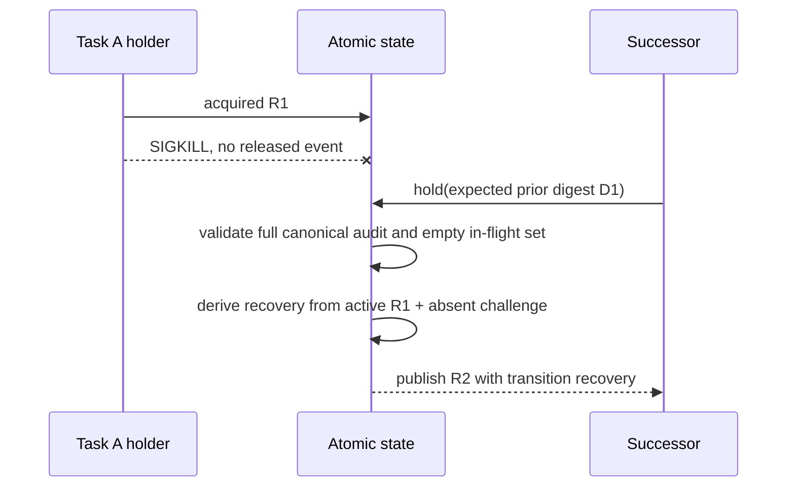

# Codex writer lease

## Destination

Prevent two Codex or Claude tasks from treating clones, branches, or
worktrees of one repository as independent write authority. The exact Git
common directory has one live holder. Native hooks deny a mutation unless the
same task and worktree own that holder, and clean transfer waits for every
already-started mutating tool to finish.

This is the bounded implementation for [dotfiles issue #753](https://github.com/ray-manaloto/dotfiles/issues/753).
It does not schedule tasks, infer completion, or replace orchestration ACK and
START ordering.

## Decision and primitives

- Git is resolved once from a platform-exclusive absolute project contract:
  Darwin selects only `/usr/bin/git`; Linux selects only the exact conda-Git
  version bound by `.devcontainer/mise-system.lock`. Neither platform may fall
  back to the other's candidate, and ambient `PATH` never selects the identity
  executable. `rev-parse --path-format=absolute --git-common-dir` then supplies
  the identity shared by the canonical checkout and registered worktrees.
- The bootstrap and runner similarly select only explicit mise paths
  (`<absolute-home>/.local/bin/mise` on the Darwin host or `/usr/local/bin/mise` in the
  supported Linux devcontainer) and project-Python locations; missing
  contracted executables deny instead of consulting ambient `PATH`.
- `fcntl.flock(fd, LOCK_EX | LOCK_NB)` retains one foreground exclusion lock.
- A random holder token and loopback challenge endpoint are written into both
  lock bytes and the canonical receipt. A check must challenge that endpoint
  and compare both records. A stale receipt plus an unrelated flock therefore
  fails instead of closing the ABA race as a false owner.
- A 0700 state directory contains 0600 regular state/lease locks and immutable
  generation directories. Every open uses `O_NOFOLLOW`; type, owner, link
  count, and mode are validated before bytes are trusted.
- One generation contains canonical `receipt.json`, a validated canonical
  audit-head manifest in `audit.jsonl`, and canonical `inflight.json`. Their combined SHA-256 names
  the generation. An atomic 0600 `current` pointer publishes all three as one
  transaction. After the pointer and directory are durable and the new state
  validates, superseded generations are atomically renamed and reclaimed under
  the state lock through an already-open, owned, no-follow directory descriptor.
  Relative `open`, `rename`, `unlink`, and `rmdir` operations remain anchored if
  the parent pathname is concurrently replaced by a symlink. The one retained
  generation carries a canonical audit head with at most 64 open events. The
  head links immutable, content-addressed 64-event chunks beneath the same
  private state directory. Reads reconstruct and validate the complete audit;
  writes rewrite only the bounded tail and write each sealed event once, so
  cumulative write amplification and retained storage grow linearly. A cleanup
  failure after publication is typed retained debt, never a denial of the
  already-committed tool state.
  `status` uses only non-creating read opens and reports `cleanup_debt`.
- Audit history derives the next transition. No history means `initial`; a
  validated release means `handoff`; an active receipt with no live holder
  means `recovery`. The exact prior receipt digest is mandatory after initial.

Primary references: [Git `rev-parse`](https://git-scm.com/docs/git-rev-parse),
[Python `fcntl`](https://docs.python.org/3/library/fcntl.html), and the current
[Codex Hooks reference](https://developers.openai.com/codex/hooks).

## Public interface

```text
<MISE> run writer-lease-hold -- --task-id ID --owner OWNER \
  --handoff-sha256 SHA \
  [--expected-prior-receipt-sha256 PRIOR]

<MISE> run writer-lease-check -- --task-id ID --handoff-sha256 SHA
<MISE> run writer-lease-status
```

`<MISE>` is the exact absolute platform path: `<absolute-home>/.local/bin/mise` on the
Darwin host and `/usr/local/bin/mise` in the supported Linux devcontainer.

`hold` acquires the common-directory lock, starts the holder challenge,
publishes the atomic generation, prints its content-addressed receipt, and
remains alive. SIGINT/SIGTERM requests clean release; the process waits until
`inflight.json` is empty, atomically appends `released`, then drops the lock.
SIGKILL leaves an audited active receipt and therefore derives recovery.

`check` is a diagnostic cooperative seam. It requires a contended flock, a
successful challenge from the same token/port published by the current
receipt, and exact task/worktree/handoff identity. Native hooks are the actual
pre-mutation boundary.

`status` reports `absent`, `live`, or `stale`, the current receipt digest, and
active tool IDs. It never creates the state directory or lock files. Unsafe,
malformed, noncanonical, symlink, FIFO, directory, wrong-mode, wrong-owner, or
digest-mismatched paths fail closed.

## Hook enforcement and background processes

Both `.codex/hooks.json` and `.claude/settings.json` use the same tracked
runner for `PreToolUse` and `PostToolUse`; Claude also sends
`PostToolUseFailure` through the identical finish transaction. The runner begins with pinned
`/usr/bin/python3 -I -S`. [Official Codex hook documentation](https://developers.openai.com/codex/hooks)
states that commands run from the session `cwd`, Codex may start from a
subdirectory, and `PreToolUse` blocks through structured output or exit code
`2`. Codex exposes no documented project-root variable, so its pinned Python
command walks ancestors and requires exactly one non-symlink Git marker for
which every component through the regular tracked runner and hook entrypoint
opens descriptor-relative with `O_NOFOLLOW`. An unrelated incomplete outer
repository is ignored; two complete runtimes are ambiguous and exit `2` before
mutation. The selected root inode is bound with `fstat`, and the command executes
the runner bytes read from the already-admitted descriptor. This location step
invokes no Git, mise, `env`, or ambient `PATH`. The runner independently repeats
the descriptor-relative selection for the payload root and passes its already-open
hook entrypoint into the exact repository virtual-environment Python with a
fixed argv and minimal fixed environment. Bridge failure returns a structured
deny/stop instead of becoming an unobserved skipped hook.

Before a lease exists, Codex allows only a content-checked bootstrap shape:
the current account's resolved literal `<absolute-home>/.local/bin/mise`, exact
`-C <worktree>`, exact task,
session-bound owner, ordered known flags, and valid lowercase digests. `env`,
PATH overrides, bare `mise`, extra flags, and compound commands are denied.

For an owning mutation, `PreToolUse` atomically appends `tool_started` and the
tool-use ID. `PostToolUse` atomically appends `tool_finished` and removes that
ID. Codex 0.147's unified-exec handler emits no early PostToolUse while a
process remains backgrounded; the later `write_stdin` completion emits the
original Bash tool-use ID. Transfer therefore cannot overtake delayed command
output or writes. Completion, failure completion, and release retry a busy
state lock for a fixed bound rather than losing an ordinary hook overlap.

Codex linked worktrees load hook declarations from the canonical checkout.
Before landing, native certification must consequently use an independent
temporary clone of the committed candidate. The replay uses subscription auth
and `--dangerously-bypass-hook-trust` so hook behavior, not a Python substitute,
decides the tool call.

## Architecture



## Transfer sequence

```mermaid
sequenceDiagram
    participant A as Task A
    participant H as Native hooks
    participant L as Lease holder
    participant B as Task B
    A->>L: hold(A, handoff H1)
    L-->>A: live receipt R1 / digest D1
    A->>H: PreToolUse Bash ID X
    H->>L: challenge token; append X in-flight
    A->>L: request clean release
    L-->>A: still held while X is active
    A->>H: write_stdin observes completion; PostToolUse ID X
    H->>L: remove X; append tool_finished
    L->>L: append released; drop flock
    B->>L: hold(B, expected prior D1)
    L->>L: audit proves release, derives handoff
    L-->>B: live receipt R2
```

## Recovery sequence



If R1 still has an in-flight tool ID, recovery refuses. The originating
PostToolUse may drain it after the command actually finishes; otherwise a
human must stop and investigate the process rather than erasing evidence.

## Acceptance evidence

Real subprocess tests, with no project-authored mock acceptance, prove:

1. linked worktrees contend while independent Git common directories do not;
2. stale task-A receipt plus an unrelated process flock cannot pass ownership;
3. unsafe state symlinks, FIFO/directory locks, malformed audit, and generation
   tampering deny without hanging or rewriting victims;
4. receipt, audit, and in-flight state publish transactionally and all state
   paths have private regular-file invariants;
5. caller transition labels cannot turn a crash into handoff;
6. Claude Bash and Codex Bash/apply-patch controls deny a second session;
7. clean release drains delayed Bash/unified-exec through the original
   PostToolUse ID, and recovery refuses an orphan active ID;
8. tracked dirty bytes, ignored bytes, untracked bytes, `.omc/` evidence,
   modes, and exact Git status remain unchanged across hold/handoff; and
9. a pinned system-runner subprocess drives the real project hook runtime.
   The same configured Codex command starts from a nested repository directory,
   skips incomplete, wrong-type, leaf-symlink, parent-symlink, and Git-marker
   symlink outer candidates, requires exactly one complete runtime, executes
   the already-admitted runner and hook entrypoint bytes for both Pre and Post,
   drains the owner, and denies a hostile session on host and supported Linux.
   With no complete candidate, or with an untrusted complete outer runtime that
   makes selection ambiguous, it exits `2`, the documented Codex blocking status.
10. 256 real Pre/Post tool pairs retain one generation and independently compare
    the full ordered canonical 513-event audit—sequence, event type, and exact
    tool ID—from eight sealed chunks plus a bounded tail,
    keep every audit file below 32 KiB and total state below 512 KiB, and
    finish within the explicit real-subprocess runtime ceiling; and
11. a real failed Bash command drains through Claude `PostToolUseFailure`, then
    permits both clean handoff and audited crash recovery;
12. a real parent-path-to-external-symlink swap cannot redirect descriptor-
    anchored reclaim or change any external victim byte;
13. a malformed reclaim tombstone remains typed debt while both `tool_started`
    and `tool_finished` commit without a false denial; and
14. twenty-four alternating success/failure completions plus holder release
    survive real overlapping state-lock holders and still permit clean handoff.

### Sealed-history read bound

The Darwin 256-pair replay on 2026-08-14 took 77.10 seconds. Its eight immutable
chunks occupied about 20 KiB each and final writer state occupied 161,662 bytes.
Walking the actual chunk chain before each of the 512 hooks derived 35,822,208
cumulative sealed-chunk bytes read. Process launch dominates this bounded test,
but complete-history validation is intentionally cumulative. Each invocation
therefore admits each descriptor's declared size against the remaining 8 MiB
sealed-history budget before a size-exact bounded read, then denies before state
mutation when exceeded or when the file changes. The ceiling preserves validation and corruption denial;
it does not introduce a cache that could bless changed historical bytes.

The review's parser-split suggestion does not reproduce a behavior defect.
Current public corruption controls already distinguish malformed JSON, schema,
canonical encoding, sequence, field type, event kind, timestamp, digest, and
history-transition failures. This slice therefore leaves the parser intact;
splitting private functions without a new public invariant would add churn but
no enforcement evidence. The external 80% docstring threshold is likewise not
a repository policy and adds no boilerplate here.

The final acceptance arm launches real subscription-authenticated Codex from
an independent clone: a hostile session must be denied before bytes change,
then the same session succeeds only after an exact audited handoff.
