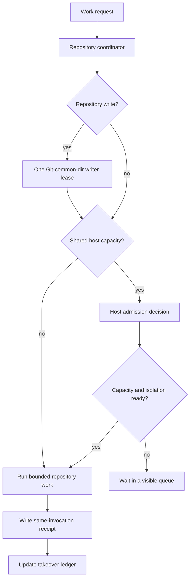

# Orchestration takeover and resource admission

## 1. What this project is

This repository builds a macOS developer environment. It also runs Linux
development containers. A long task can use several repositories and agents.

## 2. What the current goal is

Issue #766 makes long work safe to resume. Each repository has one coordinator.
Each Git common directory has one writer. A small host decision point admits
only shared CPU, memory, Docker, architecture, port, and cache capacity.

## 3. What is complete

The writer lease already protects each Git common directory. Container names,
volumes, and ports are scoped by workspace and architecture. The schemas in
this directory now define the takeover ledger and the host admission receipt.

## 4. What is not complete

The full host broker is not built. Local AMD64 and ARM64 work is not yet safe to
run together. It must wait until sync state, lookups, receipts, caches, ports,
volumes, and dynamic capacity are all architecture-scoped. A future xdist pilot
must use only an audited pure-test allowlist.

Executable content-addressed receipts are also not built. Successor issue #769
must define canonical inputs and recompute every digest at the runtime boundary.
This schema rejects digest claims that it cannot recompute.

## 5. What to do next

1. Read `orchestration-takeover.v1.json`.
2. Check its repository, worktree, branch, clone, and container facts.
3. Use `orchestration-admission.v1.schema.json` before shared heavy work.
4. Keep Docker-heavy and CPU-heavy work serial until admission says `admit`.
5. Use only same-invocation receipts. Do not reuse an old green result.

The host receipt accepts only shared CPU, memory, Docker, architecture, port,
and cache classes. Repository reads and writes stay with the repository
coordinator. The receipt records the explicit request, capacity, and safety
fields. The rule name is `dotfiles.shared-resource-fit.v1`.

The rule has one result for each identical set of explicit inputs. It says
`wait` when capacity is not available. It also says `wait` when dynamic capacity
is off. Dual-local work says `wait` when any architecture boundary is unsafe.
Every other valid request says `admit`. A `wait` receipt must state at least one
reason.

## 6. What not to do

Do not run two writers for one Git common directory. Before dispatch, block a
known stale duplicate or a container with unknown ownership. Do not delete an
unknown container. Do not run local dual architecture because names alone do
not prove safe isolation. Do not add `pytest -n auto`. Do not use an old
receipt as live capacity evidence.

## 7. How to verify the result

Validate the JSON with the two schemas. One explicit input set cannot validate
with both `admit` and `wait`. An unverified digest claim is invalid. A shared
request with no capacity must say `wait`. A handoff or land record must have
zero stale containers and zero unknown containers. The current ledger records
zero running containers and zero ports.

## 8. Where the evidence is

The temporary source reports may disappear. The tracked findings below are the
durable record.

- Safe read-only work may overlap. Repository writers remain exclusive per Git
  common directory. Docker-heavy and CPU-heavy local gates remain serial.
- The normal local workflow uses one architecture. Dual-local work waits until
  sync state, lookups, receipts, caches, ports, volumes, and dynamic admission
  are architecture-scoped.
- `sync --full` may remove one duplicate setup only with a same-invocation
  content-addressed convergence receipt. It must still run every required check.
- An xdist pilot uses an audited pure-test set, two workers, and repeated A/B
  proof. Docker, ports, process stress, and writer-lease scale tests stay serial.
- Handoff and land require zero stale and zero unknown containers. Cleanup may
  act only on exact stale identities. Unknown identities are preserved.

Research identity:

- `/private/tmp/orchestration-refresh-research/orchestration-parallelism.md`
  with SHA-256 `e42277ba5a88339c4b0b5cdcd28d40a4e02c0ae05b7d4c1aea4fb1e6e3cc7d43`.
- `/private/tmp/orchestration-refresh-research/sync-full-parallelism.md`
  with SHA-256 `73673eaa760efb9c37f88f5cdecbcefbaeef0cc509e38222380bbde3c0156d29`.

A **worktree** is another checkout that shares Git objects. A **writer lease**
proves who may mutate one Git common directory. A **gate** is a required check.
A **stale container** is an exact container whose expected owner is gone,
obsolete, or duplicated. An unknown container is a blocker, not a cleanup
candidate.
