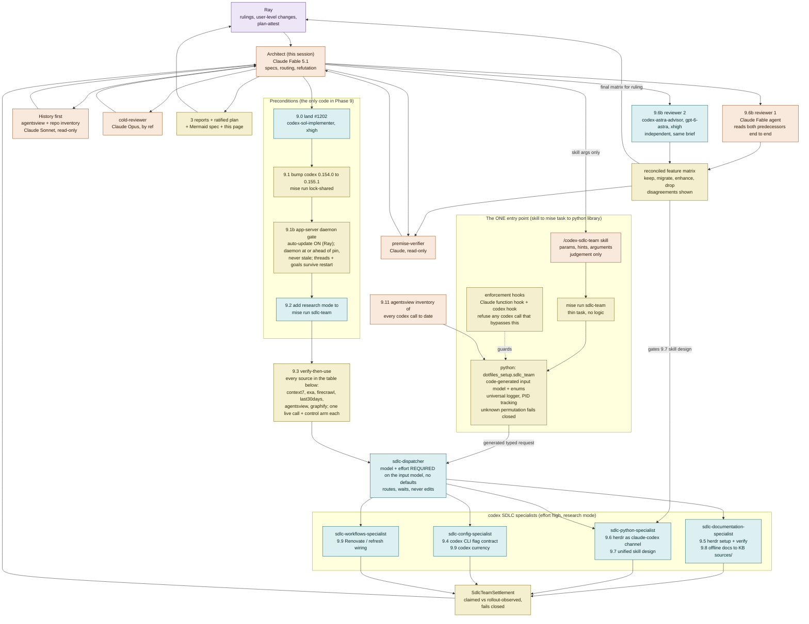

# Phase 9 lane DAG — roles, agents, models, effort

Status: RATIFIED with `task_plan.md` Phase 9 on 2026-09-21 (Ray). This file is the source of truth for the graph; a
rendered view of the same graph, with the research-source status and findings tables, is published at
<https://claude.ai/artifact/RwUfffidCMAYdPJ49jYgQc> (private to the operator).

Research and plan only. The one architecture ruling that binds everything below: there is exactly ONE entry point for
offloading work to codex — the `/codex-sdlc-team` skill (arguments only) -> `mise run sdlc-team` -> the python library
`dotfiles_setup.sdlc_team`, which builds the typed request from a code-generated input model. `model` and `effort` are
REQUIRED on that model and have no default. Hooks on both the Claude and the codex side refuse a codex call that bypasses
it. Feature scope for the entry point is the ratified matrix:
`docs/research/kb/reports/agents/feature-matrix-final-2026-09-21.md`.

## Roster

| Role | Agent | Model | Effort | Writes |
|---|---|---|---|---|
| Operator | Ray | — | — | user-level skills, codex plugin enablement, `plan-attest` |
| Architect | the coordinating Claude session | Claude Fable 5.1 | session | `task_plan.md`, specs, rulings |
| History | read-only Claude agents | Claude Sonnet | default | reports only |
| Router | `sdlc-dispatcher` | required on the input model | required | nothing |
| Research | `sdlc-documentation` / `python` / `config` / `workflows-specialist` | required on the input model | required | reports + raw sources (`research` mode, plan 9.2) |
| Precondition code | `codex-sol-implementer` | gpt-5.6-sol | xhigh | branch commits |
| Predecessor review | a Claude Fable agent + `codex-astra-advisor` | Claude Fable 5.1 / gpt-6-astra | default / xhigh | one report each |
| Premise check | `premise-verifier` (to be re-homed repo-owned) | Claude | default | nothing |
| Cold review | `cold-reviewer` | Claude Opus | default | its report |

Today the six `.codex/agents/codex-sdlc-*.toml` files pin `model_reasoning_effort = "high"` and declare no `model`; whether
a request-level effort reaches the specialists is unmeasured (matrix row A5, plan 9.4).

## Why the families are split

Codex does the volume. Claude keeps the two checks that only work from a different model family than the implementer:
premise verification before dispatch and cold review after. On #1202 those caught a hand-maintained duplicate file, a
verdict refresh that could disarm the gate, and a test-harness artifact reported as a production bug.

## GitHub repos touched

_None._ The graph is derived from `task_plan.md` and the reports it cites.
